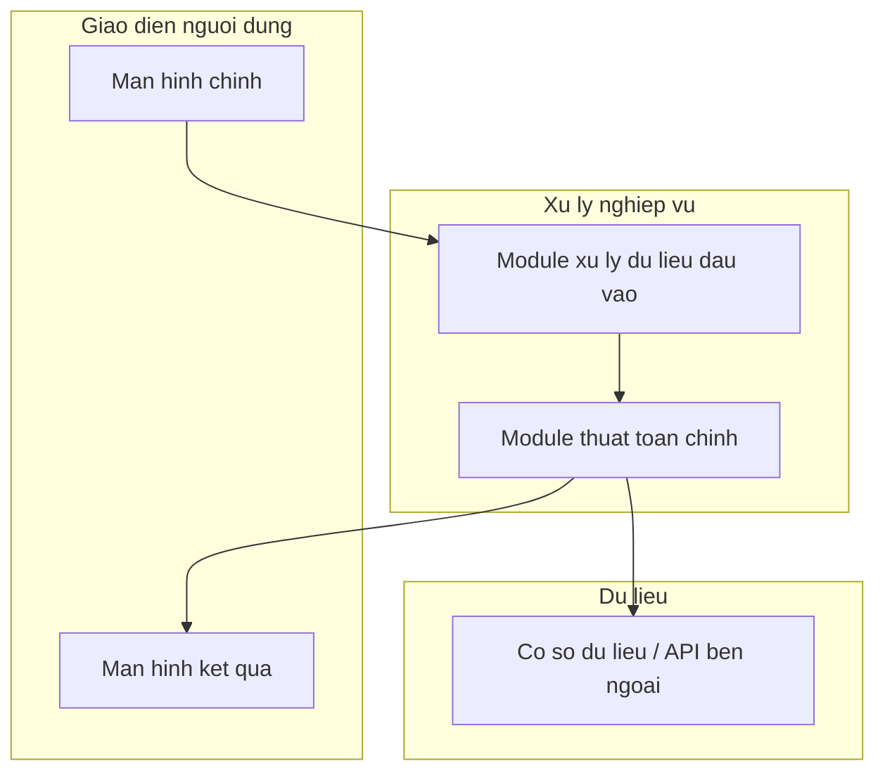
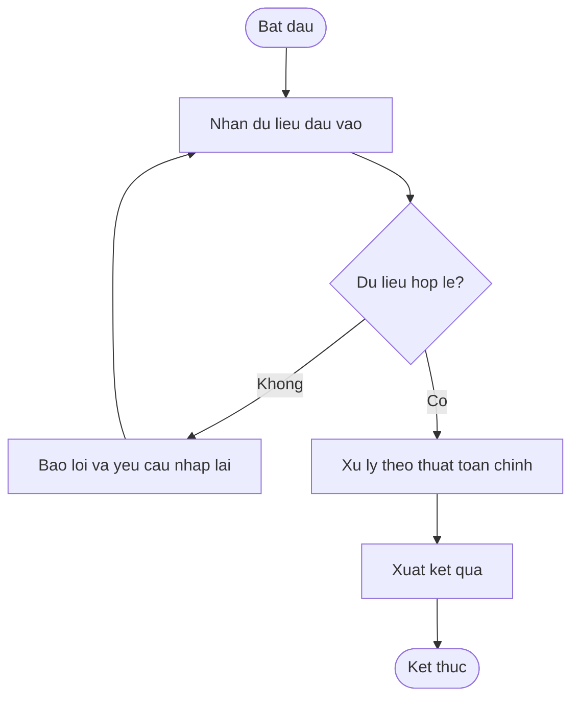
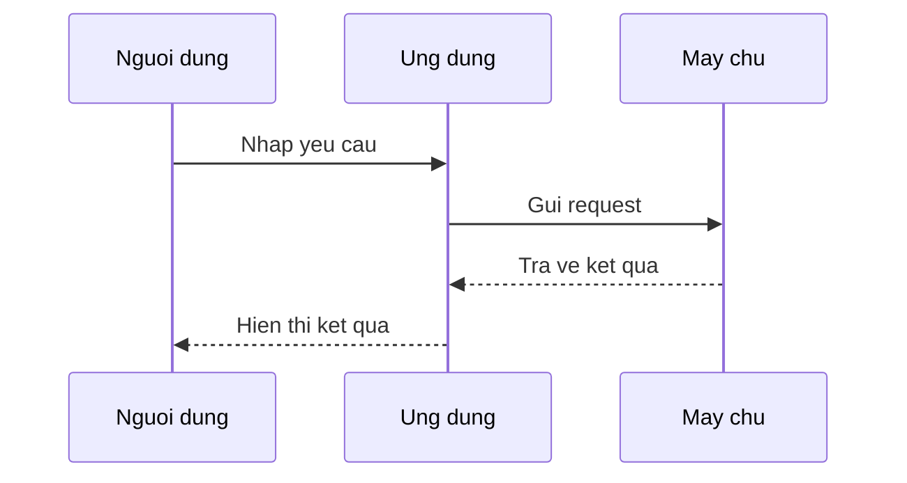
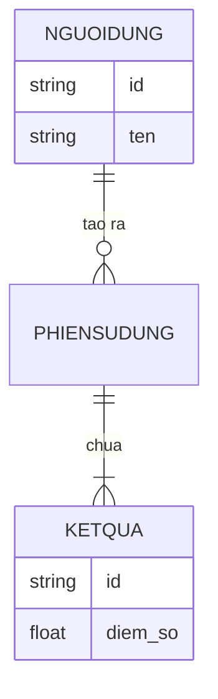
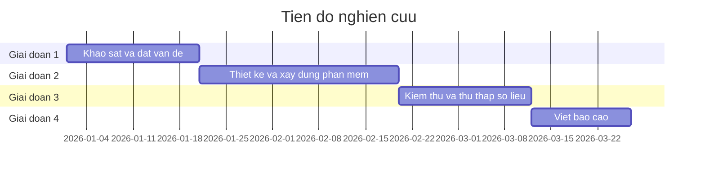

# Hướng dẫn Mermaid cho tài liệu NCKH phần mềm

Mỗi block Mermaid trong markdown viết dạng:

    ```mermaid
    <nội dung sơ đồ>
    ```

Luôn đặt một dòng chú thích `**Hình N: <tên sơ đồ>**` ngay phía trên block, đánh số N tăng dần
xuyên suốt toàn tài liệu (không reset theo từng phần).

## 1. Kiến trúc hệ thống (dùng ở Phần III)

Dùng `flowchart TB` với `subgraph` để nhóm theo layer.



## 2. Flowchart thuật toán (dùng ở Phần III, phần thiết kế thuật toán)

Dùng node hình thoi `{...}` cho điều kiện rẽ nhánh.



## 3. Sequence Diagram — luồng tương tác người dùng/hệ thống (dùng ở Phần III)



## 4. ERD — mô hình dữ liệu (nếu đề tài có phần lưu trữ dữ liệu phức tạp)



## 5. Gantt — tiến độ nghiên cứu (dùng ở Phụ lục, nhật ký nghiên cứu)



## Lưu ý tránh lỗi cú pháp

- Không dùng dấu `(` `)` `:` `,` bên ngoài dấu ngoặc kép trong nhãn node — luôn bọc nhãn bằng `["..."]`.
- Ưu tiên viết tiếng Việt không dấu bên trong node để giảm rủi ro lỗi hiển thị ở một số renderer;
  nếu người dùng yêu cầu rõ cần có dấu, vẫn dùng được miễn bọc trong ngoặc kép `"..."`.
- Không vẽ biểu đồ dữ liệu định lượng (cột, đường, tròn) bằng Mermaid — Mermaid chỉ hỗ trợ `pie`
  rất cơ bản; nếu cần biểu đồ số liệu đẹp, gợi ý người dùng dùng bảng markdown hoặc tạo artifact
  biểu đồ riêng (chart) thay vì ép dùng Mermaid.
