# Tài liệu Sequence Diagrams — Hệ thống Cảnh báo & Xua đuổi Động vật Hoang dã

Tài liệu này mô tả chi tiết luồng tương tác giữa các thành phần trong hệ thống (Android App, Mobile Server, Database, FCM, SMS Gateway, và Trạm Camera) được phân chia theo cấu trúc 3 cấp: **Application** -> **Screen** -> **Action**.

---

## Các Thành phần Hệ thống (Standardized Participants)

- **Mobile:** Ứng dụng di động (Android Client) cài đặt trên điện thoại người dùng và kiểm lâm để tương tác với hệ thống.
- **Mobile_Server:** Máy chủ trung tâm lưu trữ dữ liệu, xử lý logic, quản lý phiên làm việc, lưu cấu hình ứng phó và giao tiếp với cả `AI_Server` và `Mobile`.
- **AI_Server:** Máy chủ trí tuệ nhân tạo chạy mô hình nhận diện (YOLOv8), nhận hình ảnh từ `Camera` để phân tích, gửi kết quả nhận diện lên `Mobile_Server` và điều hướng lệnh phản hồi để điều khiển `Camera`.
- **Camera:** Thiết bị camera chụp ảnh tại hiện trường (chỉ gửi ảnh về `AI_Server` khi phát hiện chuyển động) và các thiết bị xua đuổi vật lý (Loa phát thanh, Đèn LED chớp, Hàng rào điện sinh học).
- **Database:** Cơ sở dữ liệu PostgreSQL lưu trữ trạng thái, cấu hình và nhật ký sự kiện.
- **FCM (Firebase Cloud Messaging):** Dịch vụ trung gian gửi thông báo đẩy (Push notification) thời gian thực đến `Mobile`.
- **SMS Gateway:** Hệ thống gửi tin nhắn SMS cảnh báo khẩn cấp đến các số điện thoại đã đăng ký.

### Cơ chế quản lý serviceAccountKey.json cho Firebase Cloud Messaging (FCM)

Để gửi thông báo đẩy (Push Notification) đến thiết bị di động của kiểm lâm và người dân vùng lân cận qua FCM, `Mobile_Server` cần xác thực với Google Firebase API sử dụng chứng chỉ dịch vụ (`serviceAccountKey.json`).

Nhằm đảm bảo an toàn tuyệt đối và tuân thủ nguyên tắc triển khai Serverless (như Vercel):
* **Tuyệt đối không lưu trữ file** `serviceAccountKey.json` trực tiếp trong mã nguồn (để tránh rò rỉ mã nguồn lên các kho lưu trữ công khai như GitHub).
* **Tuyệt đối không ghi file tạm** chứa khóa này lên đĩa cứng của máy chủ/môi trường Serverless trong quá trình chạy.
* **Cách quản lý và trích xuất:**
  1. Người quản trị thực hiện chuyển đổi nội dung file `serviceAccountKey.json` sang định dạng chuỗi mã hóa **Base64**:
     ```bash
     cat serviceAccountKey.json | base64 | tr -d '\n'
     ```
  2. Lưu chuỗi Base64 vừa trích xuất vào biến môi trường tên là `PUSH_SERVICE_ACCOUNT_KEY_JSON` trên trang quản lý của Vercel (hoặc tệp cấu hình môi trường cục bộ `.env.local` / `.env.production`).
  3. Khi server khởi chạy hoặc khi xử lý yêu cầu gửi thông báo, `Mobile_Server` sẽ đọc chuỗi từ biến môi trường, thực hiện giải mã trực tiếp trong bộ nhớ RAM và truyền Object thu được vào hàm khởi tạo của Firebase Admin SDK:
     ```typescript
     const base64Key = process.env.PUSH_SERVICE_ACCOUNT_KEY_JSON;
     if (base64Key) {
       const decodedJson = Buffer.from(base64Key, 'base64').toString('utf8');
       const serviceAccount = JSON.parse(decodedJson);
       
       // Khởi tạo SDK trực tiếp từ RAM, không ghi file ra đĩa
       admin.initializeApp({
         credential: admin.credential.cert(serviceAccount)
       });
     }
     ```

### Sơ đồ Kiến trúc Tương tác Tổng quan

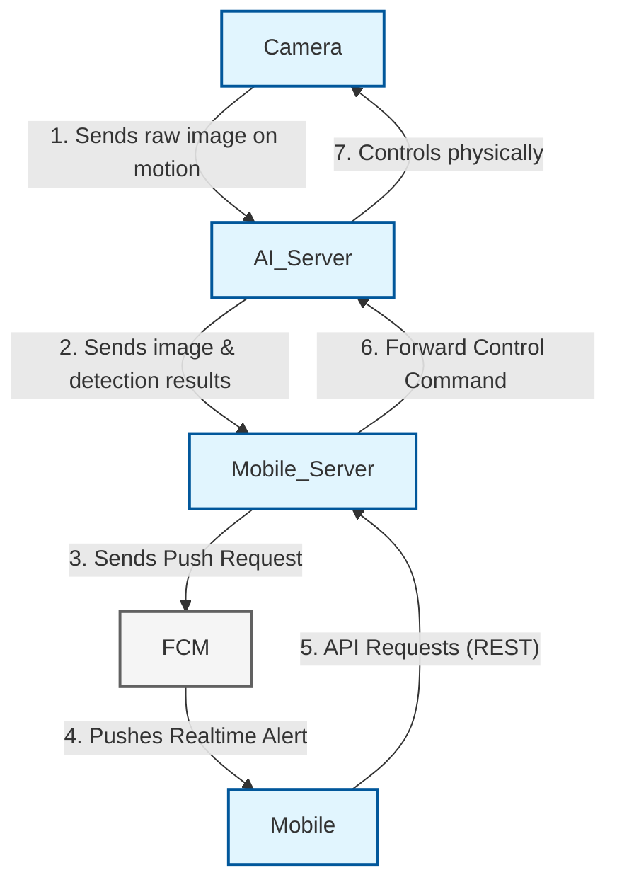
```mermaid
graph TD
    classDef main fill:#e1f5fe,stroke:#01579b,stroke-width:2px;
    classDef ext fill:#f5f5f5,stroke:#616161,stroke-width:2px;

    Camera[Camera]:::main
    AI_Server[AI_Server]:::main
    Mobile_Server[Mobile_Server]:::main
    Mobile[Mobile]:::main

    FCM[FCM]:::ext

    %% Connections
    Camera -- "1. Sends raw image on motion" --> AI_Server
    AI_Server -- "2. Sends image & detection results" --> Mobile_Server

    %% Realtime warning paths
    Mobile_Server -- "3. Sends Push Request" --> FCM
    FCM -- "4. Pushes Realtime Alert" --> Mobile

    %% User Actions
    Mobile -- "5. API Requests (REST)" --> Mobile_Server
    Mobile_Server -- "6. Forward Control Command" --> AI_Server
    AI_Server -- "7. Controls physically" --> Camera
```

---

# I. Ứng dụng Android (Android Application)

## 1. Màn hình Đăng ký (`[REGISTER_SCREEN]`)

_(Không có action load dữ liệu ban đầu)_

### 1.1. Action: Register a new account

- **Mô tả:** Người dùng nhập các thông tin đăng ký (tên đăng nhập, họ tên, số điện thoại, mật khẩu, vai trò, và email tùy chọn) để tạo tài khoản mới trong hệ thống.

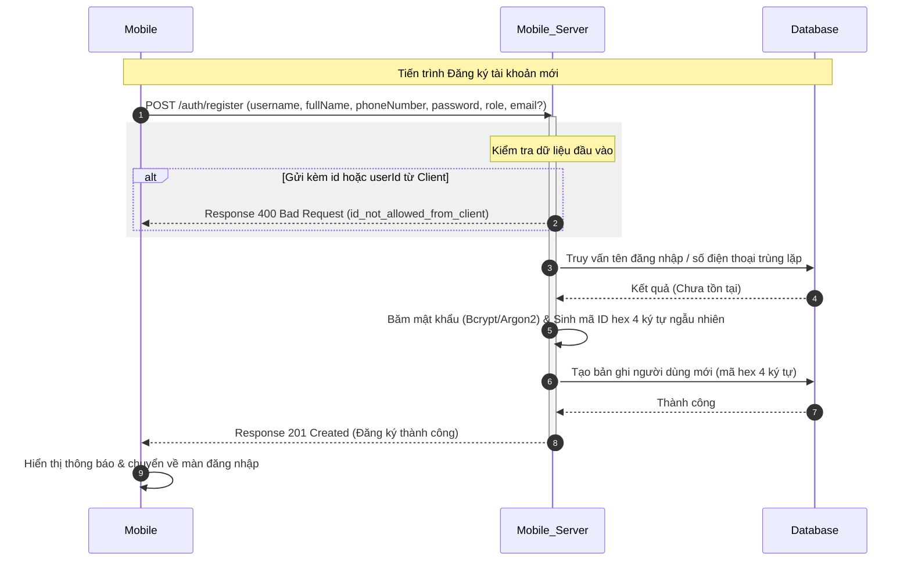
```mermaid
sequenceDiagram
    autonumber
    participant Mobile as Mobile
    participant Mobile_Server as Mobile_Server
    participant Database as Database

    Note over Mobile, Database: Tiến trình Đăng ký tài khoản mới
    Mobile->>Mobile_Server: POST /auth/register (username, fullName, phoneNumber, password, role, email?)
    activate Mobile_Server
    
    rect rgb(240, 240, 240)
        Note over Mobile_Server: Kiểm tra dữ liệu đầu vào
        alt Gửi kèm id hoặc userId từ Client
            Mobile_Server-->>Mobile: Response 400 Bad Request (id_not_allowed_from_client)
        end
    end

    Mobile_Server->>Database: Truy vấn tên đăng nhập / số điện thoại trùng lặp
    Database-->>Mobile_Server: Kết quả (Chưa tồn tại)
    Mobile_Server->>Mobile_Server: Băm mật khẩu (Bcrypt/Argon2) & Sinh mã ID hex 4 ký tự ngẫu nhiên
    Mobile_Server->>Database: Tạo bản ghi người dùng mới (mã hex 4 ký tự)
    Database-->>Mobile_Server: Thành công
    Mobile_Server-->>Mobile: Response 201 Created (Đăng ký thành công)
    deactivate Mobile_Server
    Mobile->>Mobile: Hiển thị thông báo & chuyển về màn đăng nhập
```
*   **Chi tiết đặc tả API:**
    *   [POST /auth/register](./03-mobile_api.md#31-post-authregister)

---

## 2. Màn hình Đăng nhập (`[LOGIN_SCREEN]`)

_(Không có action load dữ liệu ban đầu)_

### 2.1. Action: Login & Register Push Token

- **Mô tả:** Người dùng đăng nhập bằng tên đăng nhập và mật khẩu. Sau khi nhận accessToken từ server, Android Client lấy FCM Token từ Firebase SDK và tự động gửi lên server để liên kết thiết bị.

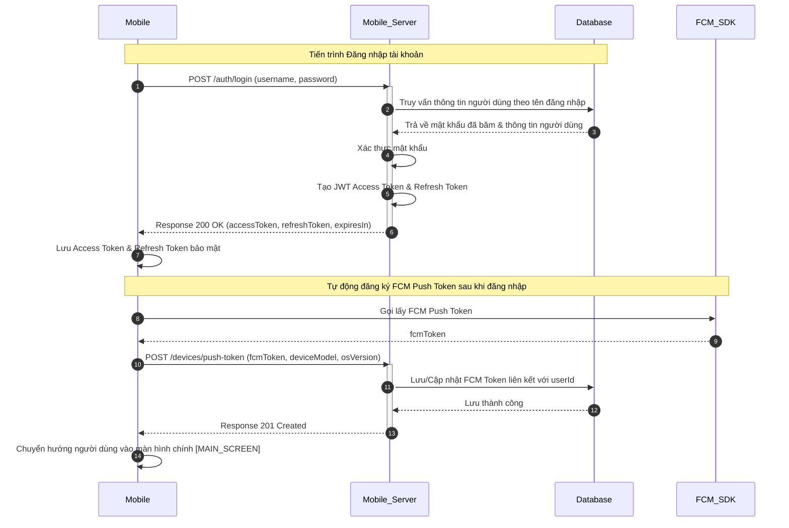
```mermaid
sequenceDiagram
    autonumber
    participant Mobile as Mobile
    participant Mobile_Server as Mobile_Server
    participant Database as Database
    participant FCM_SDK as FCM_SDK

    Note over Mobile, Database: Tiến trình Đăng nhập tài khoản
    Mobile->>Mobile_Server: POST /auth/login (username, password)
    activate Mobile_Server
    Mobile_Server->>Database: Truy vấn thông tin người dùng theo tên đăng nhập
    Database-->>Mobile_Server: Trả về mật khẩu đã băm & thông tin người dùng
    Mobile_Server->>Mobile_Server: Xác thực mật khẩu
    Mobile_Server->>Mobile_Server: Tạo JWT Access Token & Refresh Token
    Mobile_Server-->>Mobile: Response 200 OK (accessToken, refreshToken, expiresIn)
    deactivate Mobile_Server

    Mobile->>Mobile: Lưu Access Token & Refresh Token bảo mật

    Note over Mobile, FCM_SDK: Tự động đăng ký FCM Push Token sau khi đăng nhập
    Mobile->>FCM_SDK: Gọi lấy FCM Push Token
    FCM_SDK-->>Mobile: fcmToken
    Mobile->>Mobile_Server: POST /devices/push-token (fcmToken, deviceModel, osVersion)
    activate Mobile_Server
    Mobile_Server->>Database: Lưu/Cập nhật FCM Token liên kết với userId
    Database-->>Mobile_Server: Lưu thành công
    Mobile_Server-->>Mobile: Response 201 Created
    deactivate Mobile_Server
    Mobile->>Mobile: Chuyển hướng người dùng vào màn hình chính [MAIN_SCREEN]
```
*   **Chi tiết đặc tả API:**
    *   [POST /auth/login](./03-mobile_api.md#32-post-authlogin)
    *   [POST /devices/push-token](./03-mobile_api.md#41-post-devicespush-token)

---

## 3. Màn hình chính (`[MAIN_SCREEN]`)

### 3.1. Tab Danh sách Camera (`[CAMERA_LIST_TAB]`)

### 3.1.1. Action: Load camera list & initial snapshots

- **Mô tả:** Khi mở tab hoặc vào màn hình chính, app tự động gọi API lấy danh sách các trạm camera trực thuộc quyền quản lý kèm theo trạng thái hoạt động và ảnh snapshot thumbnail gần nhất để hiển thị.

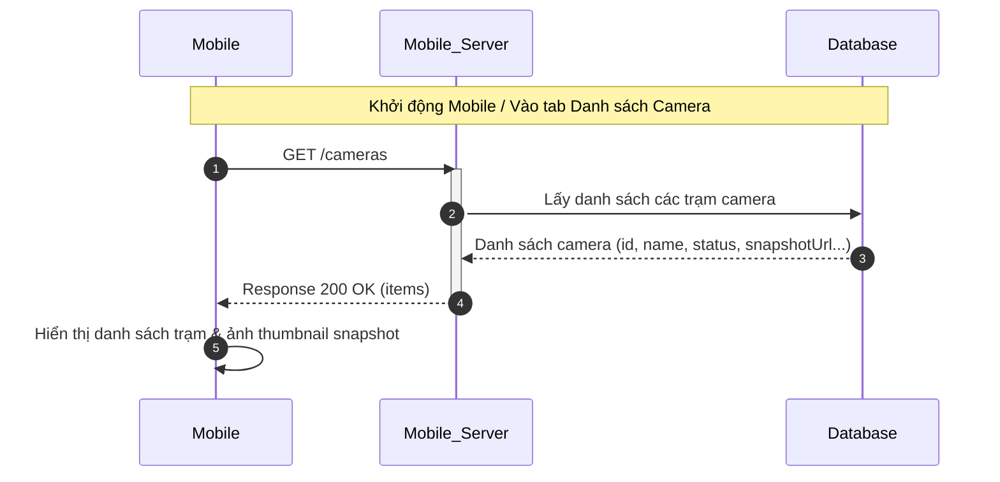
```mermaid
sequenceDiagram
    autonumber
    participant Mobile as Mobile
    participant Mobile_Server as Mobile_Server
    participant Database as Database

    Note over Mobile, Database: Khởi động Mobile / Vào tab Danh sách Camera
    Mobile->>Mobile_Server: GET /cameras
    activate Mobile_Server
    Mobile_Server->>Database: Lấy danh sách các trạm camera
    Database-->>Mobile_Server: Danh sách camera (id, name, status, snapshotUrl...)
    Mobile_Server-->>Mobile: Response 200 OK (items)
    deactivate Mobile_Server
    Mobile->>Mobile: Hiển thị danh sách trạm & ảnh thumbnail snapshot
```
*   **Chi tiết đặc tả API:**
    *   [GET /cameras](./03-mobile_api.md#51-get-cameras)

### 3.1.2. Action: Register & Listen for updates via SSE

- **Mô tả:** Song song với việc tải danh sách, ứng dụng tự động mở kết nối Server-Sent Events (SSE) để duy trì kênh lắng nghe sự kiện từ xa. Khi có cập nhật mới (ảnh chụp mới, thay đổi trạng thái hoạt động), server đẩy tin nhắn `camera-update` báo cho client tự động fetch lại thông tin mới.

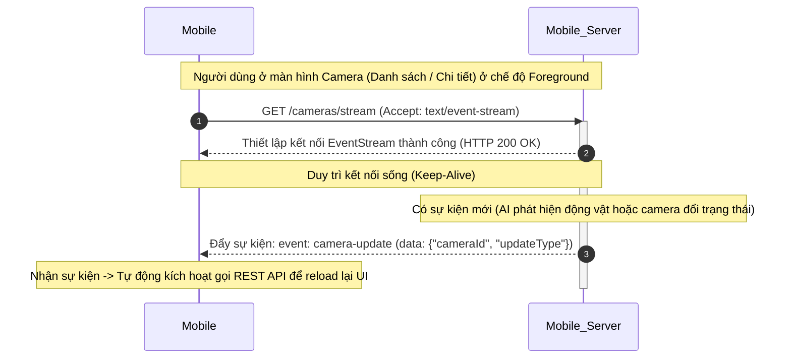
```mermaid
sequenceDiagram
    autonumber
    participant Mobile as Mobile
    participant Mobile_Server as Mobile_Server

    Note over Mobile, Mobile_Server: Người dùng ở màn hình Camera (Danh sách / Chi tiết) ở chế độ Foreground
    Mobile->>Mobile_Server: GET /cameras/stream (Accept: text/event-stream)
    activate Mobile_Server
    Mobile_Server-->>Mobile: Thiết lập kết nối EventStream thành công (HTTP 200 OK)
    
    Note over Mobile, Mobile_Server: Duy trì kết nối sống (Keep-Alive)
    
    Note over Mobile_Server: Có sự kiện mới (AI phát hiện động vật hoặc camera đổi trạng thái)
    Mobile_Server-->>Mobile: Đẩy sự kiện: event: camera-update (data: {"cameraId", "updateType"})
    
    Note over Mobile: Nhận sự kiện -> Tự động kích hoạt gọi REST API để reload lại UI
    deactivate Mobile_Server
```
*   **Chi tiết đặc tả API:**
    *   [GET /cameras/stream](./03-mobile_api.md#54-get-camerasstream)

### 3.2. Tab Thống kê (`[STATISTICS_TAB]`)

### 3.2.1. Action: Initialize filter & Apply filter (`statistics_filter`)

- **Mô tả:** Khi mở tab Thống kê, app thực hiện tải danh sách loài và trạm camera để đổ vào các dropdown bộ lọc. Khi người dùng thay đổi bộ lọc (Thời gian, Loài, Camera), app gọi lại API lấy dữ liệu thống kê tổng hợp để vẽ lại biểu đồ/heatmap.

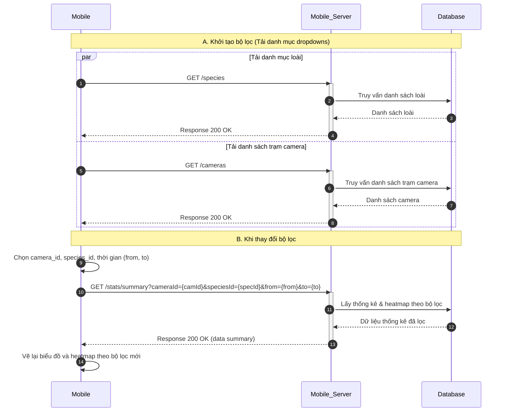
```mermaid
sequenceDiagram
    autonumber
    participant Mobile as Mobile
    participant Mobile_Server as Mobile_Server
    participant Database as Database

    Note over Mobile, Database: A. Khởi tạo bộ lọc (Tải danh mục dropdowns)
    par Tải danh mục loài
        Mobile->>Mobile_Server: GET /species
        activate Mobile_Server
        Mobile_Server->>Database: Truy vấn danh sách loài
        Database-->>Mobile_Server: Danh sách loài
        Mobile_Server-->>Mobile: Response 200 OK
        deactivate Mobile_Server
    and Tải danh sách trạm camera
        Mobile->>Mobile_Server: GET /cameras
        activate Mobile_Server
        Mobile_Server->>Database: Truy vấn danh sách trạm camera
        Database-->>Mobile_Server: Danh sách camera
        Mobile_Server-->>Mobile: Response 200 OK
        deactivate Mobile_Server
    end

    Note over Mobile, Database: B. Khi thay đổi bộ lọc
    Mobile->>Mobile: Chọn camera_id, species_id, thời gian (from, to)
    Mobile->>Mobile_Server: GET /stats/summary?cameraId={camId}&speciesId={specId}&from={from}&to={to}
    activate Mobile_Server
    Mobile_Server->>Database: Lấy thống kê & heatmap theo bộ lọc
    Database-->>Mobile_Server: Dữ liệu thống kê đã lọc
    Mobile_Server-->>Mobile: Response 200 OK (data summary)
    deactivate Mobile_Server
    Mobile->>Mobile: Vẽ lại biểu đồ và heatmap theo bộ lọc mới
```
*   **Chi tiết đặc tả API:**
    *   [GET /species](./03-mobile_api.md#81-get-species)
    *   [GET /cameras](./03-mobile_api.md#51-get-cameras)
    *   [GET /stats/summary](./03-mobile_api.md#102-get-statssummary)

### 3.2.2. Action: Load weekly detections list (`weekly_detections_section`)

- **Mô tả:** App tải danh sách các tin cảnh báo khẩn cấp/phát hiện động vật hoang dã gần đây nhất bằng cách gọi API `GET /alerts/feed`.

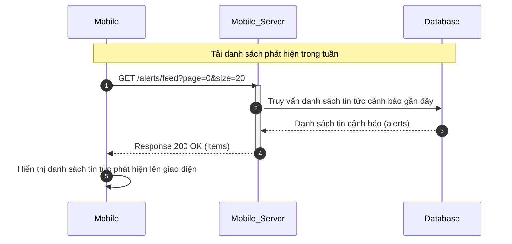
```mermaid
sequenceDiagram
    autonumber
    participant Mobile as Mobile
    participant Mobile_Server as Mobile_Server
    participant Database as Database

    Note over Mobile, Database: Tải danh sách phát hiện trong tuần
    Mobile->>Mobile_Server: GET /alerts/feed?page=0&size=20
    activate Mobile_Server
    Mobile_Server->>Database: Truy vấn danh sách tin tức cảnh báo gần đây
    Database-->>Mobile_Server: Danh sách tin cảnh báo (alerts)
    Mobile_Server-->>Mobile: Response 200 OK (items)
    deactivate Mobile_Server
    Mobile->>Mobile: Hiển thị danh sách tin tức phát hiện lên giao diện
```
*   **Chi tiết đặc tả API:**
    *   [GET /alerts/feed](./03-mobile_api.md#111-get-alertsfeed)

### 3.2.3. Action: Load trend chart & movement heatmap (`per_camera_analysis_section`)

- **Mô tả:** Tải dữ liệu phân tích thống kê tổng hợp (tổng số lần xuất hiện, tọa độ di chuyển) để vẽ biểu đồ đường xu hướng và sơ đồ nhiệt (heatmap) phân bố động vật.

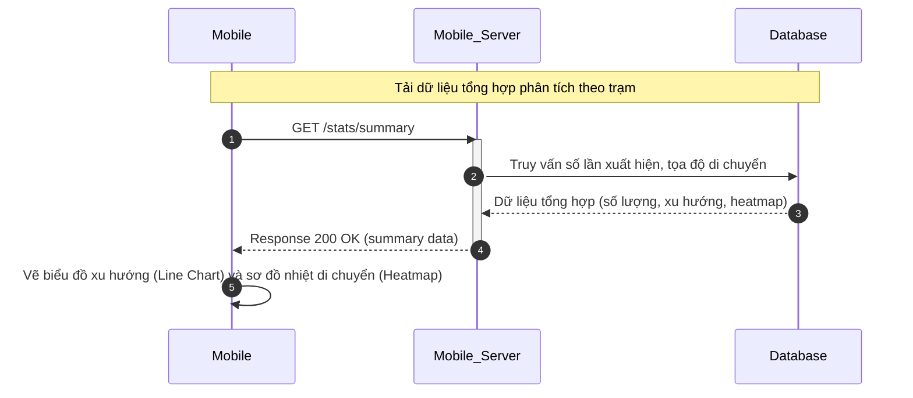
```mermaid
sequenceDiagram
    autonumber
    participant Mobile as Mobile
    participant Mobile_Server as Mobile_Server
    participant Database as Database

    Note over Mobile, Database: Tải dữ liệu tổng hợp phân tích theo trạm
    Mobile->>Mobile_Server: GET /stats/summary
    activate Mobile_Server
    Mobile_Server->>Database: Truy vấn số lần xuất hiện, tọa độ di chuyển
    Database-->>Mobile_Server: Dữ liệu tổng hợp (số lượng, xu hướng, heatmap)
    Mobile_Server-->>Mobile: Response 200 OK (summary data)
    deactivate Mobile_Server
    Mobile->>Mobile: Vẽ biểu đồ xu hướng (Line Chart) và sơ đồ nhiệt di chuyển (Heatmap)
```
*   **Chi tiết đặc tả API:**
    *   [GET /stats/summary](./03-mobile_api.md#102-get-statssummary)

### 3.3. Tab Cài đặt (`[SETTING_TAB]`)

### 3.3.1. Action: Load user profile

- **Mô tả:** Tải thông tin tài khoản hiện tại (họ tên, vai trò, số điện thoại đăng nhập) để hiển thị lên form cài đặt chung.

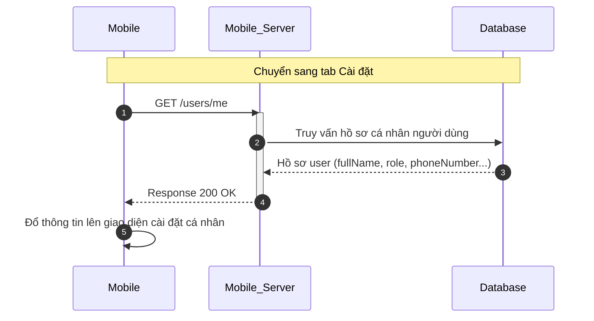
```mermaid
sequenceDiagram
    autonumber
    participant Mobile as Mobile
    participant Mobile_Server as Mobile_Server
    participant Database as Database

    Note over Mobile, Database: Chuyển sang tab Cài đặt
    Mobile->>Mobile_Server: GET /users/me
    activate Mobile_Server
    Mobile_Server->>Database: Truy vấn hồ sơ cá nhân người dùng
    Database-->>Mobile_Server: Hồ sơ user (fullName, role, phoneNumber...)
    Mobile_Server-->>Mobile: Response 200 OK
    deactivate Mobile_Server
    Mobile->>Mobile: Đổ thông tin lên giao diện cài đặt cá nhân
```
*   **Chi tiết đặc tả API:**
    *   [GET /users/me](./03-mobile_api.md#91-get-usersme)

### 3.3.2. Action: Logout

- **Mô tả:** Người dùng nhấn nút Đăng xuất, app gửi yêu cầu hủy session trên server, đồng thời hủy FCM Push Token trên thiết bị để ngưng nhận thông báo và đưa người dùng trở lại màn hình đăng nhập.

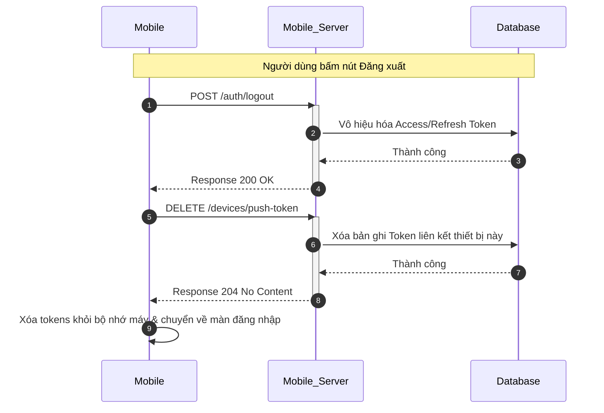
```mermaid
sequenceDiagram
    autonumber
    participant Mobile as Mobile
    participant Mobile_Server as Mobile_Server
    participant Database as Database

    Note over Mobile, Database: Người dùng bấm nút Đăng xuất
    Mobile->>Mobile_Server: POST /auth/logout
    activate Mobile_Server
    Mobile_Server->>Database: Vô hiệu hóa Access/Refresh Token
    Database-->>Mobile_Server: Thành công
    Mobile_Server-->>Mobile: Response 200 OK
    deactivate Mobile_Server

    Mobile->>Mobile_Server: DELETE /devices/push-token
    activate Mobile_Server
    Mobile_Server->>Database: Xóa bản ghi Token liên kết thiết bị này
    Database-->>Mobile_Server: Thành công
    Mobile_Server-->>Mobile: Response 204 No Content
    deactivate Mobile_Server

    Mobile->>Mobile: Xóa tokens khỏi bộ nhớ máy & chuyển về màn đăng nhập
```
*   **Chi tiết đặc tả API:**
    *   [POST /auth/logout](./03-mobile_api.md#33-post-authlogout)
    *   [DELETE /devices/push-token](./03-mobile_api.md#42-delete-devicespush-token)

---

## 4. Màn hình Chi tiết Camera (`[CAMERA_VIEW_SCREEN]`)

### 4.1. Action: Load camera details & history logs

- **Mô tả:** Khi người dùng chọn một camera, Mobile sẽ đồng thời tải: thông tin chi tiết camera (bao gồm thông tin trạm, ảnh snapshot gần nhất, phán đoán AI hiện tại) và danh sách lịch sử nhật ký sự kiện ghi nhận của camera đó.

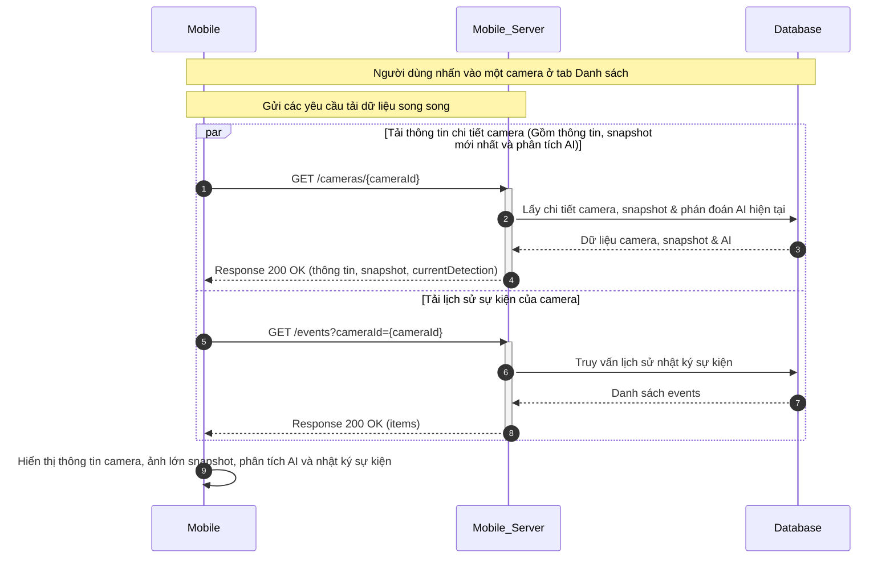
```mermaid
sequenceDiagram
    autonumber
    participant Mobile as Mobile
    participant Mobile_Server as Mobile_Server
    participant Database as Database

    Note over Mobile, Database: Người dùng nhấn vào một camera ở tab Danh sách
    Note over Mobile, Mobile_Server: Gửi các yêu cầu tải dữ liệu song song
    par Tải thông tin chi tiết camera (Gồm thông tin, snapshot mới nhất và phân tích AI)
        Mobile->>Mobile_Server: GET /cameras/{cameraId}
        activate Mobile_Server
        Mobile_Server->>Database: Lấy chi tiết camera, snapshot & phán đoán AI hiện tại
        Database-->>Mobile_Server: Dữ liệu camera, snapshot & AI
        Mobile_Server-->>Mobile: Response 200 OK (thông tin, snapshot, currentDetection)
        deactivate Mobile_Server
    and Tải lịch sử sự kiện của camera
        Mobile->>Mobile_Server: GET /events?cameraId={cameraId}
        activate Mobile_Server
        Mobile_Server->>Database: Truy vấn lịch sử nhật ký sự kiện
        Database-->>Mobile_Server: Danh sách events
        Mobile_Server-->>Mobile: Response 200 OK (items)
        deactivate Mobile_Server
    end
    Mobile->>Mobile: Hiển thị thông tin camera, ảnh lớn snapshot, phân tích AI và nhật ký sự kiện
```
*   **Chi tiết đặc tả API:**
    *   [GET /cameras/{cameraId}](./03-mobile_api.md#52-get-camerascameraid)
    *   [GET /events](./03-mobile_api.md#101-get-events)

### 4.2. Action: Update camera name

- **Mô tả:** Người dùng bấm nút sửa tên hiển thị trên màn hình chi tiết, nhập tên mới và lưu lại để đồng bộ lên DB.

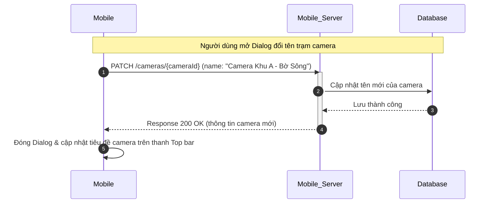
```mermaid
sequenceDiagram
    autonumber
    participant Mobile as Mobile
    participant Mobile_Server as Mobile_Server
    participant Database as Database

    Note over Mobile, Database: Người dùng mở Dialog đổi tên trạm camera
    Mobile->>Mobile_Server: PATCH /cameras/{cameraId} (name: "Camera Khu A - Bờ Sông")
    activate Mobile_Server
    Mobile_Server->>Database: Cập nhật tên mới của camera
    Database-->>Mobile_Server: Lưu thành công
    Mobile_Server-->>Mobile: Response 200 OK (thông tin camera mới)
    deactivate Mobile_Server
    Mobile->>Mobile: Đóng Dialog & cập nhật tiêu đề camera trên thanh Top bar
```
*   **Chi tiết đặc tả API:**
    *   [PATCH /cameras/{cameraId}](./03-mobile_api.md#53-patch-camerascameraid)

---

## 5. Màn hình Danh sách Cấu hình Loài (`[SPECIES_CONFIG_LIST_SCREEN]`)

### 5.1. Action: Load species list & configuration overview

- **Mô tả:** Khi người dùng mở màn hình thiết lập ứng phó mặc định, app tải danh sách toàn bộ các loài động vật trong hệ thống (kèm chỉ số hung dữ, đặc tính htmlDescription) và tình trạng cấu hình tương ứng đang được áp dụng tại trạm camera đã chọn.

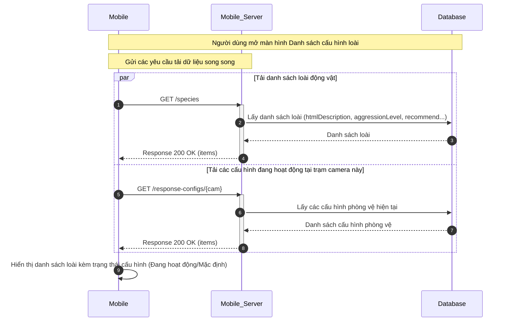
```mermaid
sequenceDiagram
    autonumber
    participant Mobile as Mobile
    participant Mobile_Server as Mobile_Server
    participant Database as Database

    Note over Mobile, Database: Người dùng mở màn hình Danh sách cấu hình loài
    Note over Mobile, Mobile_Server: Gửi các yêu cầu tải dữ liệu song song
    par Tải danh sách loài động vật
        Mobile->>Mobile_Server: GET /species
        activate Mobile_Server
        Mobile_Server->>Database: Lấy danh sách loài (htmlDescription, aggressionLevel, recommend...)
        Database-->>Mobile_Server: Danh sách loài
        Mobile_Server-->>Mobile: Response 200 OK (items)
        deactivate Mobile_Server
    and Tải các cấu hình đang hoạt động tại trạm camera này
        Mobile->>Mobile_Server: GET /response-configs/{cam}
        activate Mobile_Server
        Mobile_Server->>Database: Lấy các cấu hình phòng vệ hiện tại
        Database-->>Mobile_Server: Danh sách cấu hình phòng vệ
        Mobile_Server-->>Mobile: Response 200 OK (items)
        deactivate Mobile_Server
    end
    Mobile->>Mobile: Hiển thị danh sách loài kèm trạng thái cấu hình (Đang hoạt động/Mặc định)
```
*   **Chi tiết đặc tả API:**
    *   [GET /species](./03-mobile_api.md#81-get-species)
    *   [GET /response-configs/{cameraId}](./03-mobile_api.md#86-get-response-configscameraid-helper)

---

## 6. Màn hình Thiết lập Phòng vệ theo Loài (`[SPECIES_CONFIG_DETAIL_SCREEN]`)

### 6.1. Action: Load species configuration & sample lists

- **Mô tả:** Khi chọn một loài để cấu hình chi tiết, app tải cấu hình phòng vệ hiện tại đang lưu trên DB, đồng thời tải danh sách 3 preset phòng vệ mẫu và danh sách âm thanh mẫu (bao gồm cả âm thanh xua đuổi và các mẫu nội dung phát loa) để phục vụ dropdown lựa chọn của người dùng.

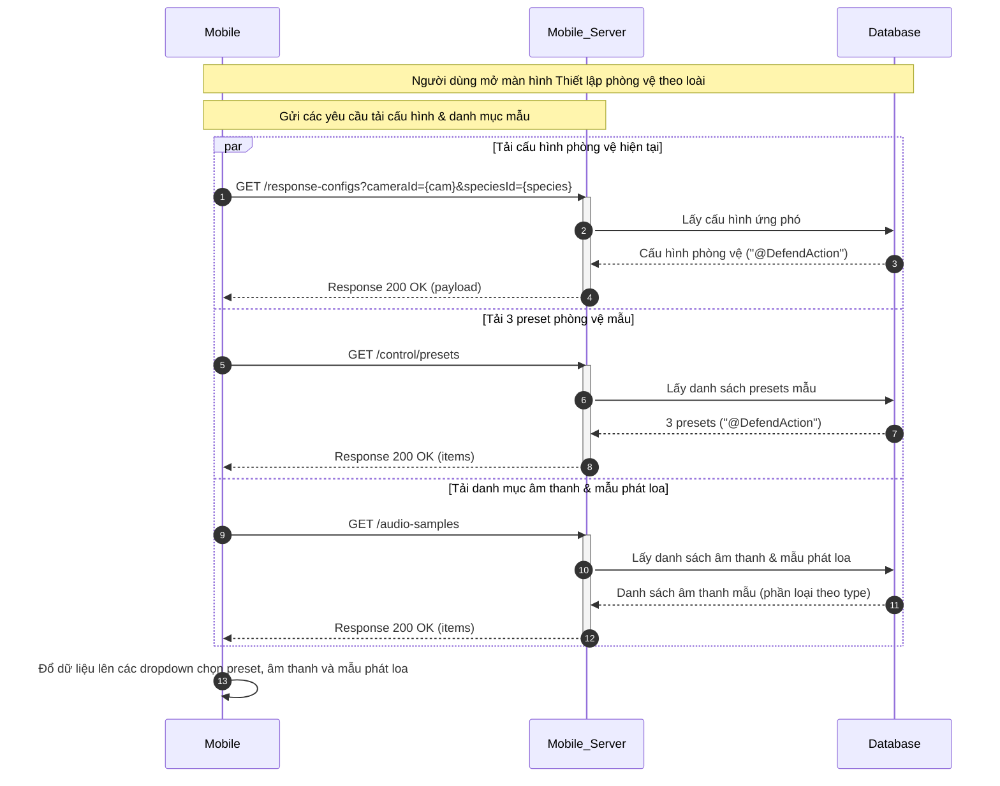
```mermaid
sequenceDiagram
    autonumber
    participant Mobile as Mobile
    participant Mobile_Server as Mobile_Server
    participant Database as Database

    Note over Mobile, Database: Người dùng mở màn hình Thiết lập phòng vệ theo loài
    Note over Mobile, Mobile_Server: Gửi các yêu cầu tải cấu hình & danh mục mẫu
    par Tải cấu hình phòng vệ hiện tại
        Mobile->>Mobile_Server: GET /response-configs?cameraId={cam}&speciesId={species}
        activate Mobile_Server
        Mobile_Server->>Database: Lấy cấu hình ứng phó
        Database-->>Mobile_Server: Cấu hình phòng vệ ("@DefendAction")
        Mobile_Server-->>Mobile: Response 200 OK (payload)
        deactivate Mobile_Server
    and Tải 3 preset phòng vệ mẫu
        Mobile->>Mobile_Server: GET /control/presets
        activate Mobile_Server
        Mobile_Server->>Database: Lấy danh sách presets mẫu
        Database-->>Mobile_Server: 3 presets ("@DefendAction")
        Mobile_Server-->>Mobile: Response 200 OK (items)
        deactivate Mobile_Server
    and Tải danh mục âm thanh & mẫu phát loa
        Mobile->>Mobile_Server: GET /audio-samples
        activate Mobile_Server
        Mobile_Server->>Database: Lấy danh sách âm thanh & mẫu phát loa
        Database-->>Mobile_Server: Danh sách âm thanh mẫu (phần loại theo type)
        Mobile_Server-->>Mobile: Response 200 OK (items)
        deactivate Mobile_Server
    end
    Mobile->>Mobile: Đổ dữ liệu lên các dropdown chọn preset, âm thanh và mẫu phát loa
```
*   **Chi tiết đặc tả API:**
    *   [GET /response-configs?cameraId=&speciesId=](./03-mobile_api.md#83-get-response-configscameraidspeciesid)
    *   [GET /control/presets](./03-mobile_api.md#71-get-controlpresets)
    *   [GET /audio-samples](./03-mobile_api.md#72-get-audio-samples)

### 6.2. Action: Update species configuration

- **Mô tả:** Người dùng tùy biến các tham số (âm thanh, đèn LED nháy, cấp độ hàng rào điện, mẫu phát loa, chế độ silent) cho một loài động vật cụ thể và nhấn Lưu cấu hình hoặc Đặt lại về mặc định.

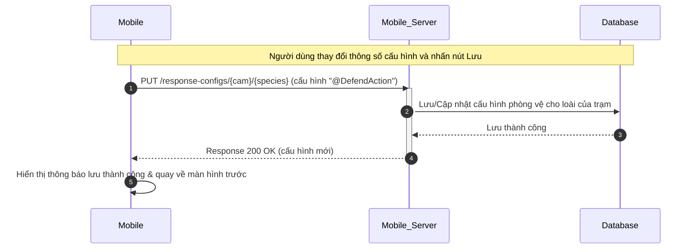
```mermaid
sequenceDiagram
    autonumber
    participant Mobile as Mobile
    participant Mobile_Server as Mobile_Server
    participant Database as Database

    Note over Mobile, Database: Người dùng thay đổi thông số cấu hình và nhấn nút Lưu
    Mobile->>Mobile_Server: PUT /response-configs/{cam}/{species} (cấu hình "@DefendAction")
    activate Mobile_Server
    Mobile_Server->>Database: Lưu/Cập nhật cấu hình phòng vệ cho loài của trạm
    Database-->>Mobile_Server: Lưu thành công
    Mobile_Server-->>Mobile: Response 200 OK (cấu hình mới)
    deactivate Mobile_Server
    Mobile->>Mobile: Hiển thị thông báo lưu thành công & quay về màn hình trước
```
*   **Chi tiết đặc tả API:**
    *   [PUT /response-configs/{cameraId}/{speciesId}](./03-mobile_api.md#82-put-response-configscameraidspeciesid)
    *   [DELETE /response-configs/{cameraId}/{speciesId}](./03-mobile_api.md#84-delete-response-configscameraidspeciesid)

### 6.3. Action: Test speaker sound at camera station (AI_SERVER)

- **Mô tả:** Người dùng chọn loại âm thanh còi báo và nhấn "Nghe thử" để phát thử nghiệm trực tiếp tại hiện trường nhằm căn chỉnh âm lượng.

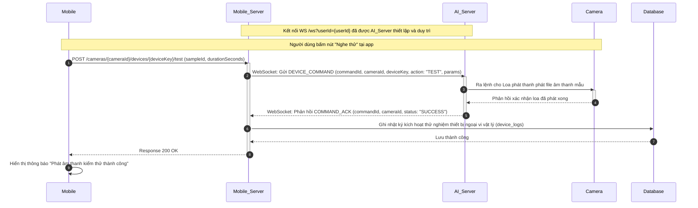
```mermaid
sequenceDiagram
    autonumber
    participant Mobile as Mobile
    participant Mobile_Server as Mobile_Server
    participant AI_Server as AI_Server
    participant Camera as Camera
    participant Database as Database

    Note over AI_Server, Mobile_Server: Kết nối WS /ws?userId={userId} đã được AI_Server thiết lập và duy trì
    Note over Mobile, Camera: Người dùng bấm nút "Nghe thử" tại app
    Mobile->>Mobile_Server: POST /cameras/{cameraId}/devices/{deviceKey}/test (sampleId, durationSeconds)
    activate Mobile_Server
    Mobile_Server->>AI_Server: WebSocket: Gửi DEVICE_COMMAND (commandId, cameraId, deviceKey, action: "TEST", params)
    activate AI_Server
    AI_Server->>Camera: Ra lệnh cho Loa phát thanh phát file âm thanh mẫu
    activate Camera
    Camera-->>AI_Server: Phản hồi xác nhận loa đã phát xong
    deactivate Camera
    AI_Server-->>Mobile_Server: WebSocket: Phản hồi COMMAND_ACK (commandId, cameraId, status: "SUCCESS")
    deactivate AI_Server
    Mobile_Server->>Database: Ghi nhật ký kích hoạt thử nghiệm thiết bị ngoại vi vật lý (device_logs)
    Database-->>Mobile_Server: Lưu thành công
    Mobile_Server-->>Mobile: Response 200 OK
    deactivate Mobile_Server
    Mobile->>Mobile: Hiển thị thông báo "Phát âm thanh kiểm thử thành công"
```
*   **Chi tiết đặc tả API:**
    *   [POST /cameras/{cameraId}/devices/{deviceKey}/test](./03-mobile_api.md#61-post-camerascameraiddevicesdevicekeytest)

---

## 7. Màn hình Quản lý SĐT Nhận Cảnh Báo (`[SMS_CONFIG_SCREEN]`)

### 7.1. Action: Load SMS recipients list

- **Mô tả:** Tải danh sách tối đa 3 số điện thoại đăng ký nhận cảnh báo bổ sung khi mở màn hình quản lý SMS.

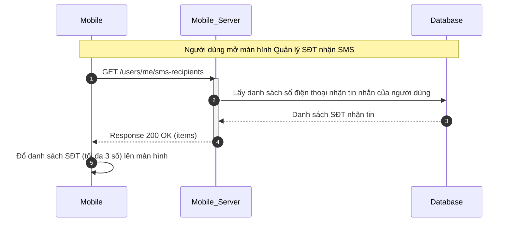
```mermaid
sequenceDiagram
    autonumber
    participant Mobile as Mobile
    participant Mobile_Server as Mobile_Server
    participant Database as Database

    Note over Mobile, Database: Người dùng mở màn hình Quản lý SĐT nhận SMS
    Mobile->>Mobile_Server: GET /users/me/sms-recipients
    activate Mobile_Server
    Mobile_Server->>Database: Lấy danh sách số điện thoại nhận tin nhắn của người dùng
    Database-->>Mobile_Server: Danh sách SĐT nhận tin
    Mobile_Server-->>Mobile: Response 200 OK (items)
    deactivate Mobile_Server
    Mobile->>Mobile: Đổ danh sách SĐT (tối đa 3 số) lên màn hình
```
*   **Chi tiết đặc tả API:**
    *   [GET /users/me/sms-recipients](./03-mobile_api.md#121-get-usersmesms-recipients)

### 7.2. Action: Add / Remove SMS recipient

- **Mô tả:** Người dùng thực hiện thêm số điện thoại mới (qua dialog) hoặc nhấn xóa một số điện thoại khỏi danh sách nhận cảnh báo. Mỗi tài khoản người dùng được thêm tối đa 3 số điện thoại nhận tin.

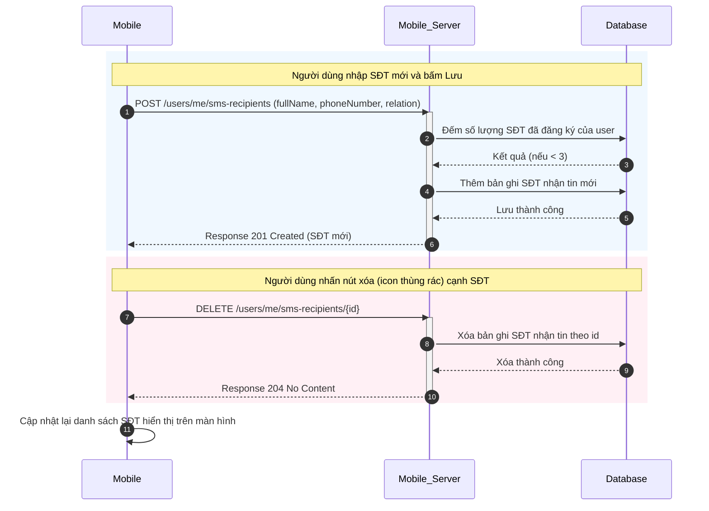
```mermaid
sequenceDiagram
    autonumber
    participant Mobile as Mobile
    participant Mobile_Server as Mobile_Server
    participant Database as Database

    %% THÊM SĐT
    rect rgb(240, 248, 255)
        Note over Mobile, Database: Người dùng nhập SĐT mới và bấm Lưu
        Mobile->>Mobile_Server: POST /users/me/sms-recipients (fullName, phoneNumber, relation)
        activate Mobile_Server
        Mobile_Server->>Database: Đếm số lượng SĐT đã đăng ký của user
        Database-->>Mobile_Server: Kết quả (nếu < 3)
        Mobile_Server->>Database: Thêm bản ghi SĐT nhận tin mới
        Database-->>Mobile_Server: Lưu thành công
        Mobile_Server-->>Mobile: Response 201 Created (SĐT mới)
        deactivate Mobile_Server
    end

    %% XÓA SĐT
    rect rgb(255, 240, 245)
        Note over Mobile, Database: Người dùng nhấn nút xóa (icon thùng rác) cạnh SĐT
        Mobile->>Mobile_Server: DELETE /users/me/sms-recipients/{id}
        activate Mobile_Server
        Mobile_Server->>Database: Xóa bản ghi SĐT nhận tin theo id
        Database-->>Mobile_Server: Xóa thành công
        Mobile_Server-->>Mobile: Response 204 No Content
        deactivate Mobile_Server
    end
    Mobile->>Mobile: Cập nhật lại danh sách SĐT hiển thị trên màn hình
```
*   **Chi tiết đặc tả API:**
    *   [POST /users/me/sms-recipients](./03-mobile_api.md#122-post-usersmesms-recipients)
    *   [DELETE /users/me/sms-recipients/{recipientId}](./03-mobile_api.md#123-delete-usersmesms-recipientsrecipientid)

---

# II. Thiết bị Camera & AI Server (Server AI / Field Device)

## 1. Không phân chia màn hình (Thực thi ngầm & Tích hợp)

### 1.1. Action: AI Server sends detection snapshot (AI_SERVER)

- **Mô tả:** Khi phát hiện có động vật hoặc chuyển động bất thường, Camera/AI_Server tải hình ảnh lên Mobile_Server, nhận cấu hình phòng vệ "@DefendAction" phản hồi để thực thi loa/LED/hàng rào tại chỗ, đồng thời kích hoạt cảnh báo đa kênh đến người dân (SMS/Push).
- **Cơ chế gửi Push Notification:**
  - `Mobile_Server` phân tích danh sách loài phát hiện (`detections`).
  - Nếu phát hiện loài thú rừng nguy hiểm (có `isHuman` = false và `dangerLevel` từ `MEDIUM` trở lên như `MEDIUM`, `HIGH`, `CRITICAL`):
    * `Mobile_Server` sẽ đọc biến môi trường `PUSH_SERVICE_ACCOUNT_KEY_JSON`, giải mã từ Base64 sang Object JSON **trực tiếp trong RAM** để khởi tạo Firebase Admin SDK (nếu chưa được khởi tạo).
    * `Mobile_Server` truy vấn danh sách `fcmToken` từ bảng `device_tokens` cho những người dùng lân cận.
    * Thực hiện gửi Push Notification thông qua Firebase Cloud Messaging.

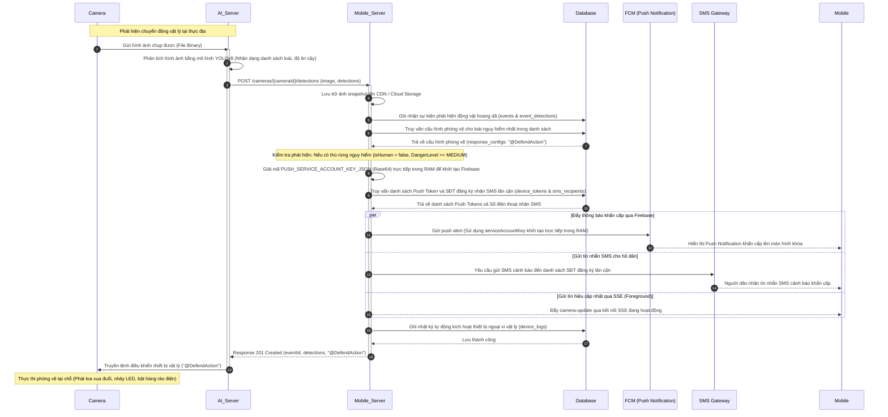
```mermaid
sequenceDiagram
    autonumber
    participant Camera as Camera
    participant AI_Server as AI_Server
    participant Mobile_Server as Mobile_Server
    participant Database as Database
    participant FCM as FCM (Push Notification)
    participant SMS as SMS Gateway
    participant Mobile as Mobile

    Note over Camera, AI_Server: Phát hiện chuyển động vật lý tại thực địa
    Camera->>AI_Server: Gửi hình ảnh chụp được (File Binary)
    activate AI_Server
    AI_Server->>AI_Server: Phân tích hình ảnh bằng mô hình YOLOv8 (Nhận dạng danh sách loài, độ tin cậy)

    AI_Server->>Mobile_Server: POST /cameras/{cameraId}/detections (image, detections)
    activate Mobile_Server
    Mobile_Server->>Mobile_Server: Lưu trữ ảnh snapshot lên CDN / Cloud Storage
    Mobile_Server->>Database: Ghi nhận sự kiện phát hiện động vật hoang dã (events & event_detections)
    Mobile_Server->>Database: Truy vấn cấu hình phòng vệ cho loài nguy hiểm nhất trong danh sách
    Database-->>Mobile_Server: Trả về cấu hình phòng vệ (response_configs: "@DefendAction")

    Note over Mobile_Server: Kiểm tra phát hiện: Nếu có thú rừng nguy hiểm (isHuman = false, DangerLevel >= MEDIUM)
    Mobile_Server->>Mobile_Server: Giải mã PUSH_SERVICE_ACCOUNT_KEY_JSON (Base64) trực tiếp trong RAM để khởi tạo Firebase

    Mobile_Server->>Database: Truy vấn danh sách Push Token và SĐT đăng ký nhận SMS lân cận (device_tokens & sms_recipients)
    Database-->>Mobile_Server: Trả về danh sách Push Tokens và Số điện thoại nhận SMS

    par Đẩy thông báo khẩn cấp qua Firebase
        Mobile_Server->>FCM: Gửi push alert (Sử dụng serviceAccountKey khởi tạo trực tiếp trong RAM)
        FCM-->>Mobile: Hiển thị Push Notification khẩn cấp lên màn hình khóa
    and Gửi tin nhắn SMS cho hộ dân
        Mobile_Server->>SMS: Yêu cầu gửi SMS cảnh báo đến danh sách SĐT đăng ký lân cận
        SMS-->>Mobile: Người dân nhận tin nhắn SMS cảnh báo khẩn cấp
    and Gửi tín hiệu cập nhật qua SSE (Foreground)
        Mobile_Server-->>Mobile: Đẩy camera-update qua kết nối SSE đang hoạt động
    end

    Mobile_Server->>Database: Ghi nhật ký tự động kích hoạt thiết bị ngoại vi vật lý (device_logs)
    Database-->>Mobile_Server: Lưu thành công

    Mobile_Server-->>AI_Server: Response 201 Created (eventId, detections, "@DefendAction")
    deactivate Mobile_Server

    AI_Server->>Camera: Truyền lệnh điều khiển thiết bị vật lý ("@DefendAction")
    deactivate AI_Server

    Note over Camera: Thực thi phòng vệ tại chỗ (Phát loa xua đuổi, nháy LED, bật hàng rào điện)
```
*   **Chi tiết đặc tả API:**
    *   [POST /cameras/{cameraId}/detections](./03-mobile_api.md#13a1-post-camerascameraiddetections)
