# Tài liệu Sequence Diagrams — Hệ thống Cảnh báo & Xua đuổi Động vật Hoang dã

Tài liệu này mô tả chi tiết luồng tương tác giữa các thành phần trong hệ thống (Android App, Mobile Server, Database, FCM, SMS Gateway, và Trạm Camera) được phân chia theo cấu trúc 3 cấp: **Application** -> **Screen** -> **Action**.

---

## Các Thành phần Hệ thống (Standardized Participants)

- **Mobile:** Ứng dụng di động (Android Client) cài đặt trên điện thoại người dùng và kiểm lâm để tương tác với hệ thống.
- **Mobile_Server:** Máy chủ trung tâm lưu trữ dữ liệu, xử lý logic, quản lý phiên làm việc, lưu cấu hình ứng phó và giao tiếp với `Mobile` (qua REST / SSE) và `Ably` (qua REST).
- **Ably:** Dịch vụ đám mây Pub/Sub trung gian (Cloud Broker) phân phối tin nhắn thời gian thực giữa `Mobile_Server` và `AI_Server` thay thế cho WebSocket trực tiếp.
- **AI_Server:** Máy chủ trí tuệ nhân tạo chạy mô hình nhận diện (YOLOv8), nhận hình ảnh từ `Camera` để phân tích, gửi kết quả nhận diện lên `Mobile_Server` (qua REST) và kết nối với `Ably` (qua WebSocket) để nhận lệnh điều khiển.
- **Camera:** Thiết bị camera chụp ảnh tại hiện trường (chỉ gửi ảnh về `AI_Server` khi phát hiện chuyển động) và các thiết bị xua đuổi vật lý (Loa phát thanh, Đèn LED chớp, còi hú báo động).
- **Database:** Cơ sở dữ liệu PostgreSQL lưu trữ trạng thái, cấu hình và nhật ký sự kiện.
- **FCM (Firebase Cloud Messaging):** Dịch vụ trung gian gửi thông báo đẩy (Push notification) thời gian thực đến `Mobile`.
- **SMS Gateway:** Hệ thống gửi tin nhắn SMS cảnh báo khẩn cấp đến các số điện thoại đã đăng ký.

### Cơ chế quản lý serviceAccountKey.json cho Firebase Cloud Messaging (FCM)

Để gửi thông báo đẩy (Push Notification) đến thiết bị di động của kiểm lâm và người dân vùng lân cận qua FCM, `Mobile_Server` cần xác thực với Google Firebase API sử dụng chứng chỉ dịch vụ (`serviceAccountKey.json`).

Nhằm đảm bảo an toàn tuyệt đối và tuân thủ nguyên tắc triển khai Serverless (như Vercel):

- **Tuyệt đối không lưu trữ file** `serviceAccountKey.json` trực tiếp trong mã nguồn (để tránh rò rỉ mã nguồn lên các kho lưu trữ công khai như GitHub).
- **Tuyệt đối không ghi file tạm** chứa khóa này lên đĩa cứng của máy chủ/môi trường Serverless trong quá trình chạy.
- **Cách quản lý và trích xuất:**
  1. Người quản trị thực hiện chuyển đổi nội dung file `serviceAccountKey.json` sang định dạng chuỗi mã hóa **Base64**:
     ```bash
     cat serviceAccountKey.json | base64 | tr -d '\n'
     ```
  2. Lưu chuỗi Base64 vừa trích xuất vào biến môi trường tên là `PUSH_SERVICE_ACCOUNT_KEY_JSON` trên trang quản lý của Vercel (hoặc tệp cấu hình môi trường cục bộ `.env.local` / `.env.production`).
  3. Khi server khởi chạy hoặc khi xử lý yêu cầu gửi thông báo, `Mobile_Server` sẽ đọc chuỗi từ biến môi trường, thực hiện giải mã trực tiếp trong bộ nhớ RAM và truyền Object thu được vào hàm khởi tạo của Firebase Admin SDK:

     ```typescript
     const base64Key = process.env.PUSH_SERVICE_ACCOUNT_KEY_JSON;
     if (base64Key) {
       const decodedJson = Buffer.from(base64Key, "base64").toString("utf8");
       const serviceAccount = JSON.parse(decodedJson);

       // Khởi tạo SDK trực tiếp từ RAM, không ghi file ra đĩa
       admin.initializeApp({
         credential: admin.credential.cert(serviceAccount),
       });
     }
     ```

### Sơ đồ Kiến trúc Tương tác Tổng quan


---

# I. Ứng dụng Android (Android Application)

## 0. Kiến trúc & Luồng xử lý nội bộ Android (Android Application)

Phần này mô tả **mô hình xử lý/threading bên trong** ứng dụng Android — khác với các sequence diagram bên dưới (mô tả tương tác giữa các thành phần hệ thống).

### 0.1. Kiến trúc tổng quan

- **Kiến trúc:** MVVM (Model-View-ViewModel) với UI bằng **Jetpack Compose + Material3**.
- **Tầng dữ liệu:** Retrofit (`NetworkClient` singleton) khởi tạo các API interface (`AuthApi`, `CameraApi`, `ConfigApi`, `AlertApi`, `SmsApi`) — ViewModel gọi trực tiếp các service này bằng Retrofit `suspend fun`. (`DataRepository` hiện chỉ là stub placeholder, không dùng cho logic thật).
- **Quản lý session:** `TokenManager` lưu/accesstoken; mỗi request đính kèm `Authorization: Bearer <token>`.
- **Realtime:** `PollingManager` (coroutine loop 5s) cập nhật danh sách camera định kỳ; FCM push qua `WildlifeFirebaseMessagingService`.

### 0.2. Mô hình xử lý đồng bộ & Threading

- **Coroutines + StateFlow** là cơ chế bất đồng bộ chính (không dùng LiveData).
- **ViewModel** khởi động tác vụ bằng `viewModelScope.launch { }` → chạy trên **`Dispatchers.Main`** mặc định.
- **Retrofit `suspend fun`** thực hiện I/O mạng trên **OkHttp executor thread** rồi resume về Main — do đó **Main thread không bị block**, dù không cần `withContext(Dispatchers.IO)` cho các call mạng.
- Trạng thái được lưu trong **`MutableStateFlow`** (`_xxx.value`), UI thu thập bằng `collectAsState()`; mọi cập nhật giao diện nằm trên Main thread.
- **Ngoài ViewModel**, các tác vụ nền có đời sống/scope riêng tạo `CoroutineScope(Dispatchers.IO)`:
  - `pollingJob` (trong ViewModel) — vòng lặp Auto-Polling 5 giây.
  - `WildlifeFirebaseMessagingService` & `DeterrenceActionReceiver` — xử lý FCM push / action notification.

### 0.3. Luồng xử lý điển hình (Ví dụ: Màn hình Cấu hình phòng vệ theo loài)

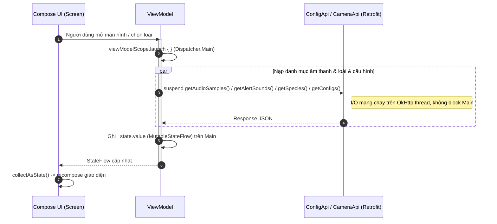
```mermaid
sequenceDiagram
    autonumber
    participant UI as Compose UI (Screen)
    participant VM as ViewModel
    participant API as ConfigApi / CameraApi (Retrofit)

    UI->>VM: Người dùng mở màn hình / chọn loài
    activate VM
    VM->>VM: viewModelScope.launch { } (Dispatcher.Main)
    par Nạp danh mục âm thanh & loài & cấu hình
        VM->>API: suspend getAudioSamples() / getAlertSounds() / getSpecies() / getConfigs()
        Note right of API: I/O mạng chạy trên OkHttp thread, không block Main
        API-->>VM: Response JSON
    end
    VM->>VM: Ghi _state.value (MutableStateFlow) trên Main
    VM-->>UI: StateFlow cập nhật
    deactivate VM
    UI->>UI: collectAsState() -> recompose giao diện
```

---

## 1. Màn hình Đăng ký (`[REGISTER_SCREEN]`)

_(Không có action load dữ liệu ban đầu)_

### 1.1. Action: Register a new account

- **Mô tả:** Người dùng nhập các thông tin đăng ký (tên đăng nhập, họ tên, số điện thoại, mật khẩu, vai trò, và email tùy chọn) để tạo tài khoản mới trong hệ thống.

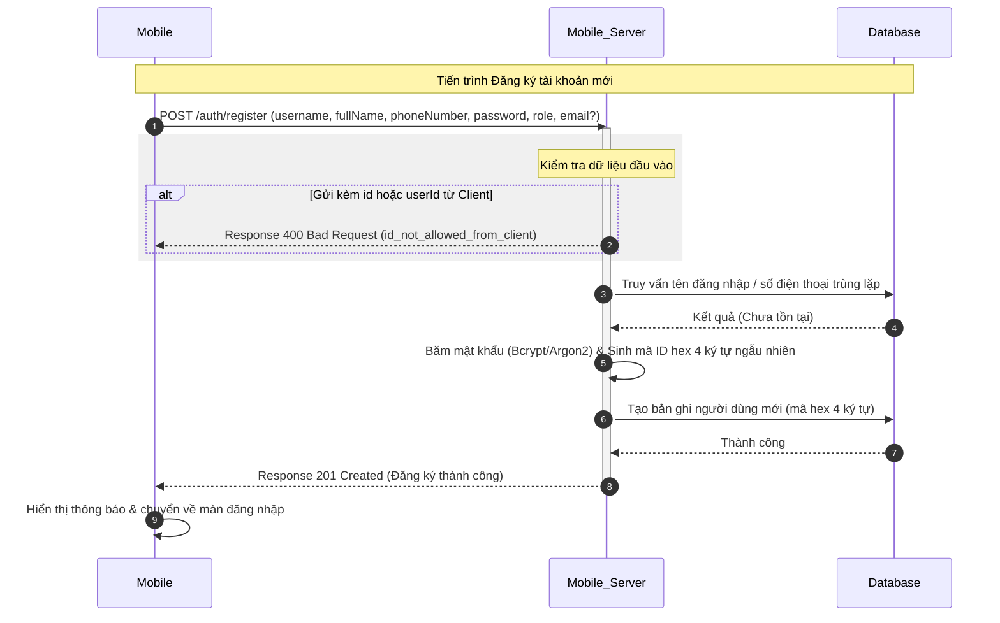
```mermaid
sequenceDiagram
    autonumber
    participant Mobile as Mobile
    participant Mobile_Server as Mobile_Server
    participant Database as Database

    Note over Mobile, Database: Tiến trình Đăng ký tài khoản mới
    Mobile->>Mobile_Server: POST /auth/register (username, fullName, phoneNumber, password, role, email?)
    activate Mobile_Server

    rect rgb(240, 240, 240)
        Note over Mobile_Server: Kiểm tra dữ liệu đầu vào
        alt Gửi kèm id hoặc userId từ Client
            Mobile_Server-->>Mobile: Response 400 Bad Request (id_not_allowed_from_client)
        end
    end

    Mobile_Server->>Database: Truy vấn tên đăng nhập / số điện thoại trùng lặp
    Database-->>Mobile_Server: Kết quả (Chưa tồn tại)
    Mobile_Server->>Mobile_Server: Băm mật khẩu (Bcrypt/Argon2) & Sinh mã ID hex 4 ký tự ngẫu nhiên
    Mobile_Server->>Database: Tạo bản ghi người dùng mới (mã hex 4 ký tự)
    Database-->>Mobile_Server: Thành công
    Mobile_Server-->>Mobile: Response 201 Created (Đăng ký thành công)
    deactivate Mobile_Server
    Mobile->>Mobile: Hiển thị thông báo & chuyển về màn đăng nhập
```

- **Chi tiết đặc tả API:**
  - [POST /auth/register](./03-mobile_api.md#31-post-authregister)

---

## 2. Màn hình Đăng nhập (`[LOGIN_SCREEN]`)

_(Không có action load dữ liệu ban đầu)_

### 2.1. Action: Login & Register fcm-push-token

> [!NOTE]
>
> ### 💡 Diễn giải Luồng vận hành (Dành cho Giám khảo / Người đọc tổng quan)
>
> Quy trình xác thực bảo mật và liên kết thiết bị nhận thông báo tự động khi người dùng đăng nhập diễn ra qua **3 bước chính** như sau:
>
> 1. **Bước 1: Nhập thông tin & Xác thực Tài khoản (Đăng nhập)**
>    - Kiểm lâm hoặc Người dân nhập tên đăng nhập và mật khẩu trên ứng dụng di động. Yêu cầu được gửi về Máy chủ Trung tâm (`Mobile_Server`) để kiểm tra tính hợp lệ.
>    - **Cơ chế xác thực mật khẩu an toàn (Băm mật khẩu một chiều):** Máy chủ tuyệt đối không bao giờ lưu mật khẩu dạng chữ thô. Mật khẩu người dùng gửi lên được máy chủ chạy qua hàm toán học một chiều (Băm - Password Hashing) để biến đổi thành một chuỗi mã cố định độc đáo trước khi so sánh với dữ liệu trong hệ thống.
>      - 💡 **Ví dụ minh họa nguyên lý "Trộn màu sơn một chiều":**
>        - **Chiều đi (Rất dễ):** Khi hòa trộn các màu sơn theo tỉ lệ nhất định (Mật khẩu `MatKhau123`), ta thu được một màu sơn Xanh Ngọc duy nhất (Mã băm `$2b$12$eImi...`).
>        - **Chiều ngược lại (Bất khả thi):** Cho một hũ màu Xanh Ngọc đã trộn sẵn, không ai có thể dùng công cụ nào để "tách ngược" nó trở lại chính xác từng giọt màu ban đầu. Dù kẻ xấu có đánh cắp được chuỗi mã băm trong Cơ sở dữ liệu, họ cũng không thể giải mã ngược để biết mật khẩu gốc là gì.
>        - **Cách xác nhận:** Mỗi lần đăng nhập, máy chủ chỉ việc đem mật khẩu vừa nhập đi "trộn màu", nếu ra đúng màu Xanh Ngọc đã lưu thì xác nhận đúng mật khẩu.
>      - 🛡️ **Độ tin cậy & Tỷ lệ trùng mã băm (Hash Collision):** Mặc dù về mặt lý thuyết toán học thuần túy, mã băm không phải là tuyệt đối duy nhất 100% cho vô hạn chuỗi ký tự, nhưng **khả năng/xác suất để tìm được một chuỗi mật khẩu bất kỳ khác mà khi băm ra lại cho kết quả trùng khớp (hiện tượng đụng độ - Hash Collision) là vô cùng cực kỳ thấp** (tỷ lệ dưới 1 trên hàng tỷ tỷ tỷ trường hợp). Do đó, hệ thống hoàn toàn đảm bảo tính an toàn bảo mật tuyệt đối trên thực tế.
>    - **Ý nghĩa của Thẻ xác thực (Access Token & Refresh Token) & Vì sao không gửi trực tiếp Mật khẩu:**
>      - **Vì sao không dùng trực tiếp Mật khẩu ở mọi thao tác:** Nếu mỗi lần bấm nút (xem camera, đổi cấu hình) ứng dụng lại gửi kèm tên đăng nhập và mật khẩu, thông tin nhạy cảm sẽ liên tục bay trên mạng, nguy cơ bị lộ rất cao.
>      - **Access Token (Chìa khóa thông hành tạm thời):** Là một mã điện tử có thời hạn sử dụng ngắn. Khi đăng nhập đúng, máy chủ phát cho điện thoại chiếc thẻ này. Trong các thao tác tiếp theo, ứng dụng chỉ cần trình chiếc thẻ `Access Token` mà không cần gửi lại mật khẩu.
>      - **Refresh Token (Thẻ gia hạn phiên làm việc):** Khi chìa khóa tạm thời `Access Token` hết hạn, ứng dụng sẽ dùng chiếc thẻ gia hạn `Refresh Token` này để xin máy chủ cấp chìa khóa mới một cách tự động, giúp người dùng không phải gõ lại mật khẩu nhiều lần.
> 2. **Bước 2: Tự động Định danh & Gửi Mã Thiết bị về Máy chủ Trung tâm (Đăng ký fcm-push-token)**
>    - Ngay sau khi đăng nhập thành công, ứng dụng di động tự động liên hệ với hạ tầng **Google Firebase** để xin cấp một **`fcm-push-token`**. Chuỗi mã này do Google Firebase khởi tạo riêng biệt và là **mã duy nhất tuyệt đối dành riêng cho từng Ứng dụng trên từng Thiết bị di động cụ thể** (không bao giờ bị trùng lặp trên toàn thế giới).
>    - Ứng dụng lập tức **gửi mã `fcm-push-token` duy nhất này về lưu trữ tại Máy chủ Trung tâm (Backend Server qua API `POST /devices/push-token`)** để đính kèm trực tiếp với tài khoản người dùng (`userId`).
>    - **Ý nghĩa & Vai trò trong việc phát thông báo khẩn cấp:**
>      - **Gửi `fcm-push-token` về Backend Server:** Giúp máy chủ ghi nhớ chính xác địa chỉ liên lạc duy nhất của từng tài khoản. Bất kể lúc nào có sự kiện động vật nguy hiểm xuất hiện (dù ứng dụng di động đang mở, đang chạy ngầm hay điện thoại đang khóa/tắt màn hình), máy chủ Backend đều có thể chủ động kích hoạt và gửi cảnh báo tức thời.
>      - **`fcm-push-token` (Mã địa chỉ nhận tin):** Được Google Firebase cấp riêng và là mã duy nhất tuyệt đối cho từng App trên từng Device, đóng vai trò như _"Địa chỉ hòm thư độc nhất"_ của thiết bị di động đó, đảm bảo tin nhắn cảnh báo phát đúng ứng dụng, đúng người dùng mà không bao giờ bị nhầm lẫn.
>      - **Google Firebase (Hạ tầng dịch vụ tin nhắn):** Đóng vai trò _"Bưu điện Trung gian Khẩn cấp"_, tiếp nhận lệnh từ Backend Server và chịu trách nhiệm đưa thông báo đẩy (Push Notification) hiển thị rực sáng trên màn hình khóa điện thoại 24/7.
> 3. **Bước 3: Hoàn tất & Chuyển vào Màn hình Điều khiển Chính**
>    - Khi thiết bị được ghi nhận thành công, ứng dụng lưu chìa khóa bảo mật và tự động chuyển người dùng vào màn hình chính để theo dõi danh sách trạm camera và tin tức cảnh báo theo thời gian thực.

- **Mô tả kỹ thuật:** Người dùng đăng nhập bằng tên đăng nhập và mật khẩu. Sau khi nhận accessToken từ server, Android Client lấy fcm-push-token từ FCM và tự động gửi lên server để liên kết thiết bị.

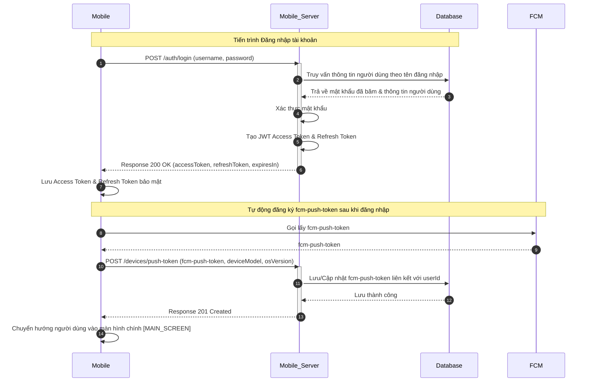
```mermaid
sequenceDiagram
    autonumber
    participant Mobile as Mobile
    participant Mobile_Server as Mobile_Server
    participant Database as Database
    participant FCM as FCM

    Note over Mobile, Database: Tiến trình Đăng nhập tài khoản
    Mobile->>Mobile_Server: POST /auth/login (username, password)
    activate Mobile_Server
    Mobile_Server->>Database: Truy vấn thông tin người dùng theo tên đăng nhập
    Database-->>Mobile_Server: Trả về mật khẩu đã băm & thông tin người dùng
    Mobile_Server->>Mobile_Server: Xác thực mật khẩu
    Mobile_Server->>Mobile_Server: Tạo JWT Access Token & Refresh Token
    Mobile_Server-->>Mobile: Response 200 OK (accessToken, refreshToken, expiresIn)
    deactivate Mobile_Server

    Mobile->>Mobile: Lưu Access Token & Refresh Token bảo mật

    Note over Mobile, FCM: Tự động đăng ký fcm-push-token sau khi đăng nhập
    Mobile->>FCM: Gọi lấy fcm-push-token
    FCM-->>Mobile: fcm-push-token
    Mobile->>Mobile_Server: POST /devices/push-token (fcm-push-token, deviceModel, osVersion)
    activate Mobile_Server
    Mobile_Server->>Database: Lưu/Cập nhật fcm-push-token liên kết với userId
    Database-->>Mobile_Server: Lưu thành công
    Mobile_Server-->>Mobile: Response 201 Created
    deactivate Mobile_Server
    Mobile->>Mobile: Chuyển hướng người dùng vào màn hình chính [MAIN_SCREEN]
```

- **Chi tiết đặc tả API:**
  - [POST /auth/login](./03-mobile_api.md#32-post-authlogin)
  - [POST /devices/push-token](./03-mobile_api.md#41-post-devicespush-token)

---

## 3. Màn hình chính (`[MAIN_SCREEN]`)

### 3.1. Tab Danh sách Camera (`[CAMERA_LIST_TAB]`)

### 3.1.1. Action: Load camera list & initial snapshots

- **Mô tả:** Khi mở tab hoặc vào màn hình chính, app tự động gọi API lấy danh sách các trạm camera trực thuộc quyền quản lý kèm theo trạng thái hoạt động và ảnh snapshot thumbnail gần nhất để hiển thị.

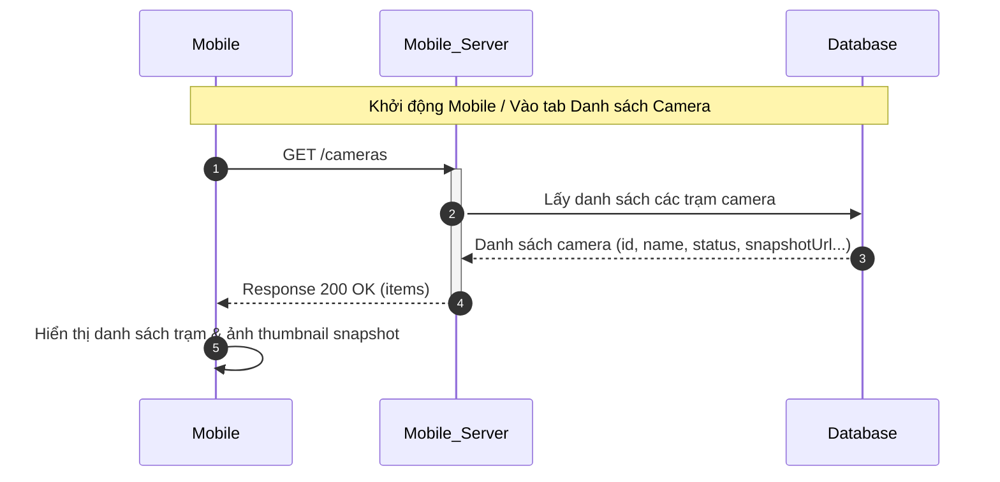
```mermaid
sequenceDiagram
    autonumber
    participant Mobile as Mobile
    participant Mobile_Server as Mobile_Server
    participant Database as Database

    Note over Mobile, Database: Khởi động Mobile / Vào tab Danh sách Camera
    Mobile->>Mobile_Server: GET /cameras
    activate Mobile_Server
    Mobile_Server->>Database: Lấy danh sách các trạm camera
    Database-->>Mobile_Server: Danh sách camera (id, name, status, snapshotUrl...)
    Mobile_Server-->>Mobile: Response 200 OK (items)
    deactivate Mobile_Server
    Mobile->>Mobile: Hiển thị danh sách trạm & ảnh thumbnail snapshot
```

- **Chi tiết đặc tả API:**
  - [GET /cameras](./03-mobile_api.md#51-get-cameras)

### 3.1.2. Action: Auto-Polling (Smart Polling) cập nhật danh sách camera

- **Mô tả:** Song song với việc tải danh sách lần đầu, ứng dụng khởi động một vòng lặp coroutine (Smart Polling) chạy ngầm. Sau mỗi **5 giây**, vòng lặp tự động gọi nhẹ `GET /cameras/heartbeat` để kiểm tra `lastUpdatedAt` trong toàn hệ thống. Nếu `lastUpdatedAt` lớn hơn thời điểm cập nhật gần nhất của client, ứng dụng mới gọi `GET /cameras` để lấy toàn bộ dữ liệu danh sách camera và ảnh snapshot mới nhất.

> **Cơ chế Smart Polling tối ưu:** Giúp giảm thiểu tối đa băng thông và tải serverless của Vercel mà vẫn đảm bảo cập nhật trạng thái báo động thời gian thực.

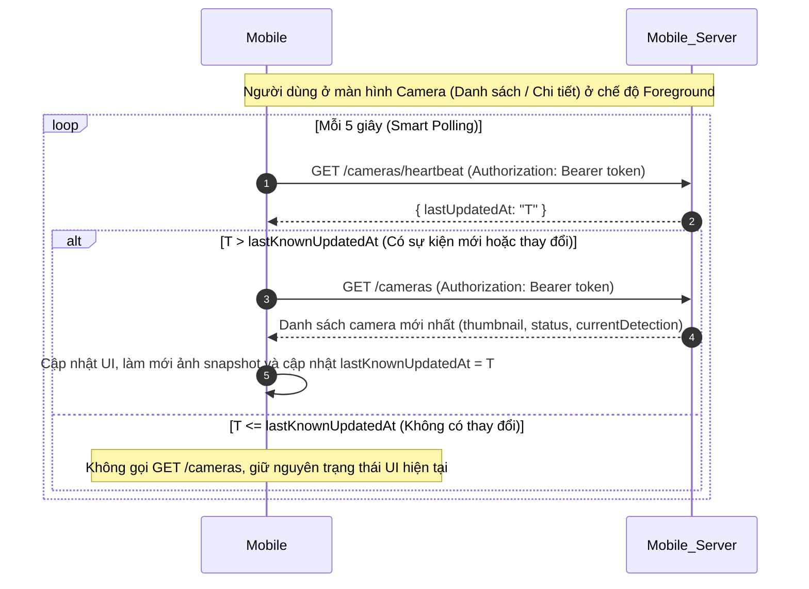
```mermaid
sequenceDiagram
    autonumber
    participant Mobile as Mobile
    participant Mobile_Server as Mobile_Server

    Note over Mobile, Mobile_Server: Người dùng ở màn hình Camera (Danh sách / Chi tiết) ở chế độ Foreground
    loop Mỗi 5 giây (Smart Polling)
        Mobile->>Mobile_Server: GET /cameras/heartbeat (Authorization: Bearer token)
        Mobile_Server-->>Mobile: { lastUpdatedAt: "T" }
        alt T > lastKnownUpdatedAt (Có sự kiện mới hoặc thay đổi)
            Mobile->>Mobile_Server: GET /cameras (Authorization: Bearer token)
            Mobile_Server-->>Mobile: Danh sách camera mới nhất (thumbnail, status, currentDetection)
            Mobile->>Mobile: Cập nhật UI, làm mới ảnh snapshot và cập nhật lastKnownUpdatedAt = T
        else T <= lastKnownUpdatedAt (Không có thay đổi)
            Note over Mobile: Không gọi GET /cameras, giữ nguyên trạng thái UI hiện tại
        end
    end
```

- **Chi tiết đặc tả API:**
  - [GET /cameras/heartbeat](./03-mobile_api.md#55-get-camerasheartbeat)
  - [GET /cameras](./03-mobile_api.md#51-get-cameras)

### 3.2. Tab Thống kê (`[STATISTICS_TAB]`)

### 3.2.1. Action: Initialize filter & Apply filter (`statistics_filter`)

- **Mô tả:** Khi mở tab Thống kê, app thực hiện tải danh sách loài và trạm camera để đổ vào các dropdown bộ lọc. Khi người dùng thay đổi bộ lọc (Thời gian, Loài, Camera), app gọi lại API lấy dữ liệu thống kê tổng hợp để vẽ lại biểu đồ/heatmap.

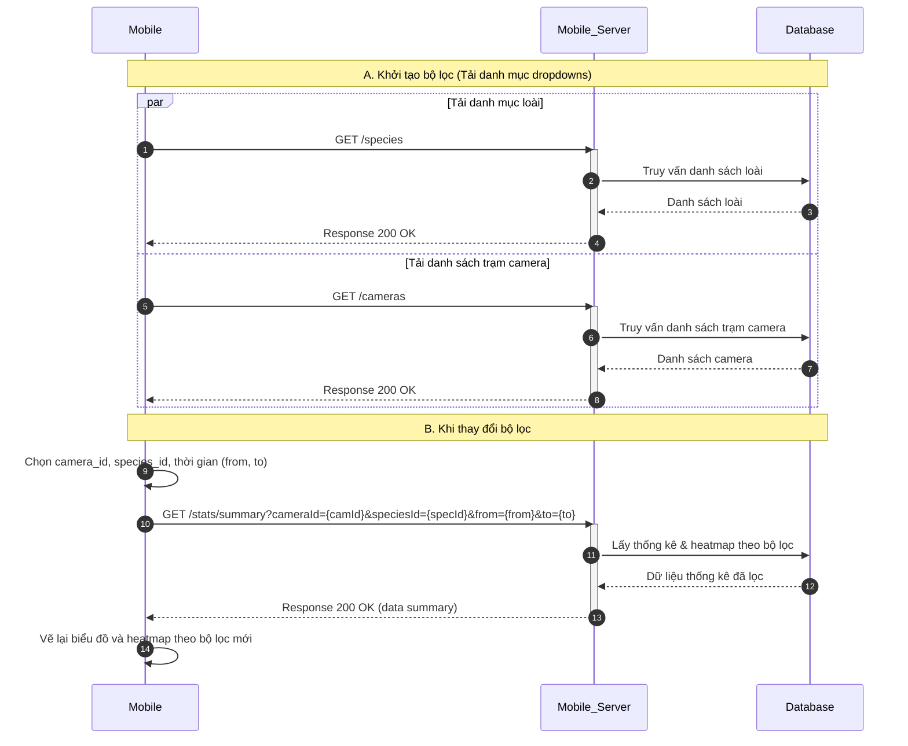
```mermaid
sequenceDiagram
    autonumber
    participant Mobile as Mobile
    participant Mobile_Server as Mobile_Server
    participant Database as Database

    Note over Mobile, Database: A. Khởi tạo bộ lọc (Tải danh mục dropdowns)
    par Tải danh mục loài
        Mobile->>Mobile_Server: GET /species
        activate Mobile_Server
        Mobile_Server->>Database: Truy vấn danh sách loài
        Database-->>Mobile_Server: Danh sách loài
        Mobile_Server-->>Mobile: Response 200 OK
        deactivate Mobile_Server
    and Tải danh sách trạm camera
        Mobile->>Mobile_Server: GET /cameras
        activate Mobile_Server
        Mobile_Server->>Database: Truy vấn danh sách trạm camera
        Database-->>Mobile_Server: Danh sách camera
        Mobile_Server-->>Mobile: Response 200 OK
        deactivate Mobile_Server
    end

    Note over Mobile, Database: B. Khi thay đổi bộ lọc
    Mobile->>Mobile: Chọn camera_id, species_id, thời gian (from, to)
    Mobile->>Mobile_Server: GET /stats/summary?cameraId={camId}&speciesId={specId}&from={from}&to={to}
    activate Mobile_Server
    Mobile_Server->>Database: Lấy thống kê & heatmap theo bộ lọc
    Database-->>Mobile_Server: Dữ liệu thống kê đã lọc
    Mobile_Server-->>Mobile: Response 200 OK (data summary)
    deactivate Mobile_Server
    Mobile->>Mobile: Vẽ lại biểu đồ và heatmap theo bộ lọc mới
```

- **Chi tiết đặc tả API:**
  - [GET /species](./03-mobile_api.md#81-get-species)
  - [GET /cameras](./03-mobile_api.md#51-get-cameras)
  - [GET /stats/summary](./03-mobile_api.md#102-get-statssummary)

### 3.2.2. Action: Load weekly detections list & Mark alert read (`weekly_detections_section`)

- **Mô tả:** App tải danh sách các tin cảnh báo khẩn cấp/phát hiện động vật hoang dã gần đây nhất bằng cách gọi API `GET /alerts/feed`. Khi người dùng chạm vào một tin cảnh báo để đọc chi tiết, ứng dụng tự động gửi yêu cầu `POST /alerts/feed/{alertId}/read` để đánh dấu tin đó là đã đọc.

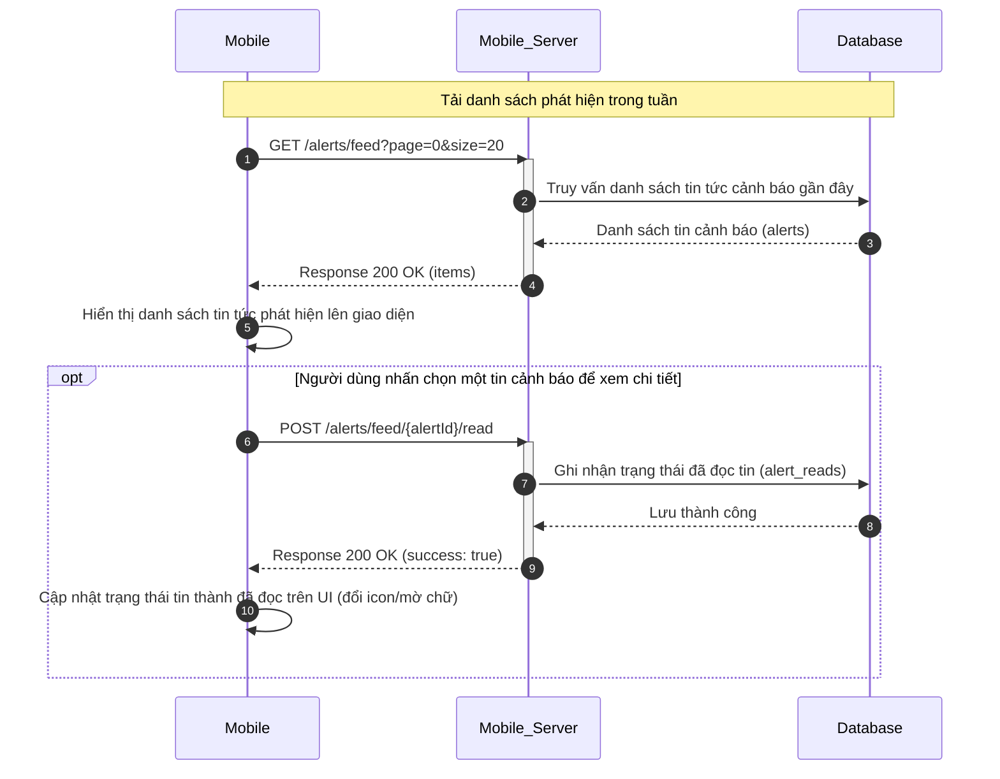
```mermaid
sequenceDiagram
    autonumber
    participant Mobile as Mobile
    participant Mobile_Server as Mobile_Server
    participant Database as Database

    Note over Mobile, Database: Tải danh sách phát hiện trong tuần
    Mobile->>Mobile_Server: GET /alerts/feed?page=0&size=20
    activate Mobile_Server
    Mobile_Server->>Database: Truy vấn danh sách tin tức cảnh báo gần đây
    Database-->>Mobile_Server: Danh sách tin cảnh báo (alerts)
    Mobile_Server-->>Mobile: Response 200 OK (items)
    deactivate Mobile_Server
    Mobile->>Mobile: Hiển thị danh sách tin tức phát hiện lên giao diện

    opt Người dùng nhấn chọn một tin cảnh báo để xem chi tiết
        Mobile->>Mobile_Server: POST /alerts/feed/{alertId}/read
        activate Mobile_Server
        Mobile_Server->>Database: Ghi nhận trạng thái đã đọc tin (alert_reads)
        Database-->>Mobile_Server: Lưu thành công
        Mobile_Server-->>Mobile: Response 200 OK (success: true)
        deactivate Mobile_Server
        Mobile->>Mobile: Cập nhật trạng thái tin thành đã đọc trên UI (đổi icon/mờ chữ)
    end
```

- **Chi tiết đặc tả API:**
  - [GET /alerts/feed](./03-mobile_api.md#111-get-alertsfeed)
  - [POST /alerts/feed/{alertId}/read](./03-mobile_api.md#113-post-alertsfeedalertidread)

### 3.2.3. Action: Load trend chart & movement heatmap (`per_camera_analysis_section`)

- **Mô tả:** Tải dữ liệu phân tích thống kê tổng hợp (tổng số lần xuất hiện, tọa độ di chuyển) để vẽ biểu đồ đường xu hướng và sơ đồ nhiệt (heatmap) phân bố động vật.

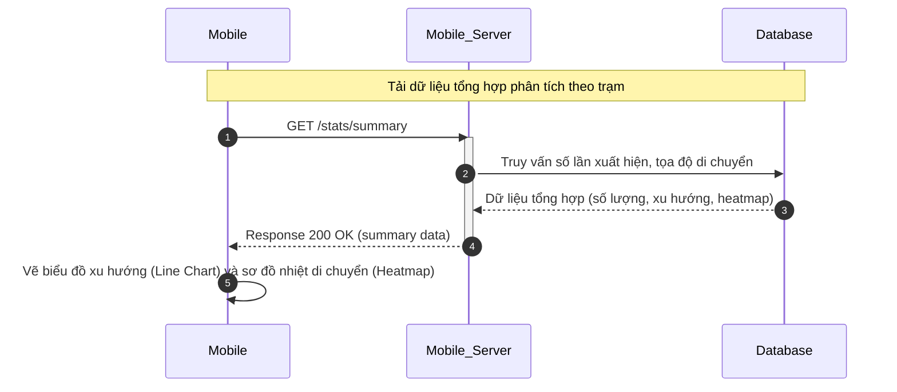
```mermaid
sequenceDiagram
    autonumber
    participant Mobile as Mobile
    participant Mobile_Server as Mobile_Server
    participant Database as Database

    Note over Mobile, Database: Tải dữ liệu tổng hợp phân tích theo trạm
    Mobile->>Mobile_Server: GET /stats/summary
    activate Mobile_Server
    Mobile_Server->>Database: Truy vấn số lần xuất hiện, tọa độ di chuyển
    Database-->>Mobile_Server: Dữ liệu tổng hợp (số lượng, xu hướng, heatmap)
    Mobile_Server-->>Mobile: Response 200 OK (summary data)
    deactivate Mobile_Server
    Mobile->>Mobile: Vẽ biểu đồ xu hướng (Line Chart) và sơ đồ nhiệt di chuyển (Heatmap)
```

- **Chi tiết đặc tả API:**
  - [GET /stats/summary](./03-mobile_api.md#102-get-statssummary)

### 3.3. Tab Cài đặt (`[SETTING_TAB]`)

### 3.3.1. Action: Load & Update user profile

- **Mô tả:** Tải thông tin tài khoản hiện tại (họ tên, vai trò, số điện thoại đăng nhập) để hiển thị lên form cài đặt chung bằng `GET /users/me`. Khi người dùng chỉnh sửa họ tên/số điện thoại, ứng dụng gửi yêu cầu `PATCH /users/me` để lưu cập nhật.

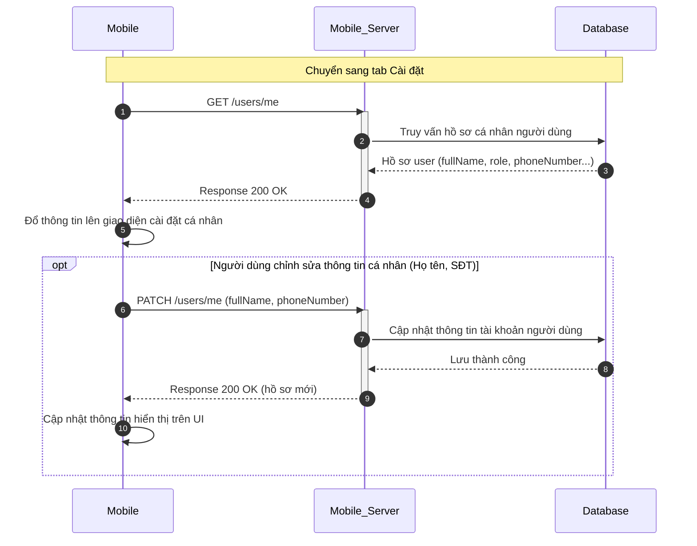
```mermaid
sequenceDiagram
    autonumber
    participant Mobile as Mobile
    participant Mobile_Server as Mobile_Server
    participant Database as Database

    Note over Mobile, Database: Chuyển sang tab Cài đặt
    Mobile->>Mobile_Server: GET /users/me
    activate Mobile_Server
    Mobile_Server->>Database: Truy vấn hồ sơ cá nhân người dùng
    Database-->>Mobile_Server: Hồ sơ user (fullName, role, phoneNumber...)
    Mobile_Server-->>Mobile: Response 200 OK
    deactivate Mobile_Server
    Mobile->>Mobile: Đổ thông tin lên giao diện cài đặt cá nhân

    opt Người dùng chỉnh sửa thông tin cá nhân (Họ tên, SĐT)
        Mobile->>Mobile_Server: PATCH /users/me (fullName, phoneNumber)
        activate Mobile_Server
        Mobile_Server->>Database: Cập nhật thông tin tài khoản người dùng
        Database-->>Mobile_Server: Lưu thành công
        Mobile_Server-->>Mobile: Response 200 OK (hồ sơ mới)
        deactivate Mobile_Server
        Mobile->>Mobile: Cập nhật thông tin hiển thị trên UI
    end
```

- **Chi tiết đặc tả API:**
  - [GET /users/me](./03-mobile_api.md#91-get-usersme)
  - [PATCH /users/me](./03-mobile_api.md#92-patch-usersme)

### 3.3.2. Action: Logout

- **Mô tả:** Người dùng nhấn nút Đăng xuất, app gửi yêu cầu hủy session trên server, đồng thời hủy fcm-push-token trên thiết bị để ngưng nhận thông báo và đưa người dùng trở lại màn hình đăng nhập.

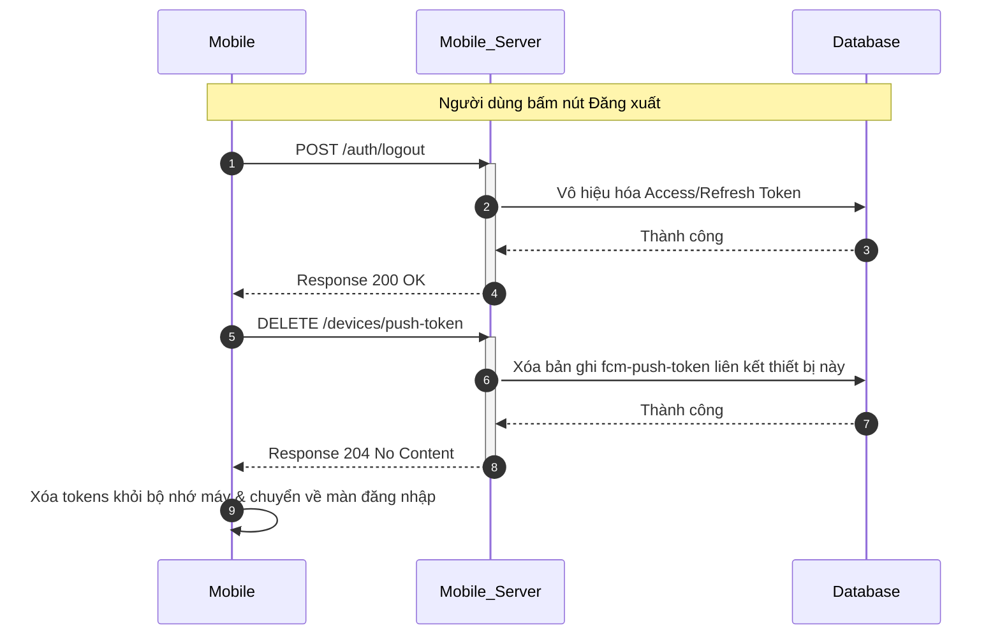
```mermaid
sequenceDiagram
    autonumber
    participant Mobile as Mobile
    participant Mobile_Server as Mobile_Server
    participant Database as Database

    Note over Mobile, Database: Người dùng bấm nút Đăng xuất
    Mobile->>Mobile_Server: POST /auth/logout
    activate Mobile_Server
    Mobile_Server->>Database: Vô hiệu hóa Access/Refresh Token
    Database-->>Mobile_Server: Thành công
    Mobile_Server-->>Mobile: Response 200 OK
    deactivate Mobile_Server

    Mobile->>Mobile_Server: DELETE /devices/push-token
    activate Mobile_Server
    Mobile_Server->>Database: Xóa bản ghi fcm-push-token liên kết thiết bị này
    Database-->>Mobile_Server: Thành công
    Mobile_Server-->>Mobile: Response 204 No Content
    deactivate Mobile_Server

    Mobile->>Mobile: Xóa tokens khỏi bộ nhớ máy & chuyển về màn đăng nhập
```

- **Chi tiết đặc tả API:**
  - [POST /auth/logout](./03-mobile_api.md#33-post-authlogout)
  - [DELETE /devices/push-token](./03-mobile_api.md#42-delete-devicespush-token)

---

## 4. Màn hình Chi tiết Camera (`[CAMERA_VIEW_SCREEN]`)

### 4.1. Action: Load camera details & history logs

- **Mô tả:** Khi người dùng chọn một camera, Mobile sẽ đồng thời tải: thông tin chi tiết camera (bao gồm thông tin trạm, ảnh snapshot gần nhất, phán đoán AI hiện tại) và danh sách lịch sử nhật ký sự kiện ghi nhận của camera đó theo ngày chọn.

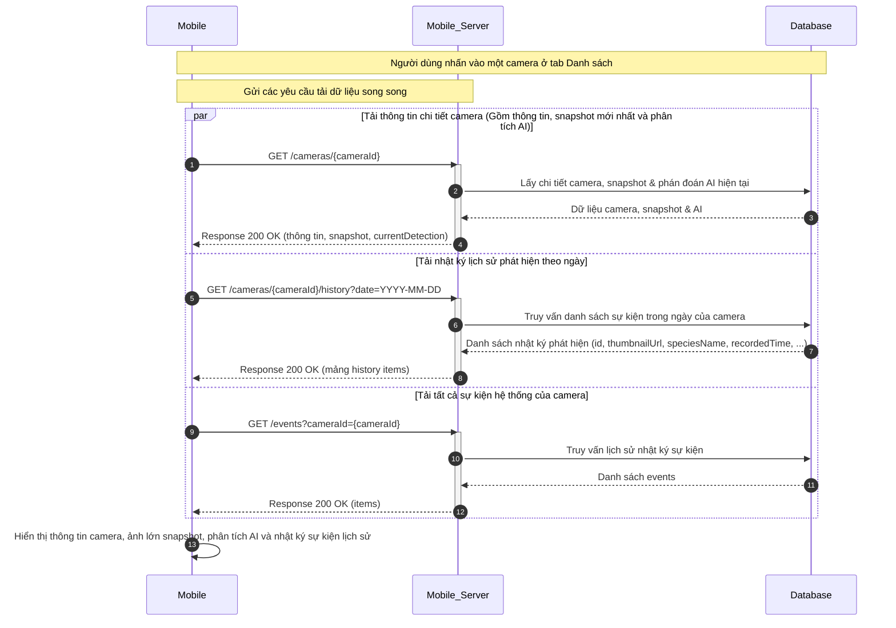
```mermaid
sequenceDiagram
    autonumber
    participant Mobile as Mobile
    participant Mobile_Server as Mobile_Server
    participant Database as Database

    Note over Mobile, Database: Người dùng nhấn vào một camera ở tab Danh sách
    Note over Mobile, Mobile_Server: Gửi các yêu cầu tải dữ liệu song song
    par Tải thông tin chi tiết camera (Gồm thông tin, snapshot mới nhất và phân tích AI)
        Mobile->>Mobile_Server: GET /cameras/{cameraId}
        activate Mobile_Server
        Mobile_Server->>Database: Lấy chi tiết camera, snapshot & phán đoán AI hiện tại
        Database-->>Mobile_Server: Dữ liệu camera, snapshot & AI
        Mobile_Server-->>Mobile: Response 200 OK (thông tin, snapshot, currentDetection)
        deactivate Mobile_Server
    and Tải nhật ký lịch sử phát hiện theo ngày
        Mobile->>Mobile_Server: GET /cameras/{cameraId}/history?date=YYYY-MM-DD
        activate Mobile_Server
        Mobile_Server->>Database: Truy vấn danh sách sự kiện trong ngày của camera
        Database-->>Mobile_Server: Danh sách nhật ký phát hiện (id, thumbnailUrl, speciesName, recordedTime, ...)
        Mobile_Server-->>Mobile: Response 200 OK (mảng history items)
        deactivate Mobile_Server
    and Tải tất cả sự kiện hệ thống của camera
        Mobile->>Mobile_Server: GET /events?cameraId={cameraId}
        activate Mobile_Server
        Mobile_Server->>Database: Truy vấn lịch sử nhật ký sự kiện
        Database-->>Mobile_Server: Danh sách events
        Mobile_Server-->>Mobile: Response 200 OK (items)
        deactivate Mobile_Server
    end
    Mobile->>Mobile: Hiển thị thông tin camera, ảnh lớn snapshot, phân tích AI và nhật ký sự kiện lịch sử
```

- **Chi tiết đặc tả API:**
  - [GET /cameras/{cameraId}](./03-mobile_api.md#52-get-camerascameraid)
  - [GET /cameras/{cameraId}/history](./03-mobile_api.md#56-get-camerascameraidhistory)
  - [GET /events](./03-mobile_api.md#101-get-events)

### 4.2. Action: Update camera name

- **Mô tả:** Người dùng bấm nút sửa tên hiển thị trên màn hình chi tiết, nhập tên mới và lưu lại để đồng bộ lên DB.

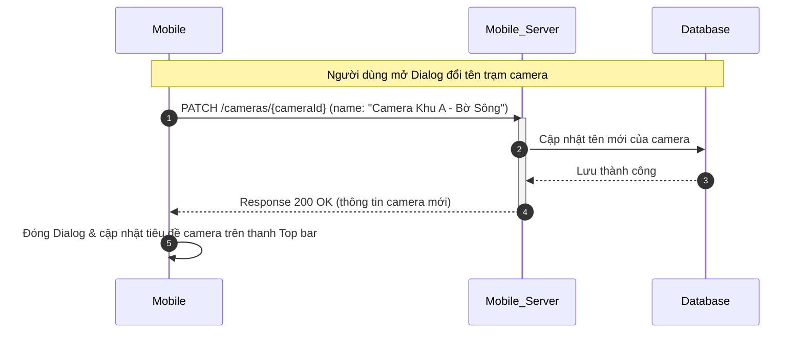
```mermaid
sequenceDiagram
    autonumber
    participant Mobile as Mobile
    participant Mobile_Server as Mobile_Server
    participant Database as Database

    Note over Mobile, Database: Người dùng mở Dialog đổi tên trạm camera
    Mobile->>Mobile_Server: PATCH /cameras/{cameraId} (name: "Camera Khu A - Bờ Sông")
    activate Mobile_Server
    Mobile_Server->>Database: Cập nhật tên mới của camera
    Database-->>Mobile_Server: Lưu thành công
    Mobile_Server-->>Mobile: Response 200 OK (thông tin camera mới)
    deactivate Mobile_Server
    Mobile->>Mobile: Đóng Dialog & cập nhật tiêu đề camera trên thanh Top bar
```

- **Chi tiết đặc tả API:**
  - [PATCH /cameras/{cameraId}](./03-mobile_api.md#53-patch-camerascameraid)

---

## 5. Màn hình Danh sách Cấu hình Loài (`[SPECIES_CONFIG_LIST_SCREEN]`)

### 5.1. Action: Load species list & configuration overview

- **Mô tả:** Khi người dùng mở màn hình thiết lập ứng phó mặc định, app tải danh sách toàn bộ các loài động vật trong hệ thống (kèm chỉ số hung dữ, đặc tính htmlDescription) và tình trạng cấu hình tương ứng đang được áp dụng tại trạm camera đã chọn.

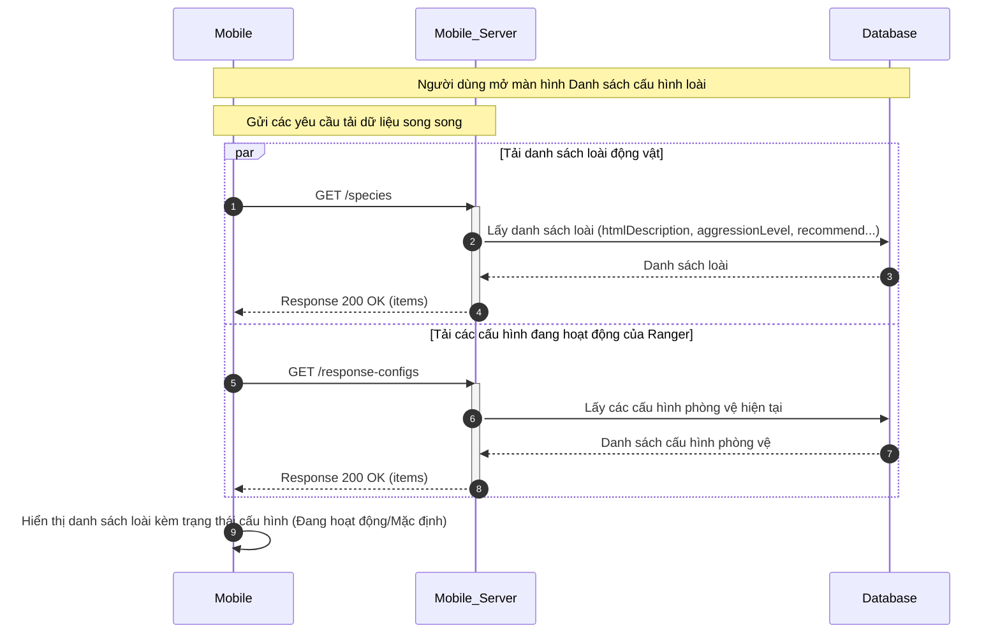
```mermaid
sequenceDiagram
    autonumber
    participant Mobile as Mobile
    participant Mobile_Server as Mobile_Server
    participant Database as Database

    Note over Mobile, Database: Người dùng mở màn hình Danh sách cấu hình loài
    Note over Mobile, Mobile_Server: Gửi các yêu cầu tải dữ liệu song song
    par Tải danh sách loài động vật
        Mobile->>Mobile_Server: GET /species
        activate Mobile_Server
        Mobile_Server->>Database: Lấy danh sách loài (htmlDescription, aggressionLevel, recommend...)
        Database-->>Mobile_Server: Danh sách loài
        Mobile_Server-->>Mobile: Response 200 OK (items)
        deactivate Mobile_Server
    and Tải các cấu hình đang hoạt động của Ranger
        Mobile->>Mobile_Server: GET /response-configs
        activate Mobile_Server
        Mobile_Server->>Database: Lấy các cấu hình phòng vệ hiện tại
        Database-->>Mobile_Server: Danh sách cấu hình phòng vệ
        Mobile_Server-->>Mobile: Response 200 OK (items)
        deactivate Mobile_Server
    end
    Mobile->>Mobile: Hiển thị danh sách loài kèm trạng thái cấu hình (Đang hoạt động/Mặc định)
```

- **Chi tiết đặc tả API:**
  - [GET /species](./03-mobile_api.md#81-get-species)
  - [GET /response-configs](./03-mobile_api.md#86-get-response-configs-helper)

---

## 6. Màn hình Thiết lập Phòng vệ theo Loài (`[SPECIES_CONFIG_DETAIL_SCREEN]`)

### 6.1. Action: Load species configuration & sample lists

- **Mô tả:** Khi chọn một loài để cấu hình chi tiết, app tải cấu hình phòng vệ hiện tại đang lưu trên DB, đồng thời tải danh sách 3 preset phòng vệ mẫu và danh sách âm thanh mẫu (bao gồm cả âm thanh xua đuổi `animalDeterrentSounds` và âm thanh cảnh báo qua loa `citizenAlertSounds` — nguồn là `GET /alertSounds`) để phục vụ dropdown lựa chọn của người dùng. Các id âm thanh hoàn toàn lấy từ API, không hardcode trong app.

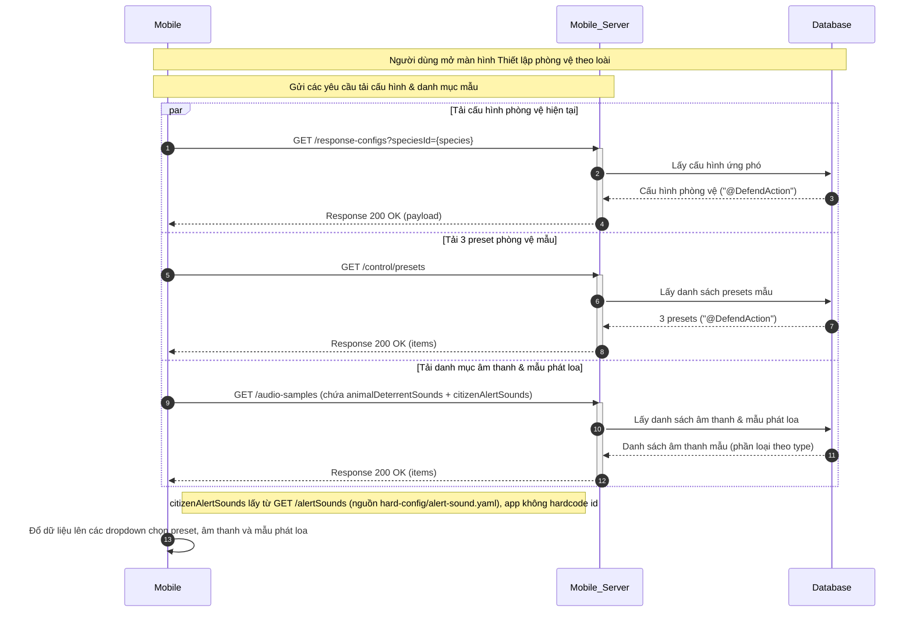
```mermaid
sequenceDiagram
    autonumber
    participant Mobile as Mobile
    participant Mobile_Server as Mobile_Server
    participant Database as Database

    Note over Mobile, Database: Người dùng mở màn hình Thiết lập phòng vệ theo loài
    Note over Mobile, Mobile_Server: Gửi các yêu cầu tải cấu hình & danh mục mẫu
    par Tải cấu hình phòng vệ hiện tại
        Mobile->>Mobile_Server: GET /response-configs?speciesId={species}
        activate Mobile_Server
        Mobile_Server->>Database: Lấy cấu hình ứng phó
        Database-->>Mobile_Server: Cấu hình phòng vệ ("@DefendAction")
        Mobile_Server-->>Mobile: Response 200 OK (payload)
        deactivate Mobile_Server
    and Tải 3 preset phòng vệ mẫu
        Mobile->>Mobile_Server: GET /control/presets
        activate Mobile_Server
        Mobile_Server->>Database: Lấy danh sách presets mẫu
        Database-->>Mobile_Server: 3 presets ("@DefendAction")
        Mobile_Server-->>Mobile: Response 200 OK (items)
        deactivate Mobile_Server
    and Tải danh mục âm thanh & mẫu phát loa
        Mobile->>Mobile_Server: GET /audio-samples (chứa animalDeterrentSounds + citizenAlertSounds)
        activate Mobile_Server
        Mobile_Server->>Database: Lấy danh sách âm thanh & mẫu phát loa
        Database-->>Mobile_Server: Danh sách âm thanh mẫu (phần loại theo type)
        Mobile_Server-->>Mobile: Response 200 OK (items)
        deactivate Mobile_Server
    end
    Note right of Mobile: citizenAlertSounds lấy từ GET /alertSounds (nguồn hard-config/alert-sound.yaml), app không hardcode id
    Mobile->>Mobile: Đổ dữ liệu lên các dropdown chọn preset, âm thanh và mẫu phát loa
```

- **Chi tiết đặc tả API:**
  - [GET /response-configs?speciesId=](./03-mobile_api.md#83-get-response-configsspeciesid)
  - [GET /control/presets](./03-mobile_api.md#71-get-controlpresets)
  - [GET /audio-samples](./03-mobile_api.md#72-get-audio-samples)
  - [GET /alertSounds](./03-mobile_api.md#73-get-alertsounds) — nguồn của `citizenAlertSounds` (public, không cần token)

### 6.2. Action: Update species configuration & apply preset

- **Mô tả:** Người dùng tùy biến các tham số (âm thanh, đèn LED nháy, còi báo động, mẫu phát loa, chế độ silent) cho một loài động vật cụ thể và nhấn Lưu cấu hình (`PUT`), Đặt lại về mặc định (`DELETE`), hoặc chọn Áp dụng nhanh theo mức độ nguy hiểm (`POST .../apply-preset/{presetId}`).

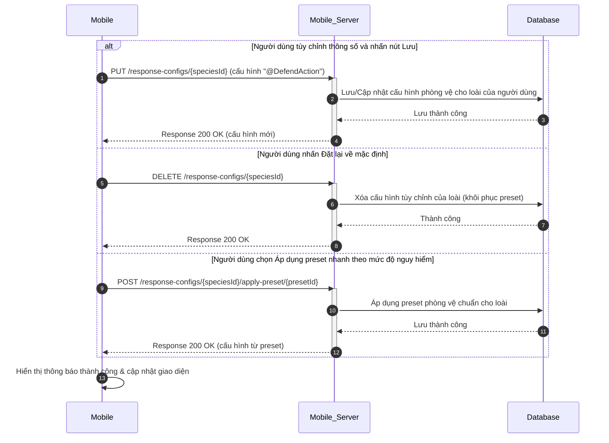
```mermaid
sequenceDiagram
    autonumber
    participant Mobile as Mobile
    participant Mobile_Server as Mobile_Server
    participant Database as Database

    alt Người dùng tùy chỉnh thông số và nhấn nút Lưu
        Mobile->>Mobile_Server: PUT /response-configs/{speciesId} (cấu hình "@DefendAction")
        activate Mobile_Server
        Mobile_Server->>Database: Lưu/Cập nhật cấu hình phòng vệ cho loài của người dùng
        Database-->>Mobile_Server: Lưu thành công
        Mobile_Server-->>Mobile: Response 200 OK (cấu hình mới)
        deactivate Mobile_Server
    else Người dùng nhấn Đặt lại về mặc định
        Mobile->>Mobile_Server: DELETE /response-configs/{speciesId}
        activate Mobile_Server
        Mobile_Server->>Database: Xóa cấu hình tùy chỉnh của loài (khôi phục preset)
        Database-->>Mobile_Server: Thành công
        Mobile_Server-->>Mobile: Response 200 OK
        deactivate Mobile_Server
    else Người dùng chọn Áp dụng preset nhanh theo mức độ nguy hiểm
        Mobile->>Mobile_Server: POST /response-configs/{speciesId}/apply-preset/{presetId}
        activate Mobile_Server
        Mobile_Server->>Database: Áp dụng preset phòng vệ chuẩn cho loài
        Database-->>Mobile_Server: Lưu thành công
        Mobile_Server-->>Mobile: Response 200 OK (cấu hình từ preset)
        deactivate Mobile_Server
    end
    Mobile->>Mobile: Hiển thị thông báo thành công & cập nhật giao diện
```

- **Chi tiết đặc tả API:**
  - [PUT /response-configs/{speciesId}](./03-mobile_api.md#82-put-response-configsspeciesid)
  - [DELETE /response-configs/{speciesId}](./03-mobile_api.md#84-delete-response-configsspeciesid)
  - [POST /response-configs/{speciesId}/apply-preset/{presetId}](./03-mobile_api.md#85-post-response-configsspeciesidapply-presetpresetid)

### 6.3. Action: Test speaker sound at camera station (AI_SERVER)

> [!NOTE]
>
> ### 💡 Diễn giải Luồng vận hành & Các Thuật ngữ Kỹ thuật (Dành cho Giám khảo / Người đọc tổng quan)
>
> Quy trình kiểm thử âm thanh xua đuổi trực tiếp tại hiện trường rừng diễn ra qua **4 bước chính** như sau:
>
> 1. **Bước 1: Bấm nút Phát thử trên Ứng dụng di động**
>    - Tại màn hình Thiết lập phòng vệ, Kiểm lâm chọn loại âm thanh xua đuổi (như tiếng súng `A_gunshot`, tiếng sóng dưới nước `A_fish`...) và bấm nút _"Phát thử âm thanh từ trạm (5s)"_. Yêu cầu lập tức được gửi đến Máy chủ Trung tâm (`Mobile_Server`).
> 2. **Bước 2: Truyền lệnh tức thì qua Trạm Bộ đàm Vệ tinh Đám mây (Ably)**
>    - Máy chủ Trung tâm đóng gói lệnh thử nghiệm và phát qua trạm bộ đàm đám mây **Ably Broker**. Ably lập tức "bắn" ngay lệnh này xuống Trạm Camera tại rừng qua kênh truyền thời gian thực **WebSocket**.
> 3. **Bước 3: Trạm Camera tiếp nhận & Phát âm thanh thực địa**
>    - Trạm camera tại rừng nhận được lệnh, lập tức kích hoạt Loa công suất lớn phát âm thanh xua đuổi theo đúng loại và cường độ đã chọn trong vòng 5 giây.
> 4. **Bước 4: Phản hồi Xác nhận (ACK) & Báo kết quả về Điện thoại**
>    - Sau khi phát xong âm thanh, Trạm camera gửi một bản tin xác nhận (**ACK**) ngược trở lại Máy chủ. Ứng dụng di động lập tức hiển thị thông báo rực sáng: _"Đã phát thử âm thanh tại trạm camera thành công!"_.
>
> ---
>
> 🔍 **Ghi chú Diễn giải Thuật ngữ Kỹ thuật (Dành cho Giám khảo):**
>
> - 📡 **WebSocket là gì? (Đường dây điện thoại nghe/nói 2 chiều liên tục):**  
>   Khác với giao thức web thông thường (giống như gửi thư tay - gửi đi rồi ngồi chờ hồi đáp), **WebSocket** là một đường kết nối điện thoại 2 chiều được mở trực tiếp và duy trì liên tục giữa máy chủ và trạm camera. Nhờ đường dây này, máy chủ có thể "nói" và truyền lệnh điều khiển tới trạm camera ngay lập tức trong vài mili-giây mà không cần trạm camera phải liên tục gửi hỏi _"Có lệnh mới nào không?"_.
> - ☁️ **Vai trò của Ably Broker (Tổng đài Trung gian Đám mây 24/7):**  
>   Đóng vai trò như một _"Tổng đài bưu điện đám mây chuyên trách thông tin thời gian thực"_. Do máy chủ Vercel Serverless vận hành ngắn hạn, máy chủ giao phó cho Ably chịu trách nhiệm duy trì đường truyền WebSocket liên tục 24/7 với trạm camera tại rừng, đảm bảo lệnh test truyền đi thông suốt và không bị gián đoạn.
> - 🤝 **ACK (Acknowledge) là gì? (Giấy báo phát / Lời đáp "Đã nhận lệnh"):**  
>   **ACK** (viết tắt của _Acknowledge_ - Xác nhận/Đã nhận) đóng vai trò như chiếc _"Giấy báo phát thành công"_ hoặc lời đáp lại của trạm camera: _"Thưa máy chủ, trạm camera chúng tôi đã nhận được lệnh và đã phát thử loa thành công rồi!"_. Nếu trong 9 giây mà máy chủ không nhận được bản tin ACK này (do mất mạng hoặc trạm camera mất điện), hệ thống sẽ báo lỗi quá thời hạn (Timeout) để kiểm lâm biết trạm đang gặp sự cố.
>
> 🤔 **Lý giải Kiến trúc: Vì sao chọn Ably Pub/Sub thay vì HTTP Request / Socket trực tiếp từ Mobile Server đến AI Server?**
>
> 1. **Phân công Trách nhiệm & Tách rời Mở rộng (Team Decoupling & Loose Coupling):**
>    - Hệ thống gồm 2 thành phần phát triển song song: `Mobile_Server` (Cloud Backend) và `AI_Server` (Trạm thực địa/Raspberry Pi).
>    - Việc dùng Cloud Pub/Sub Broker (Ably) giúp nhóm AI/Phần cứng không cần tự xây dựng hay duy trì một Web Server (HTTP REST/Socket Server) công khai tại thực địa (không phải xử lý routing, auth token, SSL hay phòng chống tấn công mạng). `AI_Server` chỉ đóng vai trò một **Subscriber (Client)** đơn giản — nhúng thư viện Ably để nhận tin nhắn. Điều này giúp 2 nhóm phát triển độc lập, giảm thiểu lỗi và nâng cao tốc độ tích hợp.
> 2. **Phù hợp với Hạ tầng Serverless (Vercel):**
>    - `Mobile_Server` triển khai trên Vercel Serverless Functions mang tính ngắn hạn (stateless). Nếu gọi HTTP Request đồng bộ trực tiếp xuống `AI_Server` và chờ phần cứng thực thi (5–9s), hàm Serverless sẽ bị treo kết nối và dễ đụng trần **Execution Timeout (10s)** của Vercel.
>    - Dùng Ably REST API giúp `Mobile_Server` đẩy tin nhắn đi chỉ trong vài mili-giây và nhận phản hồi ACK qua kênh bất đồng bộ, tối ưu chi phí và hiệu năng máy chủ.
> 3. **Mô hình Phân phối Đa điểm (Fan-out Pattern):**
>    - Một bản tin phát ra từ Ably có thể đồng thời truyền tới nhiều `AI_Server` hoặc thiết bị giám sát khác mà `Mobile_Server` không phải chạy vòng lặp gửi hàng loạt HTTP Request riêng lẻ tới từng địa chỉ IP/Domain.

- **Mô tả:** Người dùng chọn loại âm thanh còi báo và nhấn "Nghe thử" để phát thử nghiệm trực tiếp tại hiện trường nhằm căn chỉnh âm lượng.

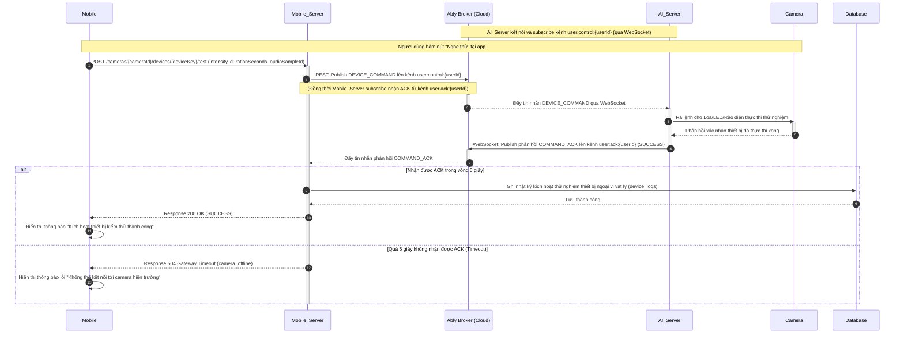
```mermaid
sequenceDiagram
    autonumber
    participant Mobile as Mobile
    participant Mobile_Server as Mobile_Server
    participant Ably as Ably Broker (Cloud)
    participant AI_Server as AI_Server
    participant Camera as Camera
    participant Database as Database

    Note over AI_Server, Ably: AI_Server kết nối và subscribe kênh user:control:{userId} (qua WebSocket)
    Note over Mobile, Camera: Người dùng bấm nút "Nghe thử" tại app
    Mobile->>Mobile_Server: POST /cameras/{cameraId}/devices/{deviceKey}/test (intensity, durationSeconds, audioSampleId)
    activate Mobile_Server
    Mobile_Server->>Ably: REST: Publish DEVICE_COMMAND lên kênh user:control:{userId}
    Note over Mobile_Server, Ably: (Đồng thời Mobile_Server subscribe nhận ACK từ kênh user:ack:{userId})
    activate Ably
    Ably-->>AI_Server: Đẩy tin nhắn DEVICE_COMMAND qua WebSocket
    deactivate Ably
    activate AI_Server
    AI_Server->>Camera: Ra lệnh cho Loa/LED/Rào điện thực thi thử nghiệm
    activate Camera
    Camera-->>AI_Server: Phản hồi xác nhận thiết bị đã thực thi xong
    deactivate Camera
    AI_Server->>Ably: WebSocket: Publish phản hồi COMMAND_ACK lên kênh user:ack:{userId} (SUCCESS)
    deactivate AI_Server
    activate Ably
    Ably-->>Mobile_Server: Đẩy tin nhắn phản hồi COMMAND_ACK
    deactivate Ably

    alt Nhận được ACK trong vòng 5 giây
        Mobile_Server->>Database: Ghi nhật ký kích hoạt thử nghiệm thiết bị ngoại vi vật lý (device_logs)
        Database-->>Mobile_Server: Lưu thành công
        Mobile_Server-->>Mobile: Response 200 OK (SUCCESS)
        Mobile->>Mobile: Hiển thị thông báo "Kích hoạt thiết bị kiểm thử thành công"
    else Quá 5 giây không nhận được ACK (Timeout)
        Mobile_Server-->>Mobile: Response 504 Gateway Timeout (camera_offline)
        Mobile->>Mobile: Hiển thị thông báo lỗi "Không thể kết nối tới camera hiện trường"
    end
    deactivate Mobile_Server
```

- **Chi tiết đặc tả API:**
  - [POST /cameras/{cameraId}/devices/{deviceKey}/test](./03-mobile_api.md#61-post-camerascameraiddevicesdevicekeytest)
  - [GET /auth/ably-token](./03-mobile_api.md#13a3-get-authably-token)

---

## 7. Màn hình Quản lý SĐT Nhận Cảnh Báo (`[SMS_CONFIG_SCREEN]`)

### 7.1. Action: Load SMS recipients list

- **Mô tả:** Tải danh sách tối đa 3 số điện thoại đăng ký nhận cảnh báo bổ sung khi mở màn hình quản lý SMS.

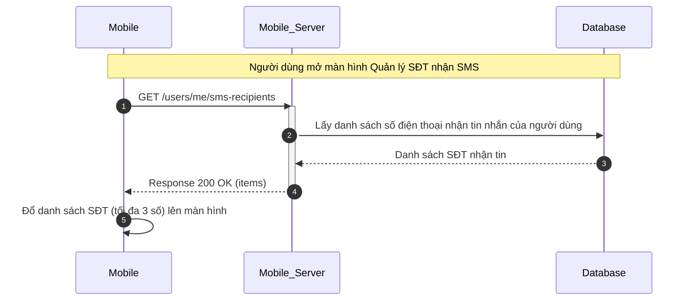
```mermaid
sequenceDiagram
    autonumber
    participant Mobile as Mobile
    participant Mobile_Server as Mobile_Server
    participant Database as Database

    Note over Mobile, Database: Người dùng mở màn hình Quản lý SĐT nhận SMS
    Mobile->>Mobile_Server: GET /users/me/sms-recipients
    activate Mobile_Server
    Mobile_Server->>Database: Lấy danh sách số điện thoại nhận tin nhắn của người dùng
    Database-->>Mobile_Server: Danh sách SĐT nhận tin
    Mobile_Server-->>Mobile: Response 200 OK (items)
    deactivate Mobile_Server
    Mobile->>Mobile: Đổ danh sách SĐT (tối đa 3 số) lên màn hình
```

- **Chi tiết đặc tả API:**
  - [GET /users/me/sms-recipients](./03-mobile_api.md#121-get-usersmesms-recipients)

### 7.2. Action: Add / Remove SMS recipient

- **Mô tả:** Người dùng thực hiện thêm số điện thoại mới (qua dialog) hoặc nhấn xóa một số điện thoại khỏi danh sách nhận cảnh báo. Mỗi tài khoản người dùng được thêm tối đa 3 số điện thoại nhận tin.

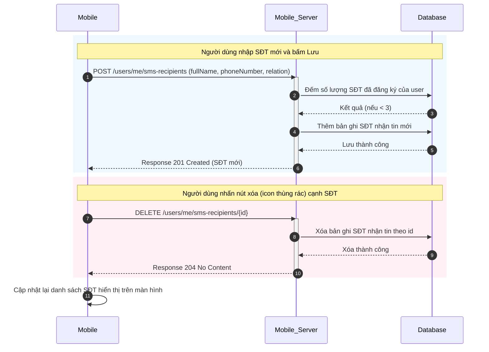
```mermaid
sequenceDiagram
    autonumber
    participant Mobile as Mobile
    participant Mobile_Server as Mobile_Server
    participant Database as Database

    %% THÊM SĐT
    rect rgb(240, 248, 255)
        Note over Mobile, Database: Người dùng nhập SĐT mới và bấm Lưu
        Mobile->>Mobile_Server: POST /users/me/sms-recipients (fullName, phoneNumber, relation)
        activate Mobile_Server
        Mobile_Server->>Database: Đếm số lượng SĐT đã đăng ký của user
        Database-->>Mobile_Server: Kết quả (nếu < 3)
        Mobile_Server->>Database: Thêm bản ghi SĐT nhận tin mới
        Database-->>Mobile_Server: Lưu thành công
        Mobile_Server-->>Mobile: Response 201 Created (SĐT mới)
        deactivate Mobile_Server
    end

    %% XÓA SĐT
    rect rgb(255, 240, 245)
        Note over Mobile, Database: Người dùng nhấn nút xóa (icon thùng rác) cạnh SĐT
        Mobile->>Mobile_Server: DELETE /users/me/sms-recipients/{id}
        activate Mobile_Server
        Mobile_Server->>Database: Xóa bản ghi SĐT nhận tin theo id
        Database-->>Mobile_Server: Xóa thành công
        Mobile_Server-->>Mobile: Response 204 No Content
        deactivate Mobile_Server
    end
    Mobile->>Mobile: Cập nhật lại danh sách SĐT hiển thị trên màn hình
```

- **Chi tiết đặc tả API:**
  - [POST /users/me/sms-recipients](./03-mobile_api.md#122-post-usersmesms-recipients)
  - [DELETE /users/me/sms-recipients/{recipientId}](./03-mobile_api.md#123-delete-usersmesms-recipientsrecipientid)

---

# II. Thiết bị Camera & AI Server (Server AI / Field Device)

## 1. Không phân chia màn hình (Thực thi ngầm & Tích hợp)

### 1.1. Action: AI Server sends detection snapshot (AI_SERVER)

> [!NOTE]
>
> ### 💡 Diễn giải Luồng vận hành Hệ thống (Dành cho Giám khảo / Người đọc tổng quan)
>
> Để dễ hình dung toàn bộ quá trình tự động hóa từ hiện trường đến thiết bị di động mà không cần đi sâu vào chi tiết kỹ thuật lập trình, luồng xử lý khi có động vật xuất hiện diễn ra qua **4 bước chính** như sau:
>
> 1. **Bước 1: Chụp ảnh & Nhận dạng Trí tuệ Nhân tạo (Tại thực địa)**
>    - Khi phát hiện chuyển động tại vùng ranh giới rừng, Camera tự động chụp ảnh và truyền sang Máy chủ AI (`AI_Server`). Mô hình AI thị giác máy tính sẽ "nhìn" bức ảnh để nhận biết chính xác loài động vật (như Voi, Hổ, Lợn rừng, Gấu...) kèm độ tin cậy nhận diện.
> 2. **Bước 2: Ra quyết định Phản ứng & Xua đuổi Tức thì (Tại chỗ)**
>    - Kết quả được gửi về Máy chủ Trung tâm (`Mobile_Server`).
>    - **Cách trạm camera nhận đúng cấu hình phòng vệ:** Mỗi trạm camera có một mã định danh duy nhất (`cameraId`). Khi gửi phán đoán, AI Server truyền đúng `cameraId` này trên đường dẫn URL. Máy chủ xác định người quản lý trạm đó (`ownerId`) và truy vấn chính xác kịch bản phòng vệ mà người đó đã cài đặt riêng cho loài vừa xuất hiện (nếu chưa cài riêng, hệ thống lấy kịch bản khuyên dùng mặc định theo cấp độ nguy hiểm).
>    - Máy chủ đóng gói kịch bản phòng vệ (`@DefendAction`) vào JSON trả về ngay lập tức cho kết nối của trạm camera đó, giúp Loa và Đèn LED tại đúng trạm đó phát ra âm thanh và ánh sáng xua đuổi lập tức.
> 3. **Bước 3: Kích hoạt Cảnh báo Khẩn cấp Đa kênh (Push Notification & SMS)**
>    - Song song với việc xua đuổi tại chỗ, nếu đây là sự kiện mới (hệ thống tự động lọc chống phát lặp lại trong 30 giây), Máy chủ lập tức gửi thông báo cảnh báo.
>    - **Cách định danh người dùng sẽ nhận thông báo:**
>      - **Gửi Push Notification qua App:** Khi đăng nhập trên điện thoại, ứng dụng di động tự động lấy Mã định danh thiết bị duy nhất (`fcm-push-token` từ Google Firebase) gửi lên lưu vào máy chủ đính kèm theo tài khoản `userId`. Khi có sự kiện, máy chủ gửi thông báo trực tiếp đến các `fcm-push-token` này.
>      - **Quản lý danh sách SĐT SMS khẩn cấp:** Máy chủ truy vấn danh sách SĐT chính của tài khoản và các SĐT người dân lân cận (`sms_recipients`, tối đa 3 số/tài khoản) đã được lưu sẵn trong Database để chuẩn bị kích hoạt gửi tin nhắn SMS ở giai đoạn nâng cấp tiếp theo.
> 4. **Bước 4: Cập nhật Nhật ký & Hiển thị Thời gian thực trên Ứng dụng**
>    - Hì> [!NOTE]
>
> ### 💡 Diễn giải Đánh giá Kiến trúc & Hướng Phát triển (Dành cho Giám khảo / Người đọc tổng quan)
>
> Khối nội dung này tổng kết góc nhìn tự đánh giá kỹ thuật một cách khách quan về hệ thống hiện tại. Trong quá trình phát triển thực tế, nhóm tác giả thẳng thắn nhận diện **4 hạn chế nguyên nhân cốt lõi** dẫn đến việc sử dụng giải pháp Pub/Sub trung gian (Ably):
>
> 1. 💰 **Hạn chế về kinh phí triển khai:** Kinh phí dự án có hạn, chưa thể thuê các máy chủ Cloud VPS mạnh và chuyên nghiệp, do đó nhóm tận dụng các nền tảng dịch vụ miễn phí (như Vercel Serverless cho Mobile Server) và máy tính cá nhân (Laptop) để làm AI Server.
> 2. ⏳ **Hạn chế về thời gian thực hiện:** Thời gian phát triển dự án của học sinh có hạn, cần đưa sản phẩm vào thử nghiệm thực tế trong thời gian ngắn nhất.
> 3. 🧠 **Hạn chế về kinh nghiệm thiết k> [!NOTE]
>
> ### 💡 Diễn giải Đánh giá Kiến trúc & Hướng Phát triển (Dành cho Giám khảo / Người đọc tổng quan)
>
> Khối nội dung này tổng kết góc nhìn tự đánh giá kỹ thuật một cách khách quan về hệ thống hiện tại. Trong quá trình phát triển thực tế, nhóm tác giả thẳng thắn nhận diện **4 hạn chế nguyên nhân cốt lõi** dẫn đến việc sử dụng giải pháp Pub/Sub trung gian (Ably):
>
> 1. 💰 **Hạn chế về kinh phí triển khai:** Kinh phí dự án có hạn, chưa thể thuê các máy chủ Cloud VPS mạnh và chuyên nghiệp, do đó nhóm tận dụng các nền tảng dịch vụ miễn phí (như Vercel Serverless cho Mobile Server) và máy tính cá nhân (Laptop) để làm AI Server.
> 2. ⏳ **Hạn chế về thời gian thực hiện:** Thời gian phát triển dự án của học sinh có hạn, cần đưa sản phẩm vào thử nghiệm thực tế trong thời gian ngắn nhất.
> 3. 🧠 **Hạn chế về kinh nghiệm thiết kế hệ thống lớn:** Là lần đầu tiên nhóm tiếp cận, thiết kế và triển khai một hệ thống phân tán thời gian thực quy mô lớn.
> 4. 🛠️ **Hạn chế về năng lực phát triển Backend của nhóm AI:** Nhóm chuyên trách AI/Phần cứng chưa có kinh nghiệm xây dựng AI Server thành một hệ thống máy chủ web hoàn chỉnh (REST/Socket Server). Do đó, AI Server đóng vai trò như một **Client** đơn giản và chủ động kết nối lắng nghe lệnh qua dịch vụ trung gian Ably Broker.
>
> Nhóm tác giả thẳng thắn chỉ ra các giới hạn của kiến trúc hiện tại và đề xuất **Mô hình Kiến trúc Tập trung Đám mây (DigitalOcean Cloud Environment & Edge Station)** cho các giai đoạn nâng cấp tiếp theo, giúp hệ thống vận hành trực tiếp, loại bỏ trung gian bên thứ ba, giảm thiểu chi phí và tối ưu độ trễ xử lý.thống vận hành trực tiếp, loại bỏ trung gian bên thứ ba, giảm thiểu chi phí và tối ưu độ trễ xử lý.

## 1. Các Hạn chế của Kiến trúc Hiện tại

1. **Phụ thuộc vào Dịch vụ Trung gian Bên thứ 3 (Cloud Broker Dependency):**  
   Việc sử dụng Ably Pub/Sub làm trung gian truyền tin real-time tuy giải quyết được bài toán phân công giữa 2 nhóm phát triển độc lập, nhưng tạo ra sự phụ thuộc vào dịch vụ đám mây bên thứ ba (phát sinh chi phí/hạn ngạch quota tin nhắn và yêu cầu tạo Token Ably trung gian).
2. **Độ phức tạp trong Quản lý Kênh Tin nhắn (Channel Management Overhead):**  
   Hệ thống phải duy trì các cặp kênh Ably (`user:control:{userId}`, `user:ack:{userId}`) và cơ chế bất đồng bộ Await ACK giữa Vercel Serverless Function và AI Server, làm tăng độ phức tạp trong luồng code xử lý lỗi timeout.
3. **Giới hạn kết nối của Hạ tầng Serverless (Vercel):**  
   Do `Mobile_Server` chạy trên Vercel dưới dạng Serverless Functions (stateless), máy chủ không thể tự duy trì các kết nối WebSocket 24/7 trực tiếp tới thiết bị thực địa mà phải ủy thác cho Cloud Broker.CE_ACCOUNT_KEY_JSON`, giải mã từ Base64 sang Object JSON **trực tiếp trong RAM** để khởi tạo Firebase Admin SDK (nếu chưa được khởi tạo).
  - `Mobile_Server` truy vấn danh sách `fcm-push-token` từ bảng `device_tokens` rồi gửi Push Notification thông qua Firebase Cloud Messaging.

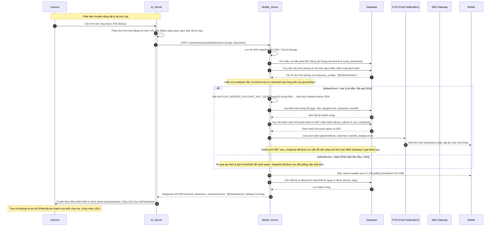
```mermaid
sequenceDiagram
    autonumber
    participant Camera as Camera
    participant AI_Server as AI_Server
    participant Mobile_Server as Mobile_Server
    participant Database as Database
    participant FCM as FCM (Push Notification)
    participant SMS as SMS Gateway
    participant Mobile as Mobile

    Note over Camera, AI_Server: Phát hiện chuyển động vật lý tại thực địa
    Camera->>AI_Server: Gửi hình ảnh chụp được (File Binary)
    activate AI_Server
    AI_Server->>AI_Server: Phân tích hình ảnh bằng mô hình YOLOv8 (Nhận dạng danh sách loài, độ tin cậy)

    AI_Server->>Mobile_Server: POST /cameras/{cameraId}/detections (image, detections)
    activate Mobile_Server
    Mobile_Server->>Mobile_Server: Lưu trữ ảnh snapshot lên CDN / Cloud Storage
    Mobile_Server->>Database: Ghi nhận sự kiện phát hiện động vật hoang dã (events & event_detections)
    Mobile_Server->>Database: Truy vấn cấu hình phòng vệ cho loài nguy hiểm nhất trong danh sách
    Database-->>Mobile_Server: Trả về cấu hình phòng vệ (response_configs: "@DefendAction")

    Note over Mobile_Server: Kiểm tra cooldown 30s: Có Event nào từ cameraId này trong 30s vừa qua không?
    alt isNewEvent = true (Lần đầu / Đã quá 30s)
        Mobile_Server->>Mobile_Server: Giải mã PUSH_SERVICE_ACCOUNT_KEY_JSON (Base64) trong RAM → khởi tạo Firebase Admin SDK
        Mobile_Server->>Database: Tạo Alert mới trong DB (type, title, dangerLevel, cameraId, eventId)
        Database-->>Mobile_Server: Alert đã tạo thành công
        Mobile_Server->>Database: Truy vấn danh sách fcm-push-token & SĐT nhận SMS (device_tokens & sms_recipients)
        Database-->>Mobile_Server: Danh sách fcm-push-token và SĐT
        Mobile_Server->>FCM: Gửi push alert (speciesName, cameraId, eventId, dangerLevel)
        FCM-->>Mobile: Hiển thị Push Notification khẩn cấp lên màn hình khóa
        Note over Mobile_Server, Database: Danh sách SĐT sms_recipients đã được lưu sẵn để sẵn sàng cho tích hợp SMS Gateway ở giai đoạn sau.
    else isNewEvent = false (Phát hiện liên tiếp ≤ 30s)
        Note over Mobile_Server: Bỏ qua tạo Alert & gửi Push/SMS để tránh spam. Snapshot đã được lưu để polling cập nhật ảnh.
    end
    Mobile_Server-->>Mobile: Đẩy camera-update qua cơ chế polling (Snapshot mới nhất)

    Mobile_Server->>Database: Ghi nhật ký tự động kích hoạt thiết bị ngoại vi vật lý (device_logs)
    Database-->>Mobile_Server: Lưu thành công

    Mobile_Server-->>AI_Server: Response 201/200 (eventId, detections, responseAction: "@DefendAction" phẳng 8 trường)
    deactivate Mobile_Server

    AI_Server->>Camera: Truyền lệnh điều khiển thiết bị vật lý (phát audioSampleId, chớp LED theo ledFlashRate)
    deactivate AI_Server

    Note over Camera: Thực thi phòng vệ tại chỗ (Phát tệp âm thanh xua đuổi chọn lọc, chớp nháy LED)
```

- **Chi tiết đặc tả API:**
  - [POST /cameras/{cameraId}/detections](./03-mobile_api.md#13a1-post-camerascameraiddetections)

### 1.2. Action: Manual snapshot upload via Backend API / Testing Tools (BACKEND ONLY)

> [!IMPORTANT]
> **Lưu ý về Thực trạng Triển khai:**
> API `POST /cameras/{cameraId}/image-upload` hiện tại **CHỈ tồn tại trên Backend Server** (phục vụ các kịch bản kiểm thử API cURL, tích hợp công cụ giả lập). Ứng dụng di động Android hiện tại **KHÔNG có giao diện hay nút bấm tải ảnh snapshot thủ công**. Trên ứng dụng mobile, kiểm lâm và người dân chỉ xem (`GET`) ảnh snapshot do hệ thống cập nhật tự động từ AI Server.

- **Mô tả kỹ thuật backend:** Công cụ kiểm thử (cURL / Postman / Integration Test Script) gửi tệp ảnh snapshot thực địa lên trạm camera qua API `POST /cameras/{cameraId}/image-upload` (truyền multipart/form-data chứa tệp ảnh JPEG/PNG ≤ 5MB và `userId`). Máy chủ tải ảnh lên Cloud Storage/Cloudinary và lưu bản ghi vào cơ sở dữ liệu.

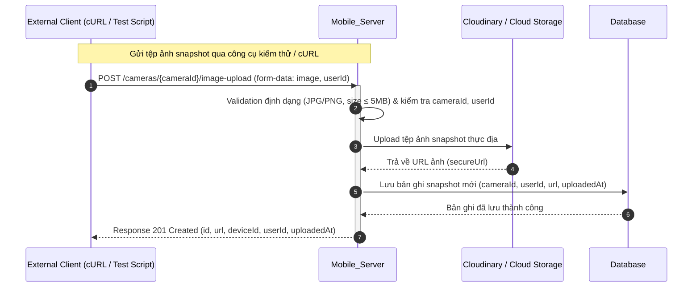
```mermaid
sequenceDiagram
    autonumber
    participant Client_Test as External Client (cURL / Test Script)
    participant Mobile_Server as Mobile_Server
    participant Cloudinary as Cloudinary / Cloud Storage
    participant Database as Database

    Note over Client_Test, Mobile_Server: Gửi tệp ảnh snapshot qua công cụ kiểm thử / cURL
    Client_Test->>Mobile_Server: POST /cameras/{cameraId}/image-upload (form-data: image, userId)
    activate Mobile_Server
    Mobile_Server->>Mobile_Server: Validation định dạng (JPG/PNG, size ≤ 5MB) & kiểm tra cameraId, userId
    Mobile_Server->>Cloudinary: Upload tệp ảnh snapshot thực địa
    Cloudinary-->>Mobile_Server: Trả về URL ảnh (secureUrl)
    Mobile_Server->>Database: Lưu bản ghi snapshot mới (cameraId, userId, url, uploadedAt)
    Database-->>Mobile_Server: Bản ghi đã lưu thành công
    Mobile_Server-->>Client_Test: Response 201 Created (id, url, deviceId, userId, uploadedAt)
    deactivate Mobile_Server
```

- **Chi tiết đặc tả API:**
  - [POST /cameras/{cameraId}/image-upload](./03-mobile_api.md#13a4-post-camerascameraidimage-upload)

---

# III. Đánh giá Hạn chế Kiến trúc Hiện tại & Đề xuất Hướng Cải tiến Tối ưu (Architecture Assessment & Future Redesign)

> [!NOTE]
>
> ### 💡 Diễn giải Đánh giá Kiến trúc & Hướng Phát triển (Dành cho Giám khảo / Người đọc tổng quan)
>
> Khối nội dung này tổng kết góc nhìn tự đánh giá kỹ thuật một cách khách quan về hệ thống hiện tại. Trong quá trình phát triển thực tế, nhóm tác giả thẳng thắn nhận diện **4 hạn chế nguyên nhân cốt lõi** dẫn đến việc sử dụng giải pháp Pub/Sub trung gian (Ably):
>
> 1. 💰 **Hạn chế về kinh phí triển khai:** Kinh phí dự án có hạn, chưa thể thuê các máy chủ Cloud VPS mạnh và chuyên nghiệp, do đó nhóm tận dụng các nền tảng dịch vụ miễn phí (như Vercel Serverless cho Mobile Server) và máy tính cá nhân (Laptop) để làm AI Server.
> 2. ⏳ **Hạn chế về thời gian thực hiện:** Thời gian phát triển dự án của học sinh có hạn, cần đưa sản phẩm vào thử nghiệm thực tế trong thời gian ngắn nhất.
> 3. 🧠 **Hạn chế về kinh nghiệm thiết kế hệ thống lớn:** Là lần đầu tiên nhóm tiếp cận, thiết kế và triển khai một hệ thống phân tán thời gian thực quy mô lớn.
> 4. 🛠️ **Hạn chế về năng lực phát triển Backend của nhóm AI:** Nhóm chuyên trách AI/Phần cứng chưa có kinh nghiệm xây dựng AI Server thành một hệ thống máy chủ web hoàn chỉnh (REST/Socket Server). Do đó, AI Server đóng vai trò như một **Client** đơn giản và chủ động kết nối lắng nghe lệnh qua dịch vụ trung gian Ably Broker.
>
> Nhóm tác giả thẳng thắn chỉ ra các giới hạn của kiến trúc hiện tại và đề xuất **Mô hình Kiến trúc Tập trung Đám mây (DigitalOcean Cloud Environment & Edge Station)** cho các giai đoạn nâng cấp tiếp theo, giúp hệ thống vận hành trực tiếp, loại bỏ trung gian bên thứ ba, giảm thiểu chi phí và tối ưu độ trễ xử lý.

## 1. Các Hạn chế của Kiến trúc Hiện tại

1. **Phụ thuộc vào Dịch vụ Trung gian Bên thứ 3 (Cloud Broker Dependency):**  
   Việc sử dụng Ably Pub/Sub làm trung gian truyền tin real-time tuy giải quyết được bài toán phân công giữa 2 nhóm phát triển độc lập, nhưng tạo ra sự phụ thuộc vào dịch vụ đám mây bên thứ ba (phát sinh chi phí/hạn ngạch quota tin nhắn và yêu cầu tạo Token Ably trung gian).
2. **Độ phức tạp trong Quản lý Kênh Tin nhắn (Channel Management Overhead):**  
   Hệ thống phải duy trì các cặp kênh Ably (`user:control:{userId}`, `user:ack:{userId}`) và cơ chế bất đồng bộ Await ACK giữa Vercel Serverless Function và AI Server, làm tăng độ phức tạp trong luồng code xử lý lỗi timeout.
3. **Giới hạn kết nối của Hạ tầng Serverless (Vercel):**  
   Do `Mobile_Server` chạy trên Vercel dưới dạng Serverless Functions (stateless), máy chủ không thể tự duy trì các kết nối WebSocket 24/7 trực tiếp tới thiết bị thực địa mà phải ủy thác cho Cloud Broker.

---

## 2. Đề xuất Kiến trúc Cải tiến Tối ưu (DigitalOcean Cloud & Safe Area Edge Station)

Dựa trên sơ đồ kiến trúc cải tiến mục tiêu, hệ thống được quy hoạch làm **2 Vùng chính**: **DigitalOcean Cloud Environment** (Chứa toàn bộ Backend & AI Engine) và **Safe Area** (Trạm camera thực địa).

<a href="https://ibb.co/dRtJwdC"></a>

---

### 🔄 Luồng Vận hànhChi tiết trong Kiến trúc Cải tiến:

1. **Luồng Nhận diện & Cảnh báo Tự động (Detection & Warning Flow):**
   - **Tại Safe Area (Thực địa):** Khi có chuyển động, `Camera` chụp ảnh (`image`) gửi đến `Raspberry Pi`.
   - **Đẩy ảnh lên Đám mây:** `Raspberry Pi` gửi bản tin `send image` trực tiếp lên `AI Server` đặt trên hạ tầng **DigitalOcean**.
   - **Nhận diện GPU & Ra quyết định:** `AI Server` dùng sức mạnh GPU nhận dạng loài động vật $\rightarrow$ gửi thông tin phán đoán `send detection` sang `Mobile Server` $\rightarrow$ `Mobile Server` truy vấn kịch bản phòng vệ từ `Database` $\rightarrow$ trả về kịch bản cho `AI Server`.
   - **Kích hoạt Phòng vệ Thực địa:** `AI Server` truyền lệnh điều khiển về `Raspberry Pi` tại Safe Area để kích hoạt ngay `Sound` (Loa còi) và `Light` (Đèn LED chớp).
   - **Lưu trữ CDN & Thông báo Khẩn cấp:** `Mobile Server` lưu ảnh snapshot lên `Cloudinary Image Storage` và phát yêu cầu `message` qua `Google FCM` để bắn `notification` hiển thị tức thì trên `Android App` của kiểm lâm.

2. **Luồng Cấu hình & Nghe thử Âm thanh (Configuration & Test Sound Flow):**
   - **Cấu hình:** Người dùng sử dụng `Android App` để thực hiện `save configuration` gửi trực tiếp đến `Mobile Server` để lưu vào `Database`.
   - **Phát thử âm thanh từ trạm:** Khi người dùng bấm nút _"Nghe thử"_ trên `Android App`, ứng dụng gửi yêu cầu `test sound` đến `Mobile Server` $\rightarrow$ `Mobile Server` chuyển tiếp lệnh `test sound` sang `AI Server` $\rightarrow$ `AI Server` phát lệnh xuống `Raspberry Pi` tại Safe Area $\rightarrow$ `Raspberry Pi` bật `Sound` (Loa) trong 5 giây.

---

### 🌟 Ưu điểm Vượt trội của Kiến trúc Cải tiến DigitalOcean:

1. 🚀 **Loại bỏ hoàn toàn Dịch vụ Trung gian (Zero 3rd-party Dependency):**  
   Xóa bỏ hoàn toàn Ably Broker, không còn tốn chi phí quota tin nhắn hay phức tạp hóa việc quản lý Token.
2. ⚡ **Tốc độ Truyền nhận Siêu tốc (Low Latency):**  
   `Mobile Server` và `AI Server` được đặt cùng một môi trường **DigitalOcean Environment**, giúp chi phí giao tiếp và độ trễ giữa 2 máy chủ đạt mức bằng 0 (In-Memory hoặc Local Loopback).
3. 🛡️ **Bảo mật & Đơn giản hóa Trạm Thực địa (Safe Area):**  
   `Raspberry Pi` tại thực địa chỉ đóng vai trò là một **Outbound Client** gửi ảnh và nhận lệnh từ DigitalOcean Cloud. Trạm thực địa không cần có IP công khai, không mở port, tuyệt đối an toàn trước các nguy cơ tấn công mạng.
4. 💰 **Tối ưu Chi phí Thuê Hạ tầng:**  
   Toàn bộ Backend, AI Server và Database được đóng gói chạy chung trên 01 máy chủ VPS DigitalOcean (Node Singapore), vừa tối ưu chi phí (chỉ ~$15-$25/tháng), vừa cực kỳ mượt mà cho người dùng tại Việt Nam.
