# Tài liệu Sequence Diagrams — Hệ thống Cảnh báo & Xua đuổi Động vật Hoang dã

Tài liệu này mô tả chi tiết luồng tương tác giữa các thành phần trong hệ thống (Android App, Mobile Server, Database, FCM, SMS Gateway, và Trạm Camera) được phân chia theo cấu trúc 3 cấp: **Application** -> **Screen** -> **Action**.

---

## Các Thành phần Hệ thống (Standardized Participants)

- **Mobile:** Ứng dụng di động (Android Client) cài đặt trên điện thoại người dùng và kiểm lâm để tương tác với hệ thống.
- **Mobile_Server:** Máy chủ trung tâm lưu trữ dữ liệu, xử lý logic, quản lý phiên làm việc, lưu cấu hình ứng phó và giao tiếp với `Mobile` (qua REST / SSE) và `Ably` (qua REST).
- **Ably:** Dịch vụ đám mây Pub/Sub trung gian (Cloud Broker) phân phối tin nhắn thời gian thực giữa `Mobile_Server` và `AI_Server` thay thế cho WebSocket trực tiếp.
- **AI_Server:** Máy chủ trí tuệ nhân tạo chạy mô hình nhận diện (YOLOv8), nhận hình ảnh từ `Camera` để phân tích, gửi kết quả nhận diện lên `Mobile_Server` (qua REST) và kết nối với `Ably` (qua WebSocket) để nhận lệnh điều khiển.
- **Camera:** Thiết bị camera chụp ảnh tại hiện trường (chỉ gửi ảnh về `AI_Server` khi phát hiện chuyển động) và các thiết bị xua đuổi vật lý (Loa phát thanh, Đèn LED chớp, còi hú báo động).
- **Database:** Cơ sở dữ liệu PostgreSQL lưu trữ trạng thái, cấu hình và nhật ký sự kiện.
- **FCM (Firebase Cloud Messaging):** Dịch vụ trung gian gửi thông báo đẩy (Push notification) thời gian thực đến `Mobile`.
- **SMS Gateway:** Hệ thống gửi tin nhắn SMS cảnh báo khẩn cấp đến các số điện thoại đã đăng ký.

### Cơ chế quản lý serviceAccountKey.json cho Firebase Cloud Messaging (FCM)

Để gửi thông báo đẩy (Push Notification) đến thiết bị di động của kiểm lâm và người dân vùng lân cận qua FCM, `Mobile_Server` cần xác thực với Google Firebase API sử dụng chứng chỉ dịch vụ (`serviceAccountKey.json`).

Nhằm đảm bảo an toàn tuyệt đối và tuân thủ nguyên tắc triển khai Serverless (như Vercel):
* **Tuyệt đối không lưu trữ file** `serviceAccountKey.json` trực tiếp trong mã nguồn (để tránh rò rỉ mã nguồn lên các kho lưu trữ công khai như GitHub).
* **Tuyệt đối không ghi file tạm** chứa khóa này lên đĩa cứng của máy chủ/môi trường Serverless trong quá trình chạy.
* **Cách quản lý và trích xuất:**
  1. Người quản trị thực hiện chuyển đổi nội dung file `serviceAccountKey.json` sang định dạng chuỗi mã hóa **Base64**:
     ```bash
     cat serviceAccountKey.json | base64 | tr -d '\n'
     ```
  2. Lưu chuỗi Base64 vừa trích xuất vào biến môi trường tên là `PUSH_SERVICE_ACCOUNT_KEY_JSON` trên trang quản lý của Vercel (hoặc tệp cấu hình môi trường cục bộ `.env.local` / `.env.production`).
  3. Khi server khởi chạy hoặc khi xử lý yêu cầu gửi thông báo, `Mobile_Server` sẽ đọc chuỗi từ biến môi trường, thực hiện giải mã trực tiếp trong bộ nhớ RAM và truyền Object thu được vào hàm khởi tạo của Firebase Admin SDK:
     ```typescript
     const base64Key = process.env.PUSH_SERVICE_ACCOUNT_KEY_JSON;
     if (base64Key) {
       const decodedJson = Buffer.from(base64Key, 'base64').toString('utf8');
       const serviceAccount = JSON.parse(decodedJson);
       
       // Khởi tạo SDK trực tiếp từ RAM, không ghi file ra đĩa
       admin.initializeApp({
         credential: admin.credential.cert(serviceAccount)
       });
     }
     ```

### Sơ đồ Kiến trúc Tương tác Tổng quan

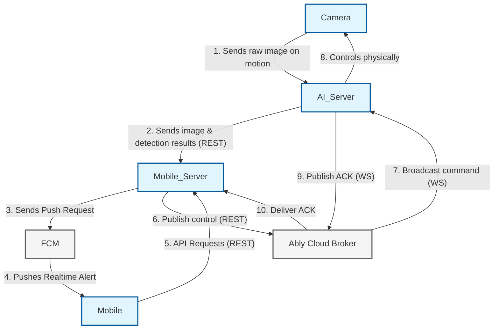
```mermaid
graph TD
    classDef main fill:#e1f5fe,stroke:#01579b,stroke-width:2px;
    classDef ext fill:#f5f5f5,stroke:#616161,stroke-width:2px;

    Camera[Camera]:::main
    AI_Server[AI_Server]:::main
    Mobile_Server[Mobile_Server]:::main
    Mobile[Mobile]:::main

    FCM[FCM]:::ext
    Ably[Ably Cloud Broker]:::ext

    %% Connections
    Camera -- "1. Sends raw image on motion" --> AI_Server
    AI_Server -- "2. Sends image & detection results (REST)" --> Mobile_Server

    %% Realtime warning paths
    Mobile_Server -- "3. Sends Push Request" --> FCM
    FCM -- "4. Pushes Realtime Alert" --> Mobile

    %% User Actions
    Mobile -- "5. API Requests (REST)" --> Mobile_Server
    Mobile_Server -- "6. Publish control (REST)" --> Ably
    Ably -- "7. Broadcast command (WS)" --> AI_Server
    AI_Server -- "8. Controls physically" --> Camera
    AI_Server -- "9. Publish ACK (WS)" --> Ably
    Ably -- "10. Deliver ACK" --> Mobile_Server
```

---

# I. Ứng dụng Android (Android Application)

## 0. Kiến trúc & Luồng xử lý nội bộ Android (Android Application)

Phần này mô tả **mô hình xử lý/threading bên trong** ứng dụng Android — khác với các sequence diagram bên dưới (mô tả tương tác giữa các thành phần hệ thống).

### 0.1. Kiến trúc tổng quan

- **Kiến trúc:** MVVM (Model-View-ViewModel) với UI bằng **Jetpack Compose + Material3**.
- **Tầng dữ liệu:** Retrofit (`NetworkClient` singleton) khởi tạo các API interface (`AuthApi`, `CameraApi`, `ConfigApi`, `AlertApi`, `SmsApi`) — ViewModel gọi trực tiếp các service này bằng Retrofit `suspend fun`. (`DataRepository` hiện chỉ là stub placeholder, không dùng cho logic thật).
- **Quản lý session:** `TokenManager` lưu/accesstoken; mỗi request đính kèm `Authorization: Bearer <token>`.
- **Realtime:** `PollingManager` (coroutine loop 5s) cập nhật danh sách camera định kỳ; FCM push qua `WildlifeFirebaseMessagingService`.

### 0.2. Mô hình xử lý đồng bộ & Threading

- **Coroutines + StateFlow** là cơ chế bất đồng bộ chính (không dùng LiveData).
- **ViewModel** khởi động tác vụ bằng `viewModelScope.launch { }` → chạy trên **`Dispatchers.Main`** mặc định.
- **Retrofit `suspend fun`** thực hiện I/O mạng trên **OkHttp executor thread** rồi resume về Main — do đó **Main thread không bị block**, dù không cần `withContext(Dispatchers.IO)` cho các call mạng.
- Trạng thái được lưu trong **`MutableStateFlow`** (`_xxx.value`), UI thu thập bằng `collectAsState()`; mọi cập nhật giao diện nằm trên Main thread.
- **Ngoài ViewModel**, các tác vụ nền có đời sống/scope riêng tạo `CoroutineScope(Dispatchers.IO)`:
  - `pollingJob` (trong ViewModel) — vòng lặp Auto-Polling 5 giây.
  - `WildlifeFirebaseMessagingService` & `DeterrenceActionReceiver` — xử lý FCM push / action notification.

### 0.3. Luồng xử lý điển hình (Ví dụ: Màn hình Cấu hình phòng vệ theo loài)

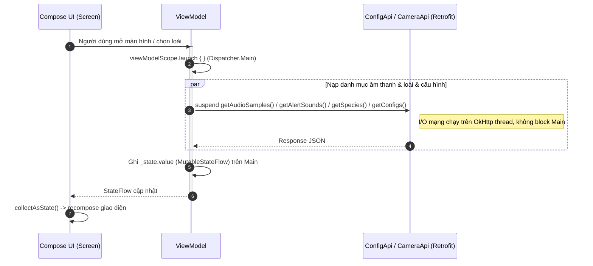
```mermaid
sequenceDiagram
    autonumber
    participant UI as Compose UI (Screen)
    participant VM as ViewModel
    participant API as ConfigApi / CameraApi (Retrofit)

    UI->>VM: Người dùng mở màn hình / chọn loài
    activate VM
    VM->>VM: viewModelScope.launch { } (Dispatcher.Main)
    par Nạp danh mục âm thanh & loài & cấu hình
        VM->>API: suspend getAudioSamples() / getAlertSounds() / getSpecies() / getConfigs()
        Note right of API: I/O mạng chạy trên OkHttp thread, không block Main
        API-->>VM: Response JSON
    end
    VM->>VM: Ghi _state.value (MutableStateFlow) trên Main
    VM-->>UI: StateFlow cập nhật
    deactivate VM
    UI->>UI: collectAsState() -> recompose giao diện
```

---

## 1. Màn hình Đăng ký (`[REGISTER_SCREEN]`)

_(Không có action load dữ liệu ban đầu)_

### 1.1. Action: Register a new account

- **Mô tả:** Người dùng nhập các thông tin đăng ký (tên đăng nhập, họ tên, số điện thoại, mật khẩu, vai trò, và email tùy chọn) để tạo tài khoản mới trong hệ thống.

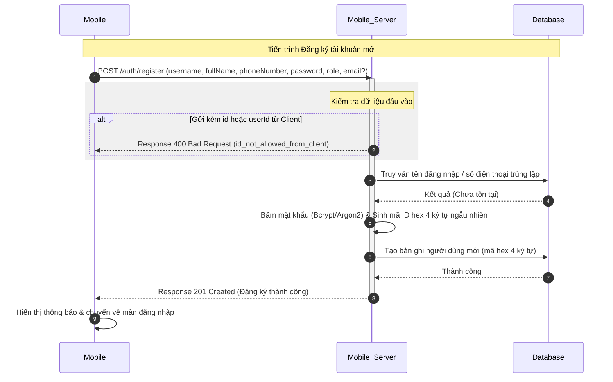
```mermaid
sequenceDiagram
    autonumber
    participant Mobile as Mobile
    participant Mobile_Server as Mobile_Server
    participant Database as Database

    Note over Mobile, Database: Tiến trình Đăng ký tài khoản mới
    Mobile->>Mobile_Server: POST /auth/register (username, fullName, phoneNumber, password, role, email?)
    activate Mobile_Server
    
    rect rgb(240, 240, 240)
        Note over Mobile_Server: Kiểm tra dữ liệu đầu vào
        alt Gửi kèm id hoặc userId từ Client
            Mobile_Server-->>Mobile: Response 400 Bad Request (id_not_allowed_from_client)
        end
    end

    Mobile_Server->>Database: Truy vấn tên đăng nhập / số điện thoại trùng lặp
    Database-->>Mobile_Server: Kết quả (Chưa tồn tại)
    Mobile_Server->>Mobile_Server: Băm mật khẩu (Bcrypt/Argon2) & Sinh mã ID hex 4 ký tự ngẫu nhiên
    Mobile_Server->>Database: Tạo bản ghi người dùng mới (mã hex 4 ký tự)
    Database-->>Mobile_Server: Thành công
    Mobile_Server-->>Mobile: Response 201 Created (Đăng ký thành công)
    deactivate Mobile_Server
    Mobile->>Mobile: Hiển thị thông báo & chuyển về màn đăng nhập
```
*   **Chi tiết đặc tả API:**
    *   [POST /auth/register](./03-mobile_api.md#31-post-authregister)

---

## 2. Màn hình Đăng nhập (`[LOGIN_SCREEN]`)

_(Không có action load dữ liệu ban đầu)_

### 2.1. Action: Login & Register Push Token

> [!NOTE]
> ### 💡 Diễn giải Luồng vận hành (Dành cho Giám khảo / Người đọc tổng quan)
> Quy trình xác thực bảo mật và liên kết thiết bị nhận thông báo tự động khi người dùng đăng nhập diễn ra qua **3 bước chính** như sau:
> 
> 1. **Bước 1: Nhập thông tin & Xác thực Tài khoản (Đăng nhập)**  
>    * Kiểm lâm hoặc Người dân nhập tên đăng nhập và mật khẩu trên ứng dụng di động. Yêu cầu được gửi về Máy chủ Trung tâm (`Mobile_Server`) để kiểm tra tính hợp lệ. Khi thông tin chính xác, máy chủ cấp chìa khóa phiên làm việc bảo mật cho ứng dụng.
> 
> 2. **Bước 2: Tự động Định danh Thiết bị Nhận Cảnh báo (Đăng ký FCM Token)**  
>    * Ngay sau khi đăng nhập thành công, ứng dụng di động tự động liên hệ với hạ tầng **Google Firebase** (dịch vụ bưu điện tin nhắn toàn cầu) để xin cấp một **`fcmToken`** (chuỗi mã định danh địa chỉ duy nhất của chiếc điện thoại đó).
>    * **Vai trò của Google Firebase & `fcmToken` trong việc phát thông báo khẩn cấp:**
>      - **`fcmToken` (Mã địa chỉ nhận tin):** Đóng vai trò như *"Địa chỉ hòm thư duy nhất"* của chiếc điện thoại. Máy chủ lưu trữ `fcmToken` này đính kèm với tài khoản người dùng (`userId`), giúp hệ thống biết chính xác cần gửi thông báo đến chiếc điện thoại nào mà không bị nhầm lẫn.
>      - **Google Firebase (Hạ tầng dịch vụ tin nhắn):** Đóng vai trò *"Bưu điện Trung gian Khẩn cấp"*, tiếp nhận yêu cầu từ máy chủ và chịu trách nhiệm đưa thông báo đẩy (Push Notification) hiển thị trực tiếp lên màn hình điện thoại người dùng tức thì 24/7, kể cả khi ứng dụng đang đóng hay điện thoại đang tắt màn hình.
> 
> 3. **Bước 3: Hoàn tất & Chuyển vào Màn hình Điều khiển Chính**  
>    * Khi thiết bị được ghi nhận thành công, ứng dụng lưu chìa khóa bảo mật và tự động chuyển người dùng vào màn hình chính để theo dõi danh sách trạm camera và tin tức cảnh báo theo thời gian thực.

- **Mô tả kỹ thuật:** Người dùng đăng nhập bằng tên đăng nhập và mật khẩu. Sau khi nhận accessToken từ server, Android Client lấy FCM Token từ Firebase SDK và tự động gửi lên server để liên kết thiết bị.

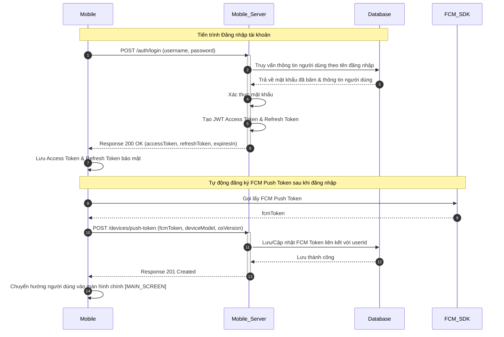
```mermaid
sequenceDiagram
    autonumber
    participant Mobile as Mobile
    participant Mobile_Server as Mobile_Server
    participant Database as Database
    participant FCM_SDK as FCM_SDK

    Note over Mobile, Database: Tiến trình Đăng nhập tài khoản
    Mobile->>Mobile_Server: POST /auth/login (username, password)
    activate Mobile_Server
    Mobile_Server->>Database: Truy vấn thông tin người dùng theo tên đăng nhập
    Database-->>Mobile_Server: Trả về mật khẩu đã băm & thông tin người dùng
    Mobile_Server->>Mobile_Server: Xác thực mật khẩu
    Mobile_Server->>Mobile_Server: Tạo JWT Access Token & Refresh Token
    Mobile_Server-->>Mobile: Response 200 OK (accessToken, refreshToken, expiresIn)
    deactivate Mobile_Server

    Mobile->>Mobile: Lưu Access Token & Refresh Token bảo mật

    Note over Mobile, FCM_SDK: Tự động đăng ký FCM Push Token sau khi đăng nhập
    Mobile->>FCM_SDK: Gọi lấy FCM Push Token
    FCM_SDK-->>Mobile: fcmToken
    Mobile->>Mobile_Server: POST /devices/push-token (fcmToken, deviceModel, osVersion)
    activate Mobile_Server
    Mobile_Server->>Database: Lưu/Cập nhật FCM Token liên kết với userId
    Database-->>Mobile_Server: Lưu thành công
    Mobile_Server-->>Mobile: Response 201 Created
    deactivate Mobile_Server
    Mobile->>Mobile: Chuyển hướng người dùng vào màn hình chính [MAIN_SCREEN]
```
*   **Chi tiết đặc tả API:**
    *   [POST /auth/login](./03-mobile_api.md#32-post-authlogin)
    *   [POST /devices/push-token](./03-mobile_api.md#41-post-devicespush-token)

---

## 3. Màn hình chính (`[MAIN_SCREEN]`)

### 3.1. Tab Danh sách Camera (`[CAMERA_LIST_TAB]`)

### 3.1.1. Action: Load camera list & initial snapshots

- **Mô tả:** Khi mở tab hoặc vào màn hình chính, app tự động gọi API lấy danh sách các trạm camera trực thuộc quyền quản lý kèm theo trạng thái hoạt động và ảnh snapshot thumbnail gần nhất để hiển thị.

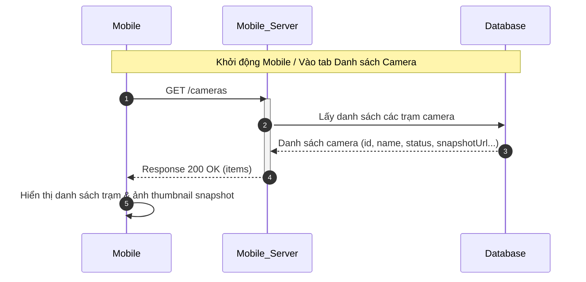
```mermaid
sequenceDiagram
    autonumber
    participant Mobile as Mobile
    participant Mobile_Server as Mobile_Server
    participant Database as Database

    Note over Mobile, Database: Khởi động Mobile / Vào tab Danh sách Camera
    Mobile->>Mobile_Server: GET /cameras
    activate Mobile_Server
    Mobile_Server->>Database: Lấy danh sách các trạm camera
    Database-->>Mobile_Server: Danh sách camera (id, name, status, snapshotUrl...)
    Mobile_Server-->>Mobile: Response 200 OK (items)
    deactivate Mobile_Server
    Mobile->>Mobile: Hiển thị danh sách trạm & ảnh thumbnail snapshot
```
*   **Chi tiết đặc tả API:**
    *   [GET /cameras](./03-mobile_api.md#51-get-cameras)

### 3.1.2. Action: Auto-Polling (Smart Polling) cập nhật danh sách camera

- **Mô tả:** Song song với việc tải danh sách lần đầu, ứng dụng khởi động một vòng lặp coroutine (Smart Polling) chạy ngầm. Sau mỗi **5 giây**, vòng lặp tự động gọi nhẹ `GET /cameras/heartbeat` để kiểm tra `lastUpdatedAt` trong toàn hệ thống. Nếu `lastUpdatedAt` lớn hơn thời điểm cập nhật gần nhất của client, ứng dụng mới gọi `GET /cameras` để lấy toàn bộ dữ liệu danh sách camera và ảnh snapshot mới nhất.

> **Cơ chế Smart Polling tối ưu:** Giúp giảm thiểu tối đa băng thông và tải serverless của Vercel mà vẫn đảm bảo cập nhật trạng thái báo động thời gian thực.

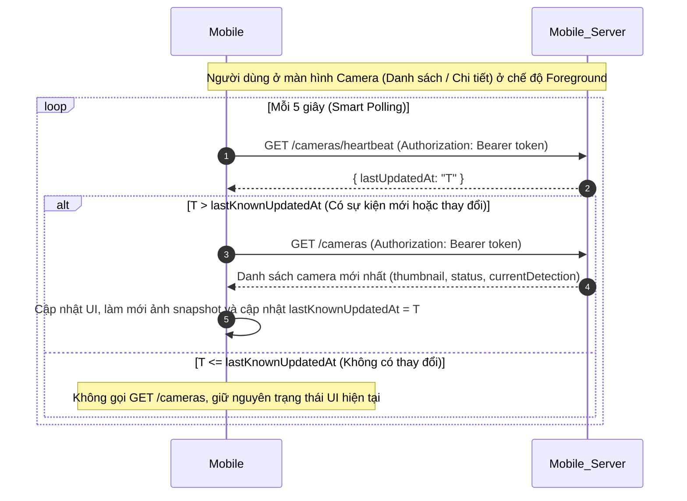
```mermaid
sequenceDiagram
    autonumber
    participant Mobile as Mobile
    participant Mobile_Server as Mobile_Server

    Note over Mobile, Mobile_Server: Người dùng ở màn hình Camera (Danh sách / Chi tiết) ở chế độ Foreground
    loop Mỗi 5 giây (Smart Polling)
        Mobile->>Mobile_Server: GET /cameras/heartbeat (Authorization: Bearer token)
        Mobile_Server-->>Mobile: { lastUpdatedAt: "T" }
        alt T > lastKnownUpdatedAt (Có sự kiện mới hoặc thay đổi)
            Mobile->>Mobile_Server: GET /cameras (Authorization: Bearer token)
            Mobile_Server-->>Mobile: Danh sách camera mới nhất (thumbnail, status, currentDetection)
            Mobile->>Mobile: Cập nhật UI, làm mới ảnh snapshot và cập nhật lastKnownUpdatedAt = T
        else T <= lastKnownUpdatedAt (Không có thay đổi)
            Note over Mobile: Không gọi GET /cameras, giữ nguyên trạng thái UI hiện tại
        end
    end
```
*   **Chi tiết đặc tả API:**
    *   [GET /cameras/heartbeat](./03-mobile_api.md#55-get-camerasheartbeat)
    *   [GET /cameras](./03-mobile_api.md#51-get-cameras)

### 3.2. Tab Thống kê (`[STATISTICS_TAB]`)

### 3.2.1. Action: Initialize filter & Apply filter (`statistics_filter`)

- **Mô tả:** Khi mở tab Thống kê, app thực hiện tải danh sách loài và trạm camera để đổ vào các dropdown bộ lọc. Khi người dùng thay đổi bộ lọc (Thời gian, Loài, Camera), app gọi lại API lấy dữ liệu thống kê tổng hợp để vẽ lại biểu đồ/heatmap.

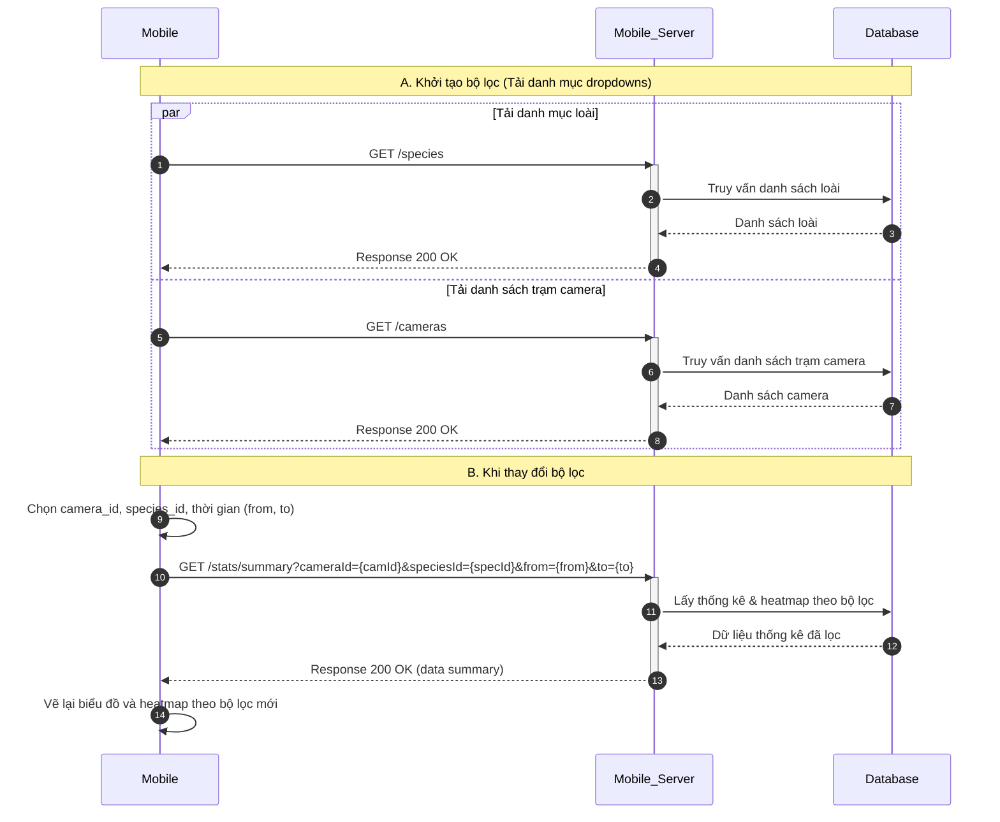
```mermaid
sequenceDiagram
    autonumber
    participant Mobile as Mobile
    participant Mobile_Server as Mobile_Server
    participant Database as Database

    Note over Mobile, Database: A. Khởi tạo bộ lọc (Tải danh mục dropdowns)
    par Tải danh mục loài
        Mobile->>Mobile_Server: GET /species
        activate Mobile_Server
        Mobile_Server->>Database: Truy vấn danh sách loài
        Database-->>Mobile_Server: Danh sách loài
        Mobile_Server-->>Mobile: Response 200 OK
        deactivate Mobile_Server
    and Tải danh sách trạm camera
        Mobile->>Mobile_Server: GET /cameras
        activate Mobile_Server
        Mobile_Server->>Database: Truy vấn danh sách trạm camera
        Database-->>Mobile_Server: Danh sách camera
        Mobile_Server-->>Mobile: Response 200 OK
        deactivate Mobile_Server
    end

    Note over Mobile, Database: B. Khi thay đổi bộ lọc
    Mobile->>Mobile: Chọn camera_id, species_id, thời gian (from, to)
    Mobile->>Mobile_Server: GET /stats/summary?cameraId={camId}&speciesId={specId}&from={from}&to={to}
    activate Mobile_Server
    Mobile_Server->>Database: Lấy thống kê & heatmap theo bộ lọc
    Database-->>Mobile_Server: Dữ liệu thống kê đã lọc
    Mobile_Server-->>Mobile: Response 200 OK (data summary)
    deactivate Mobile_Server
    Mobile->>Mobile: Vẽ lại biểu đồ và heatmap theo bộ lọc mới
```
*   **Chi tiết đặc tả API:**
    *   [GET /species](./03-mobile_api.md#81-get-species)
    *   [GET /cameras](./03-mobile_api.md#51-get-cameras)
    *   [GET /stats/summary](./03-mobile_api.md#102-get-statssummary)

### 3.2.2. Action: Load weekly detections list & Mark alert read (`weekly_detections_section`)

- **Mô tả:** App tải danh sách các tin cảnh báo khẩn cấp/phát hiện động vật hoang dã gần đây nhất bằng cách gọi API `GET /alerts/feed`. Khi người dùng chạm vào một tin cảnh báo để đọc chi tiết, ứng dụng tự động gửi yêu cầu `POST /alerts/feed/{alertId}/read` để đánh dấu tin đó là đã đọc.

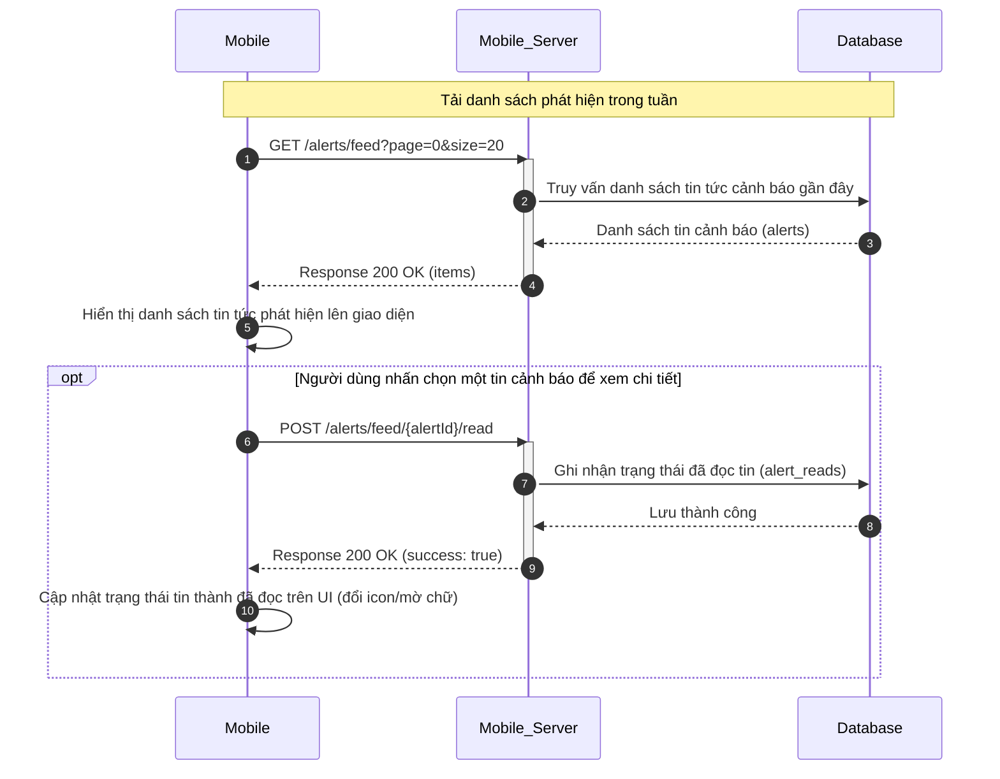
```mermaid
sequenceDiagram
    autonumber
    participant Mobile as Mobile
    participant Mobile_Server as Mobile_Server
    participant Database as Database

    Note over Mobile, Database: Tải danh sách phát hiện trong tuần
    Mobile->>Mobile_Server: GET /alerts/feed?page=0&size=20
    activate Mobile_Server
    Mobile_Server->>Database: Truy vấn danh sách tin tức cảnh báo gần đây
    Database-->>Mobile_Server: Danh sách tin cảnh báo (alerts)
    Mobile_Server-->>Mobile: Response 200 OK (items)
    deactivate Mobile_Server
    Mobile->>Mobile: Hiển thị danh sách tin tức phát hiện lên giao diện

    opt Người dùng nhấn chọn một tin cảnh báo để xem chi tiết
        Mobile->>Mobile_Server: POST /alerts/feed/{alertId}/read
        activate Mobile_Server
        Mobile_Server->>Database: Ghi nhận trạng thái đã đọc tin (alert_reads)
        Database-->>Mobile_Server: Lưu thành công
        Mobile_Server-->>Mobile: Response 200 OK (success: true)
        deactivate Mobile_Server
        Mobile->>Mobile: Cập nhật trạng thái tin thành đã đọc trên UI (đổi icon/mờ chữ)
    end
```
*   **Chi tiết đặc tả API:**
    *   [GET /alerts/feed](./03-mobile_api.md#111-get-alertsfeed)
    *   [POST /alerts/feed/{alertId}/read](./03-mobile_api.md#113-post-alertsfeedalertidread)

### 3.2.3. Action: Load trend chart & movement heatmap (`per_camera_analysis_section`)

- **Mô tả:** Tải dữ liệu phân tích thống kê tổng hợp (tổng số lần xuất hiện, tọa độ di chuyển) để vẽ biểu đồ đường xu hướng và sơ đồ nhiệt (heatmap) phân bố động vật.

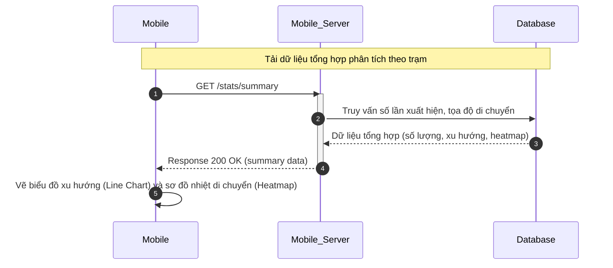
```mermaid
sequenceDiagram
    autonumber
    participant Mobile as Mobile
    participant Mobile_Server as Mobile_Server
    participant Database as Database

    Note over Mobile, Database: Tải dữ liệu tổng hợp phân tích theo trạm
    Mobile->>Mobile_Server: GET /stats/summary
    activate Mobile_Server
    Mobile_Server->>Database: Truy vấn số lần xuất hiện, tọa độ di chuyển
    Database-->>Mobile_Server: Dữ liệu tổng hợp (số lượng, xu hướng, heatmap)
    Mobile_Server-->>Mobile: Response 200 OK (summary data)
    deactivate Mobile_Server
    Mobile->>Mobile: Vẽ biểu đồ xu hướng (Line Chart) và sơ đồ nhiệt di chuyển (Heatmap)
```
*   **Chi tiết đặc tả API:**
    *   [GET /stats/summary](./03-mobile_api.md#102-get-statssummary)

### 3.3. Tab Cài đặt (`[SETTING_TAB]`)

### 3.3.1. Action: Load & Update user profile

- **Mô tả:** Tải thông tin tài khoản hiện tại (họ tên, vai trò, số điện thoại đăng nhập) để hiển thị lên form cài đặt chung bằng `GET /users/me`. Khi người dùng chỉnh sửa họ tên/số điện thoại, ứng dụng gửi yêu cầu `PATCH /users/me` để lưu cập nhật.

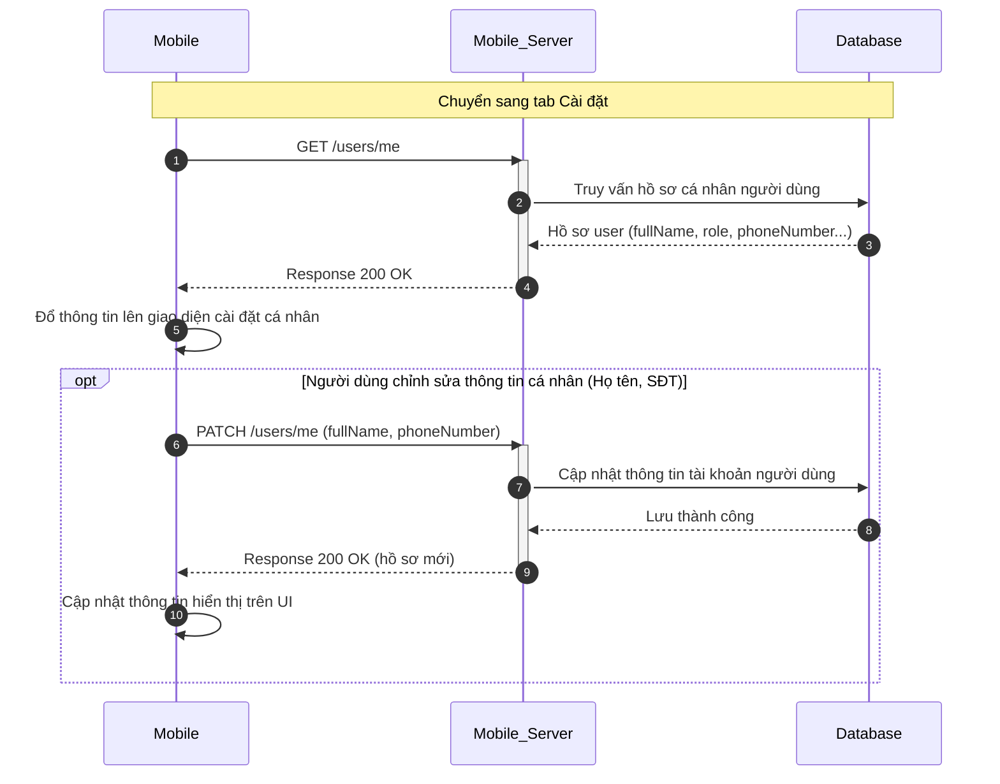
```mermaid
sequenceDiagram
    autonumber
    participant Mobile as Mobile
    participant Mobile_Server as Mobile_Server
    participant Database as Database

    Note over Mobile, Database: Chuyển sang tab Cài đặt
    Mobile->>Mobile_Server: GET /users/me
    activate Mobile_Server
    Mobile_Server->>Database: Truy vấn hồ sơ cá nhân người dùng
    Database-->>Mobile_Server: Hồ sơ user (fullName, role, phoneNumber...)
    Mobile_Server-->>Mobile: Response 200 OK
    deactivate Mobile_Server
    Mobile->>Mobile: Đổ thông tin lên giao diện cài đặt cá nhân

    opt Người dùng chỉnh sửa thông tin cá nhân (Họ tên, SĐT)
        Mobile->>Mobile_Server: PATCH /users/me (fullName, phoneNumber)
        activate Mobile_Server
        Mobile_Server->>Database: Cập nhật thông tin tài khoản người dùng
        Database-->>Mobile_Server: Lưu thành công
        Mobile_Server-->>Mobile: Response 200 OK (hồ sơ mới)
        deactivate Mobile_Server
        Mobile->>Mobile: Cập nhật thông tin hiển thị trên UI
    end
```
*   **Chi tiết đặc tả API:**
    *   [GET /users/me](./03-mobile_api.md#91-get-usersme)
    *   [PATCH /users/me](./03-mobile_api.md#92-patch-usersme)

### 3.3.2. Action: Logout

- **Mô tả:** Người dùng nhấn nút Đăng xuất, app gửi yêu cầu hủy session trên server, đồng thời hủy FCM Push Token trên thiết bị để ngưng nhận thông báo và đưa người dùng trở lại màn hình đăng nhập.

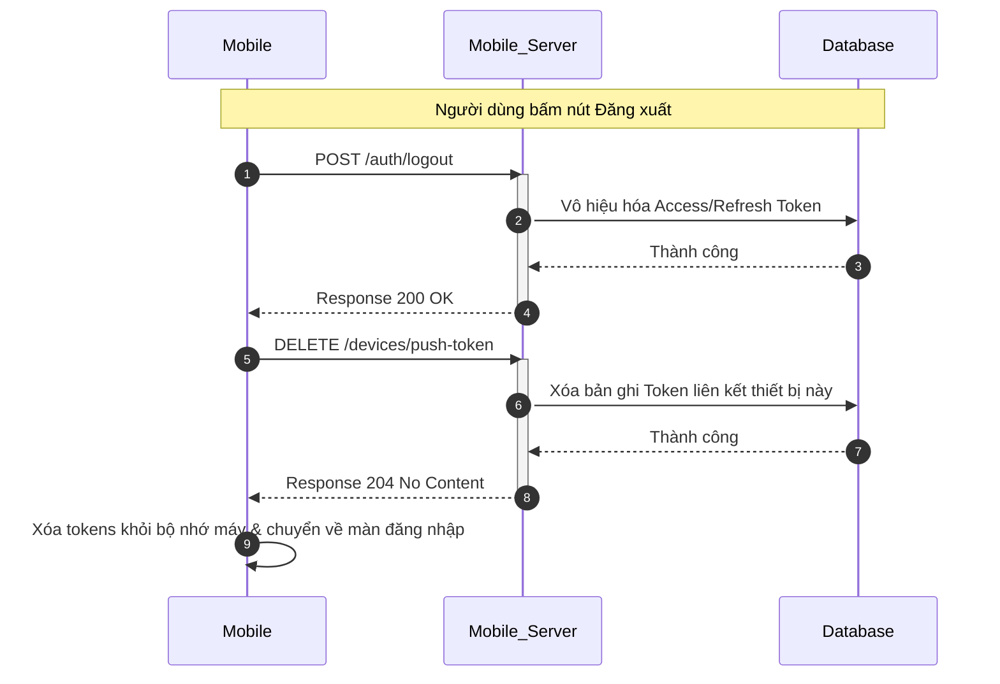
```mermaid
sequenceDiagram
    autonumber
    participant Mobile as Mobile
    participant Mobile_Server as Mobile_Server
    participant Database as Database

    Note over Mobile, Database: Người dùng bấm nút Đăng xuất
    Mobile->>Mobile_Server: POST /auth/logout
    activate Mobile_Server
    Mobile_Server->>Database: Vô hiệu hóa Access/Refresh Token
    Database-->>Mobile_Server: Thành công
    Mobile_Server-->>Mobile: Response 200 OK
    deactivate Mobile_Server

    Mobile->>Mobile_Server: DELETE /devices/push-token
    activate Mobile_Server
    Mobile_Server->>Database: Xóa bản ghi Token liên kết thiết bị này
    Database-->>Mobile_Server: Thành công
    Mobile_Server-->>Mobile: Response 204 No Content
    deactivate Mobile_Server

    Mobile->>Mobile: Xóa tokens khỏi bộ nhớ máy & chuyển về màn đăng nhập
```
*   **Chi tiết đặc tả API:**
    *   [POST /auth/logout](./03-mobile_api.md#33-post-authlogout)
    *   [DELETE /devices/push-token](./03-mobile_api.md#42-delete-devicespush-token)

---

## 4. Màn hình Chi tiết Camera (`[CAMERA_VIEW_SCREEN]`)

### 4.1. Action: Load camera details & history logs

- **Mô tả:** Khi người dùng chọn một camera, Mobile sẽ đồng thời tải: thông tin chi tiết camera (bao gồm thông tin trạm, ảnh snapshot gần nhất, phán đoán AI hiện tại) và danh sách lịch sử nhật ký sự kiện ghi nhận của camera đó theo ngày chọn.

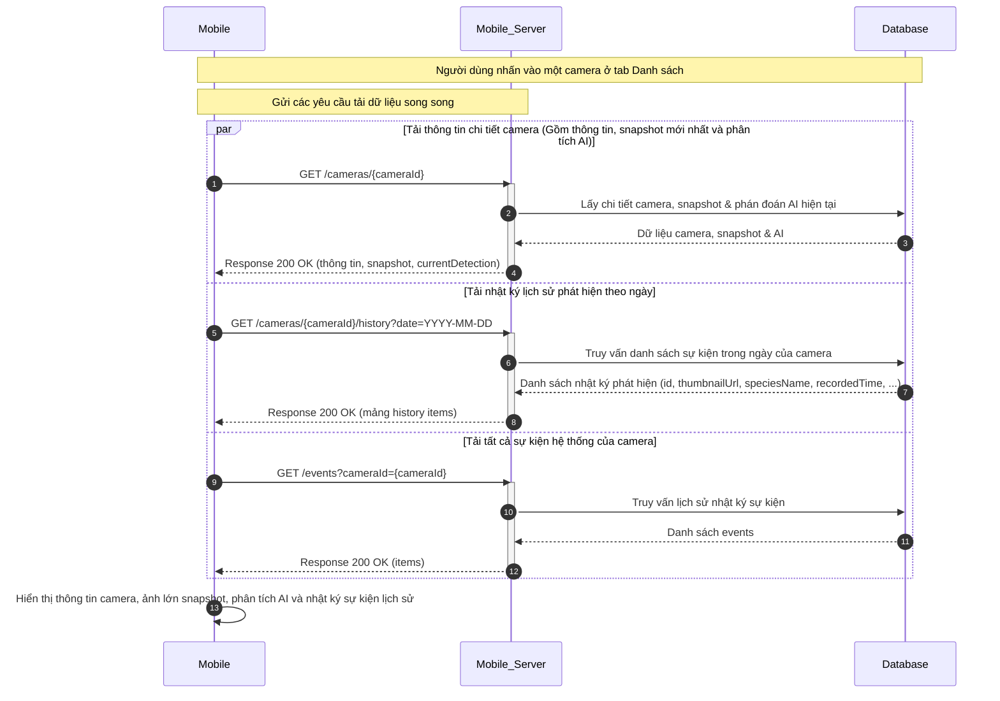
```mermaid
sequenceDiagram
    autonumber
    participant Mobile as Mobile
    participant Mobile_Server as Mobile_Server
    participant Database as Database

    Note over Mobile, Database: Người dùng nhấn vào một camera ở tab Danh sách
    Note over Mobile, Mobile_Server: Gửi các yêu cầu tải dữ liệu song song
    par Tải thông tin chi tiết camera (Gồm thông tin, snapshot mới nhất và phân tích AI)
        Mobile->>Mobile_Server: GET /cameras/{cameraId}
        activate Mobile_Server
        Mobile_Server->>Database: Lấy chi tiết camera, snapshot & phán đoán AI hiện tại
        Database-->>Mobile_Server: Dữ liệu camera, snapshot & AI
        Mobile_Server-->>Mobile: Response 200 OK (thông tin, snapshot, currentDetection)
        deactivate Mobile_Server
    and Tải nhật ký lịch sử phát hiện theo ngày
        Mobile->>Mobile_Server: GET /cameras/{cameraId}/history?date=YYYY-MM-DD
        activate Mobile_Server
        Mobile_Server->>Database: Truy vấn danh sách sự kiện trong ngày của camera
        Database-->>Mobile_Server: Danh sách nhật ký phát hiện (id, thumbnailUrl, speciesName, recordedTime, ...)
        Mobile_Server-->>Mobile: Response 200 OK (mảng history items)
        deactivate Mobile_Server
    and Tải tất cả sự kiện hệ thống của camera
        Mobile->>Mobile_Server: GET /events?cameraId={cameraId}
        activate Mobile_Server
        Mobile_Server->>Database: Truy vấn lịch sử nhật ký sự kiện
        Database-->>Mobile_Server: Danh sách events
        Mobile_Server-->>Mobile: Response 200 OK (items)
        deactivate Mobile_Server
    end
    Mobile->>Mobile: Hiển thị thông tin camera, ảnh lớn snapshot, phân tích AI và nhật ký sự kiện lịch sử
```
*   **Chi tiết đặc tả API:**
    *   [GET /cameras/{cameraId}](./03-mobile_api.md#52-get-camerascameraid)
    *   [GET /cameras/{cameraId}/history](./03-mobile_api.md#56-get-camerascameraidhistory)
    *   [GET /events](./03-mobile_api.md#101-get-events)

### 4.2. Action: Update camera name

- **Mô tả:** Người dùng bấm nút sửa tên hiển thị trên màn hình chi tiết, nhập tên mới và lưu lại để đồng bộ lên DB.

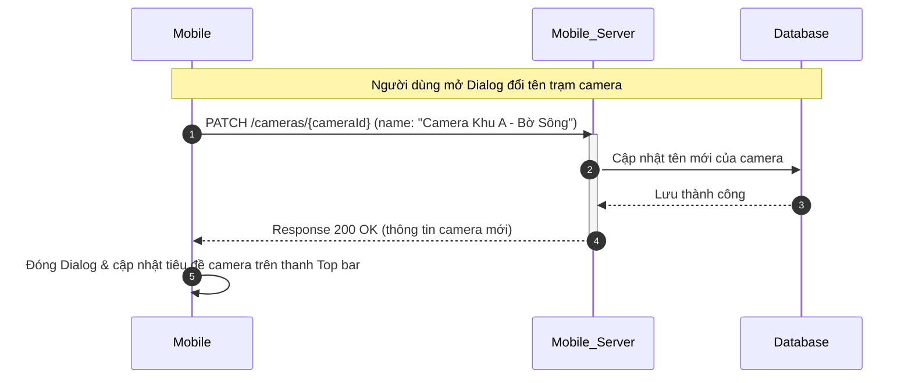
```mermaid
sequenceDiagram
    autonumber
    participant Mobile as Mobile
    participant Mobile_Server as Mobile_Server
    participant Database as Database

    Note over Mobile, Database: Người dùng mở Dialog đổi tên trạm camera
    Mobile->>Mobile_Server: PATCH /cameras/{cameraId} (name: "Camera Khu A - Bờ Sông")
    activate Mobile_Server
    Mobile_Server->>Database: Cập nhật tên mới của camera
    Database-->>Mobile_Server: Lưu thành công
    Mobile_Server-->>Mobile: Response 200 OK (thông tin camera mới)
    deactivate Mobile_Server
    Mobile->>Mobile: Đóng Dialog & cập nhật tiêu đề camera trên thanh Top bar
```
*   **Chi tiết đặc tả API:**
    *   [PATCH /cameras/{cameraId}](./03-mobile_api.md#53-patch-camerascameraid)

---

## 5. Màn hình Danh sách Cấu hình Loài (`[SPECIES_CONFIG_LIST_SCREEN]`)

### 5.1. Action: Load species list & configuration overview

- **Mô tả:** Khi người dùng mở màn hình thiết lập ứng phó mặc định, app tải danh sách toàn bộ các loài động vật trong hệ thống (kèm chỉ số hung dữ, đặc tính htmlDescription) và tình trạng cấu hình tương ứng đang được áp dụng tại trạm camera đã chọn.

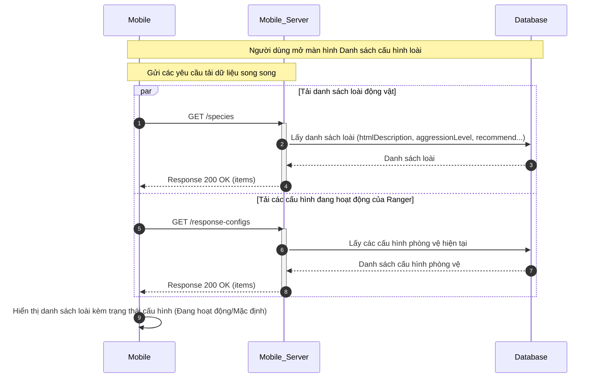
```mermaid
sequenceDiagram
    autonumber
    participant Mobile as Mobile
    participant Mobile_Server as Mobile_Server
    participant Database as Database

    Note over Mobile, Database: Người dùng mở màn hình Danh sách cấu hình loài
    Note over Mobile, Mobile_Server: Gửi các yêu cầu tải dữ liệu song song
    par Tải danh sách loài động vật
        Mobile->>Mobile_Server: GET /species
        activate Mobile_Server
        Mobile_Server->>Database: Lấy danh sách loài (htmlDescription, aggressionLevel, recommend...)
        Database-->>Mobile_Server: Danh sách loài
        Mobile_Server-->>Mobile: Response 200 OK (items)
        deactivate Mobile_Server
    and Tải các cấu hình đang hoạt động của Ranger
        Mobile->>Mobile_Server: GET /response-configs
        activate Mobile_Server
        Mobile_Server->>Database: Lấy các cấu hình phòng vệ hiện tại
        Database-->>Mobile_Server: Danh sách cấu hình phòng vệ
        Mobile_Server-->>Mobile: Response 200 OK (items)
        deactivate Mobile_Server
    end
    Mobile->>Mobile: Hiển thị danh sách loài kèm trạng thái cấu hình (Đang hoạt động/Mặc định)
```
*   **Chi tiết đặc tả API:**
    *   [GET /species](./03-mobile_api.md#81-get-species)
    *   [GET /response-configs](./03-mobile_api.md#86-get-response-configs-helper)

---

## 6. Màn hình Thiết lập Phòng vệ theo Loài (`[SPECIES_CONFIG_DETAIL_SCREEN]`)

### 6.1. Action: Load species configuration & sample lists

- **Mô tả:** Khi chọn một loài để cấu hình chi tiết, app tải cấu hình phòng vệ hiện tại đang lưu trên DB, đồng thời tải danh sách 3 preset phòng vệ mẫu và danh sách âm thanh mẫu (bao gồm cả âm thanh xua đuổi `animalDeterrentSounds` và âm thanh cảnh báo qua loa `citizenAlertSounds` — nguồn là `GET /alertSounds`) để phục vụ dropdown lựa chọn của người dùng. Các id âm thanh hoàn toàn lấy từ API, không hardcode trong app.

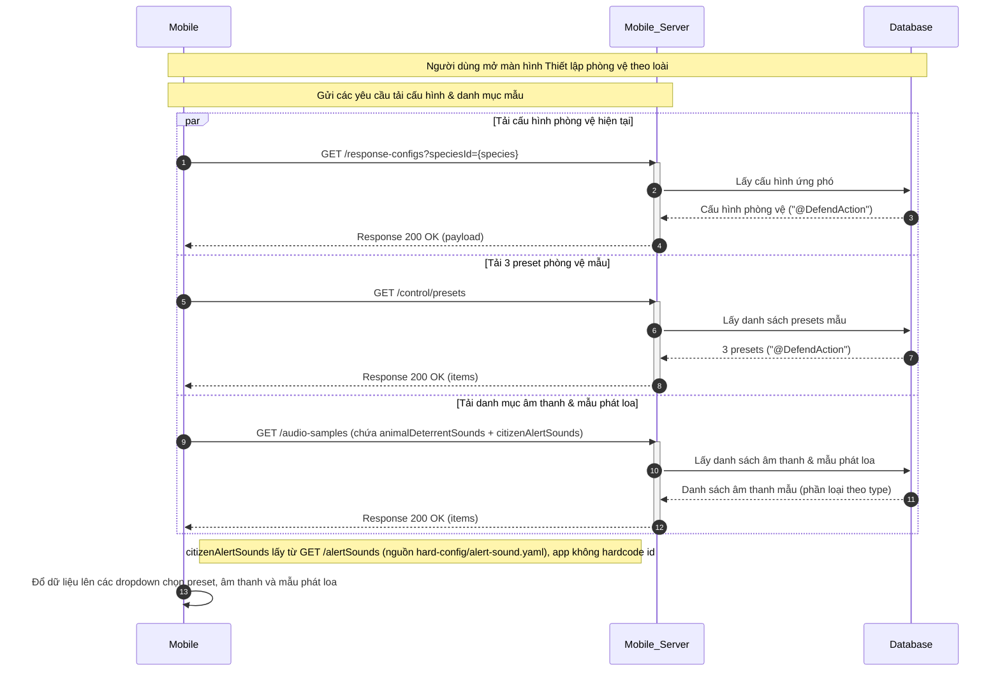
```mermaid
sequenceDiagram
    autonumber
    participant Mobile as Mobile
    participant Mobile_Server as Mobile_Server
    participant Database as Database

    Note over Mobile, Database: Người dùng mở màn hình Thiết lập phòng vệ theo loài
    Note over Mobile, Mobile_Server: Gửi các yêu cầu tải cấu hình & danh mục mẫu
    par Tải cấu hình phòng vệ hiện tại
        Mobile->>Mobile_Server: GET /response-configs?speciesId={species}
        activate Mobile_Server
        Mobile_Server->>Database: Lấy cấu hình ứng phó
        Database-->>Mobile_Server: Cấu hình phòng vệ ("@DefendAction")
        Mobile_Server-->>Mobile: Response 200 OK (payload)
        deactivate Mobile_Server
    and Tải 3 preset phòng vệ mẫu
        Mobile->>Mobile_Server: GET /control/presets
        activate Mobile_Server
        Mobile_Server->>Database: Lấy danh sách presets mẫu
        Database-->>Mobile_Server: 3 presets ("@DefendAction")
        Mobile_Server-->>Mobile: Response 200 OK (items)
        deactivate Mobile_Server
    and Tải danh mục âm thanh & mẫu phát loa
        Mobile->>Mobile_Server: GET /audio-samples (chứa animalDeterrentSounds + citizenAlertSounds)
        activate Mobile_Server
        Mobile_Server->>Database: Lấy danh sách âm thanh & mẫu phát loa
        Database-->>Mobile_Server: Danh sách âm thanh mẫu (phần loại theo type)
        Mobile_Server-->>Mobile: Response 200 OK (items)
        deactivate Mobile_Server
    end
    Note right of Mobile: citizenAlertSounds lấy từ GET /alertSounds (nguồn hard-config/alert-sound.yaml), app không hardcode id
    Mobile->>Mobile: Đổ dữ liệu lên các dropdown chọn preset, âm thanh và mẫu phát loa
```
*   **Chi tiết đặc tả API:**
    *   [GET /response-configs?speciesId=](./03-mobile_api.md#83-get-response-configsspeciesid)
    *   [GET /control/presets](./03-mobile_api.md#71-get-controlpresets)
    *   [GET /audio-samples](./03-mobile_api.md#72-get-audio-samples)
    *   [GET /alertSounds](./03-mobile_api.md#73-get-alertsounds) — nguồn của `citizenAlertSounds` (public, không cần token)

### 6.2. Action: Update species configuration & apply preset

- **Mô tả:** Người dùng tùy biến các tham số (âm thanh, đèn LED nháy, còi báo động, mẫu phát loa, chế độ silent) cho một loài động vật cụ thể và nhấn Lưu cấu hình (`PUT`), Đặt lại về mặc định (`DELETE`), hoặc chọn Áp dụng nhanh theo mức độ nguy hiểm (`POST .../apply-preset/{presetId}`).

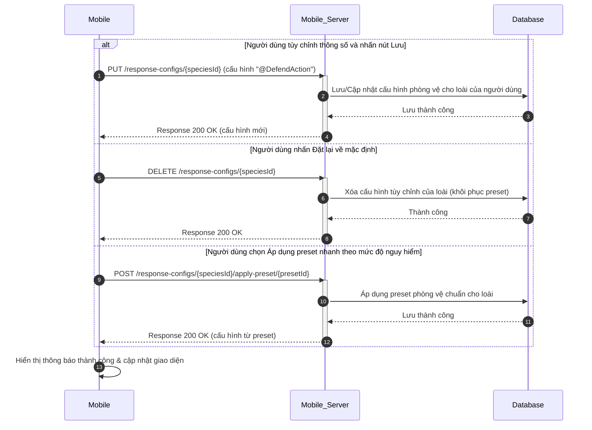
```mermaid
sequenceDiagram
    autonumber
    participant Mobile as Mobile
    participant Mobile_Server as Mobile_Server
    participant Database as Database

    alt Người dùng tùy chỉnh thông số và nhấn nút Lưu
        Mobile->>Mobile_Server: PUT /response-configs/{speciesId} (cấu hình "@DefendAction")
        activate Mobile_Server
        Mobile_Server->>Database: Lưu/Cập nhật cấu hình phòng vệ cho loài của người dùng
        Database-->>Mobile_Server: Lưu thành công
        Mobile_Server-->>Mobile: Response 200 OK (cấu hình mới)
        deactivate Mobile_Server
    else Người dùng nhấn Đặt lại về mặc định
        Mobile->>Mobile_Server: DELETE /response-configs/{speciesId}
        activate Mobile_Server
        Mobile_Server->>Database: Xóa cấu hình tùy chỉnh của loài (khôi phục preset)
        Database-->>Mobile_Server: Thành công
        Mobile_Server-->>Mobile: Response 200 OK
        deactivate Mobile_Server
    else Người dùng chọn Áp dụng preset nhanh theo mức độ nguy hiểm
        Mobile->>Mobile_Server: POST /response-configs/{speciesId}/apply-preset/{presetId}
        activate Mobile_Server
        Mobile_Server->>Database: Áp dụng preset phòng vệ chuẩn cho loài
        Database-->>Mobile_Server: Lưu thành công
        Mobile_Server-->>Mobile: Response 200 OK (cấu hình từ preset)
        deactivate Mobile_Server
    end
    Mobile->>Mobile: Hiển thị thông báo thành công & cập nhật giao diện
```
*   **Chi tiết đặc tả API:**
    *   [PUT /response-configs/{speciesId}](./03-mobile_api.md#82-put-response-configsspeciesid)
    *   [DELETE /response-configs/{speciesId}](./03-mobile_api.md#84-delete-response-configsspeciesid)
    *   [POST /response-configs/{speciesId}/apply-preset/{presetId}](./03-mobile_api.md#85-post-response-configsspeciesidapply-presetpresetid)

### 6.3. Action: Test speaker sound at camera station (AI_SERVER)

- **Mô tả:** Người dùng chọn loại âm thanh còi báo và nhấn "Nghe thử" để phát thử nghiệm trực tiếp tại hiện trường nhằm căn chỉnh âm lượng.

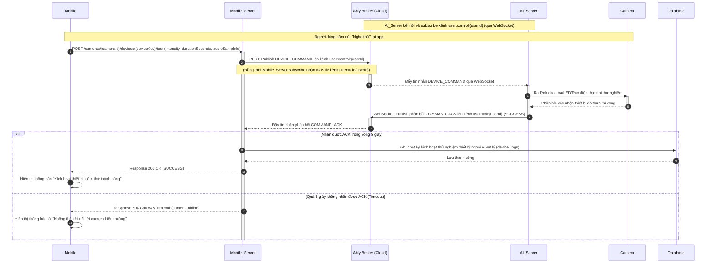
```mermaid
sequenceDiagram
    autonumber
    participant Mobile as Mobile
    participant Mobile_Server as Mobile_Server
    participant Ably as Ably Broker (Cloud)
    participant AI_Server as AI_Server
    participant Camera as Camera
    participant Database as Database

    Note over AI_Server, Ably: AI_Server kết nối và subscribe kênh user:control:{userId} (qua WebSocket)
    Note over Mobile, Camera: Người dùng bấm nút "Nghe thử" tại app
    Mobile->>Mobile_Server: POST /cameras/{cameraId}/devices/{deviceKey}/test (intensity, durationSeconds, audioSampleId)
    activate Mobile_Server
    Mobile_Server->>Ably: REST: Publish DEVICE_COMMAND lên kênh user:control:{userId}
    Note over Mobile_Server, Ably: (Đồng thời Mobile_Server subscribe nhận ACK từ kênh user:ack:{userId})
    activate Ably
    Ably-->>AI_Server: Đẩy tin nhắn DEVICE_COMMAND qua WebSocket
    deactivate Ably
    activate AI_Server
    AI_Server->>Camera: Ra lệnh cho Loa/LED/Rào điện thực thi thử nghiệm
    activate Camera
    Camera-->>AI_Server: Phản hồi xác nhận thiết bị đã thực thi xong
    deactivate Camera
    AI_Server->>Ably: WebSocket: Publish phản hồi COMMAND_ACK lên kênh user:ack:{userId} (SUCCESS)
    deactivate AI_Server
    activate Ably
    Ably-->>Mobile_Server: Đẩy tin nhắn phản hồi COMMAND_ACK
    deactivate Ably
    
    alt Nhận được ACK trong vòng 5 giây
        Mobile_Server->>Database: Ghi nhật ký kích hoạt thử nghiệm thiết bị ngoại vi vật lý (device_logs)
        Database-->>Mobile_Server: Lưu thành công
        Mobile_Server-->>Mobile: Response 200 OK (SUCCESS)
        Mobile->>Mobile: Hiển thị thông báo "Kích hoạt thiết bị kiểm thử thành công"
    else Quá 5 giây không nhận được ACK (Timeout)
        Mobile_Server-->>Mobile: Response 504 Gateway Timeout (camera_offline)
        Mobile->>Mobile: Hiển thị thông báo lỗi "Không thể kết nối tới camera hiện trường"
    end
    deactivate Mobile_Server
```
*   **Chi tiết đặc tả API:**
    *   [POST /cameras/{cameraId}/devices/{deviceKey}/test](./03-mobile_api.md#61-post-camerascameraiddevicesdevicekeytest)
    *   [GET /auth/ably-token](./03-mobile_api.md#13a3-get-authably-token)

---

## 7. Màn hình Quản lý SĐT Nhận Cảnh Báo (`[SMS_CONFIG_SCREEN]`)

### 7.1. Action: Load SMS recipients list

- **Mô tả:** Tải danh sách tối đa 3 số điện thoại đăng ký nhận cảnh báo bổ sung khi mở màn hình quản lý SMS.

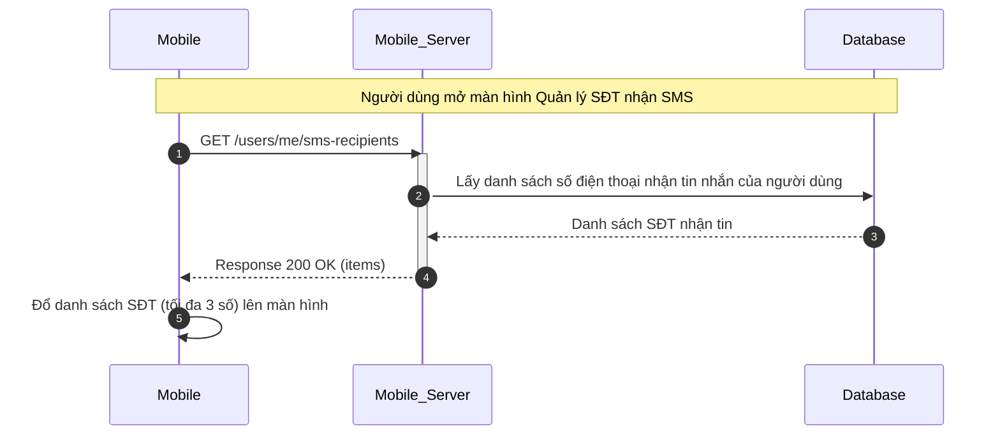
```mermaid
sequenceDiagram
    autonumber
    participant Mobile as Mobile
    participant Mobile_Server as Mobile_Server
    participant Database as Database

    Note over Mobile, Database: Người dùng mở màn hình Quản lý SĐT nhận SMS
    Mobile->>Mobile_Server: GET /users/me/sms-recipients
    activate Mobile_Server
    Mobile_Server->>Database: Lấy danh sách số điện thoại nhận tin nhắn của người dùng
    Database-->>Mobile_Server: Danh sách SĐT nhận tin
    Mobile_Server-->>Mobile: Response 200 OK (items)
    deactivate Mobile_Server
    Mobile->>Mobile: Đổ danh sách SĐT (tối đa 3 số) lên màn hình
```
*   **Chi tiết đặc tả API:**
    *   [GET /users/me/sms-recipients](./03-mobile_api.md#121-get-usersmesms-recipients)

### 7.2. Action: Add / Remove SMS recipient

- **Mô tả:** Người dùng thực hiện thêm số điện thoại mới (qua dialog) hoặc nhấn xóa một số điện thoại khỏi danh sách nhận cảnh báo. Mỗi tài khoản người dùng được thêm tối đa 3 số điện thoại nhận tin.

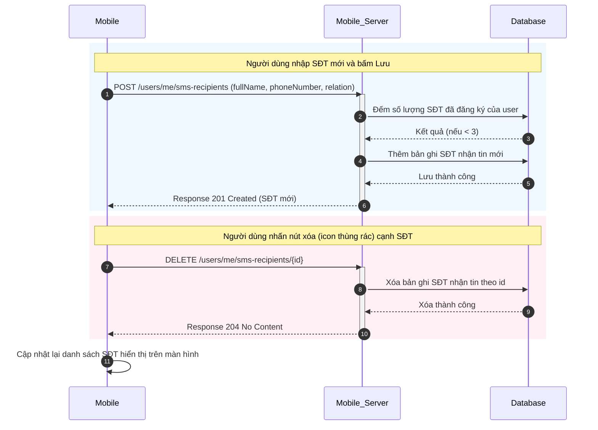
```mermaid
sequenceDiagram
    autonumber
    participant Mobile as Mobile
    participant Mobile_Server as Mobile_Server
    participant Database as Database

    %% THÊM SĐT
    rect rgb(240, 248, 255)
        Note over Mobile, Database: Người dùng nhập SĐT mới và bấm Lưu
        Mobile->>Mobile_Server: POST /users/me/sms-recipients (fullName, phoneNumber, relation)
        activate Mobile_Server
        Mobile_Server->>Database: Đếm số lượng SĐT đã đăng ký của user
        Database-->>Mobile_Server: Kết quả (nếu < 3)
        Mobile_Server->>Database: Thêm bản ghi SĐT nhận tin mới
        Database-->>Mobile_Server: Lưu thành công
        Mobile_Server-->>Mobile: Response 201 Created (SĐT mới)
        deactivate Mobile_Server
    end

    %% XÓA SĐT
    rect rgb(255, 240, 245)
        Note over Mobile, Database: Người dùng nhấn nút xóa (icon thùng rác) cạnh SĐT
        Mobile->>Mobile_Server: DELETE /users/me/sms-recipients/{id}
        activate Mobile_Server
        Mobile_Server->>Database: Xóa bản ghi SĐT nhận tin theo id
        Database-->>Mobile_Server: Xóa thành công
        Mobile_Server-->>Mobile: Response 204 No Content
        deactivate Mobile_Server
    end
    Mobile->>Mobile: Cập nhật lại danh sách SĐT hiển thị trên màn hình
```
*   **Chi tiết đặc tả API:**
    *   [POST /users/me/sms-recipients](./03-mobile_api.md#122-post-usersmesms-recipients)
    *   [DELETE /users/me/sms-recipients/{recipientId}](./03-mobile_api.md#123-delete-usersmesms-recipientsrecipientid)

---

# II. Thiết bị Camera & AI Server (Server AI / Field Device)

## 1. Không phân chia màn hình (Thực thi ngầm & Tích hợp)

### 1.1. Action: AI Server sends detection snapshot (AI_SERVER)

> [!NOTE]
> ### 💡 Diễn giải Luồng vận hành Hệ thống (Dành cho Giám khảo / Người đọc tổng quan)
> Để dễ hình dung toàn bộ quá trình tự động hóa từ hiện trường đến thiết bị di động mà không cần đi sâu vào chi tiết kỹ thuật lập trình, luồng xử lý khi có động vật xuất hiện diễn ra qua **4 bước chính** như sau:
> 
> 1. **Bước 1: Chụp ảnh & Nhận dạng Trí tuệ Nhân tạo (Tại thực địa)**  
>    * Khi phát hiện chuyển động tại vùng ranh giới rừng, Camera tự động chụp ảnh và truyền sang Máy chủ AI (`AI_Server`). Mô hình AI thị giác máy tính sẽ "nhìn" bức ảnh để nhận biết chính xác loài động vật (như Voi, Hổ, Lợn rừng, Gấu...) kèm độ tin cậy nhận diện.
> 
> 2. **Bước 2: Ra quyết định Phản ứng & Xua đuổi Tức thì (Tại chỗ)**  
>    * Kết quả được gửi về Máy chủ Trung tâm (`Mobile_Server`).  
>    * **Cách trạm camera nhận đúng cấu hình phòng vệ:** Mỗi trạm camera có một mã định danh duy nhất (`cameraId`). Khi gửi phán đoán, AI Server truyền đúng `cameraId` này trên đường dẫn URL. Máy chủ xác định người quản lý trạm đó (`ownerId`) và truy vấn chính xác kịch bản phòng vệ mà người đó đã cài đặt riêng cho loài vừa xuất hiện (nếu chưa cài riêng, hệ thống lấy kịch bản khuyên dùng mặc định theo cấp độ nguy hiểm).  
>    * Máy chủ đóng gói kịch bản phòng vệ (`@DefendAction`) vào JSON trả về ngay lập tức cho kết nối của trạm camera đó, giúp Loa và Đèn LED tại đúng trạm đó phát ra âm thanh và ánh sáng xua đuổi lập tức.
> 
> 3. **Bước 3: Kích hoạt Cảnh báo Khẩn cấp Đa kênh (Push Notification & SMS)**  
>    * Song song với việc xua đuổi tại chỗ, nếu đây là sự kiện mới (hệ thống tự động lọc chống phát lặp lại trong 30 giây), Máy chủ lập tức gửi thông báo cảnh báo.  
>    * **Cách định danh người dùng sẽ nhận thông báo:**
>      - **Gửi Push Notification qua App:** Khi đăng nhập trên điện thoại, ứng dụng di động tự động lấy Mã định danh thiết bị duy nhất (`fcmToken` từ Google Firebase) gửi lên lưu vào máy chủ đính kèm theo tài khoản `userId`. Khi có sự kiện, máy chủ gửi thông báo trực tiếp đến các `fcmToken` này.
>      - **Gửi tin nhắn SMS khẩn cấp:** Máy chủ truy vấn danh sách số điện thoại chính của tài khoản và các số điện thoại người dân lân cận đã được đăng ký trước (tối đa 3 số/tài khoản) để gửi tin nhắn SMS cảnh báo tức thời.
> 
> 4. **Bước 4: Cập nhật Nhật ký & Hiển thị Thời gian thực trên Ứng dụng**  
>    * Hình ảnh thực địa, thời gian xuất hiện và nhật ký xua đuổi được lưu vào Cơ sở dữ liệu. Ứng dụng di động của người dùng tự động làm mới giao diện, giúp kiểm lâm và người dân dễ dàng theo dõi tình hình trực quan trên bản đồ và danh sách camera.

- **Mô tả kỹ thuật:** Khi phát hiện có động vật hoặc chuyển động bất thường, Camera/AI_Server tải hình ảnh lên Mobile_Server qua API `POST /cameras/{cameraId}/detections`, nhận cấu hình phòng vệ `@DefendAction` phẳng 8 trường (`ledFlash`, `ledColor`, `ledIntensity`, `ledFlashRate`, `speakerWarn`, `audioSampleId`, `audioIntensity`, `silentAlert`) phản hồi để thực thi phát âm thanh xua đuổi/chớp LED tại chỗ, đồng thời kích hoạt cảnh báo đa kênh đến người dân (SMS/Push).
- **Cơ chế gửi Push Notification với Cooldown 30 giây:**
  - AI Server có thể gửi detection liên tục về Mobile Server. Để tránh spam thông báo, `Mobile_Server` áp dụng logic cooldown:
    * **Xác định `isNewEvent`:** Kiểm tra trong DB xem `cameraId` này có `Event` nào được tạo trong vòng **30 giây** gần nhất không.
    * Nếu **`isNewEvent = true`** (lần phát hiện đầu tiên / đã quá 30s kể từ event trước): Tạo `Alert` mới trong DB **và** gửi Push Notification qua FCM đến người dùng.
    * Nếu **`isNewEvent = false`** (phát hiện liên tiếp trong cùng chuỗi ≤ 30s): **Bỏ qua** việc tạo `Alert` và gửi Push, nhưng **vẫn lưu `Snapshot`** để mobile app có thể cập nhật ảnh mới nhất qua cơ chế polling.
  - Khi `isNewEvent = true`, `Mobile_Server` sẽ đọc biến môi trường `PUSH_SERVICE_ACCOUNT_KEY_JSON`, giải mã từ Base64 sang Object JSON **trực tiếp trong RAM** để khởi tạo Firebase Admin SDK (nếu chưa được khởi tạo).
  - `Mobile_Server` truy vấn danh sách `fcmToken` từ bảng `device_tokens` rồi gửi Push Notification thông qua Firebase Cloud Messaging.

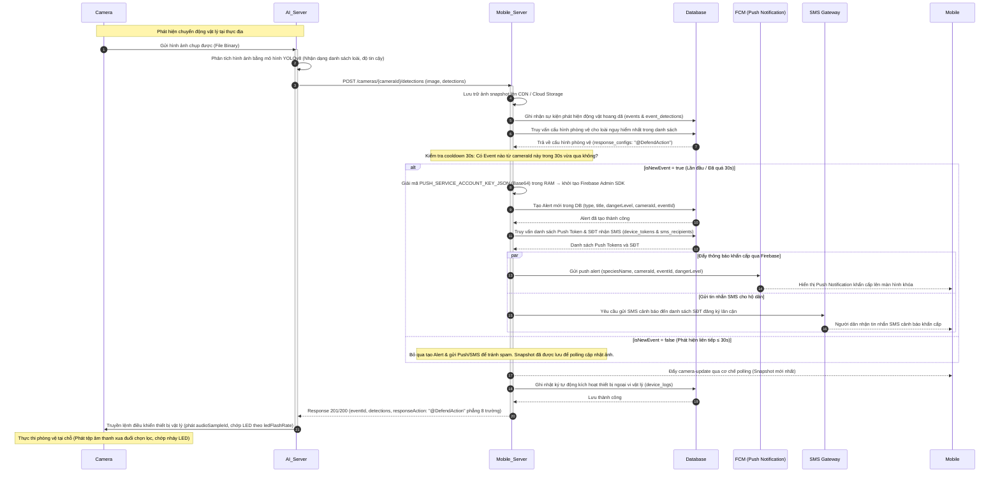
```mermaid
sequenceDiagram
    autonumber
    participant Camera as Camera
    participant AI_Server as AI_Server
    participant Mobile_Server as Mobile_Server
    participant Database as Database
    participant FCM as FCM (Push Notification)
    participant SMS as SMS Gateway
    participant Mobile as Mobile

    Note over Camera, AI_Server: Phát hiện chuyển động vật lý tại thực địa
    Camera->>AI_Server: Gửi hình ảnh chụp được (File Binary)
    activate AI_Server
    AI_Server->>AI_Server: Phân tích hình ảnh bằng mô hình YOLOv8 (Nhận dạng danh sách loài, độ tin cậy)

    AI_Server->>Mobile_Server: POST /cameras/{cameraId}/detections (image, detections)
    activate Mobile_Server
    Mobile_Server->>Mobile_Server: Lưu trữ ảnh snapshot lên CDN / Cloud Storage
    Mobile_Server->>Database: Ghi nhận sự kiện phát hiện động vật hoang dã (events & event_detections)
    Mobile_Server->>Database: Truy vấn cấu hình phòng vệ cho loài nguy hiểm nhất trong danh sách
    Database-->>Mobile_Server: Trả về cấu hình phòng vệ (response_configs: "@DefendAction")

    Note over Mobile_Server: Kiểm tra cooldown 30s: Có Event nào từ cameraId này trong 30s vừa qua không?
    alt isNewEvent = true (Lần đầu / Đã quá 30s)
        Mobile_Server->>Mobile_Server: Giải mã PUSH_SERVICE_ACCOUNT_KEY_JSON (Base64) trong RAM → khởi tạo Firebase Admin SDK
        Mobile_Server->>Database: Tạo Alert mới trong DB (type, title, dangerLevel, cameraId, eventId)
        Database-->>Mobile_Server: Alert đã tạo thành công
        Mobile_Server->>Database: Truy vấn danh sách Push Token & SĐT nhận SMS (device_tokens & sms_recipients)
        Database-->>Mobile_Server: Danh sách Push Tokens và SĐT
        par Đẩy thông báo khẩn cấp qua Firebase
            Mobile_Server->>FCM: Gửi push alert (speciesName, cameraId, eventId, dangerLevel)
            FCM-->>Mobile: Hiển thị Push Notification khẩn cấp lên màn hình khóa
        and Gửi tin nhắn SMS cho hộ dân
            Mobile_Server->>SMS: Yêu cầu gửi SMS cảnh báo đến danh sách SĐT đăng ký lân cận
            SMS-->>Mobile: Người dân nhận tin nhắn SMS cảnh báo khẩn cấp
        end
    else isNewEvent = false (Phát hiện liên tiếp ≤ 30s)
        Note over Mobile_Server: Bỏ qua tạo Alert & gửi Push/SMS để tránh spam. Snapshot đã được lưu để polling cập nhật ảnh.
    end
    Mobile_Server-->>Mobile: Đẩy camera-update qua cơ chế polling (Snapshot mới nhất)

    Mobile_Server->>Database: Ghi nhật ký tự động kích hoạt thiết bị ngoại vi vật lý (device_logs)
    Database-->>Mobile_Server: Lưu thành công

    Mobile_Server-->>AI_Server: Response 201/200 (eventId, detections, responseAction: "@DefendAction" phẳng 8 trường)
    deactivate Mobile_Server

    AI_Server->>Camera: Truyền lệnh điều khiển thiết bị vật lý (phát audioSampleId, chớp LED theo ledFlashRate)
    deactivate AI_Server

    Note over Camera: Thực thi phòng vệ tại chỗ (Phát tệp âm thanh xua đuổi chọn lọc, chớp nháy LED)
```
*   **Chi tiết đặc tả API:**
    *   [POST /cameras/{cameraId}/detections](./03-mobile_api.md#13a1-post-camerascameraiddetections)

### 1.2. Action: Manual snapshot upload by ranger/user (RANGER / USER)

- **Mô tả:** Kiểm lâm hoặc người dùng chủ động chụp và tải tệp ảnh snapshot thực địa lên một trạm camera thông qua API `POST /cameras/{cameraId}/snapshots` (truyền multipart/form-data chứa file ảnh JPEG/PNG ≤ 5MB và `userId`). Máy chủ tải ảnh lên Cloud Storage/Cloudinary và ghi nhận vào bảng `snapshots` trong DB.

```mermaid
sequenceDiagram
    autonumber
    participant Mobile as Mobile
    participant Mobile_Server as Mobile_Server
    participant Cloudinary as Cloudinary / Cloud Storage
    participant Database as Database

    Note over Mobile, Mobile_Server: Người dùng/Kiểm lâm chọn tải ảnh snapshot từ ứng dụng
    Mobile->>Mobile_Server: POST /cameras/{cameraId}/snapshots (form-data: image, userId)
    activate Mobile_Server
    Mobile_Server->>Mobile_Server: Validation định dạng (JPG/PNG, size ≤ 5MB) & kiểm tra cameraId, userId
    Mobile_Server->>Cloudinary: Upload tệp ảnh snapshot thực địa
    Cloudinary-->>Mobile_Server: Trả về URL ảnh (secureUrl)
    Mobile_Server->>Database: Lưu bản ghi snapshot mới (cameraId, userId, url, uploadedAt)
    Database-->>Mobile_Server: Bản ghi đã lưu thành công
    Mobile_Server-->>Mobile: Response 201 Created (id, url, deviceId, userId, uploadedAt)
    deactivate Mobile_Server
    Mobile->>Mobile: Cập nhật hiển thị ảnh snapshot mới lên ứng dụng
```
*   **Chi tiết đặc tả API:**
    *   [POST /cameras/{cameraId}/snapshots](./03-mobile_api.md#13a2-post-camerascameraidsnapshots)
