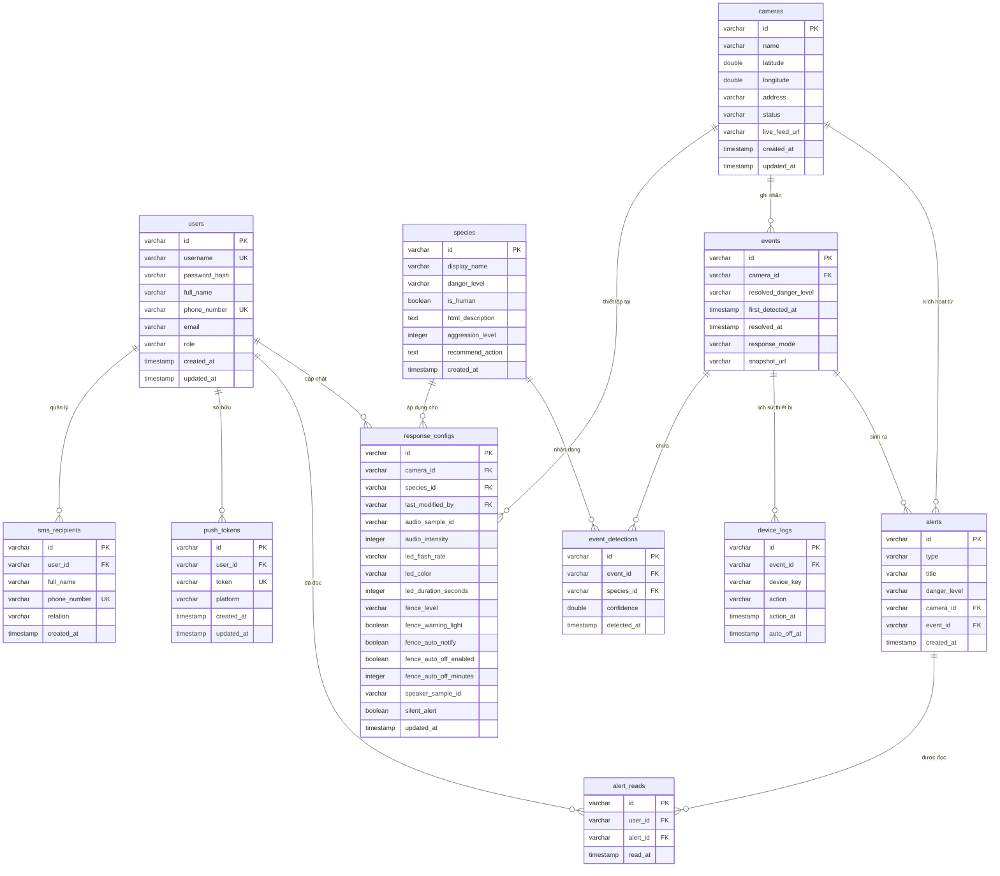

# Thiết kế Cơ sở dữ liệu (Database Schema Design)

Tài liệu này mô tả chi tiết thiết kế cơ sở dữ liệu quan hệ sử dụng hệ quản trị cơ sở dữ liệu **PostgreSQL** cho dự án Hệ thống Cảnh báo và Xua đuổi Động vật hoang dã. Thiết kế này hỗ trợ đầy đủ các tính năng và API được mô tả trong [03-mobile_api.md](03-mobile_api.md).

---

## 1. Sơ đồ thực thể mối quan hệ (ERD - Entity Relationship Diagram)

Dưới đây là sơ đồ mối quan hệ giữa các bảng dữ liệu chính trong hệ thống:



---

## 2. Chi tiết các bảng dữ liệu

### 2.1. Bảng `users` (Tài khoản người dùng)
Lưu trữ thông tin tài khoản đăng nhập của người dân, kiểm lâm, biên phòng và ban quản lý.

| Tên cột | Kiểu dữ liệu | Ràng buộc | Mô tả |
|---|---|---|---|
| `id` | `VARCHAR(50)` | `PRIMARY KEY` | ID người dùng (mã hex/uuid, vd: `9f3a`) |
| `username` | `VARCHAR(50)` | `NOT NULL, UNIQUE` | Tên đăng nhập |
| `password_hash` | `VARCHAR(255)` | `NOT NULL` | Mật khẩu băm (bcrypt/argon2) |
| `full_name` | `VARCHAR(100)` | `NOT NULL` | Họ và tên hiển thị |
| `phone_number` | `VARCHAR(20)` | `NOT NULL, UNIQUE` | Số điện thoại di động (E.164, vd: `+84901234567`) |
| `email` | `VARCHAR(100)` | `NULL` | Thư điện tử (tùy chọn) |
| `role` | `VARCHAR(20)` | `NOT NULL` | Enum: `CITIZEN`, `RANGER`, `BORDER_GUARD`, `HIGHWAY_ADMIN` |
| `created_at` | `TIMESTAMP` | `NOT NULL` | Thời gian tạo tài khoản |
| `updated_at` | `TIMESTAMP` | `NOT NULL` | Thời gian cập nhật gần nhất |


*   **Quy trình CRUD:**
    *   **READ:** Đọc khi xác thực đăng nhập ([POST /auth/login](03-mobile_api.md#32-post-authlogin) - [Action 2.1: Đăng nhập hệ thống & Đăng ký Push Token](04-sequence-diagram.md#21-action-đăng-nhập-hệ-thống-đăng-ký-push-token)), kiểm tra thông tin cá nhân ([GET /users/me](03-mobile_api.md#91-get-usersme) - [Action 3.3.1: Load thông tin cá nhân của người dùng](04-sequence-diagram.md#331-action-load-thông-tin-cá-nhân-của-người-dùng)), xác thực danh tính trước khi đăng xuất ([POST /auth/logout](03-mobile_api.md#33-post-authlogout) - [Action 3.3.2: Đăng xuất tài khoản](04-sequence-diagram.md#332-action-đăng-xuất-tài-khoản)), hoặc khi hệ thống kiểm tra vai trò người dùng (`role`).
    *   **CREATE:** Thêm bản ghi khi đăng ký tài khoản mới ([POST /auth/register](03-mobile_api.md#31-post-authregister) - [Action 1.1: Đăng ký tài khoản mới](04-sequence-diagram.md#11-action-đăng-ký-tài-khoản-mới)).
    *   **UPDATE:** Cập nhật khi người dùng sửa đổi họ tên cá nhân ([PATCH /users/me](03-mobile_api.md#92-patch-usersme)).
    *   **DELETE:** Không hỗ trợ xóa thông tin tài khoản qua ứng dụng di động để đảm bảo tính toàn vẹn dữ liệu.

---

### 2.2. Bảng `sms_recipients` (Số điện thoại nhận SMS phụ)
Lưu danh sách SĐT nhận tin nhắn cảnh báo bổ sung do tài khoản người dùng đăng ký thêm (tối đa 3 số mỗi tài khoản).

| Tên cột | Kiểu dữ liệu | Ràng buộc | Mô tả |
|---|---|---|---|
| `id` | `VARCHAR(50)` | `PRIMARY KEY` | ID bản ghi |
| `user_id` | `VARCHAR(50)` | `FOREIGN KEY` -> `users.id` | Tài khoản sở hữu liên kết |
| `full_name` | `VARCHAR(100)` | `NOT NULL` | Tên người nhận tin nhắn |
| `phone_number` | `VARCHAR(20)` | `NOT NULL, UNIQUE` | SĐT nhận SMS (E.164) |
| `relation` | `VARCHAR(20)` | `NOT NULL` | Mối quan hệ (`self`, `family`, `neighbor`, `other`) |
| `created_at` | `TIMESTAMP` | `NOT NULL` | Thời điểm thêm số điện thoại |

*   *Ràng buộc đặc biệt:* Đảm bảo tối đa 3 bản ghi cho mỗi `user_id` (kiểm tra ở tầng Backend hoặc qua DB trigger).


*   **Quy trình CRUD:**
    *   **READ:** Đọc khi tải danh sách SĐT nhận SMS bổ sung ([GET /users/me/sms-recipients](03-mobile_api.md#121-get-usersmesms-recipients) - [Action 7.1: Load danh sách số điện thoại nhận SMS bổ sung](04-sequence-diagram.md#71-action-load-danh-sách-số-điện-thoại-nhận-sms-bổ-sung)) hoặc khi Mobile Server quét danh sách SĐT để gửi tin nhắn SMS cảnh báo động vật hoang dã xâm nhập ([Action 1.1: Gửi hình ảnh snapshot và phán đoán nhận dạng của AI Server (AI_SERVER)](04-sequence-diagram.md#11-action-gửi-hình-ảnh-snapshot-và-phán-đoán-nhận-dạng-của-ai-server-ai_server)).
    *   **CREATE:** Thêm bản ghi khi đăng ký SĐT nhận cảnh báo mới ([POST /users/me/sms-recipients](03-mobile_api.md#122-post-usersmesms-recipients) - [Action 7.2: Thêm / Xóa số điện thoại nhận tin nhắn SMS](04-sequence-diagram.md#72-action-thêm-xóa-số-điện-thoại-nhận-tin-nhắn-sms)).
    *   **UPDATE:** Không hỗ trợ cập nhật trực tiếp (người dùng cần xóa đi và thêm lại SĐT mới).
    *   **DELETE:** Xóa bản ghi khi người dùng gỡ bỏ SĐT khỏi danh sách ([DELETE /users/me/sms-recipients/{recipientId}](03-mobile_api.md#123-delete-usersmesms-recipientsrecipientid) - [Action 7.2: Thêm / Xóa số điện thoại nhận tin nhắn SMS](04-sequence-diagram.md#72-action-thêm-xóa-số-điện-thoại-nhận-tin-nhắn-sms)).

---

### 2.3. Bảng `push_tokens` (Token FCM nhận thông báo đẩy)
Lưu thông tin token FCM của thiết bị Android nhằm gửi thông báo đẩy thời gian thực.

| Tên cột | Kiểu dữ liệu | Ràng buộc | Mô tả |
|---|---|---|---|
| `id` | `VARCHAR(50)` | `PRIMARY KEY` | ID bản ghi |
| `user_id` | `VARCHAR(50)` | `FOREIGN KEY` -> `users.id` | Tài khoản đăng nhập trên thiết bị |
| `token` | `VARCHAR(255)` | `NOT NULL, UNIQUE` | FCM push token từ Google Services |
| `platform` | `VARCHAR(20)` | `NOT NULL` | Hệ điều hành thiết bị (`android`) |
| `created_at` | `TIMESTAMP` | `NOT NULL` | Thời điểm đăng ký token |
| `updated_at` | `TIMESTAMP` | `NOT NULL` | Thời điểm làm mới token |


*   **Quy trình CRUD:**
    *   **READ:** Đọc khi Mobile Server lấy danh sách Push Token để gửi thông báo đẩy (FCM) thời gian thực tới các thiết bị liên quan khi có báo động ([Action 1.1: Gửi hình ảnh snapshot và phán đoán nhận dạng của AI Server (AI_SERVER)](04-sequence-diagram.md#11-action-gửi-hình-ảnh-snapshot-và-phán-đoán-nhận-dạng-của-ai-server-ai_server)).
    *   **CREATE:** Thêm bản ghi khi thiết bị đăng ký Token FCM mới sau khi đăng nhập thành công ([POST /devices/push-token](03-mobile_api.md#41-post-devicespush-token) - [Action 2.1: Đăng nhập hệ thống & Đăng ký Push Token](04-sequence-diagram.md#21-action-đăng-nhập-hệ-thống-đăng-ký-push-token)).
    *   **UPDATE:** Cập nhật thời gian hoặc làm mới Token khi ứng dụng gửi Token FCM cập nhật ([POST /devices/push-token](03-mobile_api.md#41-post-devicespush-token) - [Action 2.1: Đăng nhập hệ thống & Đăng ký Push Token](04-sequence-diagram.md#21-action-đăng-nhập-hệ-thống-đăng-ký-push-token)).
    *   **DELETE:** Xóa Token tương ứng khi người dùng đăng xuất tài khoản ([DELETE /devices/push-token](03-mobile_api.md#42-delete-devicespush-token) - [Action 3.3.2: Đăng xuất tài khoản](04-sequence-diagram.md#332-action-đăng-xuất-tài-khoản)).

---

### 2.4. Bảng `cameras` (Trạm camera thực địa)
Quản lý các trạm camera chụp ảnh và tích hợp thiết bị ngoại vi vật lý tại hiện trường.

| Tên cột | Kiểu dữ liệu | Ràng buộc | Mô tả |
|---|---|---|---|
| `id` | `VARCHAR(50)` | `PRIMARY KEY` | ID trạm camera (vd: `cam-001`) |
| `name` | `VARCHAR(100)` | `NOT NULL` | Tên gọi của trạm camera |
| `latitude` | `DOUBLE PRECISION`| `NOT NULL` | Vĩ độ tọa độ GPS |
| `longitude` | `DOUBLE PRECISION`| `NOT NULL` | Kinh độ tọa độ GPS |
| `address` | `VARCHAR(255)` | `NOT NULL` | Mô tả địa chỉ vị trí đặt trạm |
| `status` | `VARCHAR(20)` | `NOT NULL` | Enum: `ONLINE`, `OFFLINE`, `MAINTENANCE` |
| `live_feed_url` | `VARCHAR(255)` | `NOT NULL` | Link phát trực tiếp HLS (.m3u8) của camera |
| `created_at` | `TIMESTAMP` | `NOT NULL` | Thời điểm trạm được đưa vào vận hành |
| `updated_at` | `TIMESTAMP` | `NOT NULL` | Thời điểm cập nhật trạng thái gần nhất |


*   **Quy trình CRUD:**
    *   **READ:** Đọc khi tải danh sách trạm camera ([GET /cameras](03-mobile_api.md#51-get-cameras) - [Action 3.1.1: Load danh sách trạm camera & snapshot ban đầu](04-sequence-diagram.md#311-action-load-danh-sách-trạm-camera-snapshot-ban-đầu)), xem chi tiết trạm ([GET /cameras/{cameraId}](03-mobile_api.md#52-get-camerascameraid) - [Action 4.1: Load chi tiết trạm camera, snapshot & lịch sử nhật ký](04-sequence-diagram.md#41-action-load-chi-tiết-trạm-camera-snapshot-lịch-sử-nhật-ký)), khi Server truyền phát kết nối SSE cập nhật trạng thái động ([GET /cameras/stream](03-mobile_api.md#54-get-camerasstream) - [Action 3.1.2: Đăng ký & Lắng nghe sự kiện cập nhật qua SSE](04-sequence-diagram.md#312-action-đăng-ký-lắng-nghe-sự-kiện-cập-nhật-qua-sse)), hoặc khi Mobile Server xác thực camera nhận diện ([POST /cameras/{cameraId}/detections](03-mobile_api.md#13a1-post-camerascameraiddetections) - [Action 1.1: Gửi hình ảnh snapshot và phán đoán nhận dạng của AI Server (AI_SERVER)](04-sequence-diagram.md#11-action-gửi-hình-ảnh-snapshot-và-phán-đoán-nhận-dạng-của-ai-server-ai_server)).
    *   **CREATE:** Không hỗ trợ tạo qua API di động (được quản trị viên chèn trực tiếp qua DB/Admin khi lắp đặt trạm mới).
    *   **UPDATE:** Cập nhật khi kiểm lâm đổi tên hiển thị camera ([PATCH /cameras/{cameraId}](03-mobile_api.md#53-patch-camerascameraid) - [Action 4.2: Thay đổi tên hiển thị của trạm camera](04-sequence-diagram.md#42-action-thay-đổi-tên-hiển-thị-của-trạm-camera)), hoặc khi hệ thống tự động cập nhật trạng thái kết nối ONLINE/OFFLINE của camera thông qua kết nối WebSocket ([WS /ws/cameras](03-mobile_api.md#13a2-ws-wscameras) - [Action 1.1: Gửi hình ảnh snapshot và phán đoán nhận dạng của AI Server (AI_SERVER)](04-sequence-diagram.md#11-action-gửi-hình-ảnh-snapshot-và-phán-đoán-nhận-dạng-của-ai-server-ai_server)).
    *   **DELETE:** Không hỗ trợ xóa qua ứng dụng di động để đảm bảo an toàn và bảo lưu nhật ký hệ thống.

---

### 2.5. Bảng `species` (Danh mục loài động vật)
Danh mục phân loại động vật hoang dã được thiết lập sẵn trong hệ thống để mô hình AI đối chiếu.

| Tên cột | Kiểu dữ liệu | Ràng buộc | Mô tả |
|---|---|---|---|
| `id` | `VARCHAR(50)` | `PRIMARY KEY` | ID loài (mã định danh tiếng Anh, vd: `elephant`) |
| `display_name` | `VARCHAR(100)` | `NOT NULL` | Tên tiếng Việt hiển thị trên UI (vd: `Voi`) |
| `danger_level` | `VARCHAR(20)` | `NOT NULL` | Enum: `LOW`, `MEDIUM`, `HIGH`, `CRITICAL` |
| `is_human` | `BOOLEAN` | `NOT NULL` | Đánh dấu thực thể là con người hay không |
| `html_description`| `TEXT` | `NOT NULL` | Đặc tính loài định dạng HTML hiển thị chi tiết |
| `aggression_level`| `INTEGER` | `NOT NULL` | Chỉ số hung dữ từ 1 đến 5 |
| `recommend_action`| `TEXT` | `NOT NULL` | Hướng dẫn ứng phó khuyên dùng cho người dân |
| `created_at` | `TIMESTAMP` | `NOT NULL` | Thời điểm thêm danh mục |


*   **Quy trình CRUD:**
    *   **READ:** Đọc khi tải danh sách loài ([GET /species](03-mobile_api.md#81-get-species) - [Action 5.1: Load danh sách loài & tổng quan cấu hình đang áp dụng](04-sequence-diagram.md#51-action-load-danh-sách-loài-tổng-quan-cấu-hình-đang-áp-dụng)), hiển thị dropdown bộ lọc ([Action 3.2.1: Khởi tạo bộ lọc & Áp dụng lọc dữ liệu (statistics_filter)](04-sequence-diagram.md#321-action-khởi-tạo-bộ-lọc-áp-dụng-lọc-dữ-liệu-statistics_filter)), hoặc khi Server quét mức độ nguy cấp để chạy thuật toán Fallback phòng vệ.
    *   **CREATE / UPDATE / DELETE:** Không hỗ trợ các thao tác ghi từ phía ứng dụng di động.

---

### 2.6. Bảng `response_configs` (Thiết lập kịch bản phòng vệ tùy chỉnh)
Lưu cấu hình ứng phó tự chọn cho từng cặp Camera + Loài động vật (thuộc đối tượng `DefendAction`).

| Tên cột | Kiểu dữ liệu | Ràng buộc | Mô tả |
|---|---|---|---|
| `id` | `VARCHAR(50)` | `PRIMARY KEY` | ID cấu hình |
| `camera_id` | `VARCHAR(50)` | `FOREIGN KEY` -> `cameras.id` | Áp dụng tại trạm camera nào |
| `species_id` | `VARCHAR(50)` | `FOREIGN KEY` -> `species.id` | Áp dụng cho loài động vật nào |
| `last_modified_by`| `VARCHAR(50)` | `FOREIGN KEY` -> `users.id` | Người dùng kiểm lâm cập nhật gần nhất |
| `audio_sample_id` | `VARCHAR(50)` | `NULL` | ID âm thanh xua đuổi (`A_gunshot`, `A_growl`, ...) |
| `audio_intensity` | `INTEGER` | `NULL` | Cường độ âm thanh xua đuổi (1 - 100) |
| `led_flash_rate` | `VARCHAR(20)` | `NULL` | Tốc độ chớp led (`2_per_sec`, `4_per_sec`, `random`) |
| `led_color` | `VARCHAR(20)` | `NULL` | Màu đèn led (`red`, `white`, `red_white_alt`) |
| `led_duration_seconds`| `INTEGER` | `NULL` | Thời gian chớp led (giây) |
| `fence_level` | `VARCHAR(20)` | `NULL` | Mức dòng điện hàng rào (`low`, `medium`, `high`) |
| `fence_warning_light`| `BOOLEAN` | `NULL` | Bật đèn cảnh báo hổ phách/đỏ tại hàng rào |
| `fence_auto_notify` | `BOOLEAN` | `NULL` | Tự động bắn thông báo khi hàng rào kích hoạt |
| `fence_auto_off_enabled`| `BOOLEAN`| `NULL` | Tự động tắt hàng rào điện sinh học |
| `fence_auto_off_minutes`| `INTEGER`| `NULL` | Thời gian tự ngắt hàng rào điện (bắt buộc ≥ 2) |
| `speaker_sample_id`| `VARCHAR(50)` | `NULL` | ID mẫu phát loa cảnh báo người dân (`N_warning_voi`, ...) |
| `silent_alert` | `BOOLEAN` | `NOT NULL` | `true` => Cảnh báo âm thầm (chỉ bắn SMS/FCM, không còi/đèn) |
| `updated_at` | `TIMESTAMP` | `NOT NULL` | Thời điểm cập nhật cấu hình |

*   *Khớp nối Unique:* Cặp `(camera_id, species_id)` phải là duy nhất (`UNIQUE(camera_id, species_id)`).


*   **Quy trình CRUD:**
    *   **READ:** Đọc khi tải cấu hình phòng vệ chi tiết của loài ([GET /response-configs?cameraId=&speciesId=](03-mobile_api.md#83-get-response-configscameraidspeciesid) - [Action 6.1: Load cấu hình hiện tại của loài & danh mục dữ liệu mẫu](04-sequence-diagram.md#61-action-load-cấu-hình-hiện-tại-của-loài-danh-mục-dữ-liệu-mẫu)), xem danh sách cấu hình tại trạm ([GET /response-configs/{cameraId}](03-mobile_api.md#86-get-response-configscameraid-helper) - [Action 5.1: Load danh sách loài & tổng quan cấu hình đang áp dụng](04-sequence-diagram.md#51-action-load-danh-sách-loài-tổng-quan-cấu-hình-đang-áp-dụng)), hoặc khi hệ thống quét cấu hình ứng phó tự động khi phát hiện động vật.
    *   **CREATE:** Thêm bản ghi cấu hình tùy chỉnh lần đầu cho một cặp (Camera, Loài) khi kiểm lâm nhấn Lưu cấu hình ([PUT /response-configs/{cameraId}/{speciesId}](03-mobile_api.md#82-put-response-configscameraidspeciesid) - [Action 6.2: Lưu cấu hình ứng phó tự chỉnh của loài](04-sequence-diagram.md#62-action-lưu-cấu-hình-ứng-phó-tự-chỉnh-của-loài)).
    *   **UPDATE:** Cập nhật khi kiểm lâm thay đổi kịch bản phòng vệ ([PUT /response-configs/{cameraId}/{speciesId}](03-mobile_api.md#82-put-response-configscameraidspeciesid) - [Action 6.2: Lưu cấu hình ứng phó tự chỉnh của loài](04-sequence-diagram.md#62-action-lưu-cấu-hình-ứng-phó-tự-chỉnh-của-loài)) hoặc áp dụng preset mẫu ([POST /response-configs/{cameraId}/{speciesId}/apply-preset/{presetId}](03-mobile_api.md#85-post-response-configscameraidspeciesidapply-presetpresetid) - [Action 6.1: Load cấu hình hiện tại của loài & danh mục dữ liệu mẫu](04-sequence-diagram.md#61-action-load-cấu-hình-hiện-tại-của-loài-danh-mục-dữ-liệu-mẫu)).
    *   **DELETE:** Xóa cấu hình tùy chỉnh của loài để hệ thống quay về mặc định ([DELETE /response-configs/{cameraId}/{speciesId}](03-mobile_api.md#84-delete-response-configscameraidspeciesid) - [Action 6.2: Lưu cấu hình ứng phó tự chỉnh của loài](04-sequence-diagram.md#62-action-lưu-cấu-hình-ứng-phó-tự-chỉnh-của-loài)).

---

### 2.7. Bảng `events` (Nhật ký phiên sự kiện động vật xuất hiện)
Lưu thông tin phiên (session) động vật xuất hiện tại thực địa. Phiên kết thúc khi không còn ghi nhận chuyển động trong một khoảng thời gian.

| Tên cột | Kiểu dữ liệu | Ràng buộc | Mô tả |
|---|---|---|---|
| `id` | `VARCHAR(50)` | `PRIMARY KEY` | ID sự kiện (vd: `evt-456`) |
| `camera_id` | `VARCHAR(50)` | `FOREIGN KEY` -> `cameras.id` | Xảy ra tại trạm camera nào |
| `resolved_danger_level`| `VARCHAR(20)`| `NOT NULL` | Cấp độ nguy hiểm tổng hợp cao nhất của sự kiện |
| `first_detected_at`| `TIMESTAMP` | `NOT NULL` | Thời điểm bắt đầu ghi nhận sự kiện |
| `resolved_at` | `TIMESTAMP` | `NULL` | Thời điểm kết thúc sự kiện (an toàn) |
| `response_mode` | `VARCHAR(20)` | `NOT NULL` | Trạng thái phòng thủ kích hoạt (`SILENT_ALERT` / `ACTIVE_DETERRENCE`) |
| `snapshot_url` | `VARCHAR(255)` | `NOT NULL` | Đường dẫn ảnh snapshot chính ghi lại loài thú |


*   **Quy trình CRUD:**
    *   **READ:** Đọc khi tải nhật ký sự kiện lịch sử của trạm ([GET /events](03-mobile_api.md#101-get-events) - [Action 4.1: Load chi tiết trạm camera, snapshot & lịch sử nhật ký](04-sequence-diagram.md#41-action-load-chi-tiết-trạm-camera-snapshot-lịch-sử-nhật-ký)), xem thông tin chi tiết camera ([GET /cameras/{cameraId}](03-mobile_api.md#52-get-camerascameraid) - [Action 4.1: Load chi tiết trạm camera, snapshot & lịch sử nhật ký](04-sequence-diagram.md#41-action-load-chi-tiết-trạm-camera-snapshot-lịch-sử-nhật-ký)), hoặc tính toán thống kê xu hướng/heatmap ([GET /stats/summary](03-mobile_api.md#102-get-statssummary) - [Action 3.2.3: Tải biểu đồ xu hướng & bản đồ nhiệt di chuyển (per_camera_analysis_section)](04-sequence-diagram.md#323-action-tải-biểu-đồ-xu-hướng-bản-đồ-nhiệt-di-chuyển-per_camera_analysis_section)).
    *   **CREATE:** Tạo bản ghi mới khi trạm AI gửi nhận diện lần đầu ([POST /cameras/{cameraId}/detections](03-mobile_api.md#13a1-post-camerascameraiddetections) - [Action 1.1: Gửi hình ảnh snapshot và phán đoán nhận dạng của AI Server (AI_SERVER)](04-sequence-diagram.md#11-action-gửi-hình-ảnh-snapshot-và-phán-đoán-nhận-dạng-của-ai-server-ai_server)) và trạm này chưa có sự kiện nào đang diễn ra (tức là không có event nào có `resolved_at IS NULL`).
    *   **UPDATE:** Cập nhật khi hệ thống ghi nhận khung hình mới (cập nhật ảnh `snapshot_url`, nâng mức nguy hiểm `resolved_danger_level`), hoặc khi sự kiện kết thúc (sau 30 phút không phát hiện thêm động vật, hệ thống cập nhật `resolved_at`).
    *   **DELETE:** Không hỗ trợ xóa để bảo toàn dữ liệu nhật ký thực địa phục vụ nghiên cứu khoa học.

---

### 2.8. Bảng `event_detections` (Chi tiết khung hình nhận diện trong phiên)
Lưu chi tiết các lần phát hiện con vật đơn lẻ từ AI Server gửi lên trong suốt quá trình phiên `events` đang diễn ra.

| Tên cột | Kiểu dữ liệu | Ràng buộc | Mô tả |
|---|---|---|---|
| `id` | `VARCHAR(50)` | `PRIMARY KEY` | ID bản ghi |
| `event_id` | `VARCHAR(50)` | `FOREIGN KEY` -> `events.id` | Thuộc sự kiện phiên nào |
| `species_id` | `VARCHAR(50)` | `FOREIGN KEY` -> `species.id` | Loài động vật nhận dạng được |
| `confidence` | `DOUBLE PRECISION`| `NOT NULL` | Độ tin cậy nhận diện của mô hình YOLOv8 (0.00 - 1.00) |
| `detected_at` | `TIMESTAMP` | `NOT NULL` | Thời điểm ghi nhận khung hình cụ thể |


*   **Quy trình CRUD:**
    *   **READ:** Đọc khi hiển thị thông tin phân tích loài được nhận diện trong sự kiện (kết hợp tải trong [GET /events](03-mobile_api.md#101-get-events) - [Action 4.1](04-sequence-diagram.md#41-action-load-chi-tiết-trạm-camera-snapshot-lịch-sử-nhật-ký) và [GET /cameras/{cameraId}](03-mobile_api.md#52-get-camerascameraid) - [Action 4.1](04-sequence-diagram.md#41-action-load-chi-tiết-trạm-camera-snapshot-lịch-sử-nhật-ký))).
    *   **CREATE:** Thêm bản ghi mới liên tục cho mỗi khung hình nhận dạng được gửi lên từ AI Server trong suốt quá trình sự kiện đang diễn ra ([POST /cameras/{cameraId}/detections](03-mobile_api.md#13a1-post-camerascameraiddetections) - [Action 1.1](04-sequence-diagram.md#11-action-gửi-hình-ảnh-snapshot-và-phán-đoán-nhận-dạng-của-ai-server-ai_server)).
    *   **UPDATE / DELETE:** Không hỗ trợ các thao tác ghi sửa.

---

### 2.9. Bảng `device_logs` (Nhật ký kích hoạt thiết bị ngoại vi vật lý)
Lưu lịch sử bật/tắt thiết bị ngoại vi vật lý tại trạm camera trong quá trình ứng phó sự kiện.

| Tên cột | Kiểu dữ liệu | Ràng buộc | Mô tả |
|---|---|---|---|
| `id` | `VARCHAR(50)` | `PRIMARY KEY` | ID bản ghi |
| `event_id` | `VARCHAR(50)` | `FOREIGN KEY` -> `events.id` | Thuộc sự kiện ứng phó nào |
| `device_key` | `VARCHAR(20)` | `NOT NULL` | Loại thiết bị vật lý ngoại vi (`DeviceKey`) |
| `action` | `VARCHAR(20)` | `NOT NULL` | Hành động kích hoạt (`ON`, `OFF`) |
| `action_at` | `TIMESTAMP` | `NOT NULL` | Thời điểm thực hiện hành động |
| `auto_off_at` | `TIMESTAMP` | `NULL` | Thời điểm tự động tắt dự kiến (chỉ dành cho hàng rào điện) |


*   **Quy trình CRUD:**
    *   **READ:** Không có API di động đọc trực tiếp (chỉ dùng cho quản trị viên xuất báo cáo thiết bị vật lý).
    *   **CREATE:** Thêm bản ghi khi kiểm lâm gửi lệnh test còi/đèn/hàng rào ([POST /cameras/{cameraId}/devices/{deviceKey}/test](03-mobile_api.md#61-post-camerascameraiddevicesdevicekeytest) - [Action 6.3: Phát âm thanh test thử loa tại trạm hiện trường (AI_SERVER)](04-sequence-diagram.md#63-action-phát-âm-thanh-test-thử-loa-tại-trạm-hiện-trường-ai_server)) hoặc khi Server ra lệnh và nhận phản hồi ACK từ thiết bị ngoại vi tại thực địa ([WS /ws/cameras](03-mobile_api.md#13a2-ws-wscameras) - [Action 1.1: Gửi hình ảnh snapshot và phán đoán nhận dạng của AI Server (AI_SERVER)](04-sequence-diagram.md#11-action-gửi-hình-ảnh-snapshot-và-phán-đoán-nhận-dạng-của-ai-server-ai_server)).
    *   **UPDATE / DELETE:** Không hỗ trợ.

---

### 2.10. Bảng `alerts` (Luồng tin tức cảnh báo phân luồng)
Chứa các tin tức báo động được phân phối đến từng đối tượng dựa trên vai trò của họ.

| Tên cột | Kiểu dữ liệu | Ràng buộc | Mô tả |
|---|---|---|---|
| `id` | `VARCHAR(50)` | `PRIMARY KEY` | ID cảnh báo tin tức (vd: `alt-991`) |
| `type` | `VARCHAR(20)` | `NOT NULL` | Phân loại tin (`ANIMAL_RARE`, `HIGHWAY_NEARBY`, `HUMAN_BORDER`, `INTRUDER`) |
| `title` | `VARCHAR(255)` | `NOT NULL` | Tiêu đề hiển thị (vd: `Phát hiện HỔ tại Cam 2`) |
| `danger_level` | `VARCHAR(20)` | `NOT NULL` | Độ nguy cấp cảnh báo |
| `camera_id` | `VARCHAR(50)` | `FOREIGN KEY` -> `cameras.id` | Camera ghi nhận tin tức |
| `event_id` | `VARCHAR(50)` | `FOREIGN KEY` -> `events.id` | Liên kết đến sự kiện chi tiết gốc |
| `created_at` | `TIMESTAMP` | `NOT NULL` | Thời điểm phát tin tức |


*   **Quy trình CRUD:**
    *   **READ:** Đọc khi hiển thị luồng cảnh báo tin tức khẩn cấp phân luồng theo vai trò người dùng ([GET /alerts/feed](03-mobile_api.md#111-get-alertsfeed) - [Action 3.2.2: Tải danh sách phát hiện gần đây (weekly_detections_section)](04-sequence-diagram.md#322-action-tải-danh-sách-phát-hiện-gần-đây-weekly_detections_section)).
    *   **CREATE:** Tự động tạo bản ghi khi hệ thống ghi nhận một sự kiện phát hiện thú rừng mới từ trạm camera gửi về qua API tích hợp ([POST /cameras/{cameraId}/detections](03-mobile_api.md#13a1-post-camerascameraiddetections) - [Action 1.1: Gửi hình ảnh snapshot và phán đoán nhận dạng của AI Server (AI_SERVER)](04-sequence-diagram.md#11-action-gửi-hình-ảnh-snapshot-và-phán-đoán-nhận-dạng-của-ai-server-ai_server)).
    *   **UPDATE / DELETE:** Không hỗ trợ.

---

### 2.11. Bảng `alert_reads` (Trạng thái đã đọc tin cảnh báo)
Quản lý việc đọc tin tức độc lập của từng tài khoản người dùng, hỗ trợ tính năng làm mờ/đánh dấu đã đọc trên UI app.

| Tên cột | Kiểu dữ liệu | Ràng buộc | Mô tả |
|---|---|---|---|
| `id` | `VARCHAR(50)` | `PRIMARY KEY` | ID bản ghi |
| `user_id` | `VARCHAR(50)` | `FOREIGN KEY` -> `users.id` | Người dùng đã đọc tin |
| `alert_id` | `VARCHAR(50)` | `FOREIGN KEY` -> `alerts.id` | Tin tức đã được xem |
| `read_at` | `TIMESTAMP` | `NOT NULL` | Thời điểm người dùng nhấn vào xem tin |


*   **Quy trình CRUD:**
    *   **READ:** Đọc khi hiển thị luồng tin tức ([GET /alerts/feed](03-mobile_api.md#111-get-alertsfeed) - [Action 3.2.2: Tải danh sách phát hiện gần đây (weekly_detections_section)](04-sequence-diagram.md#322-action-tải-danh-sách-phát-hiện-gần-đây-weekly_detections_section)) để xác định trạng thái `isRead = true` cho tin tức nếu tồn tại bản ghi khớp với `user_id` and `alert_id`.
    *   **CREATE:** Bản ghi được insert tự động khi Mobile Server trả về danh sách tin tức cho người dùng qua API ([GET /alerts/feed](03-mobile_api.md#111-get-alertsfeed) - [Action 3.2.2: Tải danh sách phát hiện gần đây (weekly_detections_section)](04-sequence-diagram.md#322-action-tải-danh-sách-phát-hiện-gần-đây-weekly_detections_section)) (hệ thống tự động ghi nhận đã đọc khi user tải danh mục feed).
    *   **UPDATE / DELETE:** Không hỗ trợ.

---

## 3. Các cơ chế nghiệp vụ đặc thù

### 3.1. Cơ chế Fallback cấu hình phòng vệ (DefendAction Fallback)
Khi trạm AI Server gửi dữ liệu nhận dạng về thông qua API `POST /cameras/{cameraId}/detections`, Mobile Server thực thi truy vấn để lấy cấu hình phòng vệ:
1.  **Bước 1 (Truy vấn Cấu hình Tùy chỉnh):** Tìm bản ghi trong bảng `response_configs` có `camera_id = :current_camera_id` and `species_id = :detected_species_id`.
2.  **Bước 2 (Fallback về cấu hình mặc định):** Nếu không tìm thấy cấu hình riêng biệt ở Bước 1, Mobile Server sẽ dựa trên trường `danger_level` của loài động vật đó trong bảng `species` để map sang kịch bản phòng vệ mẫu mặc định của trạm:
    *   `CRITICAL` -> Áp dụng cấu hình mặc định của Preset `critical_danger` (Cảnh báo âm thầm).
    *   `HIGH` / `MEDIUM` -> Áp dụng cấu hình mặc định của Preset `medium_danger` (Xua đuổi nhẹ).
    *   `LOW` -> Áp dụng cấu hình mặc định của Preset `intruder` hoặc cấu hình an toàn tối thiểu.

### 3.2. Giới hạn 3 số điện thoại nhận SMS
Mỗi tài khoản `users` chỉ được phép quản lý tối đa 3 số điện thoại nhận SMS trong bảng `sms_recipients`. 
*   **Giải pháp DB Trigger (PostgreSQL PL/pgSQL):**
    ```sql
    CREATE OR REPLACE FUNCTION check_max_sms_recipients()
    RETURNS TRIGGER AS $$
    BEGIN
        IF (SELECT COUNT(*) FROM sms_recipients WHERE user_id = NEW.user_id) >= 3 THEN
            RAISE EXCEPTION 'ERR_MAX_RECIPIENTS_REACHED' USING DETAIL = 'Đã đạt giới hạn đăng ký tối đa 3 số điện thoại nhận cảnh báo.';
        END IF;
        RETURN NEW;
    END;
    $$ LANGUAGE plpgsql;

    CREATE TRIGGER trigger_limit_sms_recipients
    BEFORE INSERT ON sms_recipients
    FOR EACH ROW EXECUTE FUNCTION check_max_sms_recipients();
    ```
