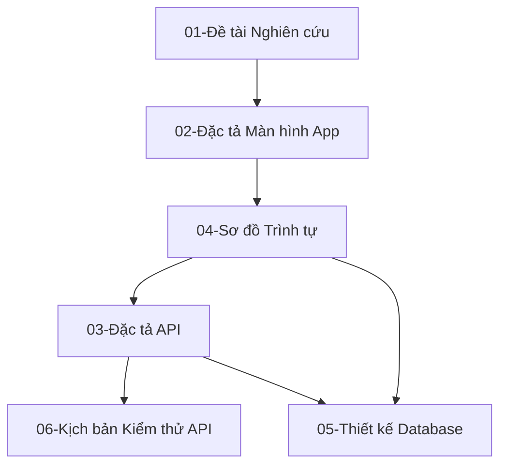
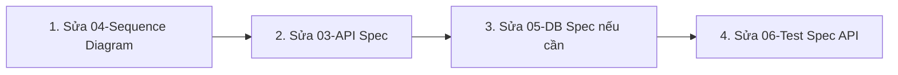
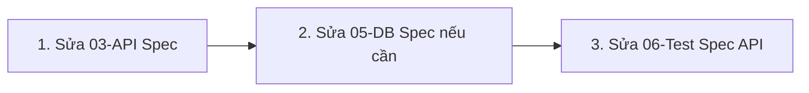
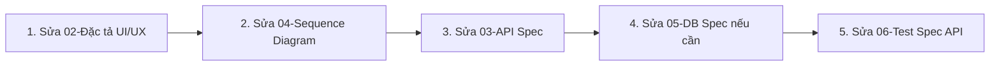

# Tài liệu Hướng dẫn Quản lý và Đồng bộ Tài liệu Dự án

## 0. Tư tưởng nền tảng: Spec Driven Development (SDD)

Dự án này được xây dựng theo tư tưởng **Spec Driven Development (Phát triển hướng theo Đặc tả)** — một mô hình làm việc trong đó **đặc tả (specification)** đóng vai trò là nguồn chân lý duy nhất (_single source of truth_) của toàn bộ hệ thống, thay vì code.

Nguyên lý cốt lõi:

- **Đặc tả đi trước, code theo sau.** Mọi thay đổi về nghiệp vụ, luồng xử lý, API hay cấu trúc dữ liệu đều phải được phản ánh trong tài liệu đặc tả _trước khi_ có bất kỳ dòng code nào được viết hoặc chỉnh sửa.
- **Con người thiết kế, AI hiện thực hóa.** Trong dự án này, con người tập trung tư duy và biên soạn tài liệu thiết kế hệ thống (nghiệp vụ, UI/UX, luồng xử lý, API, database, test case), còn AI đảm nhiệm việc chuyển hóa các đặc tả đó thành code. Nhờ vậy, chất lượng và tính đúng đắn của sản phẩm phụ thuộc trực tiếp vào chất lượng của tài liệu đặc tả, chứ không phụ thuộc vào việc "đoán ý" từ code có sẵn.
- **Tài liệu là hợp đồng, không phải diễn giải sau sự việc.** Các tệp trong `docs/` không phải là tài liệu mô tả lại code đã viết, mà là bản thiết kế được thống nhất trước, dùng làm căn cứ để AI sinh code, để kiểm thử, và để review.
- **Tính nhất quán hai chiều.** Khi phát hiện sai lệch giữa code và đặc tả, ưu tiên coi đặc tả là đúng và cập nhật code cho khớp; nếu đặc tả thực sự lỗi thời hoặc sai sót nghiệp vụ, phải sửa đặc tả trước, sau đó mới đồng bộ lại code — không bao giờ để code "âm thầm" đi lệch khỏi tài liệu.
- **Truy vết được (traceability).** Vì các tài liệu có quan hệ phụ thuộc rõ ràng (xem sơ đồ ở mục 2), một thay đổi ở tầng nghiệp vụ hoặc UI có thể được truy ngược/xuôi để biết nó ảnh hưởng đến những API, bảng dữ liệu và test case nào.

Phần còn lại của tài liệu này mô tả cụ thể vai trò của từng tệp đặc tả và quy trình cập nhật chuẩn khi có thay đổi.

---

Tài liệu này giải thích vai trò của các tệp tài liệu trong thư mục `docs/`, mối quan hệ phụ thuộc giữa chúng, và quy trình chuẩn để cập nhật tài liệu khi có thay đổi ở tầng API hoặc tầng Mobile.

---

## 1. Danh sách và Chức năng của các Tài liệu chính

Hệ thống tài liệu thiết kế được chia làm 6 tệp cốt lõi được đánh số thứ tự từ `01` đến `06`:

1.  **[01-de-tai-nghien-cuu-canh-bao-dong-vat.md](./01-de-tai-nghien-cuu-canh-bao-dong-vat.md):**
    - _Chức năng:_ Báo cáo nghiên cứu khoa học tổng quan. Định hình đề tài, bài toán nghiệp vụ, cơ chế phần cứng IoT (LED, loa, hàng rào điện) và nguyên lý xua đuổi/cảnh báo động vật.
2.  **[02-dac-ta-man-hinh-android-app.md](./02-dac-ta-man-hinh-android-app.md):**
    - _Chức năng:_ Đặc tả chi tiết giao diện người dùng (UI) và các luồng hành vi (UX) của ứng dụng Android (nút bấm, input text, trạng thái hiển thị).
3.  **[03-mobile_api.md](./03-mobile_api.md):**
    - _Chức năng:_ Đặc tả danh sách REST API kết nối giữa Mobile Client và Mobile Server (Request, Response, các ràng buộc dữ liệu đầu vào và các mã lỗi trả về).
4.  **[04-sequence-diagram.md](./04-sequence-diagram.md):**
    - _Chức năng:_ Đặc tả chi tiết về **luồng xử lý (process & data flow) của toàn bộ hệ thống**. Sử dụng các sơ đồ trình tự tương tác (Sequence Diagrams bằng Mermaid) để định hình dòng chảy dữ liệu đồng bộ thời gian thực giữa các phân hệ con (Mobile Client, Mobile Server, AI Server, Thiết bị Camera/Dự phòng vật lý, Database, FCM Push Notification và SMS Gateway).
5.  **[05-database.md](./05-database.md):**
    - _Chức năng:_ Thiết kế cấu trúc cơ sở dữ liệu chi tiết (các bảng, các cột, kiểu dữ liệu, mối quan hệ khóa ngoại và quy trình CRUD tương ứng).
6.  **[06-test-mobile-api.md](./06-test-mobile-api.md):**
    - _Chức năng:_ Kịch bản kiểm thử tích hợp API (REST API Test Cases) định nghĩa rõ mã testcase, request body gửi đi và response mong đợi của từng trường hợp thành công/thất bại.

---

## 2. Sự phụ thuộc giữa các Tài liệu (Dependency Matrix)

Các tài liệu có mối liên kết chặt chẽ và phụ thuộc lẫn nhau theo sơ đồ dưới đây:

- **Tài liệu [01]** là gốc của mọi nghiệp vụ.
- **Tài liệu [02]** (UI) định hình cách hiển thị và hành vi của ứng dụng di động.
- **Tài liệu [04]** (Sơ đồ trình tự) là đặc tả luồng xử lý của toàn bộ hệ thống để hiện thực hóa các tương tác từ màn hình [02].
- **Tài liệu [03]** (API) định nghĩa chi tiết cấu trúc truyền nhận dữ liệu (Request/Response) để đáp ứng các bước vận hành đã định hình trong luồng hệ thống [04].
- **Tài liệu [05]** (DB) được sinh ra từ đặc tả API ([03]) và luồng xử lý toàn hệ thống ([04]) để lưu trữ thông tin bền vững.
- **Tài liệu [06]** (Test Spec) phụ thuộc trực tiếp vào đặc tả API ([03]) để kiểm tra tính đúng đắn của các Endpoint.

---

## 3. Quy trình cập nhật tài liệu khi có thay đổi

### Kịch bản A: Nếu phát hiện lỗi hoặc có cập nhật ở tầng API

Trước tiên cần xác định phạm vi ảnh hưởng của thay đổi: **thay đổi này có làm biến đổi trình tự tương tác giữa các phân hệ (Mobile Client, Mobile Server, AI Server, Database, FCM, SMS Gateway...) hay không?** Câu trả lời sẽ quyết định đi theo nhánh A1 hay A2 dưới đây.

#### Nhánh A1: Thay đổi API có ảnh hưởng đến luồng xử lý hệ thống

Áp dụng khi thay đổi kéo theo bước gọi mới, đổi thứ tự tương tác, hoặc thêm/bớt một phân hệ tham gia vào luồng.

1.  **Bước 1: Cập nhật [04-sequence-diagram.md](./04-sequence-diagram.md)** để sửa đổi luồng xử lý hoặc trình tự tương tác toàn hệ thống liên quan.
2.  **Bước 2: Cập nhật [03-mobile_api.md](./03-mobile_api.md)** để sửa/thêm chi tiết cấu trúc trường dữ liệu, mã lỗi của Endpoint API.
3.  **Bước 3: Cập nhật [05-database.md](./05-database.md)** (nếu thay đổi API và luồng xử lý yêu cầu thay đổi cấu trúc bảng/cột CSDL).
4.  **Bước 4: Cập nhật [06-test-mobile-api.md](./06-test-mobile-api.md)** để bổ sung/sửa đổi testcase kiểm thử tự động tương ứng với đặc tả mới.

#### Nhánh A2: Thay đổi API cục bộ, không ảnh hưởng đến luồng xử lý hệ thống

Áp dụng khi thay đổi chỉ nằm trong nội dung đặc tả API (sai kiểu dữ liệu của field, thiếu mã lỗi, sai validation rule...) mà không làm thay đổi trình tự tương tác giữa các phân hệ. Trong trường hợp này **không cần** sửa lại [04-sequence-diagram.md](./04-sequence-diagram.md), vì bản thân trình tự tương tác vẫn giữ nguyên.

1.  **Bước 1: Cập nhật [03-mobile_api.md](./03-mobile_api.md)** để sửa/thêm chi tiết cấu trúc trường dữ liệu, mã lỗi của Endpoint API.
2.  **Bước 2: Cập nhật [05-database.md](./05-database.md)** (nếu thay đổi cấu trúc field/dữ liệu API yêu cầu thay đổi cấu trúc bảng/cột CSDL).
3.  **Bước 3: Cập nhật [06-test-mobile-api.md](./06-test-mobile-api.md)** để bổ sung/sửa đổi testcase kiểm thử tự động tương ứng với đặc tả mới.

> **Lưu ý:** Nếu trong quá trình sửa 03 phát hiện ra rằng thay đổi thực chất có kéo theo ảnh hưởng đến trình tự tương tác (ví dụ phải gọi thêm một service khác), cần quay lại áp dụng Nhánh A1 thay vì tiếp tục theo A2.

---

### Kịch bản B: Nếu phát hiện lỗi hoặc có cập nhật ở tầng Mobile (Frontend/UI)

Khi ứng dụng di động thay đổi, trình tự cập nhật tài liệu diễn ra như sau:

1.  **Bước 1: Cập nhật [02-dac-ta-man-hinh-android-app.md](./02-dac-ta-man-hinh-android-app.md)** để định nghĩa lại các component UI và hành vi màn hình mới.
2.  **Bước 2: Cập nhật [04-sequence-diagram.md](./04-sequence-diagram.md)** để mô tả luồng tương tác xử lý toàn hệ thống cho tính năng/giao diện mới đó.
3.  **Bước 3: Cập nhật [03-mobile_api.md](./03-mobile_api.md)** để thiết kế API truyền nhận dữ liệu tương ứng.
4.  **Bước 4: Cập nhật [05-database.md](./05-database.md)** (nếu cần thay đổi DB để hỗ trợ API & Sequence mới).
5.  **Bước 5: Cập nhật [06-test-mobile-api.md](./06-test-mobile-api.md)** để đồng bộ testcase kiểm thử tự động tương ứng cho API mới.
