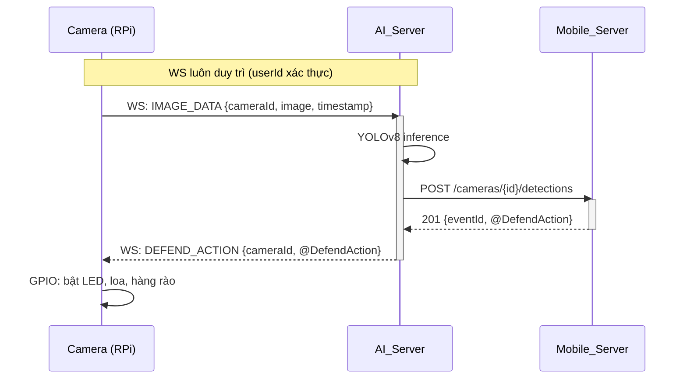

# Giao thức WebSocket giữa Camera (RPi) và AI_Server

> Tài liệu này mô tả giao thức WebSocket chuẩn cho kết nối giữa **Camera** (Raspberry Pi - client) và **AI_Server** (server Python).
>
> Cả hai module đều viết bằng Python. Yêu cầu thư viện: `websockets >= 13.0`.

---

## 1. Tổng quan

```
Camera (RPi)  ── WS ──▶  AI_Server
     ↑                     │
     └───────── WS ◀───────┘
```

| Hướng | Giao thức | Bên chủ động |
|-------|-----------|--------------|
| Camera → AI_Server | Gửi ảnh, heartbeat, trạng thái thiết bị | **Camera** kết nối WebSocket đến AI_Server |
| AI_Server → Camera | Gửi lệnh phòng vệ, lệnh test, cấu hình | **AI_Server** gửi qua kết nối có sẵn |

---

## 2. Kết nối

```
ws://<AI_SERVER_HOST>:5000/camera/ws?userId={userId}
```

- **Camera** là bên chủ động mở kết nối WebSocket
- **`userId`**: mã hex 4 ký tự của người quản lý trạm (vd: `u_rg`), dùng để xác thực thiết bị. `userId` này đồng thời được AI_Server dùng để giao tiếp với Mobile_Server
- Auto-reconnect với exponential backoff nếu mất kết nối

---

## 3. Định dạng bản tin

Tất cả bản tin đều là **JSON** với cấu trúc:

```json
{
  "event": "TÊN_EVENT",
  "payload": { ... }
}
```

> `cameraId` không nằm trong URL kết nối, mà được truyền trong **payload của từng request** để định danh trạm camera cụ thể.

---

## 4. Bản tin Uplink (Camera → AI_Server)

### 4.1. Gửi ảnh khi phát hiện chuyển động

```json
{
  "event": "IMAGE_DATA",
  "payload": {
    "cameraId": "cam-001",
    "imageBase64": "<base64 của ảnh JPEG>",
    "timestamp": "2026-07-25T14:30:00Z",
    "motionScore": 0.85
  }
}
```

### 4.2. Heartbeat (mỗi 30 giây)

```json
{
  "event": "DEVICE_HEARTBEAT",
  "payload": {
    "cameraId": "cam-001",
    "cpuTemp": 52.3,
    "uptime": 3600
  }
}
```

### 4.3. Báo cáo trạng thái thiết bị vật lý

```json
{
  "event": "DEVICE_STATUS",
  "payload": {
    "cameraId": "cam-001",
    "deviceKey": "speaker",
    "status": "ON",
    "errorMsg": null
  }
}
```

---

## 5. Bản tin Downlink (AI_Server → Camera)

### 5.1. Lệnh phòng vệ (sau khi phân tích ảnh)

```json
{
  "event": "DEFEND_ACTION",
  "payload": {
    "cameraId": "cam-001",
    "actionId": "act-123",
    "ledFlash": true,
    "ledColor": "STROBE",
    "speakerWarn": true,
    "audioSampleId": "A_gunshot",
    "audioIntensity": 80
  }
}
```

### 5.2. Lệnh test thiết bị

```json
{
  "event": "DEVICE_COMMAND",
  "payload": {
    "cameraId": "cam-001",
    "commandId": "cmd-456",
    "deviceKey": "speaker",
    "action": "TEST",
    "params": {
      "durationSeconds": 5,
      "sampleId": "A_gunshot"
    }
  }
}
```

### 5.3. Cập nhật cấu hình

```json
{
  "event": "CONFIG_UPDATE",
  "payload": {
    "cameraId": "cam-001",
    "ledColor": "RED",
    "audioSampleId": "A_growl",
    "fenceLevel": "medium"
  }
}
```

---

## 6. Code mẫu Python

### 6.1. AI_Server (server)

```py
import asyncio
import base64
import json
from urllib.parse import urlsplit, parse_qs

from websockets.asyncio.server import serve


# Danh sách userId hợp lệ. Trong thực tế, nên lấy từ cấu hình hoặc DB.
VALID_USER_IDS = {"u_rg", "u_abc", "u_xyz"}


async def handle_camera(websocket):
    # Lấy userId từ query string
    query = urlsplit(websocket.request.path).query
    params = parse_qs(query)
    user_id = params.get("userId", [None])[0]

    if not user_id or user_id not in VALID_USER_IDS:
        await websocket.close(code=4001, reason="Unauthorized")
        return

    print(f"[AI_Server] Camera của user {user_id} đã kết nối")

    async for message in websocket:
        try:
            data = json.loads(message)
        except json.JSONDecodeError:
            print("[AI_Server] Message không phải JSON hợp lệ, bỏ qua")
            continue

        event = data.get("event")
        payload = data.get("payload", {})
        camera_id = payload.get("cameraId")  # cameraId lấy từ payload

        if event == "IMAGE_DATA":
            img_bytes = base64.b64decode(payload["imageBase64"])
            print(
                f"[AI_Server] Nhận ảnh từ camera {camera_id} (user {user_id}), "
                f"{len(img_bytes)} bytes, timestamp={payload['timestamp']}"
            )

            # TODO: Chạy YOLOv8 inference ở đây
            # result = run_yolo_inference(img_bytes)
            #
            # Gửi kết quả lên Mobile_Server bằng HTTP POST (dùng userId để xác thực):
            #   POST https://mobile-server.com/api/v1/cameras/{camera_id}/detections
            #   Body: {"detections": [...], "imageUrl": "...", "detectedAt": "..."}
            #
            # Nhận @DefendAction từ Mobile_Server, rồi gửi xuống Camera:

            await websocket.send(json.dumps({
                "event": "DEFEND_ACTION",
                "payload": {
                    "cameraId": camera_id,
                    "actionId": "act-123",
                    "ledFlash": True,
                    "speakerWarn": True
                }
            }))

        elif event == "DEVICE_HEARTBEAT":
            print(f"[AI_Server] Heartbeat từ camera {camera_id}: CPU {payload['cpuTemp']}°C")

        elif event == "DEVICE_STATUS":
            print(f"[AI_Server] Trạng thái {payload['deviceKey']} = {payload['status']} (camera {camera_id})")


async def main():
    async with serve(handle_camera, "0.0.0.0", 5000):
        print("[AI_Server] WebSocket server đang chạy trên ws://0.0.0.0:5000")
        await asyncio.Future()


if __name__ == "__main__":
    asyncio.run(main())
```

### 6.2. Camera (Raspberry Pi - client)

```py
import asyncio
import base64
import json
from datetime import datetime, timezone
from urllib.parse import urlencode

from websockets.asyncio.client import connect
from websockets.exceptions import ConnectionClosed

USER_ID = "u_rg"               # mã hex 4 ký tự của người quản lý
CAMERA_ID = "cam-001"          # định danh trạm camera
AI_SERVER_HOST = "192.168.1.100"

CAPTURE_INTERVAL_SEC = 2        # chụp ảnh khi có chuyển động, tối đa mỗi 2s/lần
HEARTBEAT_INTERVAL_SEC = 30     # heartbeat mỗi 30s

_query = urlencode({"userId": USER_ID})
WS_URL = f"ws://{AI_SERVER_HOST}:5000/camera/ws?{_query}"


async def capture_image() -> str:
    """Giả lập chụp ảnh từ camera, trả về base64 của ảnh JPEG."""
    # TODO: Dùng picamera2 / opencv để chụp ảnh thực tế
    fake_image_bytes = b"fake-jpeg-bytes"
    return base64.b64encode(fake_image_bytes).decode("utf-8")


async def detect_motion() -> bool:
    """Giả lập phát hiện chuyển động."""
    # TODO: Dùng PIR sensor hoặc frame diff
    return True


async def control_gpio(action: dict):
    """Điều khiển thiết bị vật lý qua GPIO."""
    print(f"[Camera] GPIO: {json.dumps(action, indent=2)}")
    # TODO: Bật/tắt LED (GPIO), phát loa, điều khiển hàng rào điện


def now_iso() -> str:
    return datetime.now(timezone.utc).strftime("%Y-%m-%dT%H:%M:%SZ")


async def uplink_loop(ws):
    """Vòng lặp chụp ảnh (throttle theo CAPTURE_INTERVAL_SEC) + heartbeat."""
    elapsed_since_capture = CAPTURE_INTERVAL_SEC   # cho phép chụp ngay lần đầu
    elapsed_since_heartbeat = 0

    while True:
        if await detect_motion() and elapsed_since_capture >= CAPTURE_INTERVAL_SEC:
            image_b64 = await capture_image()
            await ws.send(json.dumps({
                "event": "IMAGE_DATA",
                "payload": {
                    "cameraId": CAMERA_ID,
                    "imageBase64": image_b64,
                    "timestamp": now_iso(),
                    "motionScore": 0.85
                }
            }))
            print("[Camera] Đã gửi ảnh lên AI_Server")
            elapsed_since_capture = 0

        if elapsed_since_heartbeat >= HEARTBEAT_INTERVAL_SEC:
            await ws.send(json.dumps({
                "event": "DEVICE_HEARTBEAT",
                "payload": {
                    "cameraId": CAMERA_ID,
                    "cpuTemp": 52.3,
                    "uptime": 3600
                }
            }))
            elapsed_since_heartbeat = 0

        await asyncio.sleep(1)
        elapsed_since_capture += 1
        elapsed_since_heartbeat += 1


async def downlink_loop(ws):
    """Lắng nghe lệnh từ AI_Server."""
    async for message in ws:
        try:
            data = json.loads(message)
        except json.JSONDecodeError:
            print("[Camera] Message không phải JSON hợp lệ, bỏ qua")
            continue

        event = data.get("event")

        if event == "DEFEND_ACTION":
            await control_gpio(data["payload"])

        elif event == "DEVICE_COMMAND":
            print(f"[Camera] Nhận lệnh: {data['payload']['action']}")
            await control_gpio(data["payload"])


async def connect_and_serve():
    backoff = 3
    while True:
        try:
            async with connect(WS_URL) as ws:
                print(f"[Camera] Đã kết nối AI_Server (user={USER_ID})")
                backoff = 3   # reset backoff sau khi kết nối thành công

                async with asyncio.TaskGroup() as tg:
                    tg.create_task(uplink_loop(ws))
                    tg.create_task(downlink_loop(ws))

        except* (ConnectionClosed, OSError) as eg:
            print(f"[Camera] Mất kết nối: {eg.exceptions}. Reconnect sau {backoff} giây...")
            await asyncio.sleep(backoff)
            backoff = min(backoff * 2, 60)   # exponential backoff, tối đa 60s


if __name__ == "__main__":
    asyncio.run(connect_and_serve())
```

> **Ghi chú tương thích:** `asyncio.TaskGroup` và cú pháp `except*` yêu cầu **Python 3.11+**. Nếu chạy trên Raspberry Pi với Python cũ hơn, thay bằng `asyncio.gather(uplink_loop(ws), downlink_loop(ws))` kết hợp tự `cancel()` task còn lại trong khối `except`, và dùng `except (ConnectionClosed, OSError) as e:` thông thường.

---

## 7. Giao tiếp AI_Server ↔ Mobile_Server

AI_Server dùng **`userId`** (nhận từ query string kết nối của Camera) để giao tiếp với Mobile_Server qua 2 kênh:

### 7.1. Webhook HTTP (gửi kết quả nhận diện)

```
POST https://wildlife-warning-and-deterrence-sys.vercel.app/api/v1/cameras/{cameraId}/detections
```

```json
{
  "detections": [
    { "speciesId": "elephant", "confidence": 0.92 }
  ],
  "imageUrl": "https://cdn.example.com/snapshots/cam-001_20260725_143000.jpg",
  "detectedAt": "2026-07-25T14:30:00Z"
}
```

- Endpoint này **không cần JWT**, là webhook mở dành riêng cho AI_Server
- Phản hồi chứa `eventId` và `responseAction` (`@DefendAction`) để gửi xuống Camera

### 7.2. WebSocket song công (nhận lệnh điều khiển)

```
wss://wildlife-warning-and-deterrence-sys.vercel.app/ws?userId={userId}
```

- AI_Server chủ động kết nối và duy trì WebSocket đến Mobile_Server, dùng `userId` để định danh
- Khi Mobile App gửi lệnh test thiết bị, Mobile_Server đẩy xuống AI_Server qua WS này dưới dạng `DEVICE_COMMAND`
- AI_Server nhận được, chuyển tiếp xuống Camera qua WS `DEVICE_COMMAND` (mục 5.2)
- Sau khi Camera thực thi xong, AI_Server gửi `COMMAND_ACK` qua WS lên Mobile_Server

> **Chi tiết:** Xem [03-mobile_api.md](./03-mobile_api.md#13a2-ws-ws) và [04-sequence-diagram.md](./04-sequence-diagram.md#ii-thiết-b-camera--ai-server).

---

## 8. Flow tổng thể



---

## 9. Ghi chú

- Port mặc định: **5000** (có thể cấu hình qua biến môi trường `WS_PORT`)
- Camera chụp ảnh tần suất **2 giây/lần** (khi có chuyển động) — được throttle đúng trong `uplink_loop`
- Heartbeat gửi mỗi **30 giây**
- Timeout chờ response: **5 giây**
- Auto-reconnect: **3 giây** (tăng dần theo exponential backoff: 3s → 6s → 12s → max 60s)
- `cameraId` được truyền trong payload của từng bản tin, **không nằm trong URL kết nối**
- Yêu cầu `websockets >= 13.0`; nếu dùng bản cũ hơn cần thay `websocket.request.path` bằng `websocket.path`
- Tham khảo thêm: [ai_server_plan.md](./ai_server_plan.md), [04-sequence-diagram.md](./04-sequence-diagram.md)
