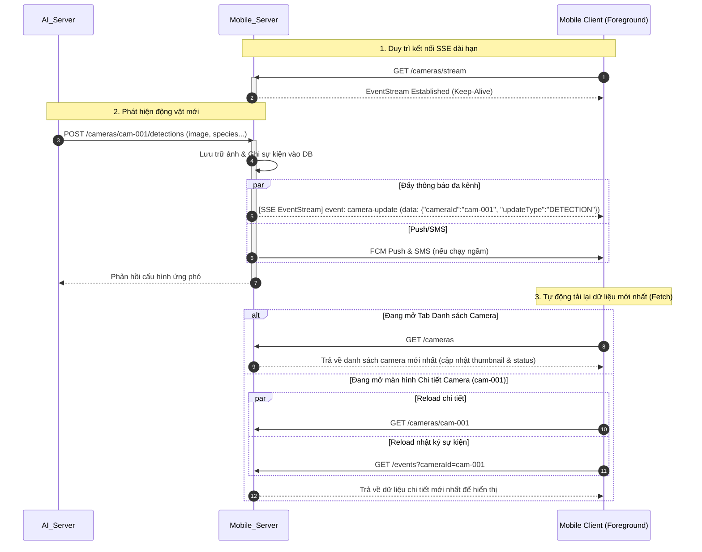

# Tài liệu hướng dẫn: Cơ chế Cập nhật Thời gian thực qua Server-Sent Events (SSE)

Hệ thống Cảnh báo và Phòng vệ Động vật Hoang dã sử dụng kết nối **Server-Sent Events (SSE)** làm kênh đẩy thông báo cập nhật thời gian thực từ phía server về ứng dụng di động Android (Mobile Client) khi ứng dụng đang chạy nổi trên màn hình (foreground).

Cơ chế này hoạt động theo mô hình **"Ping-to-Fetch" (Thông báo để tải lại)** nhằm đảm bảo tốc độ phản hồi nhanh nhất mà vẫn tối ưu băng thông di động và hiệu suất của hệ thống.

---

## 1. Mô hình hoạt động "Ping-to-Fetch"

Thay vì server phải đóng gói toàn bộ dữ liệu phức tạp (như toàn bộ thông tin camera, link ảnh snapshot mới, danh sách nhật ký...) rồi gửi qua SSE, server chỉ gửi một **thông báo ping siêu nhẹ** chứa thông tin định danh và phân loại cập nhật.

### Quy trình hoạt động:



---

## 2. Đặc tả Gói tin SSE (Data Format)

*   **Endpoint:** `GET /cameras/stream`
*   **Content-Type:** `text/event-stream`
*   **Event Name:** `camera-update`
*   **Payload (JSON):**
    ```json
    {
      "cameraId": "cam-001",
      "updateType": "DETECTION",
      "timestamp": "2026-07-19T04:55:00+07:00"
    }
    ```

### Các giá trị của `updateType`:
1.  `DETECTION`: Có sự kiện phát hiện động vật hoang dã mới (AI vừa nhận dạng xong).
2.  `SNAPSHOT`: Camera vừa tải lên hình ảnh thực địa mới.
3.  `STATUS`: Trạng thái kết nối của trạm camera vừa thay đổi (ONLINE $\leftrightarrow$ OFFLINE).

---

## 3. Tại sao chọn "Ping-to-Fetch" thay vì truyền dữ liệu trực tiếp?

1.  **Tiết kiệm băng thông di động cực hạn:** Thiết bị di động của lực lượng tuần tra và hộ dân thường sử dụng mạng 3G/4G chập chờn. Bản tin ping của SSE chỉ nặng khoảng 100 bytes, giúp tiết kiệm data tối đa so với việc gửi payload dữ liệu cồng kềnh.
2.  **Tránh trùng lặp logic xử lý:** Server không cần chạy lại các luồng logic phức tạp (serialize thông tin camera, tạo link CDN tạm thời cho ảnh...) ngay trên thread của SSE. Client sẽ chủ động kéo dữ liệu qua các API REST chuẩn vốn đã được tối ưu hóa và cấu hình bộ nhớ đệm (Caching).
3.  **Tăng tính ổn định:** SSE là giao thức đơn hướng (unidirectional) từ Server về Client, rất phù hợp cho việc phát thông báo. Mọi hành vi tương tác hai chiều hoặc lệnh điều khiển vật lý (Override/Test) được đảm nhiệm bởi kết nối **WebSocket** chuyên dụng.
