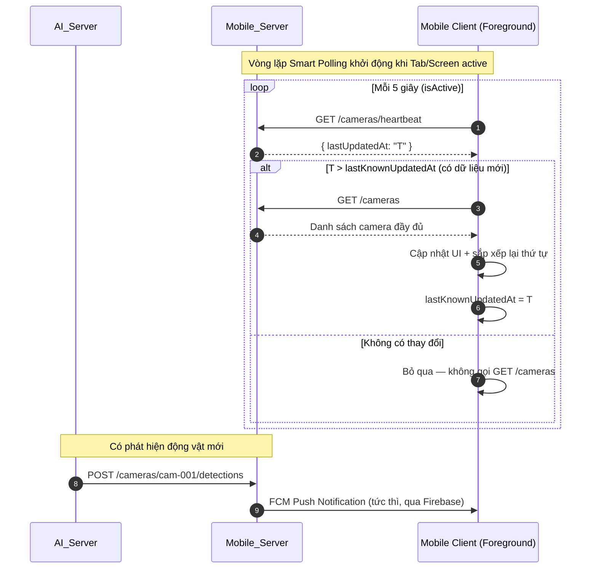

# Tài liệu hướng dẫn: Cơ chế Cập nhật Thời gian thực qua Auto-Polling

> **[CẬP NHẬT v2.0]** Hệ thống đã chuyển từ cơ chế **Server-Sent Events (SSE)** sang **Auto-Polling định kỳ** để tương thích với nền tảng triển khai Vercel (serverless), vốn không hỗ trợ kết nối HTTP long-lived.

Ứng dụng di động Android tự động gọi lại các API REST theo chu kỳ **5 giây** khi đang chạy nổi trên màn hình (foreground) để đảm bảo dữ liệu camera luôn được cập nhật gần như thời gian thực.

---

## 1. Mô hình hoạt động Auto-Polling

Thay vì duy trì một kết nối HTTP dài hạn (SSE), ứng dụng khởi động một vòng lặp coroutine (`while(isActive)`) chạy ngầm trong `viewModelScope`. Sau mỗi 5 giây, vòng lặp tự động gọi `GET /cameras` để lấy dữ liệu mới nhất.

### Quy trình hoạt động (Smart Polling):


```mermaid
sequenceDiagram
    autonumber
    participant AI_Server as AI_Server
    participant Mobile_Server as Mobile_Server
    participant Mobile as Mobile Client (Foreground)

    Note over Mobile, Mobile_Server: Vòng lặp Smart Polling khởi động khi Tab/Screen active
    loop Mỗi 5 giây (isActive)
        Mobile->>Mobile_Server: GET /cameras/heartbeat
        Mobile_Server-->>Mobile: { lastUpdatedAt: "T" }
        alt T > lastKnownUpdatedAt (có dữ liệu mới)
            Mobile->>Mobile_Server: GET /cameras
            Mobile_Server-->>Mobile: Danh sách camera đầy đủ
            Mobile->>Mobile: Cập nhật UI + sắp xếp lại thứ tự
            Mobile->>Mobile: lastKnownUpdatedAt = T
        else Không có thay đổi
            Mobile->>Mobile: Bỏ qua — không gọi GET /cameras
        end
    end

    Note over AI_Server, Mobile_Server: Có phát hiện động vật mới
    AI_Server->>Mobile_Server: POST /cameras/cam-001/detections
    Mobile_Server->>Mobile: FCM Push Notification (tức thì, qua Firebase)
```

---

## 2. Chi tiết triển khai (Implementation)

### Trong `CameraListViewModel.kt`

```kotlin
private var pollingJob: Job? = null

fun startPolling(intervalMs: Long = 5000L) {
    pollingJob?.cancel()
    pollingJob = viewModelScope.launch {
        while (isActive) {
            loadCameras(isSilent = true)
            delay(intervalMs)
        }
    }
}

fun stopPolling() {
    pollingJob?.cancel()
    pollingJob = null
}
```

Polling được khởi động trong `DisposableEffect(Unit)` tại `CameraListTab.kt` và tự động dừng khi người dùng rời khỏi màn hình (onDispose).

---

## 3. Kênh thông báo Push (FCM)

Khi ứng dụng chạy ở foreground hoặc background, **Firebase Cloud Messaging (FCM)** đảm nhiệm việc gửi thông báo tức thì khi có phát hiện động vật. FCM và Polling là hai cơ chế độc lập và bổ sung cho nhau:

| Cơ chế | Mục đích | Độ trễ |
|--------|----------|--------|
| **Auto-Polling** | Cập nhật ảnh & thứ tự danh sách camera | ≤ 5 giây |
| **FCM Push** | Hiển thị popup thông báo cảnh báo ngay lập tức | < 1 giây |

---

## 4. Lý do chuyển từ SSE sang Polling

1.  **Không tương thích với Vercel Serverless:** Vercel chạy các hàm serverless (Function as a Service) — mỗi request được xử lý bởi một instance độc lập, không thể duy trì kết nối HTTP dài hạn. Endpoint `/cameras/stream` (SSE) trả về lỗi `Cannot GET` trên môi trường Vercel.
2.  **Đơn giản & Ổn định hơn:** Polling không yêu cầu logic reconnect phức tạp, không bị ảnh hưởng bởi các proxy/load-balancer cắt kết nối, và dễ debug.
3.  **Tải server đồng đều:** Mỗi request polling là một REST call bình thường, được hưởng đầy đủ lợi ích của HTTP caching và CDN.
