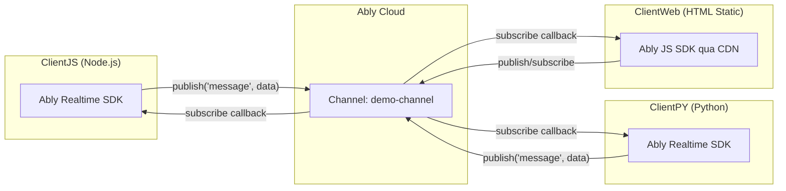
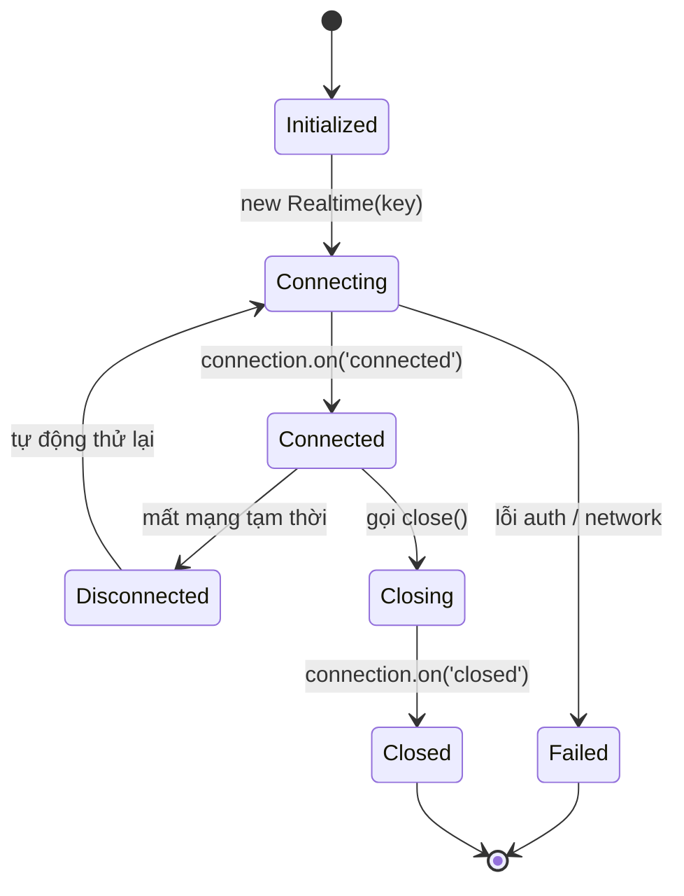
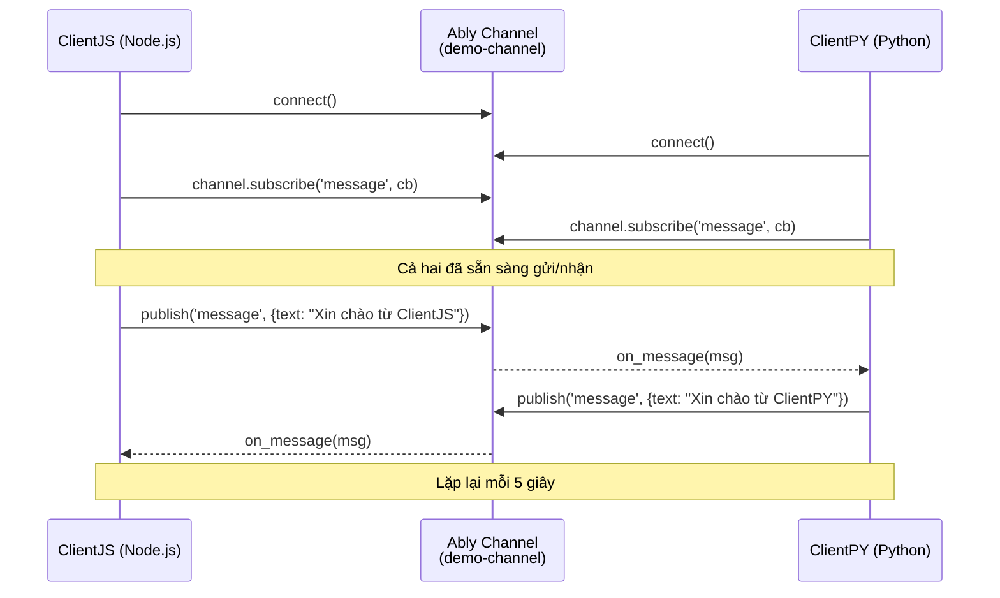
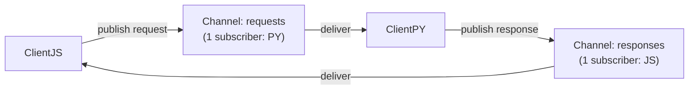
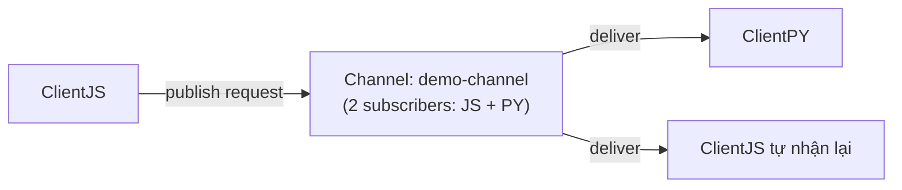
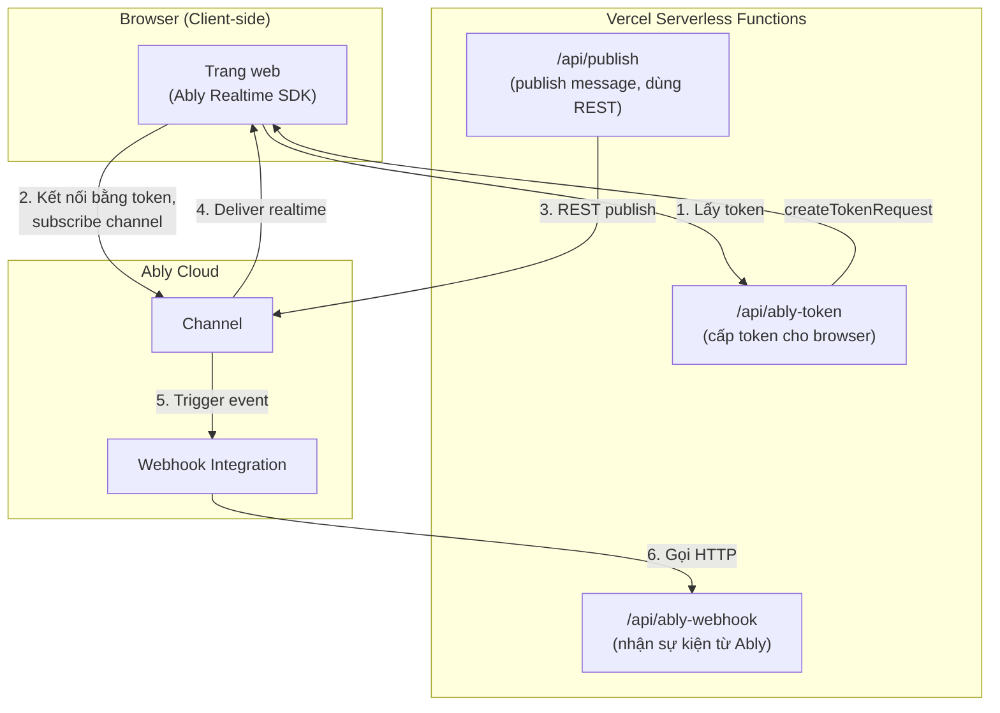
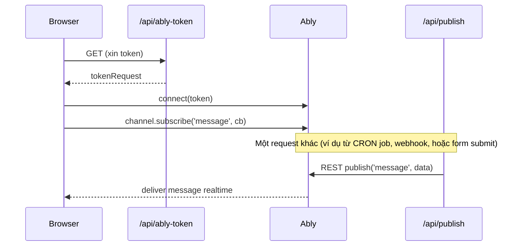
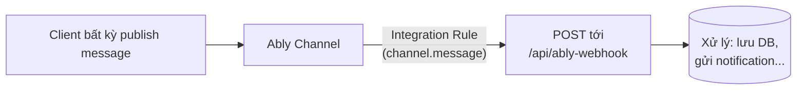
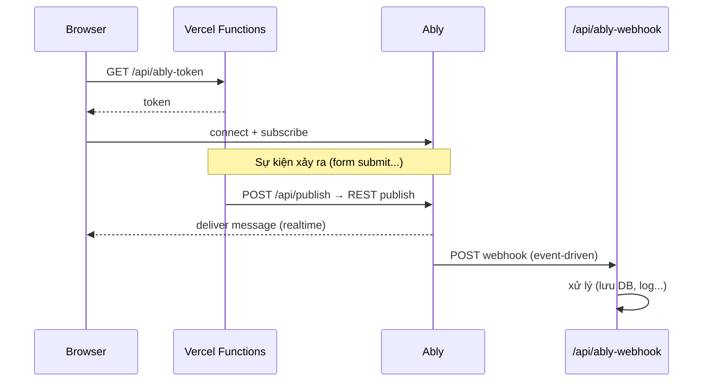

# Hướng dẫn tích hợp Ably: Giao tiếp giữa ClientJS (Node.js), ClientPY (Python) và ClientWeb (HTTP Static)

Tài liệu này hướng dẫn thiết lập các client — Node.js (`ClientJS`), Python (`ClientPY`), và trang HTML tĩnh chạy trên trình duyệt (`ClientWeb`) — để giao tiếp real-time với nhau qua Ably Pub/Sub (gói Free).

---

## 0. Kiến trúc tổng quan



ClientJS, ClientPY, ClientWeb không kết nối trực tiếp với nhau — tất cả đều mở kết nối riêng tới Ably, cùng attach vào một channel chung (`demo-channel`), và Ably chịu trách nhiệm định tuyến message giữa các subscriber.

---

## 1. Chuẩn bị trên Ably Dashboard

### 1.1. Tạo tài khoản & App

1. Đăng ký tài khoản tại https://ably.com (không cần thẻ tín dụng cho gói Free).
2. Sau khi đăng nhập, tạo một **App** mới (ví dụ: `demo-clientjs-clientpy`).

### 1.2. Tạo API Key

Vào tab **API Keys** trong app vừa tạo. Ably tự tạo sẵn 1 root key, nhưng bạn nên tạo key riêng với quyền hạn (capabilities) rõ ràng:

- **Capabilities cần có:** `publish`, `subscribe` (thêm `presence`, `history` nếu muốn thử các tính năng nâng cao sau này).
- **Channel:** có thể giới hạn theo tên channel cụ thể (ví dụ `demo:*`) hoặc để `*` cho tất cả channel trong app (phù hợp lúc demo/nghiên cứu).

Key có định dạng:

```
{app-id}.{key-id}:{key-secret}
```

Ví dụ: `abc123.DEF456:ghIjKlmNoPqrSTuv`

> **Lưu ý bảo mật:** Đây là "API key" đầy đủ, dùng được cho cả publish/subscribe. Trong môi trường thật (production), client-side (browser/app di động) không nên nhúng key này trực tiếp — nên dùng **Token Authentication**. Nhưng vì mục đích nghiên cứu/demo với 2 client backend (Node.js, Python) chạy phía server, dùng trực tiếp API key là chấp nhận được.

> **Riêng với ClientWeb (HTML Static):** API key sẽ nằm ngay trong mã nguồn JavaScript chạy trên trình duyệt — bất kỳ ai mở DevTools cũng xem được. Điều này **chỉ chấp nhận được cho mục đích phát triển tool nội bộ/demo cá nhân**, không public trang này ra internet. Nếu cần chia sẻ tool rộng rãi, hãy tạo key riêng cho Web với capability giới hạn (chỉ `publish`, `subscribe` trên đúng channel cần dùng, không dùng key gốc/root key) để giảm rủi ro nếu bị lộ.

### 1.3. Chuẩn bị thông tin cần thiết

Ghi lại các thông tin sau để dùng cho cả 2 client:

| Thông tin   | Ví dụ                            | Ghi chú                                                              |
| ----------- | -------------------------------- | -------------------------------------------------------------------- |
| API Key     | `abc123.DEF456:ghIjKlmNoPqrSTuv` | Dùng chung cho cả ClientJS và ClientPY                               |
| Tên Channel | `demo-channel`                   | Cả 2 client phải dùng cùng tên channel để "nói chuyện" được với nhau |
| Client ID   | `client-js`, `client-py`         | Tùy chọn nhưng nên đặt để phân biệt nguồn gửi tin nhắn               |
| Event name  | `message`                        | Tên "sự kiện" gắn với mỗi tin nhắn publish lên channel               |

---

## 2. Cấu hình Client

### 2.1. ClientJS (Node.js)

**Cài đặt SDK:**

```bash
mkdir client-js && cd client-js
npm init -y
npm install ably
```

**Cấu hình kết nối** (`client.js`):

```javascript
import Ably from "ably";

const ABLY_API_KEY = process.env.ABLY_API_KEY; // không hardcode key trong code
const CHANNEL_NAME = "demo-channel";

const realtime = new Ably.Realtime({
  key: ABLY_API_KEY,
  clientId: "client-js", // định danh client này khi publish
});
```

Khuyến nghị lưu key trong biến môi trường thay vì hardcode:

```bash
export ABLY_API_KEY="abc123.DEF456:ghIjKlmNoPqrSTuv"
```

### 2.2. ClientPY (Python)

**Cài đặt SDK:**

```bash
mkdir client-py && cd client-py
python -m venv venv
source venv/bin/activate   # Windows: venv\Scripts\activate
pip install ably
```

**Cấu hình kết nối** (`client.py`):

```python
import os
import asyncio
from ably import AblyRealtime

ABLY_API_KEY = os.environ["ABLY_API_KEY"]
CHANNEL_NAME = "demo-channel"
```

```bash
export ABLY_API_KEY="abc123.DEF456:ghIjKlmNoPqrSTuv"
```

> **Quan trọng:** `CHANNEL_NAME` phải **giống hệt nhau** ở cả 2 client — Ably định tuyến message theo tên channel, không phải theo ngôn ngữ hay SDK.

### 2.3. ClientWeb (HTTP Static — HTML/JS thuần, không cần build)

Phù hợp khi bạn muốn phát triển nhanh các **tool hỗ trợ** (dashboard debug, trang test publish/subscribe thủ công, công cụ giám sát...) mà không cần Node.js, npm hay bước build nào — chỉ cần mở file `.html` bằng trình duyệt hoặc serve qua HTTP static bất kỳ (Nginx, Python `http.server`, Live Server...).

**Không cần cài đặt gì** — nhúng SDK trực tiếp qua CDN trong file HTML:

```html
<!DOCTYPE html>
<html lang="vi">
  <head>
    <meta charset="UTF-8" />
    <title>ClientWeb - Ably Demo</title>
    <script src="https://cdn.ably.com/lib/ably.min-2.js"></script>
  </head>
  <body>
    <h1>ClientWeb</h1>
    <div id="log"></div>

    <script>
      const ABLY_API_KEY = "abc123.DEF456:ghIjKlmNoPqrSTuv"; // ⚠️ chỉ dùng cho demo/tool nội bộ
      const CHANNEL_NAME = "demo-channel";

      const realtime = new Ably.Realtime({
        key: ABLY_API_KEY,
        clientId: "client-web",
      });
    </script>
  </body>
</html>
```

> **Gợi ý cho tool nội bộ:** Có thể thay `ABLY_API_KEY` hardcode bằng ô input trên trang (cho phép người dùng tool tự dán key/channel của họ vào) — tiện khi bạn phát triển nhiều tool debug dùng chung 1 trang HTML nhưng test với các app Ably khác nhau.

Chạy thử nhanh, không cần server:

```bash
# Cách 1: mở trực tiếp file HTML bằng trình duyệt
open index.html    # macOS
start index.html    # Windows

# Cách 2: serve qua HTTP static (khuyến nghị hơn, tránh lỗi CORS/file://)
python -m http.server 8080
# rồi mở http://localhost:8080/index.html
```

---

## 3. Kết nối và đóng kết nối

### 3.0. Sơ đồ vòng đời kết nối (chung cho cả 2 client)



### 3.1. ClientJS — Kết nối

```javascript
const realtime = new Ably.Realtime({
  key: ABLY_API_KEY,
  clientId: "client-js",
});

realtime.connection.on("connected", () => {
  console.log("[ClientJS] Đã kết nối tới Ably");
});

realtime.connection.on("failed", (err) => {
  console.error("[ClientJS] Kết nối thất bại:", err);
});

// Hoặc chờ kết nối theo kiểu await
await realtime.connection.once("connected");
```

### 3.2. ClientJS — Đóng kết nối

```javascript
// Đóng kết nối chủ động khi không cần dùng nữa
realtime.close();

// Có thể lắng nghe sự kiện đóng để xác nhận
realtime.connection.on("closed", () => {
  console.log("[ClientJS] Kết nối đã đóng");
});
```

### 3.3. ClientPY — Kết nối

Ably Python SDK dùng `async with` (async context manager) để tự động quản lý vòng đời kết nối:

```python
async def main():
    async with AblyRealtime(ABLY_API_KEY, client_id="client-py") as realtime:
        await realtime.connection.once_async("connected")
        print("[ClientPY] Đã kết nối tới Ably")

        # ... logic publish/subscribe ở đây ...

        await asyncio.Event().wait()  # giữ chương trình chạy để tiếp tục nhận message
```

### 3.4. ClientPY — Đóng kết nối

Khi thoát khỏi khối `async with`, kết nối tự động đóng. Nếu cần đóng thủ công:

```python
await realtime.close()
```

### 3.5. ClientWeb — Kết nối

Giống hệt cú pháp ClientJS vì cùng dùng chung bộ SDK JavaScript (`ably-js`), chỉ khác cách nhúng (CDN thay vì `npm install`):

```javascript
const realtime = new Ably.Realtime({
  key: ABLY_API_KEY,
  clientId: "client-web",
});

realtime.connection.on("connected", () => {
  console.log("[ClientWeb] Đã kết nối tới Ably");
});

realtime.connection.on("failed", (err) => {
  console.error("[ClientWeb] Kết nối thất bại:", err);
});
```

### 3.6. ClientWeb — Đóng kết nối

```javascript
// Đóng khi người dùng rời trang, hoặc khi bấm nút "Disconnect" trên tool
window.addEventListener("beforeunload", () => {
  realtime.close();
});

// Hoặc đóng thủ công bằng nút bấm
document.getElementById("btn-disconnect").addEventListener("click", () => {
  realtime.close();
});
```

---

## 4. Push (Publish) và Receive (Subscribe) Message

### 4.0. Sơ đồ tuần tự Publish/Subscribe (2 chiều)



### 4.1. Nguyên lý chung

- Cả 2 client cùng "attach" (subscribe) vào một **channel** có tên giống nhau.
- Client nào `publish()` lên channel đó, tất cả client khác đang subscribe channel đó (kể cả chính client vừa publish, nếu tự subscribe) sẽ nhận được message gần như tức thời.
- Mỗi message có `event name` (tùy chọn) và `data` (nội dung — có thể là string, number, JSON object...).

### 4.2. ClientJS — Subscribe (nhận message)

```javascript
const channel = realtime.channels.get(CHANNEL_NAME);

await channel.subscribe("message", (msg) => {
  console.log(`[ClientJS] Nhận từ ${msg.clientId}:`, msg.data);
});
```

### 4.3. ClientJS — Publish (gửi message)

```javascript
await channel.publish("message", {
  text: "Xin chào từ ClientJS",
  timestamp: Date.now(),
});
```

### 4.4. ClientPY — Subscribe (nhận message)

```python
def on_message(message):
    print(f"[ClientPY] Nhận từ {message.client_id}: {message.data}")

channel = realtime.channels.get(CHANNEL_NAME)
await channel.subscribe("message", on_message)
```

### 4.5. ClientPY — Publish (gửi message)

```python
await channel.publish("message", {
    "text": "Xin chào từ ClientPY",
    "timestamp": time.time(),
})
```

### 4.6. ClientWeb — Subscribe (nhận message)

```javascript
const channel = realtime.channels.get(CHANNEL_NAME);

channel.subscribe("message", (msg) => {
  const line = `[ClientWeb] Nhận từ ${msg.clientId}: ${JSON.stringify(msg.data)}`;
  console.log(line);
  document.getElementById("log").innerHTML += `<p>${line}</p>`;
});
```

### 4.7. ClientWeb — Publish (gửi message)

```javascript
async function sendMessage(text) {
  await channel.publish("message", {
    text,
    timestamp: Date.now(),
  });
}

// Ví dụ gắn vào nút bấm trên tool
document.getElementById("btn-send").addEventListener("click", () => {
  sendMessage("Xin chào từ ClientWeb");
});
```

---

## 5. Code mẫu hoàn chỉnh

### 5.1. `client.js` (ClientJS — Node.js)

```javascript
import Ably from "ably";

const ABLY_API_KEY = process.env.ABLY_API_KEY;
const CHANNEL_NAME = "demo-channel";

async function main() {
  const realtime = new Ably.Realtime({
    key: ABLY_API_KEY,
    clientId: "client-js",
  });

  await realtime.connection.once("connected");
  console.log("[ClientJS] Đã kết nối tới Ably");

  const channel = realtime.channels.get(CHANNEL_NAME);

  // Nhận message
  await channel.subscribe("message", (msg) => {
    console.log(`[ClientJS] Nhận từ ${msg.clientId}:`, msg.data);
  });

  // Gửi message mỗi 5 giây
  setInterval(async () => {
    await channel.publish("message", {
      text: "Xin chào từ ClientJS",
      timestamp: Date.now(),
    });
    console.log("[ClientJS] Đã gửi message");
  }, 5000);

  // Đóng kết nối khi nhấn Ctrl+C
  process.on("SIGINT", () => {
    console.log("[ClientJS] Đang đóng kết nối...");
    realtime.close();
    process.exit(0);
  });
}

main();
```

Chạy:

```bash
node client.js
```

### 5.2. `client.py` (ClientPY — Python)

```python
import os
import time
import asyncio
from ably import AblyRealtime

ABLY_API_KEY = os.environ["ABLY_API_KEY"]
CHANNEL_NAME = "demo-channel"


async def main():
    async with AblyRealtime(ABLY_API_KEY, client_id="client-py") as realtime:
        await realtime.connection.once_async("connected")
        print("[ClientPY] Đã kết nối tới Ably")

        channel = realtime.channels.get(CHANNEL_NAME)

        # Nhận message
        def on_message(message):
            print(f"[ClientPY] Nhận từ {message.client_id}: {message.data}")

        await channel.subscribe("message", on_message)

        # Gửi message mỗi 5 giây
        async def publish_loop():
            while True:
                await channel.publish("message", {
                    "text": "Xin chào từ ClientPY",
                    "timestamp": time.time(),
                })
                print("[ClientPY] Đã gửi message")
                await asyncio.sleep(5)

        await publish_loop()


if __name__ == "__main__":
    try:
        asyncio.run(main())
    except KeyboardInterrupt:
        print("[ClientPY] Đang đóng kết nối...")
```

Chạy:

```bash
python client.py
```

### 5.3. `index.html` (ClientWeb — HTTP Static)

```html
<!DOCTYPE html>
<html lang="vi">
  <head>
    <meta charset="UTF-8" />
    <title>ClientWeb - Ably Demo Tool</title>
    <script src="https://cdn.ably.com/lib/ably.min-2.js"></script>
    <style>
      body {
        font-family: sans-serif;
        max-width: 600px;
        margin: 40px auto;
      }
      #log {
        border: 1px solid #ccc;
        padding: 10px;
        height: 200px;
        overflow-y: auto;
        margin-top: 10px;
      }
      #log p {
        margin: 4px 0;
        font-size: 14px;
      }
      input,
      button {
        padding: 6px 10px;
        margin-right: 6px;
      }
    </style>
  </head>
  <body>
    <h1>ClientWeb — Ably Pub/Sub Tool</h1>

    <div>
      <input
        id="api-key"
        type="text"
        placeholder="Ably API Key"
        style="width: 320px"
      />
      <input
        id="channel-name"
        type="text"
        placeholder="Channel name"
        value="demo-channel"
      />
      <button id="btn-connect">Connect</button>
      <button id="btn-disconnect">Disconnect</button>
    </div>

    <div style="margin-top: 10px">
      <input
        id="msg-text"
        type="text"
        placeholder="Nội dung message"
        style="width: 320px"
      />
      <button id="btn-send">Send</button>
    </div>

    <div id="log"></div>

    <script>
      let realtime = null;
      let channel = null;

      function log(text) {
        const el = document.getElementById("log");
        el.innerHTML += `<p>${new Date().toLocaleTimeString()} - ${text}</p>`;
        el.scrollTop = el.scrollHeight;
      }

      document.getElementById("btn-connect").addEventListener("click", () => {
        const apiKey = document.getElementById("api-key").value.trim();
        const channelName = document
          .getElementById("channel-name")
          .value.trim();

        if (!apiKey || !channelName) {
          alert("Nhập API Key và Channel name trước khi kết nối");
          return;
        }

        realtime = new Ably.Realtime({ key: apiKey, clientId: "client-web" });

        realtime.connection.on("connected", () => log("Đã kết nối tới Ably"));
        realtime.connection.on("failed", (err) =>
          log("Kết nối thất bại: " + err),
        );
        realtime.connection.on("closed", () => log("Kết nối đã đóng"));

        channel = realtime.channels.get(channelName);
        channel.subscribe("message", (msg) => {
          log(`Nhận từ <b>${msg.clientId}</b>: ${JSON.stringify(msg.data)}`);
        });
      });

      document
        .getElementById("btn-disconnect")
        .addEventListener("click", () => {
          if (realtime) {
            realtime.close();
            realtime = null;
            channel = null;
          }
        });

      document
        .getElementById("btn-send")
        .addEventListener("click", async () => {
          if (!channel) {
            alert("Chưa kết nối. Bấm Connect trước.");
            return;
          }
          const text = document.getElementById("msg-text").value;
          await channel.publish("message", { text, timestamp: Date.now() });
          log(`Đã gửi: ${text}`);
        });

      window.addEventListener("beforeunload", () => {
        if (realtime) realtime.close();
      });
    </script>
  </body>
</html>
```

Chạy:

```bash
python -m http.server 8080
# Mở http://localhost:8080/index.html trên trình duyệt
```

Tool này cho phép nhập API key/channel trực tiếp trên UI (thay vì hardcode), phù hợp làm nền tảng để phát triển thêm các tool debug/monitor khác (ví dụ: xem log real-time, giả lập nhiều client, đo độ trễ...).

### 5.4. Chạy thử nghiệm

1. Mở 2 terminal, export `ABLY_API_KEY` giống nhau ở cả hai.
2. Terminal 1: `node client.js`
3. Terminal 2: `python client.py`
4. (Tùy chọn) Mở thêm `index.html` trên trình duyệt, nhập cùng API key và channel name (`demo-channel`), bấm **Connect**.
5. Quan sát: mỗi 5 giây, ClientJS và ClientPY gửi/nhận message qua lại; nếu mở thêm ClientWeb, trang này cũng nhận được message từ cả hai và có thể gửi message của riêng nó bằng nút **Send**.

---

## 6. Chi phí message cho pattern Request-Response

Ably tính phí message theo nguyên tắc **fan-out**: 1 message publish + N message deliver tới từng subscriber = tổng số message tính phí. Cụ thể:

```
Số message = 1 (publish) + N (số subscriber nhận được)
```

### 6.1. Cách 1: Dùng 2 channel riêng (khuyến nghị)



| Bước                             | Publish | Delivery    | Tổng message  |
| -------------------------------- | ------- | ----------- | ------------- |
| ClientJS gửi request → ClientPY  | 1       | 1 (PY nhận) | **2**         |
| ClientPY gửi response → ClientJS | 1       | 1 (JS nhận) | **2**         |
| **Tổng 1 vòng request-response** |         |             | **4 message** |

### 6.2. Cách 2: Dùng chung 1 channel (cả 2 cùng subscribe) — không nên



Nếu ClientJS cũng subscribe channel đó (như code mẫu ở mục 5), publish sẽ được deliver cho **cả 2** subscriber (kể cả chính JS) → 1 publish + 2 delivery = **3 message** cho 1 chiều thay vì 2. Response cũng vậy → tổng **6 message/vòng**, lãng phí 50% quota so với dùng 2 channel riêng.

### 6.3. Khuyến nghị

- Dùng **2 channel riêng biệt** (`requests`, `responses`), mỗi channel chỉ có đúng 1 bên subscribe → tối ưu 4 message/vòng.
- Hoặc dùng **1 channel chung** nhưng lọc message do chính mình publish (dựa vào `clientId`) — vẫn tốn 3 message vì Ably đã deliver trước khi code kịp filter.
- Với gói Free (6,000,000 message/tháng), pattern 4 message/vòng cho phép khoảng **1.5 triệu vòng request-response/tháng** — dư sức cho nghiên cứu/demo.

---

## 7. Lưu ý khi dùng gói Free để nghiên cứu/demo

- Giới hạn gói Free: 200 concurrent connections, 6 triệu messages/tháng, 200 concurrent channels, rate limit 500 msg/giây — đủ dư dả cho demo 2 client.
- Message trên gói Free chỉ lưu lại **1 ngày** (message history) — nếu cần test tính năng lấy lịch sử tin nhắn, lưu ý giới hạn này.
- Nên dùng `clientId` khác nhau cho từng client để dễ debug (biết message đến từ đâu) — đã áp dụng trong ví dụ trên (`client-js`, `client-py`).
- Không nên gọi `channels.get()` nhiều lần cho cùng channel với option khác nhau — nên khai báo 1 lần và tái sử dụng biến `channel`.
- Khi test xong, nhớ gọi `close()` để giải phóng connection, tránh chiếm dụng giới hạn 200 concurrent connections không cần thiết.
- **Riêng ClientWeb:** mỗi tab/trình duyệt mở là 1 connection riêng — nếu bạn để nhiều tab tool mở song song mà quên đóng, dễ chiếm dụng quota connections không cần thiết. Nên chủ động bấm Disconnect hoặc đóng tab khi không dùng.

---

# Hướng dẫn tích hợp Ably trên Vercel Serverless (Node.js)

Tài liệu này hướng dẫn triển khai Ably Pub/Sub trong môi trường **Vercel Serverless Functions** (Node.js runtime). Khác với server dài hạn (long-running server), serverless function có giới hạn thời gian thực thi và không giữ được kết nối WebSocket liên tục, nên kiến trúc tích hợp cần thiết kế khác so với ClientJS/ClientPY/ClientWeb trong tài liệu trước.

---

## 0. Vì sao không dùng Realtime SDK trực tiếp trong Serverless Function

Serverless Function có vòng đời: nhận request → xử lý → trả response → container có thể bị hủy hoặc đóng băng bất kỳ lúc nào. Nếu bạn khởi tạo `Ably.Realtime` (giữ kết nối WebSocket mở) bên trong 1 function:

- Function trả response xong, Vercel có thể ngay lập tức đóng container → WebSocket bị ngắt.
- Không có gì đảm bảo function đó sẽ tiếp tục "sống" để lắng nghe message tiếp theo.
- Tốn thời gian khởi tạo + chờ connect chỉ để publish 1 message rồi đóng — lãng phí so với dùng REST.

**Nguyên tắc thiết kế:** trong serverless, **publish thì dùng REST**, còn **subscribe (nhận real-time) phải chuyển ra khỏi serverless function** — đưa xuống trình duyệt (client-side) hoặc dùng cơ chế event-driven (Webhook/Queue) để Ably tự "gọi" lại serverless function khi có message mới, thay vì function tự ngồi chờ.

---

## 1. Kiến trúc tổng quan



**Ba vai trò tách biệt rõ ràng:**

| Thành phần | Vai trò | Dùng SDK nào |
|---|---|---|
| `/api/ably-token` | Cấp token ngắn hạn cho browser, tránh lộ API key gốc | `Ably.Rest` |
| `/api/publish` | Publish message (server-to-channel), stateless, one-off | `Ably.Rest` |
| Browser (client-side) | Subscribe, nhận message real-time liên tục | `Ably.Realtime` |
| `/api/ably-webhook` | Nhận sự kiện từ Ably khi có message (event-driven, không cần giữ connection) | Không cần Ably SDK, chỉ là HTTP endpoint |

---

## 2. Chuẩn bị

### 2.1. Cài đặt

```bash
npm install ably
```

### 2.2. Biến môi trường trên Vercel

Vào **Project Settings → Environment Variables** trên Vercel Dashboard, thêm:

| Key | Giá trị | Ghi chú |
|---|---|---|
| `ABLY_API_KEY` | `abc123.DEF456:ghIjKlmNoPqrSTuv` | Key gốc — chỉ dùng ở phía server (serverless function), **không bao giờ** đưa xuống client |

> **Lưu ý:** Không đặt tiền tố `NEXT_PUBLIC_` (hoặc tương đương lộ ra client) cho biến này. API key phải chỉ tồn tại trong môi trường server-side của Vercel Function.

### 2.3. Cấu trúc thư mục (ví dụ dùng Next.js App Router)

```
project/
├── app/
│   ├── api/
│   │   ├── ably-token/route.js
│   │   ├── publish/route.js
│   │   └── ably-webhook/route.js
│   └── page.js          # trang chứa client-side subscribe
├── package.json
```

> Nếu dùng Vercel Functions thuần (không qua Next.js), cấu trúc là `api/ably-token.js`, `api/publish.js`, `api/ably-webhook.js` ở thư mục gốc — nội dung code bên dưới áp dụng tương tự, chỉ khác cách export handler.

---

## 3. Publish message từ Serverless Function (dùng REST)

### 3.1. `app/api/publish/route.js`

```javascript
import Ably from 'ably';

const rest = new Ably.Rest(process.env.ABLY_API_KEY);

export async function POST(req) {
  const { channelName, eventName, data } = await req.json();

  if (!channelName || !data) {
    return Response.json({ error: 'Thiếu channelName hoặc data' }, { status: 400 });
  }

  const channel = rest.channels.get(channelName);
  await channel.publish(eventName || 'message', data);

  return Response.json({ ok: true });
}
```

### 3.2. Gọi thử bằng curl

```bash
curl -X POST https://your-app.vercel.app/api/publish \
  -H "Content-Type: application/json" \
  -d '{"channelName": "demo-channel", "eventName": "message", "data": {"text": "Xin chào từ Vercel"}}'
```

### 3.3. Vì sao dùng `Ably.Rest` chứ không phải `Ably.Realtime`

`Ably.Rest` gửi 1 HTTP request đơn giản tới Ably để publish rồi kết thúc — không cần bắt tay (handshake) WebSocket, không cần chờ trạng thái `connected`. Phù hợp tuyệt đối với vòng đời ngắn của serverless function: request vào → publish → trả response → function kết thúc.

---

## 4. Cấp Token cho Browser (thay vì lộ API key)

### 4.1. `app/api/ably-token/route.js`

```javascript
import Ably from 'ably';

const rest = new Ably.Rest(process.env.ABLY_API_KEY);

export async function GET(req) {
  const { searchParams } = new URL(req.url);
  const clientId = searchParams.get('clientId') || 'anonymous';

  const tokenRequest = await rest.auth.createTokenRequest({
    clientId,
    // Giới hạn quyền nếu cần, ví dụ chỉ cho publish/subscribe trên 1 channel cụ thể:
    // capability: JSON.stringify({ 'demo-channel': ['publish', 'subscribe'] }),
  });

  return Response.json(tokenRequest);
}
```

### 4.2. Browser dùng token này để kết nối

```javascript
const realtime = new Ably.Realtime({
  authUrl: '/api/ably-token?clientId=client-web',
});
```

Mỗi lần cần token mới (token hết hạn), Ably SDK ở browser tự động gọi lại `authUrl` — bạn không cần tự quản lý việc refresh token.

---

## 5. Subscribe (nhận message real-time) — thực hiện ở Browser

### 5.1. Sơ đồ luồng



### 5.2. Code phía Browser (component React ví dụ)

```javascript
'use client';
import { useEffect, useState } from 'react';
import Ably from 'ably';

export default function ChatView() {
  const [messages, setMessages] = useState([]);

  useEffect(() => {
    const realtime = new Ably.Realtime({
      authUrl: '/api/ably-token?clientId=client-web',
    });

    const channel = realtime.channels.get('demo-channel');

    channel.subscribe('message', (msg) => {
      setMessages((prev) => [...prev, msg.data]);
    });

    return () => {
      realtime.close();
    };
  }, []);

  return (
    <ul>
      {messages.map((m, i) => (
        <li key={i}>{m.text}</li>
      ))}
    </ul>
  );
}
```

> Đây chính là vai trò **ClientWeb** đã mô tả ở tài liệu trước — chỉ khác là token lấy qua `/api/ably-token` (Vercel Function) thay vì hardcode API key trực tiếp.

---

## 6. Nhận sự kiện theo hướng Event-driven (Webhook) — thay thế cho việc "subscribe" trong serverless

Nếu bạn thực sự cần **backend logic** (chạy trên Vercel) phản ứng lại mỗi khi có message mới trên channel — ví dụ: ghi log vào database, gửi notification, gọi API khác — thì không dùng subscribe theo kiểu giữ connection. Thay vào đó, cấu hình **Ably Integration (Webhook)** để Ably chủ động gọi HTTP tới serverless function của bạn mỗi khi có sự kiện.

### 6.1. Sơ đồ



### 6.2. Cấu hình trên Ably Dashboard

1. Vào app trên Ably Dashboard → tab **Integrations**.
2. Chọn **New Integration Rule** → **Webhook** → **Generic**.
3. **Source:** `Channel Lifecycle` hoặc `Channel Message` (tùy nhu cầu — thường chọn message để bắt mọi message publish).
4. **Request URL:** `https://your-app.vercel.app/api/ably-webhook`.
5. **Channel filter:** có thể giới hạn theo tên channel (ví dụ `demo-*`) để tránh nhận webhook không liên quan.

### 6.3. `app/api/ably-webhook/route.js`

```javascript
export async function POST(req) {
  const body = await req.json();

  // body.messages là mảng các message Ably gửi kèm trong webhook
  for (const msg of body.messages || []) {
    console.log('[Webhook] Nhận message:', msg.data);
    // TODO: xử lý — lưu DB, gửi email, gọi service khác...
  }

  return Response.json({ ok: true });
}
```

> **Lưu ý bảo mật:** Nên xác thực request đến từ Ably (Ably hỗ trợ ký request bằng signature/HMAC hoặc bạn có thể thêm secret token vào query string của Request URL khi cấu hình) để tránh ai đó giả mạo gọi endpoint này.

### 6.4. So sánh 2 cách "nhận message" trong hệ sinh thái Vercel

| Cách | Phù hợp khi | Độ trễ | Độ phức tạp |
|---|---|---|---|
| Browser subscribe (mục 5) | Cần hiển thị real-time cho người dùng cuối (UI chat, dashboard) | Rất thấp (WebSocket) | Thấp |
| Webhook → Serverless Function (mục 6) | Cần backend logic phản ứng với message (không hiển thị UI) | Có độ trễ nhỏ (HTTP round-trip qua Ably) | Trung bình (cần cấu hình Integration trên Ably Dashboard) |

---

## 7. Code mẫu tổng hợp — luồng hoàn chỉnh

1. Browser gọi `/api/ably-token` → nhận token → kết nối Ably → subscribe `demo-channel`.
2. Một nơi khác (form submit, CRON job, hoặc chính 1 API route khác) gọi `/api/publish` để gửi message.
3. Ably deliver message tới browser đang subscribe (real-time).
4. Song song, nếu có cấu hình Webhook, Ably cũng POST message đó tới `/api/ably-webhook` để backend xử lý thêm (ví dụ lưu log).



---

## 8. Chi phí message cần lưu ý (áp dụng nguyên tắc fan-out đã nêu ở tài liệu trước)

- Publish qua `/api/publish` (REST) tính là **1 message** cho hành động publish, cộng thêm **1 message cho mỗi subscriber** nhận được (browser đang subscribe) — đúng công thức `1 + N` đã đề cập.
- Nếu có cấu hình Webhook, việc Ably gọi tới `/api/ably-webhook` **không** tính thêm phí message riêng — webhook là cơ chế delivery tới 1 "subscriber" đặc biệt (HTTP endpoint), vẫn tính vào N như một subscriber thông thường.
- Gói Free (6.000.000 message/tháng) vẫn đủ dùng cho nghiên cứu/demo với kiến trúc này, miễn không có quá nhiều browser đồng thời subscribe.

---

## 9. Tóm tắt các lưu ý quan trọng

- **Không** khởi tạo `Ably.Realtime` bên trong serverless function để subscribe — luôn dùng `Ably.Rest` cho các thao tác publish một lần trong function.
- **Không** đưa API key gốc xuống browser — luôn cấp token ngắn hạn qua 1 API route riêng (`/api/ably-token`).
- Việc **subscribe/nhận real-time cho người dùng cuối** luôn thực hiện ở **browser (client-side)**, không phải trong serverless function.
- Việc **backend cần phản ứng với message** (không phải hiển thị UI) nên dùng **Webhook Integration** của Ably thay vì cố gắng giữ kết nối trong function.
- Đặt biến môi trường `ABLY_API_KEY` trên Vercel Dashboard, không hardcode trong code, không commit vào git.
