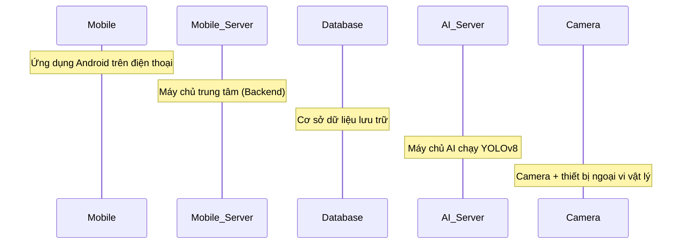
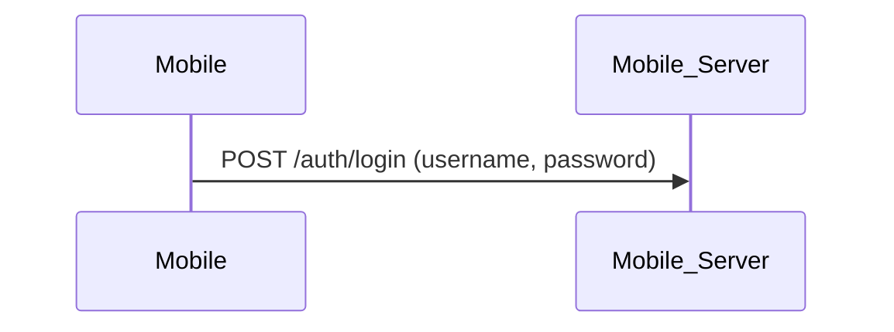
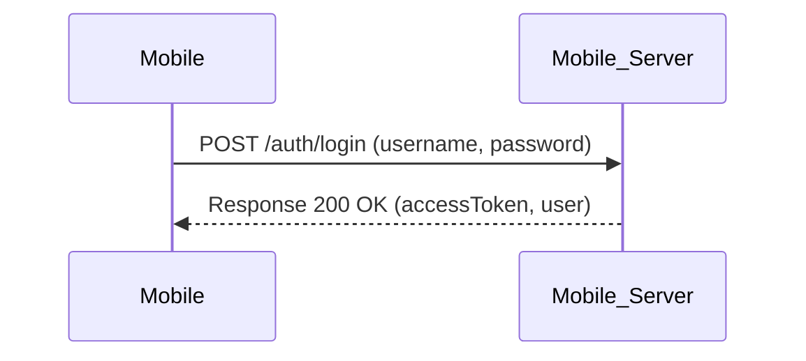
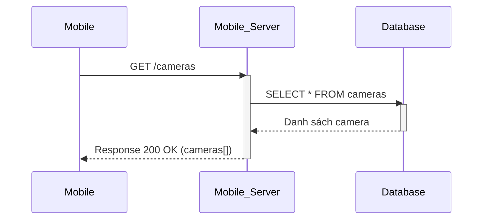
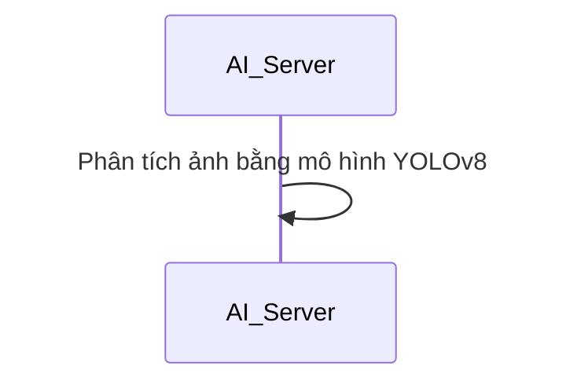
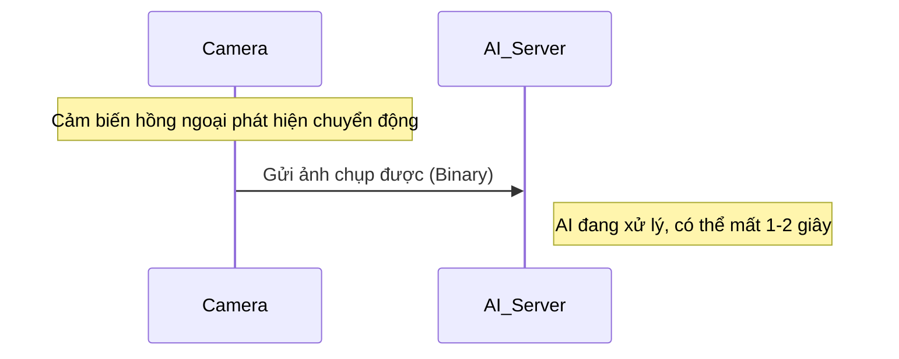
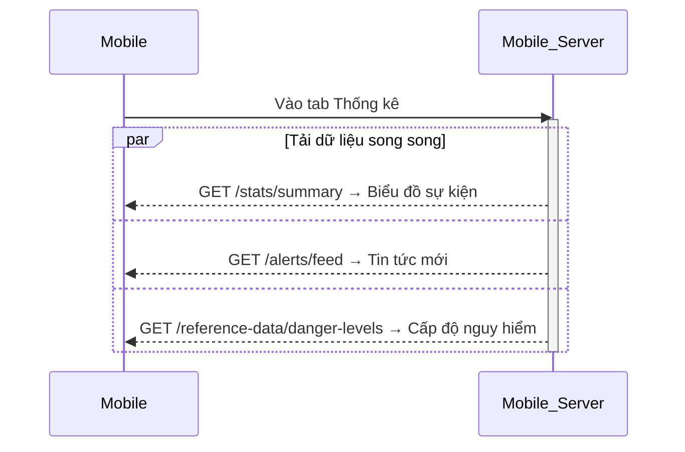
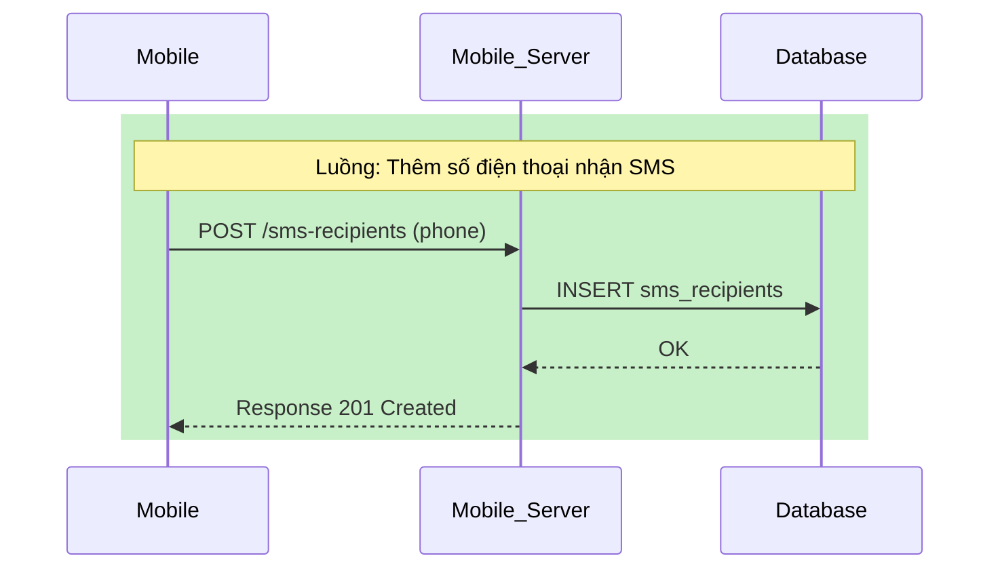
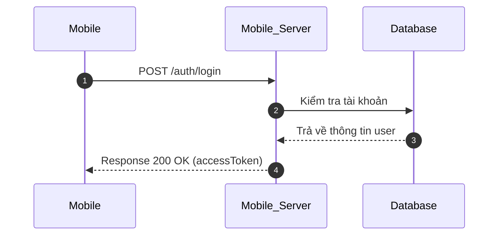
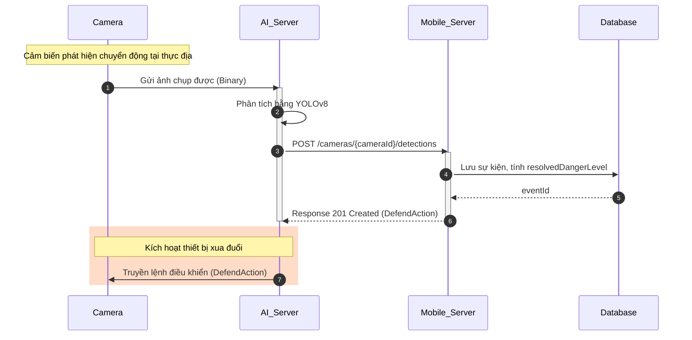

# Hướng dẫn đọc Sơ đồ trình tự (Sequence Diagram) cho Học sinh

Tài liệu này giúp các bạn học sinh tham gia đề tài Nghiên cứu Khoa học Kỹ thuật (KHKT) hiểu rõ cách đọc, vẽ và giải thích các sơ đồ trình tự có trong dự án (cụ thể là tệp [04-sequence-diagram.md](./04-sequence-diagram.md)).

## Mermaid là gì?

**Mermaid** là một ngôn ngữ văn bản nhẹ (text-based diagramming language) cho phép vẽ sơ đồ trực tiếp bằng code, không cần phần mềm đồ họa. Bạn chỉ cần viết mã theo cú pháp quy định, và công cụ (GitHub, VS Code, Notion...) sẽ tự động render thành hình ảnh sơ đồ.

> **Tại sao dùng Mermaid?** Vì sơ đồ được lưu dưới dạng văn bản thuần, dễ chỉnh sửa, dễ quản lý phiên bản bằng Git — rất phù hợp cho tài liệu kỹ thuật của đề tài KHKT.

## 1. Sequence Diagram - Sơ đồ trình tự là gì?

Hãy tưởng tượng sơ đồ trình tự giống như **kịch bản của một cuộc hội thoại** giữa các nhân vật (các thành phần phần mềm và phần cứng) theo chiều thời gian trôi từ **trên xuống dưới**.

Nó trả lời cho các câu hỏi:

- Ai gửi thông điệp cho ai?
- Gửi cái gì (dữ liệu gì)?
- Nhận lại kết quả gì và khi nào?

## 2. Các thành phần tham gia (Participants / Lifelines)

Ở đỉnh sơ đồ, bạn sẽ thấy các ô hình chữ nhật đại diện cho các thành phần trong hệ thống. Mỗi thành phần có một **đường đời (Lifeline)** là đường nét đứt chạy thẳng xuống dưới, thể hiện sự tồn tại của nó theo thời gian.

> **Giải thích các thành phần trong dự án:**
>
> - `Mobile`: Ứng dụng Android trên điện thoại của người dân/kiểm lâm.
> - `Mobile_Server`: Máy chủ trung tâm nhận lệnh, lưu cơ sở dữ liệu và điều phối hệ thống.
> - `Database`: Cơ sở dữ liệu lưu trữ thông tin tài khoản, nhật ký sự kiện, cấu hình.
> - `AI_Server`: Máy chủ trí tuệ nhân tạo chạy YOLOv8 để nhận diện loài thú.
> - `Camera`: Thiết bị camera chụp ảnh thực địa và các thiết bị ngoại vi (loa, đèn LED, hàng rào điện).

## 3. Các loại mũi tên và ký hiệu thông dụng

### a) Gửi yêu cầu — Request (`->>`)

Mũi tên **nét liền, đầu nhọn đặc**: đối tượng A chủ động gửi một yêu cầu (HTTP Request) đến đối tượng B.

### b) Phản hồi kết quả — Response (`-->>`)

Mũi tên **nét đứt, đầu nhọn hở**: đối tượng B đã xử lý xong và gửi trả kết quả về cho A.

### c) Hộp kích hoạt — Activation Bar (`activate` / `deactivate`)

Một dải hình chữ nhật đứng màu xám đè lên đường lifeline, thể hiện khoảng thời gian đối tượng đang **bận xử lý** (ví dụ: truy vấn DB, tính toán AI) trước khi trả kết quả.

### d) Tự gọi chính mình — Self-call

Khi một đối tượng tự thực hiện một hành động nội bộ (không cần gửi đến ai khác), mũi tên sẽ quay ngược lại chính nó.

### e) Ghi chú — Note (`Note over` / `Note right of`)

Dùng để ghi chú giải thích ngữ cảnh, trạng thái hệ thống, hoặc một hành động vật lý ngoài đời thực.

## 4. Các cấu trúc nâng cao có trong dự án

### a) Khối chạy song song — `par ... and ... end`

Thể hiện việc hệ thống thực hiện nhiều hành động **cùng một lúc** (song song), thay vì tuần tự từng bước một.

> **Ý nghĩa thực tế:** Khi bạn mở tab Thống kê, app gửi **3 yêu cầu song song** để tiết kiệm thời gian chờ, thay vì phải đợi từng yêu cầu một.

### b) Vùng đóng khung tô màu — `rect rgb(...) ... end`

Dùng để nhóm các hành động có liên quan mật thiết lại với nhau, giúp người đọc dễ nhận biết các luồng xử lý riêng biệt.

### c) Đánh số tự động — `autonumber`

Hệ thống tự đánh số thứ tự `1, 2, 3...` cho từng bước, giúp các bạn dễ gọi tên bước khi thuyết trình.

> **Cách đọc khi thuyết trình:** _"Ở bước 1, ứng dụng Mobile gửi yêu cầu đăng nhập lên Server..."_

## 5. Ví dụ tổng hợp: Luồng nhận diện động vật (Action 1.1)

Đây là đoạn sơ đồ quan trọng nhất trong đề tài — mô tả toàn bộ quá trình từ khi Camera phát hiện thú rừng đến khi kích hoạt thiết bị xua đuổi:

**Cách giải thích từng bước:**

| Bước | Đối tượng                 | Hành động                                            |
| ---- | ------------------------- | ---------------------------------------------------- |
| 1    | Camera                    | Phát hiện chuyển động, chụp ảnh và gửi đến AI_Server |
| 2    | AI_Server                 | **Self-call**: chạy YOLOv8 nhận diện loài thú        |
| 3    | AI_Server → Mobile_Server | Gửi kết quả nhận diện (`detections[]`) qua REST API  |
| 4    | Mobile_Server → Database  | Lưu sự kiện, tính `resolvedDangerLevel`              |
| 5    | Mobile_Server → AI_Server | Trả về cấu hình phòng vệ (`DefendAction`)            |
| 6    | AI_Server → Camera        | Truyền lệnh vật lý kích hoạt loa/đèn tại thực địa    |

## 6. Tóm tắt bảng ký hiệu

| Ký hiệu Mermaid               | Hình ảnh hiển thị               | Ý nghĩa                         |
| ----------------------------- | ------------------------------- | ------------------------------- |
| `A->>B: msg`                  | Mũi tên nét liền, đầu đặc       | Gửi yêu cầu / Request           |
| `B-->>A: msg`                 | Mũi tên nét đứt, đầu hở         | Phản hồi kết quả / Response     |
| `activate B` / `deactivate B` | Dải hình chữ nhật trên lifeline | Đang bận xử lý tác vụ           |
| `A->>A: msg`                  | Mũi tên vòng lại chính mình     | Hành động nội bộ (self-call)    |
| `Note over A,B: ...`          | Hộp ghi chú nằm ngang           | Chú thích ngữ cảnh / giải thích |
| `par ... and ... end`         | Khối nền có nhãn `par`          | Các hành động chạy song song    |
| `rect rgb(...) ... end`       | Khung nền tô màu                | Nhóm các hành động có liên quan |
| `autonumber`                  | Số thứ tự trên mỗi mũi tên      | Đánh số tự động các bước        |
