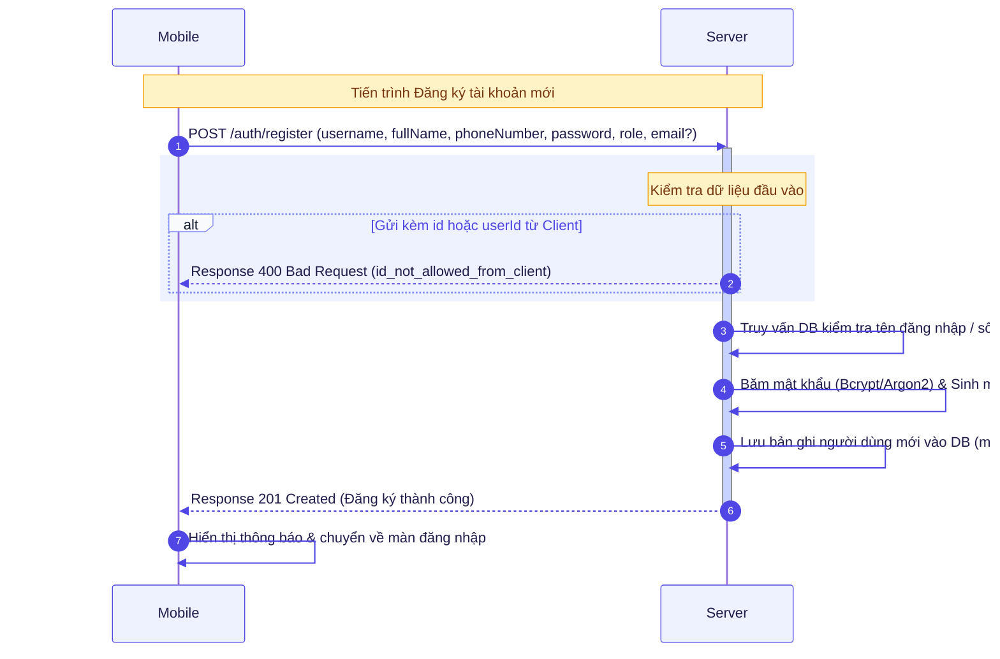

# Hướng Dẫn Quy Chuẩn Thiết Kế Mermaid Sequence Diagram (Style Guide)

Tài liệu này tổng hợp quy chuẩn thiết kế giao diện (Style Guide) cho tất cả các Sơ đồ Trình tự (Sequence Diagram) trong bộ tài liệu kỹ thuật của dự án **Hệ thống Cảnh báo và Xua đuổi Động vật Hoang dã**.

---

## 🌟 1. Điểm Nổi Bật của Style Mới

1. **Giao diện Tươi sáng & Thanh lịch (Bright Indigo Pastel Theme):**
   - Tông màu chủ đạo Indigo nhẹ nhàng (`#EEF2FF`), kết hợp với đường truyền tin nhắn Indigo đậm (`#4F46E5`), mang lại cảm giác hiện đại, sạch sẽ và chuyên nghiệp.
   - Tương phản chữ cao (`#1E1B4B`), giúp người đọc và Giám khảo dễ quan sát trên mọi màn hình sáng/tối.

2. **Đường nối Self-Message Vuông góc 90° (`rightAngles: true`):**
   - Các thao tác tự xử lý/lưu dữ liệu nội bộ (`Server->>Server:`) được vẽ bằng các đoạn thẳng vuông góc sắc nét, loại bỏ hoàn toàn các đường cong uốn lượn rườm rà.

3. **Bố cục Chuẩn xác - Không Vỡ Khung & Đè Chữ:**
   - Căn lề trái chuẩn cho nhãn tin nhắn (`messageAlign: 'left'`) để chống đè chữ lên đường dọc Lifeline hoặc ô số thứ tự (`autonumber`).
   - Tăng khoảng cách chiều dọc (`messageMargin: 40`) giúp dòng chữ cách xa đường mũi tên, tạo độ thoáng mắt cao.

---

## 🎨 2. Đoạn Mã Cấu Hình Chuẩn (Init Directive Snippet)

Mỗi sơ đồ Mermaid Sequence Diagram bắt đầu bằng khối cấu hình `%%{init: {...}}%%` sau:

```mermaid
%%{init: {
  'theme': 'default',
  'sequence': {
    'rightAngles': true,
    'messageAlign': 'left',
    'messageMargin': 40,
    'actorMargin': 80
  },
  'themeVariables': {
    'primaryColor': '#EEF2FF',
    'primaryTextColor': '#1E1B4B',
    'primaryBorderColor': '#6366F1',
    'lineColor': '#4F46E5',
    'secondaryColor': '#F0FDFA',
    'actorBkg': '#EEF2FF',
    'actorBorder': '#4F46E5',
    'actorTextColor': '#1E1B4B',
    'signalColor': '#4F46E5',
    'signalTextColor': '#1E1B4B',
    'labelBoxBkgColor': '#F8FAFC',
    'labelBoxBorderColor': '#818CF8',
    'labelTextColor': '#0F172A',
    'loopTextColor': '#4F46E5',
    'noteBkgColor': '#FEF3C7',
    'noteTextColor': '#78350F',
    'noteBorderColor': '#F59E0B',
    'activationBkgColor': '#C7D2FE',
    'sequenceNumberColor': '#FFFFFF'
  }
}}%%
```

---

## 🛠️ 3. Giải Thích Các Thuộc Tính Cấu Hình

### A. Thuộc tính Bố cục `sequence`

| Thuộc tính | Giá trị | Giải thích tác dụng |
| :--- | :--- | :--- |
| **`rightAngles`** | `true` | Ép các đường Self-Message vẽ bằng góc vuông 90° thay vì đường cong. |
| **`messageAlign`** | `'left'` | Căn lề trái cho nhãn tin nhắn, **chống triệt để lỗi chữ đè lên Lifeline/Autonumber**. |
| **`messageMargin`** | `40` | Tăng khoảng cách chiều dọc giữa dòng chữ nhãn và đường mũi tên nằm ngang. |
| **`actorMargin`** | `80` | Mở rộng khoảng cách giữa các cột Participant/Lifeline giúp sơ đồ thoáng đãng. |

### B. Bảng Mã Màu `themeVariables` (Bright Indigo Palette)

| Thành phần Mermaid | Mã màu Hex | Mô tả hiển thị |
| :--- | :--- | :--- |
| **Nền khối Participant (`primaryColor`)** | `#EEF2FF` | Màu xanh Indigo pastel dịu mát |
| **Viền khối Participant (`primaryBorderColor`)** | `#6366F1` | Đường viền Indigo vừa phải |
| **Đường mũi tên & Lifeline (`lineColor`, `signalColor`)** | `#4F46E5` | Xanh Indigo đậm sắc nét |
| **Màu chữ chính (`primaryTextColor`, `actorTextColor`)** | `#1E1B4B` | Tím đen tương phản cao |
| **Khối Ghi chú (`noteBkgColor`)** | `#FEF3C7` | Màu vàng Amber pastel nổi bật |
| **Viền khối Ghi chú (`noteBorderColor`)** | `#F59E0B` | Viền vàng Amber |
| **Thanh Kích hoạt (`activationBkgColor`)** | `#C7D2FE` | Thanh màu Indigo nhạt |

---

## 📋 4. Quy Tắc Soạn Thảo Văn Bản (Tránh Tràn Khung)

1. **Khối Note (`Note over ...`):**
   - Giữ độ dài tiêu đề Note vừa phải. Với các câu mô tả dài, chủ động dùng thẻ `<br/>` để xuống dòng.
   - **Ví dụ chuẩn:** `Note over Server: Kiểm tra dữ liệu đầu vào`

2. **Khối Phân Vùng Màu (`rect rgb(...)`):**
   - Sử dụng các màu RGB nhẹ nhàng phù hợp với theme tươi sáng:
     - 🔵 **Request / General Phase:** `rect rgb(238, 242, 255)` (Alice Blue / Indigo Soft)
     - 🟡 **Validation Phase:** `rect rgb(254, 243, 199)` (Warm Amber Soft)
     - 🟢 **Success / Execution Phase:** `rect rgb(240, 253, 244)` (Mint Emerald Soft)

---

## 🎯 5. Mẫu Sơ Đồ Hoàn Chỉnh (Reference Example)


