# 📚 Tổng Hợp Sơ Đồ Trình Tự & Giải Thích Khái Niệm Cốt Lõi

> [!NOTE]
>
> ### 💡 Diễn giải Khái niệm & Luồng vận hành (Dành cho Giám khảo / Người đọc tổng quan)
>
> Tài liệu này bao gồm **Bảng giải thích thuật ngữ cốt lõi** và các **Sơ đồ Trình tự (Sequence Diagram)** chuẩn của hệ thống.
> Người đọc có thể dễ dàng tra cứu ý nghĩa bản chất của từng công nghệ trước khi theo dõi luồng tương tác giữa các thành phần.

---

## Các Thành phần Hệ thống (Standardized Participants)

- **Mobile:** Ứng dụng di động (Android Client) cài đặt trên điện thoại người dùng và kiểm lâm để tương tác với hệ thống.
- **Server:** Máy chủ trung tâm lưu trữ dữ liệu, xử lý logic, quản lý phiên làm việc, lưu cấu hình ứng phó và giao tiếp với `Mobile` (qua REST / SSE) và `Ably` (qua REST).
- **Ably:** Dịch vụ đám mây Pub/Sub trung gian (Cloud Broker) phân phối tin nhắn thời gian thực giữa `Server` và `AI_Client` thay thế cho WebSocket trực tiếp.
- **AI_Client:** Ứng dụng trí tuệ nhân tạo nhận diện (YOLOv8) chạy tại trạm thực địa, nhận hình ảnh từ `Rasp_PI` để phân tích, gửi kết quả nhận diện lên `Server` (qua REST) và kết nối với `Ably` (qua WebSocket) để nhận lệnh điều khiển.
- **Rasp_PI:** Thiết bị trạm thực địa (Raspberry Pi) điều khiển camera chụp ảnh (chỉ gửi ảnh về `AI_Client` khi phát hiện chuyển động) và các thiết bị xua đuổi vật lý (Loa phát thanh, Đèn LED chớp, còi hú báo động).
- **FCM (Firebase Cloud Messaging):** Dịch vụ trung gian gửi thông báo đẩy (Push notification) thời gian thực đến `Mobile`. Nhận lệnh từ Máy chủ Backend và đánh thức ứng dụng di động hiển thị **Push Notification** rực sáng trên màn hình điện thoại (kể cả khi tắt/khóa màn hình).

## 📖 BẢNG GIẢI THÍCH KHÁI NIỆM & THUẬT NGỮ CỐT LÕI

| Thuật ngữ / Khái niệm                                             | Giải thích ngắn gọn dễ hiểu                                                                                                                                   | Vai trò & Giá trị trong Hệ thống                                                                                                                                                                                                                       |
| :---------------------------------------------------------------- | :------------------------------------------------------------------------------------------------------------------------------------------------------------ | :----------------------------------------------------------------------------------------------------------------------------------------------------------------------------------------------------------------------------------------------------- |
| 🔑 **FCM Push Token**                                             | Chuỗi mã định danh duy nhất tuyệt đối do Google Firebase cấp cho từng Ứng dụng trên từng Thiết bị di động cụ thể.                                             | Đóng vai trò như _"Địa chỉ hòm thư độc nhất"_ của thiết bị di động. Giúp máy chủ phát thông báo cảnh báo khẩn cấp đúng người, đúng ứng dụng mà không bao giờ bị nhầm lẫn.                                                                              |
| 🛡️ **Access Token**                                               | Chìa khóa thông hành điện tử tạm thời chứa thông tin định danh chính xác cả **Thiết bị (Device)** và **Ứng dụng (App)** cùng tài khoản người dùng (`userId`). | Máy chủ phát trả thẻ này khi đăng nhập đúng. Ứng dụng dùng nó để xác thực ở mọi yêu cầu API tiếp theo, giúp máy chủ kiểm soát và bảo mật phiên làm việc chính xác trên đúng thiết bị và ứng dụng đó mà không cần gửi lại mật khẩu.                     |
| 🔄 **Refresh Token**                                              | Thẻ gia hạn phiên làm việc dài hạn (vài tuần/tháng).                                                                                                          | Khi chìa khóa tạm thời `Access Token` hết hạn, ứng dụng tự động trình `Refresh Token` để xin máy chủ cấp chìa khóa mới mà không bắt người dùng phải gõ lại mật khẩu nhiều lần.                                                                         |
| 💓 **Heartbeat (Heartbeat Check)**                                | Cơ chế _"Bắt mạch"_ kiểm tra định kỳ (mỗi 5 giây) bằng gói tin siêu nhẹ.                                                                                      | Máy chủ trả về mốc thời gian cập nhật mới nhất (`lastUpdatedAt`), Mobile Client tự so sánh với mốc thời gian lưu cục bộ để quyết định có gọi lại API `GET /cameras` tải dữ liệu mới hay không $\rightarrow$ tiết kiệm pin và giảm 90% tải cho máy chủ. |
| ⏱️ **Cooldown (Thời gian chờ 30s)**                               | Cơ chế lọc thời gian thông minh giữa 2 lần phát cảnh báo liên tiếp tại cùng 1 trạm.                                                                           | Khi động vật đứng yên trước camera nhiều phút, ảnh snapshot vẫn được lưu liên tục nhưng thông báo đẩy khẩn cấp chỉ gửi **1 lần mỗi 30 giây** $\rightarrow$ chống spam thông báo cho kiểm lâm.                                                          |
| 🔒 **Băm Mật Khẩu (Password Hashing / Bcrypt)**                   | Hàm toán học một chiều biến đổi mật khẩu thành một chuỗi mã băm cố định độc nhất (_nguyên lý "Trộn màu sơn một chiều"_).                                      | Máy chủ tuyệt đối không lưu mật khẩu thô trong DB. Kẻ xấu dù đánh cắp được mã băm trong DB cũng không thể giải mã ngược lại mật khẩu gốc.                                                                                                              |
| 🌐 **WebSocket & Ably Broker**                                    | Đường truyền dữ liệu 2 chiều liên tục (như kết nối điện thoại trực tiếp) qua kênh đám mây Ably.                                                               | Giúp Máy chủ Cloud (Vercel Serverless) có thể bắn lệnh điều khiển trực tiếp xuống thiết bị thực địa (Loa/LED) tại rừng chỉ trong vài mili-giây mà không bị ngắt kết nối.                                                                               |
| 🌐 **HTTP Method (Phương thức HTTP)**                             | Các _"Động từ hành động"_ (`GET`, `POST`, `PUT`, `PATCH`, `DELETE`) trong giao thức truyền tải Web API.                                                       | Định nghĩa rõ mục đích thao tác của Client đối với tài nguyên dữ liệu trên Máy chủ (Ví dụ: `GET` để Đọc, `POST` để Tạo mới/Gửi lệnh, `PUT`/`PATCH` để Cập nhật, `DELETE` để Xóa).                                                                      |
| 📑 **HTTP Header (Tiêu đề HTTP)**                                 | Các cặp thông tin ngữ cảnh (`Key: Value`) được đính kèm ở phần đầu gói tin trao đổi giữa Client và Server.                                                    | Truyền tải thông tin phụ quan trọng như chìa khóa xác thực (`Authorization: Bearer <token>`), định dạng dữ liệu gửi lên/nhận về (`Content-Type: application/json`), thông tin thiết bị (`User-Agent`).                                                 |
| 🚥 **HTTP Status Code (Mã trạng thái HTTP)**                      | Mã số 3 chữ số do Máy chủ trả về cho Client để báo cáo kết quả xử lý yêu cầu.                                                                                 | Giúp App di động nhận biết trạng thái kết quả: `200 OK` (Thành công), `201 Created` (Tạo mới thành công), `400 Bad Request` (Dữ liệu lỗi), `401 Unauthorized` (Sai MK / Chưa đăng nhập), `504 Gateway Timeout` (Quá giờ chờ kết nối trạm).             |
| 🔑 **Push Service Account Key (`PUSH_SERVICE_ACCOUNT_KEY_JSON`)** | Chứng chỉ dịch vụ riêng tư (`serviceAccountKey.json`) do Google Firebase phát cho Máy chủ Backend.                                                            | Cho phép Backend Server xác thực với Google Firebase API để gửi Push Notification. Để bảo mật và phù hợp Serverless, file JSON được mã hóa sang **Base64**, lưu trong biến môi trường và giải mã trực tiếp trong RAM khi dùng (không lưu file ra đĩa). |

---

## Action 1.1: Register a new account (`POST /auth/register`)

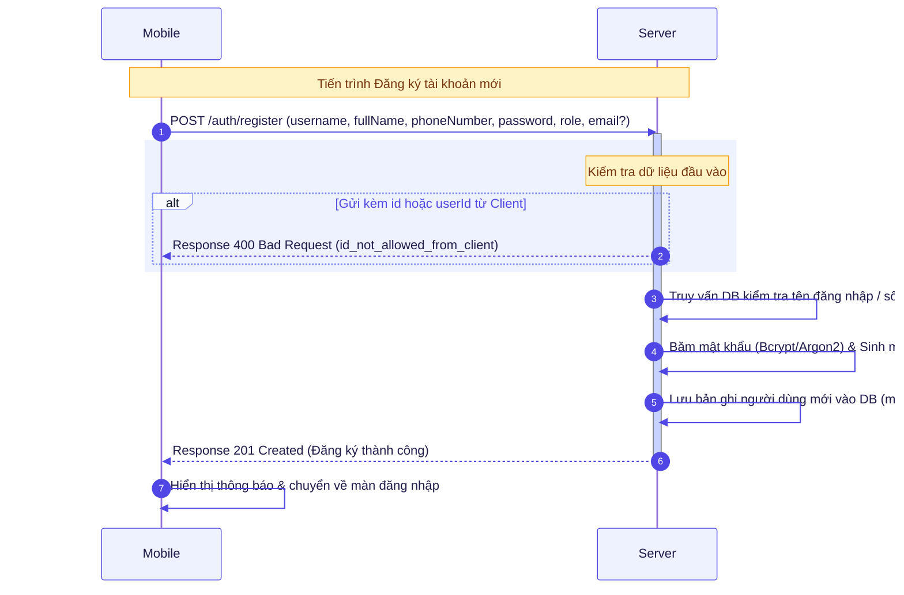

---

## Action 2.1: Login & Register fcm-push-token (`POST /auth/login` & `POST /devices/push-token`)

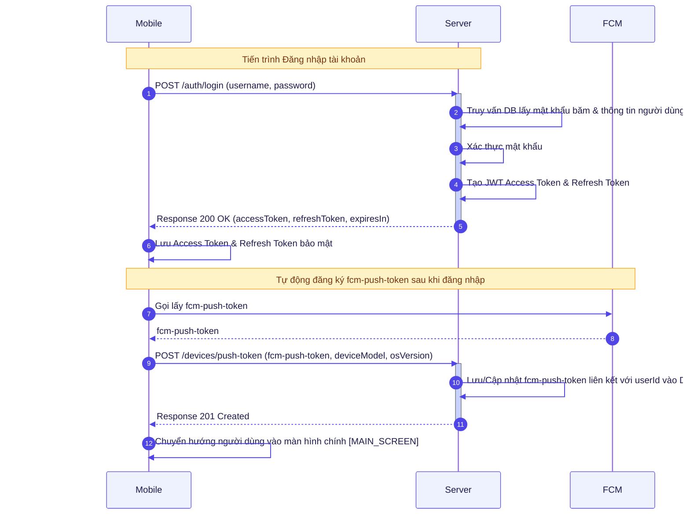

---

## Action 3.1.1: Load camera list & initial snapshots (`GET /cameras`)

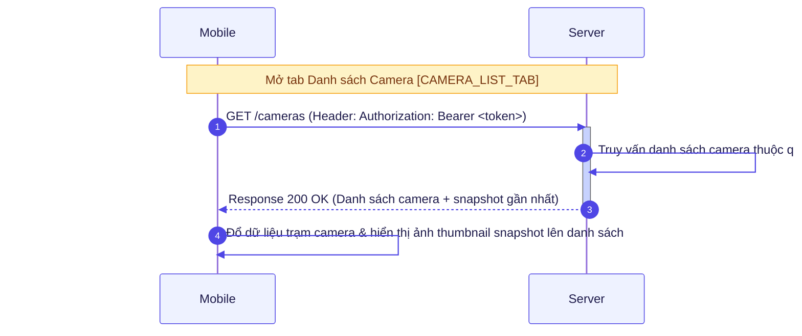

---

## Action 3.1.2: Auto-polling / Heartbeat (`GET /cameras/heartbeat`)

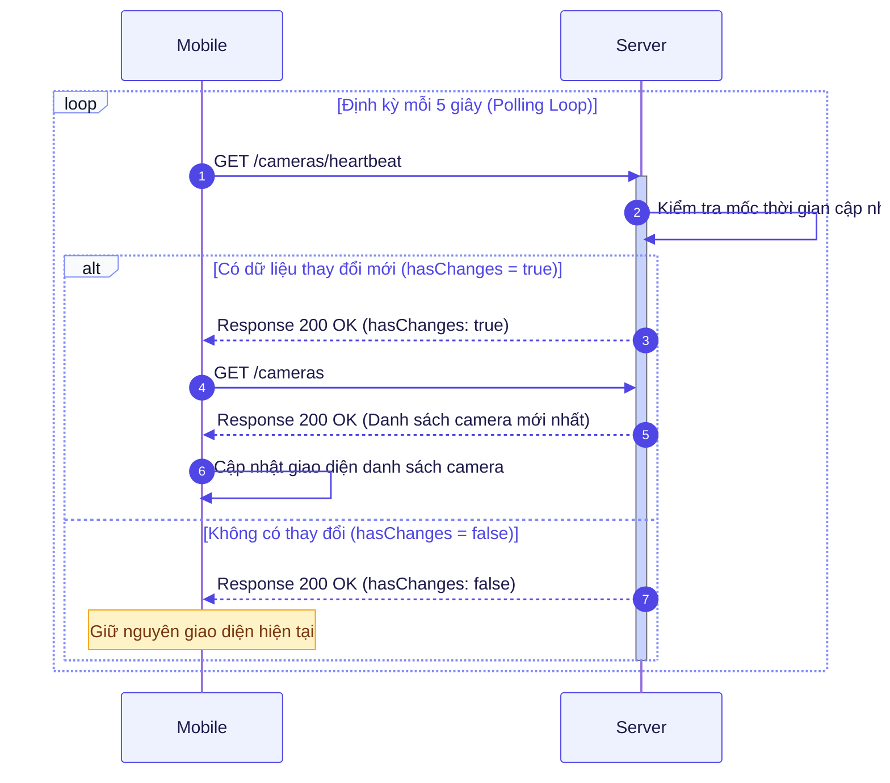

---

## Action 3.2.3: Load analytics summary & species heatmap (`GET /analytics/summary`)

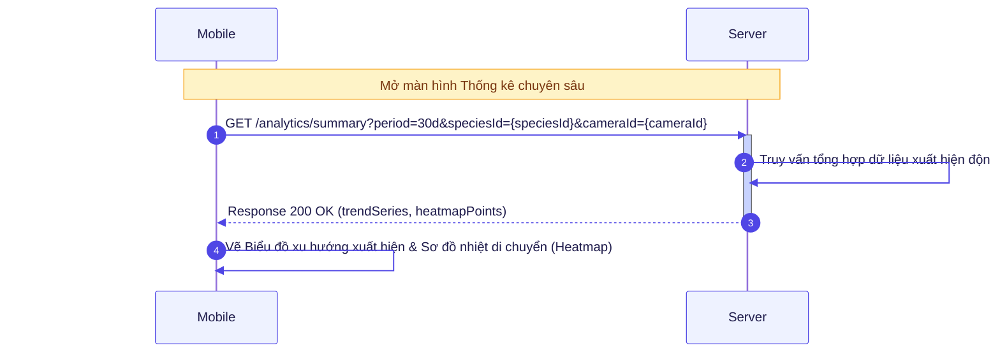

---

## Action 3.3.1: View & edit user profile (`GET /users/me` & `PATCH /users/me`)

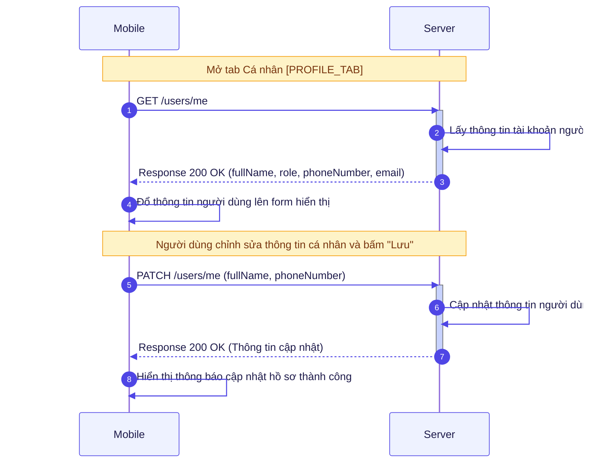

---

## Action 5.1: Load species & config statuses (`GET /species` & `GET /response-configs`)

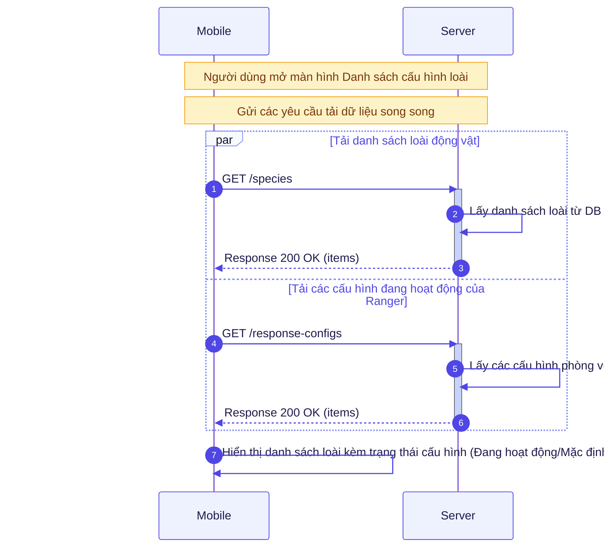

---

## Action 6.1: Load species configuration & sample lists (`GET /response-configs?speciesId=`, `GET /control/presets`, `GET /audio-samples`)

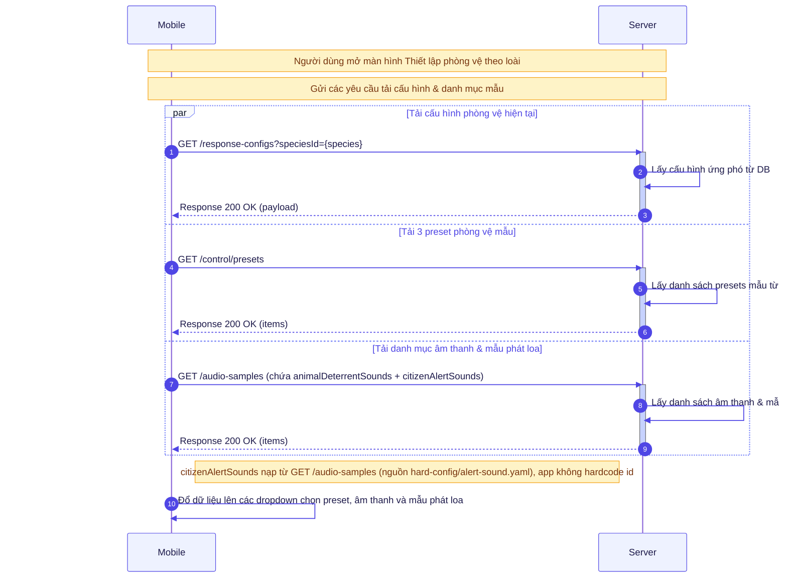

---

## Action 6.2: Update species configuration (`PUT /response-configs/{speciesId}`)

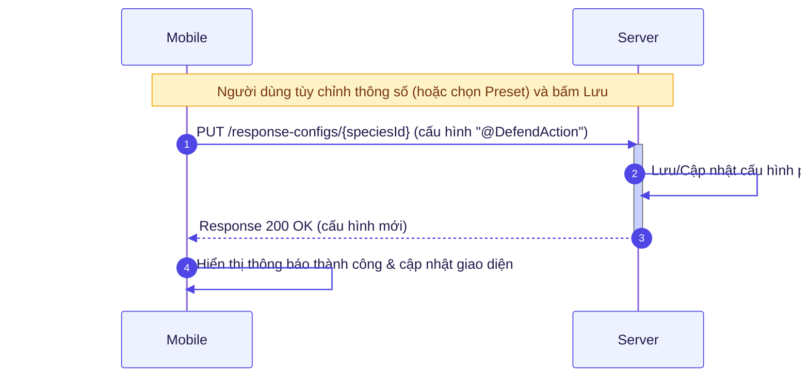

---

## Action 6.3: Test speaker sound at camera station (`POST /cameras/{cameraId}/devices/{deviceKey}/test`)

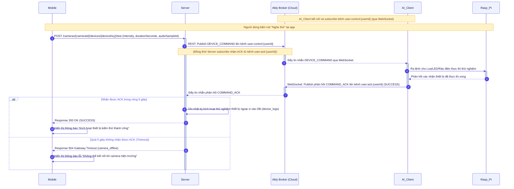

---

## Action 1.1 AI: AI Client sends detection snapshot (`POST /cameras/{cameraId}/detections`)

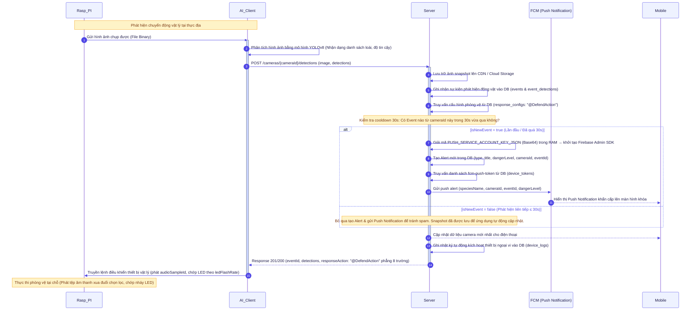

---

## Action 1.2 AI: Manual snapshot upload via Backend API / Testing Tools (`POST /cameras/{cameraId}/image-upload`)

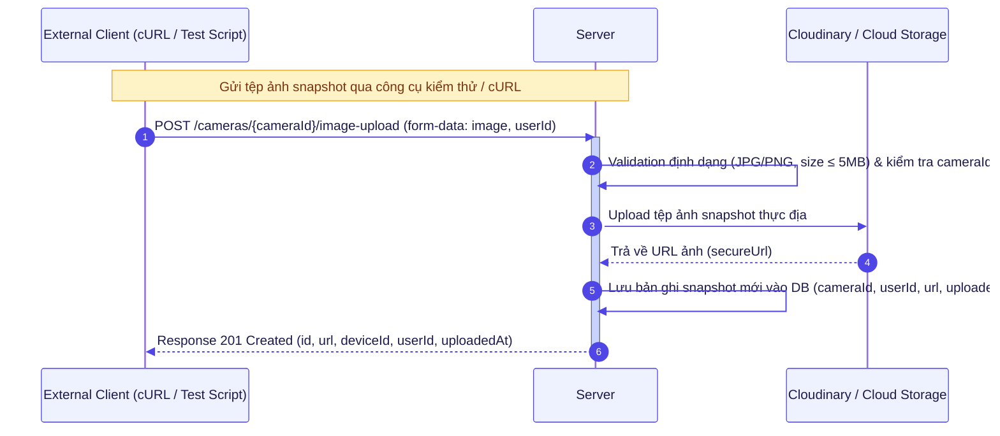
