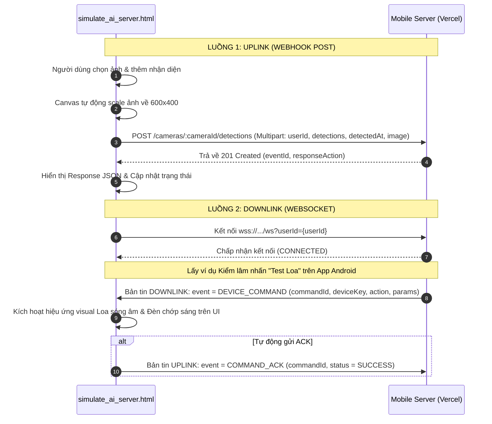

# Kế hoạch Xây dựng Công cụ Giả lập AI Server (`html_tool/simulate_ai_server.html`)

Tài liệu này trình bày kế hoạch thiết kế và phát triển công cụ giả lập tĩnh (Static HTML/JS) chạy trên trình duyệt nhằm mô phỏng toàn diện các tương tác hai chiều của phân hệ **AI Server** với **Mobile Server** trên cả môi trường local và production.

---

## 1. Mục tiêu và Phạm vi

Công cụ này tích hợp cả hai dòng xử lý chính của AI Server theo các tài liệu thiết kế hệ thống ([02-dac-ta-man-hinh-android-app.md](file:///Users/trungnguyen/GitHub/Wildlife-Warning-and-Deterrence-System/docs/02-dac-ta-man-hinh-android-app.md), [04-sequence-diagram.md](file:///Users/trungnguyen/GitHub/Wildlife-Warning-and-Deterrence-System/docs/04-sequence-diagram.md), và [ai_server_plan.md](file:///Users/trungnguyen/GitHub/Wildlife-Warning-and-Deterrence-System/docs/ai_server_plan.md)):

1.  **Mô phỏng Webhook (Uplink):** 
    *   Đăng ký sự kiện phát hiện động vật hoang dã bằng cách gửi yêu cầu `POST /cameras/{cameraId}/detections` sử dụng định dạng `multipart/form-data`.
    *   Hỗ trợ tải lên hình ảnh local và tự động scale/resize về kích thước chuẩn `600x400` trước khi gửi.
    *   Gửi đầy đủ các trường dữ liệu bắt buộc: `userId`, `detections` (JSON), `detectedAt` (ISO Timestamp) và file `image`.
2.  **Giả lập Kết nối WebSocket (Downlink & Hardware Mock):**
    *   Duy trì một kết nối WebSocket trực tiếp đến `WS /ws?userId={userId}`.
    *   Lắng nghe bản tin lệnh `DEVICE_COMMAND` từ Mobile Server khi người dùng/kiểm lâm thực hiện kiểm thử thiết bị (đèn LED chớp, Loa cảnh báo, Hàng rào điện sinh học).
    *   Hiển thị mô phỏng vật lý sống động của phần cứng ngay trên giao diện web (đèn LED nhấp nháy theo màu/tần số, loa phát sóng âm thanh, hàng rào điện phóng tia sét cùng bộ đếm ngược thời gian hoạt động).
    *   Tự động gửi bản tin phản hồi `COMMAND_ACK` xác nhận trạng thái thực thi (`SUCCESS` hoặc `FAILED`) ngược lại Mobile Server qua WebSocket.
3.  **Lưu trữ Trạng thái Tiện lợi:**
    *   Tự động ghi nhớ các trường cấu hình như `userId`, `cameraId` vào cookie trình duyệt để khôi phục nhanh khi reload trang.

---

## 2. Giao diện Người dùng & Thiết kế Thẩm mỹ (UI/UX)

Để đồng bộ với công cụ mô phỏng Webhook trước đó, giao diện sẽ được xây dựng theo phong cách **Forest Dark Mode** cao cấp và hiện đại:

*   **Bảng màu chủ đạo:**
    *   Nền tối: HSL Forest Black (`#0a140f`) kết hợp tấm nền Glassmorphic mờ ảo (`rgba(16, 28, 22, 0.65)`).
    *   Đường viền: Green Moss (`rgba(46, 125, 50, 0.3)`).
    *   Điểm nhấn: Forest Gold (`#ffc107` hoặc `#ffb300`).
*   **Bố cục phân trang (Two-Column Layout) & Chi tiết Input:**
    *   *Cột trái: Webhook Simulator (Uplink) - Bộ điều khiển gửi Detections*
        *   **Cấu hình API Endpoint:**
            *   *HTTP Server URL:* Input text cho phép thay đổi máy chủ gọi API (mặc định: `https://wildlife-warning-and-deterrence-sys.vercel.app`).
            *   *Môi trường:* Hộp chọn nhanh (Select) giữa `Production (Vercel)` và `Local Development (localhost:5001)`.
        *   **Thông tin Camera & Người dùng (Cookie-backed):**
            *   *userID:* Input text nhập mã ID người dùng (mặc định: `u_rg`).
            *   *cameraID:* Input text nhập mã trạm camera (mặc định: `CAM_PROD_TEST`).
            *   *detectedAt:* Hộp chọn ngày giờ (Datetime-local picker) và nút chuyển đổi nhanh "Sử dụng thời gian hiện tại" (Default: Tự động điền ngày giờ hiện tại).
        *   **Hình ảnh snapshot:**
            *   *Select Image:* Vùng nhấn thả tệp hình ảnh (.jpg, .jpeg, .png). Khi chọn tệp tin, ảnh sẽ được tự động vẽ lên canvas ngầm để scale về đúng `600x400` pixel và nén.
            *   *Xem trước:* Khung hiển thị ảnh xem trước thumbnail kích thước lớn (đã ẩn tên file để chống vỡ layout) kèm nhãn hiển thị dung lượng nén thực tế.
        *   **Cấu hình nhận diện loài động vật (Detections):**
            *   *input speciesId:* Ô nhập văn bản hỗ trợ Auto-suggest các mã loài vật phổ biến (`voi_rung`, `ho_dong_duong`, `lon_rung`, `khi`, `bo_tot`, `human_border_intruder`).
            *   *Thanh kéo confidence:* Thanh trượt điều chỉnh độ tin cậy từ `0.5` đến `1.0` (hiển thị số thực tương ứng bên cạnh).
            *   *Nút "Thêm mới":* Thêm thông tin vừa thiết lập vào danh sách đính kèm.
        *   **Danh sách nhận diện trước khi gửi:** Hiển thị danh sách các loài thú đã cấu hình thành hàng ngang gọn gàng kèm theo nút bấm xóa (`✕`) riêng từng phần tử.
        *   **Mẫu cURL và Kết quả:**
            *   Khung hiển thị cURL sinh tự động (realtime).
            *   Khung kết quả hiển thị JSON Response phản hồi từ API Server.
    *   *Cột phải: WebSocket & Hardware Simulator (Downlink) - Bộ giám sát Đẩy lệnh thời gian thực*
        *   **Cấu hình WebSocket URL:**
            *   *WS Server URL:* Input text cho địa chỉ kết nối WebSocket (mặc định: `wss://wildlife-warning-and-deterrence-sys.vercel.app`).
            *   *Nút bấm tương tác:* Nút "Kết nối" (Connect) và "Ngắt kết nối" (Disconnect).
            *   *Trạng thái:* Huy hiệu (Badge) nhấp nháy động thể hiện tình trạng kết nối (`DISCONNECTED` màu đỏ, `CONNECTING` màu vàng nhạt, `CONNECTED` màu xanh lá cây).
        *   **Bảng mô phỏng Thiết bị thực địa (Hardware Visual Mock):**
            *   *Đèn LED:* Vùng hiển thị vòng tròn neon phát sáng (glowing effect) chớp nháy tương ứng với màu sắc (`STROBE` - chớp trắng mạnh, `RED` - đỏ nguy hiểm, `YELLOW` - vàng cảnh báo, `WHITE` - sáng trắng xua đuổi) và tần số nháy nhận được.
            *   *Loa phát âm thanh:* Đồ họa sóng âm phát ra (pulsing audio waves) cùng thông tin hiển thị mẫu âm thanh (`A_gunshot`, `A_growl`, v.v.) và thanh đo cường độ âm lượng (Volume indicator bar).
            *   *Hàng rào điện:* Khung chớp hiệu ứng tia sét màu vàng/xanh neon kèm bộ đếm ngược số giây kích hoạt (`Duration`) tự động đếm lùi về 0.
        *   **Bảng cấu hình phản hồi ACK (COMMAND_ACK):**
            *   *Trạng thái phản hồi:* Hộp chọn (Select) giữa `SUCCESS` (Thực thi thành công) và `FAILED` (Thất bại).
            *   *Lý do lỗi:* Ô nhập text mô tả lỗi (chỉ mở khóa và hiển thị khi chọn trạng thái `FAILED`).
            *   *Chế độ phản hồi:* Nút công tắc bật tắt (Toggle) "Tự động gửi ACK ngay lập tức" hoặc gửi thủ công bằng nút "Gửi ACK thủ công" để dễ dàng debug các trạng thái phản hồi.
        *   **Console Log Terminal:** Bảng ghi lại chi tiết mọi luồng thông điệp JSON gửi và nhận qua WebSocket với màu sắc phân cấp.

---

## 3. Chi tiết Luồng xử lý & Logic Javascript



### 3.1. Các phần tử DOM & Sự kiện tương tác
*   Hàm `resizeImage(file, width, height)` sử dụng HTML5 Canvas để scale ảnh về đúng tỉ lệ `600x400` pixel, nén dưới dạng JPEG để giữ dung lượng siêu nhỏ (~50-100KB), hạn chế tối đa độ trễ truyền dẫn.
*   Cơ chế kết nối WebSocket sử dụng API `new WebSocket(wsUrl)`.
    *   Tự động đăng ký sự kiện `onopen`, `onclose`, `onerror`, `onmessage`.
    *   Hàm gửi bản tin `sendWsMessage(event, payload)` chuyển đổi object thành JSON và ghi nhận vào Log Terminal.
*   Hệ thống mô phỏng hiệu ứng phần cứng sử dụng CSS keyframes animation để chớp tắt LED, làm rung màng loa/sóng âm thanh, và phóng hiệu ứng tia chớp của hàng rào điện sinh học.

---

## 4. Kế hoạch Thay đổi Chi tiết

### [NEW] [simulate_ai_server.html](file:///Users/trungnguyen/GitHub/Wildlife-Warning-and-Deterrence-System/html_tool/simulate_ai_server.html)
*   Xây dựng mã nguồn hoàn chỉnh của trang HTML tĩnh chứa giao diện Forest Dark Mode, CSS hiệu ứng chuyển động và mã Javascript tương tác.

### [MODIFY] [walkthrough.md](file:///Users/trungnguyen/.gemini/antigravity-ide/brain/d8661faf-34e6-4ef5-9adf-8292c66e70c7/walkthrough.md)
*   Cập nhật nhật ký tiến trình phát triển để bao gồm công cụ giả lập AI Server mới.

---

## 5. Kế hoạch Kiểm tra & Xác minh (Verification Plan)

### Kiểm thử thủ công trên Giao diện mô phỏng
1.  **Kiểm tra Webhook (Uplink):**
    *   Tải một file ảnh bất kỳ.
    *   Thêm nhận diện loài động vật nguy hiểm (ví dụ: `voi_rung`, confidence `0.85`).
    *   Bấm **"Kích hoạt Webhook (Post Detections)"**.
    *   Xác nhận phản hồi trả về mã `201 Created` kèm theo đối tượng `responseAction` đầy đủ.
2.  **Kiểm tra WebSocket (Downlink):**
    *   Nhập `userId` chính xác, bấm **"Kết nối WebSocket"**.
    *   Xác nhận trạng thái hiển thị đổi sang `CONNECTED` màu xanh lá cây rực rỡ.
    *   Gửi một yêu cầu kiểm thử thiết bị bằng cách chạy lệnh cURL kiểm thử loa/đèn từ terminal (hoặc qua giao diện App Android nếu có):
        ```bash
        curl -X POST "https://wildlife-warning-and-deterrence-sys.vercel.app/api/v1/cameras/CAM_PROD_TEST/devices/speaker/test" \
          -H "Authorization: Bearer <RANGER_TOKEN>" \
          -H "Content-Type: application/json" \
          -d '{"durationSeconds": 10, "intensity": 80}'
        ```
    *   Xác nhận trên giao diện `simulate_ai_server.html`:
        *   Trong log terminal có ghi nhận bản tin `DEVICE_COMMAND` màu vàng.
        *   Phần cứng giả lập loa hiển thị rung động sóng âm thanh và LED chớp đỏ nhấp nháy.
        *   Một bản tin `COMMAND_ACK` với `status: "SUCCESS"` được tự động phản hồi ngược lại lên WebSocket của Mobile Server.
        *   Log terminal hiển thị bản tin `COMMAND_ACK` gửi đi màu xanh lá cây.
