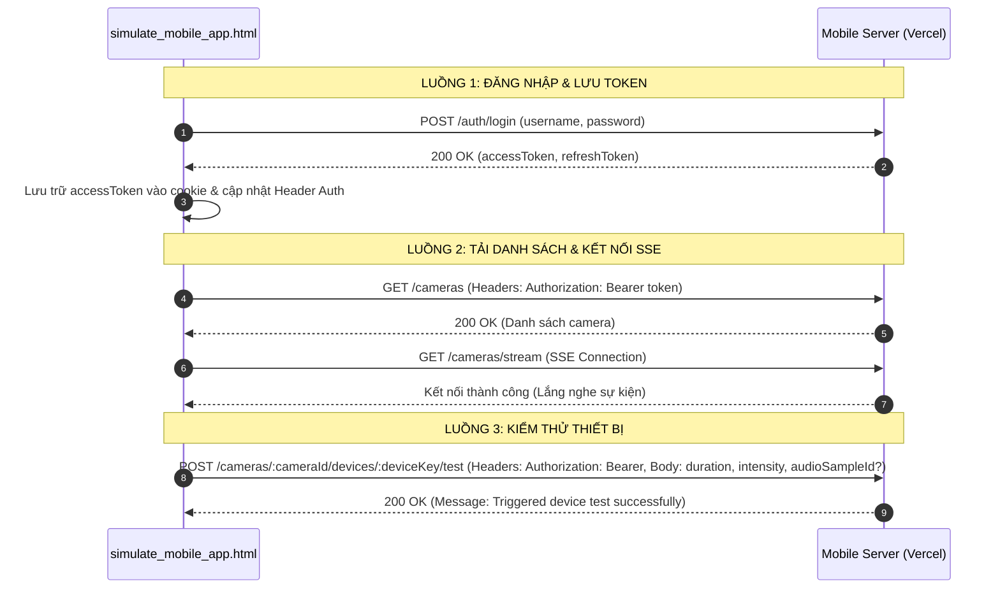

# Kế hoạch Xây dựng Công cụ Giả lập Mobile App (`html_tool/simulate_mobile_app.html`)

Tài liệu này trình bày kế hoạch thiết kế và phát triển công cụ giả lập tĩnh (Static HTML/JS) chạy trên trình duyệt nhằm mô phỏng các tương tác cốt lõi của **Ứng dụng Di động Android (Android App)** với **Mobile Server** trên cả môi trường local và production.

---

## 1. Mục tiêu và Phạm vi

Công cụ này tích hợp các luồng tương tác phía Client dựa trên các tài liệu thiết kế hệ thống ([02-dac-ta-man-hinh-android-app.md](file:///Users/trungnguyen/GitHub/Wildlife-Warning-and-Deterrence-System/docs/02-dac-ta-man-hinh-android-app.md) và [03-mobile_api.md](file:///Users/trungnguyen/GitHub/Wildlife-Warning-and-Deterrence-System/docs/03-mobile_api.md)):

1.  **Xác thực người dùng (Authentication):**
    *   Đăng nhập tài khoản (`POST /auth/login`) bằng tên đăng nhập và mật khẩu.
    *   Nhận và lưu trữ JWT `accessToken` vào cookie của trình duyệt để duy trì trạng thái đăng nhập khi reload trang.
    *   Tự động đính kèm header `Authorization: Bearer <accessToken>` cho tất cả các cuộc gọi API bảo mật phía sau.
2.  **Quản lý & Xem Camera (Camera Management):**
    *   Tải danh sách trạm camera (`GET /cameras`) mà người dùng được phép xem, bao gồm trạng thái hoạt động (`ONLINE`/`OFFLINE`), ảnh chụp snapshot gần nhất và thông tin động vật phát hiện (nếu có).
3.  **Kênh nhận thông tin sự kiện thời gian thực (SSE Event Stream):**
    *   Mở kết nối Server-Sent Events (SSE) tới đường dẫn `GET /cameras/stream` để lắng nghe luồng sự kiện từ xa.
    *   Nhận các thông báo cập nhật thiết bị hoặc sự kiện khẩn cấp từ hệ thống để làm mới giao diện.
4.  **Kiểm thử thiết bị tại hiện trường (Device Testing):**
    *   Mô phỏng chức năng của Kiểm lâm khi muốn kiểm tra đèn chớp, loa phát thanh xua đuổi hoặc hàng rào điện của trạm camera.
    *   Gửi yêu cầu điều khiển tới API `POST /cameras/{cameraId}/devices/{deviceKey}/test` chứa các tham số tùy chọn (độ lớn âm lượng, thời gian chạy, mẫu âm thanh).

---

## 2. Giao diện Người dùng & Thiết kế Thẩm mỹ (UI/UX)

Giao diện sẽ tuân thủ phong cách thiết kế **Forest Dark Mode** đồng bộ với các công cụ mô phỏng trước đó trong bộ công cụ phát triển:

*   **Bảng màu chủ đạo:**
    *   Nền tối: HSL Forest Black (`#0a140f`) kết hợp tấm nền Glassmorphic mờ ảo (`rgba(16, 28, 22, 0.65)`).
    *   Đường viền: Green Moss (`rgba(46, 125, 50, 0.3)`).
    *   Điểm nhấn: Forest Gold (`#ffc107` hoặc `#ffb300`).
*   **Bố cục phân trang (Two-Column Layout) & Chi tiết Input:**
    *   *Cột trái: Xác thực & Điều khiển Camera*
        *   **Cấu hình API Endpoint:**
            *   *HTTP Server URL:* Input text chứa địa chỉ máy chủ gọi API REST (mặc định: `https://wildlife-warning-and-deterrence-sys.vercel.app`).
            *   *Môi trường:* Hộp chọn nhanh (Select) giữa `Production (Vercel)` và `Local Development (localhost:5001)`.
        *   **Bảng Đăng nhập (Authentication Panel):**
            *   *username:* Input text nhập tài khoản kiểm lâm/kiểm soát (ví dụ: `ranger_evt`).
            *   *password:* Input password nhập mật khẩu (mặc định: `password123`).
            *   *Nút bấm:* Nút "Đăng nhập" (kích hoạt đăng nhập và lưu token).
            *   *Trạng thái:* Huy hiệu trạng thái đăng nhập (`ĐÃ ĐĂNG NHẬP` màu xanh lá cây hoặc `GUEST` màu đỏ) kèm thông tin hiển thị JWT token thu gọn.
        *   **Bảng điều khiển danh sách Camera (Camera List Panel):**
            *   Nút bấm "Tải danh sách Camera" (`GET /cameras`).
            *   Khung hiển thị danh sách các thẻ trạm camera. Mỗi thẻ chứa: tên camera, icon trạng thái hoạt động, ảnh snapshot thu nhỏ gần nhất, và thông tin chi tiết các loài vật đang bị phát hiện.
    *   *Cột phải: Kiểm thử thiết bị & Lắng nghe Luồng sự kiện (SSE)*
        *   **Bảng Kiểm thử thiết bị (Device Test Panel):**
            *   *cameraID:* Ô nhập text mã trạm camera muốn kiểm tra (mặc định: tự động chọn từ camera được nhấp chọn ở danh sách hoặc nhập tay, e.g., `CAM_EVT_01`).
            *   *deviceKey:* Hộp chọn (Select) loại thiết bị muốn test (`deterrent_audio` / `speaker` - Loa phát thanh, `led_light` - Đèn LED chớp sáng, `electric_fence` - Hàng rào điện sinh học).
            *   *durationSeconds:* Ô nhập số nguyên thiết lập thời gian chạy thử (mặc định: `10` giây, giới hạn từ 1 đến 120 giây).
            *   *intensity:* Ô nhập số nguyên thiết lập cường độ/âm lượng chạy thử (mặc định: `80`, giới hạn từ 1 đến 100).
            *   *audioSampleId:* Ô gợi ý danh sách âm thanh local (chỉ hiển thị và cho nhập khi chọn loại thiết bị loa, e.g., `A_gunshot`, `A_growl`, `A_dog_bark`, `N_warning_thu`).
            *   *Nút bấm:* Nút **"Kích hoạt Kiểm thử (Test Device)"** màu vàng sáng rực.
            *   *Mã cURL phản ánh:* Đoạn mã cURL sinh tự động hiển thị cấu trúc request kèm Token để dễ dàng copy/paste debug.
            *   *JSON Response:* Hộp hiển thị kết quả phản hồi của yêu cầu test thiết bị.
        *   **Bộ giám sát luồng sự kiện thời gian thực (SSE Monitor):**
            *   Nút bấm "Kết nối Event Stream" / "Ngắt kết nối".
            *   Huy hiệu trạng thái kết nối stream (`STREAMING` nhấp nháy xanh lá cây hoặc `CLOSED` màu đỏ).
            *   Log Terminal hiển thị danh sách thời gian thực của các tin nhắn sự kiện đẩy về từ Server (như cập nhật trạng thái camera, cảnh báo thú xâm nhập mới).

---

## 3. Chi tiết Luồng xử lý & Logic Javascript

### 3.1. Các phần tử DOM & Sự kiện tương tác
*   Hàm `getCookie(name)` và `setCookie(name, value, days)` dùng để đọc và lưu trữ thông tin cấu hình Server URL, tên đăng nhập và mã JWT Token.
*   Cơ chế kết nối EventSource SSE:
    *   Do thư viện `EventSource` chuẩn của trình duyệt không hỗ trợ trực tiếp việc đính kèm header tùy chỉnh (như `Authorization: Bearer <token>`), Nô Tài sẽ sử dụng giải pháp mở kết nối SSE nâng cao bằng cách truyền `accessToken` trực tiếp vào Query Parameter khi gọi API nếu máy chủ có hỗ trợ, hoặc hiển thị cảnh báo hướng dẫn rõ ràng.
    *   Mọi thông điệp nhận được trên luồng `onmessage` của SSE sẽ được định dạng đẹp mắt trong Terminal Log của Cột phải.
*   Tự động điền nhanh các mã `cameraID` khi người dùng nhấp chuột vào một trạm camera cụ thể trên giao diện danh sách.

---

## 4. Kế hoạch Thay đổi Chi tiết

### [NEW] [simulate_mobile_app.html](file:///Users/trungnguyen/GitHub/Wildlife-Warning-and-Deterrence-System/html_tool/simulate_mobile_app.html)
*   Xây dựng mã nguồn hoàn chỉnh của trang HTML tĩnh chứa giao diện Forest Dark Mode giả lập Mobile App, CSS hoạt họa hiển thị và mã điều khiển Javascript tương tác.

### [MODIFY] [walkthrough.md](file:///Users/trungnguyen/.gemini/antigravity-ide/brain/d8661faf-34e6-4ef5-9adf-8292c66e70c7/walkthrough.md)
*   Cập nhật nhật ký tiến trình phát triển để bao gồm công cụ giả lập Mobile App mới.

---

## 5. Kế hoạch Kiểm tra & Xác minh (Verification Plan)

### Kiểm thử thủ công trên Giao diện mô phỏng
1.  **Kiểm tra Xác thực:**
    *   Nhập tài khoản Kiểm lâm (`ranger_evt`) và mật khẩu `password123`. Bấm đăng nhập.
    *   Xác nhận nhận mã phản hồi thành công và giao diện chuyển trạng thái sang `ĐÃ ĐĂNG NHẬP` kèm Token.
2.  **Kiểm tra Danh sách Camera:**
    *   Sau khi đăng nhập, bấm "Tải danh sách Camera".
    *   Xác nhận hệ thống vẽ lại đầy đủ các trạm camera trực thuộc (ví dụ: `CAM_EVT_01`, `CAM_PROD_TEST`) kèm ảnh chụp tương ứng.
3.  **Kiểm tra Test thiết bị:**
    *   Bấm chọn trạm camera `CAM_PROD_TEST`.
    *   Chọn thiết bị `speaker` hoặc `deterrent_audio`, âm lượng `90`, chọn mã âm thanh `A_explosion` (Tiếng nổ lớn).
    *   Bấm "Test Device".
    *   Xác nhận nhận kết quả `200 OK` (Triggered device test successfully) từ máy chủ Vercel.
    *   (Tùy chọn) Nếu đồng thời đang mở công cụ giả lập AI Server [simulate_ai_server.html](file:///Users/trungnguyen/GitHub/Wildlife-Warning-and-Deterrence-System/html_tool/simulate_ai_server.html) dưới cùng một `userId`, hãy kiểm tra xem bên công cụ AI Server đó có nhận được tín hiệu test loa từ WebSocket và phát sóng âm/chớp đèn hay không.
