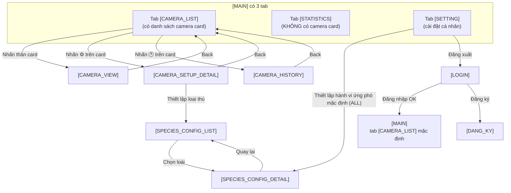

# Đặc tả màn hình chức năng — Android App

**Dự án:** Ứng dụng hệ thống cảnh báo và xua đuổi động vật hoang dã

**Nền tảng:** Android (Mobile App)

**Hướng hiển thị:** Vertical (Portrait) only — khóa cứng xoay dọc để tối ưu thao tác một tay ngoài thực địa.

**Ngôn ngữ giao diện:** Tiếng Việt (mặc định)

---

## Mục lục màn hình

1. `[LOGIN]` — Màn hình đăng nhập
2. `[MAIN]` — Trung tâm điều khiển với 3 tab `[CAMERA_LIST]` / `[STATISTICS]` / `[SETTING]` *(chỉ tab `[CAMERA_LIST]` hiển thị danh sách camera; tab `[CONTROL]` đã được bỏ — các toggle thiết bị ứng phó toàn hệ thống chuyển sang `[SPECIES_CONFIG_DETAIL]`)*
3. `[CAMERA_VIEW]` — Xem chi tiết một Camera
4. `[CAMERA_HISTORY]` — Lịch sử ghi hình của một Camera
5. `[CAMERA_SETUP_DETAIL]` — Thiết lập chi tiết một Camera
6. `[SPECIES_CONFIG_LIST]` — Danh sách loại thú cần thiết lập
7. `[SPECIES_CONFIG_DETAIL]` — Thiết lập hành vi phòng vệ theo loài

> ℹ️ **Bố cục tab hiện tại của `[MAIN]`:**
> - Tab `[CAMERA_LIST]` *(mặc định)*: danh sách camera card.
> - Tab `[STATISTICS]`: thống kê tổng hợp toàn hệ thống.
> - Tab `[SETTING]`: cài đặt chung (ngôn ngữ, theme, đăng xuất) — **không còn** toggle thiết bị ứng phó toàn hệ thống (đã chuyển sang `[SPECIES_CONFIG_DETAIL]`).
> - ~~Tab `[CONTROL]`~~: **đã xoá** — không tồn tại nữa.

---

## 1. `[LOGIN]` — Màn hình đăng nhập

Màn hình khởi đầu khi người dùng mở ứng dụng lần đầu (chưa có session hợp lệ).

| Thành phần | Kiểu | Mô tả |
|---|---|---|
| Logo ứng dụng | Image | Logo dự án canh giữa phía trên cùng. |
| Tiêu đề `Đăng nhập` | Text | Tiêu đề màn hình. |
| Ô nhập Số điện thoại | TextField | Nhập SĐT dùng để đăng nhập. |
| Ô nhập Mật khẩu | TextField | Password field, dấu `*`, có nút con mắt để hiện/ẩn. |
| Nút `Đăng nhập` | Button | Xác thực tài khoản → chuyển sang `[MAIN]` nếu thành công. |
| Nút `Đăng ký` | Button (text link) | Mở `[DANG_KY]` (màn hình đăng ký — tham chiếu tài liệu đề tài). |
| Nút `Quên mật khẩu?` | Button (text link) | Mở luồng khôi phục mật khẩu qua SMS OTP. |

**Luồng chính:**
- `Đăng nhập` thành công → `[MAIN]` (tab `[CAMERA_LIST]` mặc định).
- `Đăng nhập` thất bại → hiển thị Snackbar lỗi (SĐT hoặc mật khẩu sai).

---

## 2. `[MAIN]` — Trung tâm điều khiển (3 tab)

Màn hình chính sau khi đăng nhập. **Mỗi tab có layout nội dung hoàn toàn khác nhau** — chuyển tab là chuyển hẳng sang "trang" mới, không phải lướt ngang:

- **Dọc (Vertical — mặc định):** Thanh tab nằm ở **dưới cùng** màn hình (Bottom Tab Bar), nội dung tab chiếm phần còn lại phía trên.
- **Ngang (Horizontal — chỉ preview thiết kế):** Thanh tab nằm **bên phải** (Right Tab Bar), nội dung tab chiếm phần còn lại bên trái.

| Tab | Mặc định | Mô tả ngắn |
|---|---|---|
| `[CAMERA_LIST]` | ✅ Hiển thị đầu tiên | Danh sách camera (mỗi card có timestamp + background chớp theo mức nguy hiểm + badge cảnh báo). |
| `[STATISTICS]` | | Biểu đồ thống kê + heatmap tổng quan. |
| `[SETTING]` | | Cài đặt chung (ngôn ngữ, giao diện, đăng xuất). |

> ❓ **Quan trọng:**
>
> 1. **Danh sách camera chỉ hiển thị ở tab `[CAMERA_LIST]`.** Hai tab `[STATISTICS]` và `[SETTING]` không có danh sách camera.
> 2. **Tab `[CONTROL]` đã bỏ hẳn.** Trước đây tab `[CONTROL]` cho phép ghi đè nhanh *toàn hệ thống* các toggle (SMS/Loa/Âm thanh/LED/Hàng rào/Kiểm lâm). Thay vào đó, các toggle này hiện được **chuyển toàn bộ sang `[SPECIES_CONFIG_DETAIL]`** (cấu hình theo loài × camera) — vì "cài đặt theo từng loài × từng camera" thực chất đã bao phủ toàn bộ thiết bị trong hệ thống, không cần một lớp ghi đè toàn cục riêng.

---

### 2.1. `[CAMERA_LIST]` — Tab danh sách camera *(mặc định)*

Tab `[CAMERA_LIST]` (trước đây có tên `[WARNING]`) — đổi tên vì ngữ nghĩa của nó là **danh sách quản lý camera**, không chỉ thuần tuý cảnh báo. Vẫn giữ chức năng cảnh báo khẩn cấp trong cùng tab.

> ℹ️ **Lưu ý về vị trí các Icon / Nút trên từng Camera Card:**
> - **Không có** bất kỳ icon/nút Cài đặt hay Lịch sử nào ở thanh header/top bar của màn `[MAIN]` — kể cả FAB floating button.
> - Mọi điều khiển đặc thù cho 1 camera (xem `[CAMERA_VIEW]`, cài đặt, xem lịch sử…) đều **gắn ngay trên Camera Card** → nhấn sẽ nhảy thẳng vào màn tương ứng của camera đó, **không qua màn chọn camera trung gian**.

#### b) Banner cảnh báo nhấp nháy *(tuỳ chọn UI; có thể bỏ nếu badge trên card đã đủ)*

| Thành phần | Mô tả |
|---|---|
| Banner | Có animation nhấp nháy đỏ/vàng. Nội dung: `Tên camera · Phát hiện [LOÀI] · [giờ:phút]`. Ví dụ: `Cam 1 · Phát hiện VOI · 9:04`. |
| Phân tích AI bên dưới banner | Loài, Số lượng cá thể, Mức độ nguy hiểm, Độ tin cậy AI (%). |

**Hành vi:** Banner tự động xuất hiện khi server gửi sự kiện FCM tới thiết bị. Nhấn vào banner → chuyển sang `[CAMERA_VIEW]` của camera tương ứng. Vì mỗi Camera Card đã có badge cảnh báo nhấp nháy riêng (phụ thuộc mức nguy hiểm), banner sticky trên đầu tab có thể *bỏ qua* nếu thấy dư thừa.

#### a) Danh sách thẻ camera

> Số lượng camera **không cố định 4** — render động theo số camera thực tế trong hệ thống (1 hoặc nhiều hơn).

Tab `[CAMERA_LIST]` gồm **một khối duy nhất**: lưới các Camera Card. Mọi thông tin, bộ lọc, điều khiển cụ thể cho từng camera được đặt ngay trong **card của camera đó** (xem mục a1).

#### a1) Chi tiết một Camera Card

Mỗi card là **đơn vị nhỏ nhất** của danh sách, đại diện cho 1 camera. Mô tả theo **thông tin hiển thị** + **điều khiển khả dụng**.

##### Thông tin hiển thị

| # | Thông tin | Kiểu | Mô tả |
|---|---|---|---|
| 1 | **Trạng thái kết nối** | Status indicator | `🟢 Online` (xanh lá) · `⚪ Offline` (xám). Khi offline ≥ 30s sẽ hiển thị rõ đi kèm icon offline. |
| 2 | **Tên camera** | Text (Bold) | `Cam 1`, `Cam 2`… (đánh số tự động); có thể đổi sang tên tuỳ chỉnh trong `[CAMERA_SETUP_DETAIL]` (vd: `Cam Khu A`). |
| 3 | **Khu vực lắp đặt** | Text (caption) | Mô tả ngắn vị trí: `Rìa rừng phía B`, `Trạm 2 · Đồi cao`… Cắt bớt nếu dài. |
| 4 | **Ảnh thumbnail** | Image (16:9) | Ảnh snapshot gần nhất có **độ tin cậy AI ≥ 50%**. Nếu chưa có → placeholder icon camera + nền xám. Nếu offline → overlay icon `⚪ Offline` + tối màu 50%. Khi đang tải → shimmer effect. |
| 5 | **Badge cảnh báo trên ảnh** *(tuỳ trạng thái)* | Animated badge | Chỉ hiện khi camera có sự kiện AI mới trong 30 phút chưa xem. Nội dung: `⚠️ [LOÀI] · [%]` (vd: `⚠️ VOI · 92%`). Animation nhấp nháy đỏ-vàng nếu mức nguy hiểm cao. Tắt nhấp nháy khi user đã mở `[CAMERA_VIEW]` của camera đó (giữ nguyên badge để vẫn biết có sự kiện). |
| 6 | **Thời gian ghi nhận hình ảnh** *(timestamp snapshot)* | TextOverlay | Mốc thời gian server **chụp ảnh snapshot**, không phải live. Định dạng `HH:mm · dd/MM` (vd: `9:04 · 16/07`); tooltip dài hơn `HH:mm:ss · dd/MM/yyyy`. Hiển thị overlay góc dưới-trái của ảnh thumbnail, nền đen mờ 60% chữ trắng. Nếu ảnh > 1 giờ: thêm nhãn "cũ" hoặc icon `⏰` cảnh báo (vd: `9:04 · 16/07 · ⏰ cũ`); > 24 giờ: hiển thị cả ngày `16/07` rõ. Nếu chưa có ảnh → text gạch chân `—`. Khi user vào `[CAMERA_VIEW]` → xem thêm "Cách đây X phút" (relative time). |

##### Điều khiển (Controls)

| # | Điều khiển | Vị trí trong card | Hành vi |
|---|---|---|---|
| C1 | **Nhấn vào thân card** *(ngoại trừ các icon điều khiển)* | Toàn bộ card | Mở `[CAMERA_VIEW]` của camera đó. |
| C2 | **Icon `⚙️` Cài đặt** *(IconButton)* | Góc trên-phải card | Mở thẳng `[CAMERA_SETUP_DETAIL]` của camera đó. **Bắt buộc dừng propagation** để không kích hoạt nhầm C1. |
| C3 | **Icon `🕐` Lịch sử** *(IconButton)* | Góc dưới-phải card (hoặc trên dòng `Tên camera + Khu vực`) | Mở thẳng `[CAMERA_HISTORY]` của camera đó. **Bắt buộc dừng propagation** để không kích hoạt nhầm C1. |
| C4 | **Long-press** *(tuỳ chọn)* | Toàn bộ card | Hiện menu nhanh: `Mở cài đặt` (→ `[CAMERA_SETUP_DETAIL]`) · `Xem lịch sử` (→ `[CAMERA_HISTORY]`) · `Đánh dấu đã xem`. |
| C5 | **Vuốt sang trái** *(tuỳ chọn)* | Toàn bộ card | Hiện 2 nút nhanh: `Lịch sử` (→ `[CAMERA_HISTORY]`) · `Cài đặt` (→ `[CAMERA_SETUP_DETAIL]`). |

> 💡 `C2` (`⚙️`) và `C3` (`🕐`) là **2 icon thường trực** của mỗi card — user luôn thấy và dùng được ngay. `C4`/`C5` là tuỳ chọn UX, có thể bỏ nếu thấy icon thường trực đã đủ.

##### Trạng thái của card (Card state)

Trạng thái card gồm **hai chiều độc lập**, kết hợp để quyết định render:

> **Chiều 1 — Background chớp theo mức cảnh báo** *(do AI quyết định, dựa trên mức độ nguy hiểm của loài phát hiện gần nhất)*:
>
> | Mức cảnh báo | Loài đại diện | Background card | Tần suất chớp |
> |---|---|---|---|
> | **Cao** | Voi, Hổ, Báo, Tê giác, Rắn, Cá sấu, Người lạ | Nền **đỏ** (đỏ chói #D32F2F) phủ 12-18% | Nhấp nháy **nhanh**: 1 nhịp / 1s, alpha dao động 12%-18%, kèm glow đỏ xung quanh border |
> | **Trung bình** | Nai lớn, Khỉ đàn, Heo rừng | Nền **vàng / hổ phách** (#F9A825) phủ 10-14% | Nhấp nháy **vừa**: 1 nhịp / 1.5s, alpha dao động 10%-14%, không glow |
> | **Thấp** | Sóc, chim, các loài ít nguy hại | Nền **xanh nhạt** (#43A047) phủ 6-8% (chỉ tint, không chớp) | Không chớp — chỉ tint nhẹ ổn định |
> | **Không có sự kiện** | — | Nền trắng/kem bình thường | Không chớp |
>
> Quy tắc: chỉ áp dụng khi **ảnh snapshot có độ tin cậy ≥ 50%** và trong vòng **30 phút** gần đây. Quá 30 phút → tự động chuyển về "Thấp / không có sự kiện".

> **Chiều 2 — Đã xem / Chưa xem** *(do User quyết định)*:
>
> | Trạng thái | Điều kiện | Render |
> |---|---|---|
> | **Chưa xem** | User chưa mở `[CAMERA_VIEW]` của camera này. | Badge cảnh báo **có animation chớp** + border sáng. |
> | **Đã xem** | User đã mở `[CAMERA_VIEW]`. | Badge vẫn hiện (giữ thông tin) nhưng **tắt animation chớp**, border giảm sáng xuống mức "đã xem". |

**Kết hợp 2 chiều** *(ma trận render cuối cùng của card)*:

| Trạng thái tổng hợp | Background | Badge | Border |
|---|---|---|---|
| Có thú nguy hiểm cao + Chưa xem | Đỏ chớp nhanh + glow | `⚠️ [LOÀI] · [%]` chớp | Đỏ sáng |
| Có thú nguy hiểm cao + Đã xem | Đỏ chớp nhanh (giữ để cảnh báo liên tục 30 phút) | `⚠️ [LOÀI] · [%]` tĩnh | Đỏ vừa |
| Có thú TB + Chưa xem | Vàng chớp vừa | `⚠️ [LOÀI] · [%]` chớp | Vàng |
| Có thú TB + Đã xem | Vàng chớp vừa | `⚠️ [LOÀI] · [%]` tĩnh | Vàng nhạt |
| Có thú thấp / không có | Xanh nhạt (tĩnh) hoặc nền trắng | Không có | Xám nhạt |
| **Offline** | Nền xám đậm 50% | Ảnh tối + overlay `⚪ Offline` | Xám đậm |

##### Quy tắc render

- Grid 2 cột trên tablet/screen lớn; grid 2 cột trên điện thoại ≥ 360dp; rơi về 1 cột nếu < 320dp.
- Aspect ratio ảnh thumbnail: **16:9** (khoảng 65% chiều cao card).
- Border radius card: 12dp. Elevation: 2dp (shadow nhẹ).
- Thumbnail đang tải: shimmer effect.

---

### 2.2. `[STATISTICS]` — Tab thống kê

Tab này **không có danh sách camera**. Chỉ hiển thị thống kê tổng hợp toàn hệ thống:

| Thành phần | Mô tả |
|---|---|
| Khối `Phát hiện trong tuần` | Danh sách các sự kiện: `Camera · Ngày giờ · Loài`. |
| Khối `Phân tích theo từng camera` | Số lần xuất hiện, xu hướng (Chart line), khu vực di chuyển (sơ đồ/heatmap rừng). |
| Bộ lọc | Theo khoảng thời gian (7 ngày / 30 ngày / tuỳ chỉnh) · theo loài · theo camera cụ thể. |

> 💡 *Lưu ý:* Muốn xem **lịch sử chi tiết từng camera**, nhấn icon `🕐` trên Camera Card tương ứng ở tab `[CAMERA_LIST]` → `[CAMERA_HISTORY]`. Tab `[STATISTICS]` chỉ cung cấp cái nhìn tổng quan.

---

### 2.3. `[SETTING]` — Tab cài đặt

Tab này là **phiên bản Bottom Tab** của màn `[SETTING]` cũ (mở từ menu). Vì tab `[CONTROL]` đã được lược bỏ, **đây là nơi duy nhất** để user chỉnh cài đặt cá nhân và quản trị tài khoản.

| Thành phần | Kiểu | Mô tả |
|---|---|---|
| `Ngôn ngữ` | Dropdown | `Tiếng Việt` (mặc định) · `English`. |
| `Giao diện sáng/tối` | Toggle | `Sáng` / `Tối` (theo system hoặc thủ công). |
| `Thông báo SMS` | Toggle | Bật/tắt chuông điện thoại khi nhận SMS cảnh báo. |
| `Thiết lập hành vi ứng phó mặc định cho toàn hệ thống` | Button | Mở `[SPECIES_CONFIG_DETAIL]` với kịch bản tổng (chọn `Áp dụng cho tất cả`). |
| `Đăng xuất` | Button | Xoá session → về `[LOGIN]`. |

> 💡 **Không có** toggle thiết bị ứng phó (SMS / Loa / Âm thanh / LED / Hàng rào / Kiểm lâm) ở đây — các toggle này **chuyển hẳn sang `[SPECIES_CONFIG_DETAIL]`** (xem mục 7 chi tiết hơn).
> Lý do: vì SPECIES_CONFIG_DETAIL có hỗ trợ cấu hình `Áp dụng cho tất cả` camera, nó đã bao phủ toàn bộ phạm vi "cấu hình hệ thống"; không cần lớp ghi đè toàn cục riêng.

---

## 3. `[CAMERA_VIEW]` — Xem chi tiết một Camera

Được mở khi user nhấn vào một thẻ camera từ `[MAIN]` (tab `[CAMERA_LIST]`).

> ℹ️ **Màn này KHÔNG hiển thị live video streaming.** Nó hiển thị **ảnh snapshot** gần nhất từ camera. Theo thuật toán ở [de-tai-nghien-cuu-canh-bao-dong-vat.md:131-170](outputs/de-tai-nghien-cuu-canh-bao-dong-vat.md#L131-L170), server AI chỉ ghi nhận snapshot mỗi 2 giây/lần khi có chuyển động đáng kể, do đó ảnh trong màn này có thể đã cũ vài giây đến vài phút tuỳ mức độ hoạt động của thú.

**Bố cục màn hình (Vertical):**

| Vị trí | Nội dung |
|---|---|
| Top bar | Nút `Back` ← về `[MAIN]` · Tên Camera · Trạng thái online/offline · Icon `↻` Refresh (kéo xuống để refresh thủ công snapshot mới nhất). |
| Nửa trên | **Khung ảnh Snapshot** (không phải live video) + overlay timestamp `HH:mm:ss · dd/MM/yyyy` góc dưới-trái ảnh, và dòng "Cách đây X phút/giây" ở góc dưới-phải (relative time tự cập nhật mỗi 10s). |
| Ngay dưới ảnh | **Thông báo độ mới của ảnh:** nếu > 5 phút hiển thị chip cảnh báo nhỏ: `⏰ Ảnh cách đây 12 phút — có thể đã cũ`. Nếu > 30 phút: chip đỏ `⚠️ Ảnh cũ — kiểm tra camera`. |
| Nửa dưới | **Bảng thông tin AI:** Loài · Số lượng · Mức độ nguy hiểm · Độ tin cậy (%). |
| Cuối | Các **nút ghi đè (override)** bật/tắt nhanh thiết bị ngoại vi của riêng trạm camera đó: SMS · Loa phát thanh · Âm thanh xua đuổi · Đèn LED nhấp nháy · Hàng rào điện · Báo Kiểm lâm. |

**Hành vi:**
- Ảnh snapshot tự động refresh mỗi ~2 giây khi AI phát hiện chuyển động đáng kể. Khi không có chuyển động → ảnh giữ nguyên cho đến khi có snapshot mới.
- Pull-to-refresh → gửi yêu cầu lấy snapshot mới nhất từ server.
- Relative time tự cập nhật định kỳ (`mỗi 10s`) nhưng timestamp tuyệt đối trên ảnh chỉ thay đổi khi nhận snapshot mới.
- Banner cảnh báo có thể hiển thị phía trên khung ảnh khi vừa có sự kiện mới: `Cam 1 · Phát hiện VOI · 9:04`.
- Nút `Back` → `[MAIN]`.

---

## 4. `[CAMERA_HISTORY]` — Lịch sử ghi hình của một Camera

Được mở khi user nhấn icon `🕐 Lịch sử` trên Camera Card tương ứng ở `[MAIN]` (tab `[CAMERA_LIST]`).

| Thành phần | Mô tả |
|---|---|
| Top bar | Nút `Back` ← quay lại; Tên Camera; bộ lọc (khoảng thời gian, loài). |
| Danh sách bản ghi | Mỗi bản ghi là 1 Card, gồm: Ảnh chụp snapshot · `giờ:phút:giây` · `Thứ, dd/MM/yyyy` · Độ tin cậy (%) · Số lượng · Loài. |

**Hành vi:**
- Nhấn vào 1 bản ghi → mở màn hình chi tiết (ảnh lớn, metadata đầy đủ).
- Nút `Back` → về `[MAIN]` (tab `[CAMERA_LIST]`).

---

## 5. `[CAMERA_SETUP_DETAIL]` — Thiết lập chi tiết một Camera

Được mở khi user nhấn icon `⚙️ Cài đặt` trên một thẻ camera ở `[MAIN]` (tab `[CAMERA_LIST]`).

| Thành phần | Kiểu | Mô tả |
|---|---|---|
| Ô đổi `Tên camera` | TextField | Sửa tên hiển thị (vd: `Cam 1` → `Cam Khu A`). |
| Ô đổi `Khu vực lắp đặt` | TextField | Sửa mô tả vị trí lắp đặt. |
| Nút `Bật/Tắt camera` | Toggle | Bật hoặc tắt stream từ camera đó. |
| Nút `Thiết lập loại thú` | Button | Mở `[SPECIES_CONFIG_LIST]`. |
| Nút `Cấu hình kịch bản mặc định` | Button | Lối tắt tới `[SPECIES_CONFIG_DETAIL]` với kịch bản tổng. |
| Nút `Lưu` | Button | Lưu thay đổi. |

---

## 6. `[SPECIES_CONFIG_LIST]` — Danh sách loại thú cần thiết lập

Được mở khi user nhấn nút `Thiết lập loại thú` trong `[CAMERA_SETUP_DETAIL]`.

| Thành phần | Mô tả |
|---|---|
| Tiêu đề | `Thiết lập phòng vệ theo loài` |
| Danh sách loài đã biết | Voi, Cọp, Nai, Khỉ, Heo rừng… |

**Mỗi Card loài gồm:**

| Trường | Mô tả |
|---|---|
| Tên loài | `VOI`, `CỌP`, `NAI`… |
| Chỉ số hung dữ | `0/10` - `10/10` (thang đo nguy hiểm). |
| Tập tính | Di chuyển theo bầy, hoạt động về đêm… |
| Cách phòng vệ | Mô tả ngắn kịch bản mặc định: Silent Alert / Active Deterrent. |

**Hành vi:**
- Nhấn vào 1 loài → highlight + mở `[SPECIES_CONFIG_DETAIL]`.

---

## 7. `[SPECIES_CONFIG_DETAIL]` — Thiết lập hành vi phòng vệ theo loài

Được mở khi:
- User chọn bất kỳ loài từ `[SPECIES_CONFIG_LIST]`; **hoặc**
- User nhấn nút `Thiết lập hành vi ứng phó mặc định cho toàn hệ thống` ở tab `[SETTING]` của `[MAIN]` *(mở với scope `Áp dụng cho tất cả` để cấu hình chung)*.

### 7.1. Bộ chọn phạm vi áp dụng

| Thành phần | Mô tả |
|---|---|
| Chọn Camera (Dropdown/Chips) | Chọn trạm camera để áp dụng (bất kỳ cam nào có trong hệ thống hoặc `Áp dụng cho tất cả`). |

### 7.2. Các nhóm cài đặt chi tiết (Defense Parameter Configurations)

**Âm thanh xua đuổi:**
- Loại âm thanh: `Tiếng súng`, `Tiếng gầm`, `Tiếng chó sủa lớn`, `Tiếng nổ giả lập`, `Tần số siêu âm`.
- Thanh trượt cường độ: `1 - 100`.
- Nút `Nghe thử (Test Audio)`.

**Đèn LED nhấp nháy:**
- Tần suất: `2 lần/giây`, `4 lần/giây`, `Nhấp nháy ngẫu nhiên`.
- Màu sắc: `Đỏ`, `Trắng`, `Đỏ xen kẽ Trắng`.
- Thời lượng (giây).

**Hàng rào điện:**
- Mức dòng điện sinh học: `Thấp`, `Trung bình`, `Mạnh`.
- Đèn cảnh báo đi kèm: Toggle bật/tắt đèn vàng/đỏ nhấp nháy.
- Cơ chế thông báo: Toggle tự động gửi SMS/Push khi hàng rào hoạt động.
- Tự ngắt: Sau **2 phút** không phát hiện thú → tự động ngắt.

**Phát cảnh báo qua loa:**
- Mẫu nội dung: `Mẫu 1 (Voi hoang dã)`, `Mẫu 2 (Thú dữ xâm lấn)`, `Mẫu 3 (Di tản lánh nạn)`.
- Giới tính giọng nói: `Nam` / `Nữ`.

**Thông báo:**
- Toggle `Gửi SMS`.
- Toggle `Gửi Push Notification`.

### 7.3. Toggle thiết bị ứng phó toàn hệ thống *(chỉ hiện khi Bộ chọn Camera ở mục 7.1 = `Áp dụng cho tất cả`)*

> 🔁 **Lưu lịch sử từ bản cũ:** Đây là phần nội dung **chuyển hẳn từ tab `[CONTROL]` cũ (đã xoá) sang đây**. Mục đích: cho phép bật/tắt nhanh 6 thiết bị ứng phó toàn hệ thống mà không cần vào từng loài.

**Nhóm Thông báo:**
| Điều khiển | Toggle |
|---|---|
| Gửi tin nhắn SMS | `CÓ` / `KHÔNG` |
| Phát loa cảnh báo người dân | `CÓ` / `KHÔNG` |

**Nhóm Xử lý:**
| Điều khiển | Toggle |
|---|---|
| Âm thanh xua đuổi | `CÓ` / `KHÔNG` |
| Đèn LED nhấp nháy | `CÓ` / `KHÔNG` |
| Hàng rào điện | `CÓ` / `KHÔNG` |
| Gửi cảnh báo cho kiểm lâm | `CÓ` / `KHÔNG` |

> 💡 Các toggle ở đây tương đương với "Chế độ ghi đè nhanh toàn hệ thống": khi bật sẽ **che (override)** cấu hình riêng của từng loài × camera trong mục 7.2. Nếu muốn ưu tiên cấu hình riêng, đặt các toggle ở đây về `KHÔNG`.

### 7.4. Tự thiết lập hành vi nhanh (Preset Scenarios)

| Nút preset | Hành vi |
|---|---|
| `Người lạ đột nhập` | LED đỏ-trắng nhấp nháy + âm thanh báo động + push/SMS cho cơ quan chức năng. |
| `Thú vừa` | LED nhấp nháy + âm siêu âm/chó sủa + dòng điện nhẹ (Nai, Khỉ, Hươu cao cổ). |
| `Thú cực kỳ nguy hiểm` | **Silent Alert** — không loa/đèn tại chỗ; chỉ gửi Push/SMS cho người dân di tản. |
| `Tùy chỉnh` | Mở khoá các nhóm cài đặt chi tiết phía trên để chỉnh tay. |

### 7.5. Lưu

| Thành phần | Mô tả |
|---|---|
| Nút `Lưu` | Ghi các thông số xuống server. |
| Nút `Đặt lại` | Trả về giá trị mặc định. |

---

> ⛔ **Màn `[SETTING]` riêng (mở từ menu) đã bỏ.** Nội dung của nó đã được gộp vào **tab `[SETTING]` trong `[MAIN]`** (xem mục 2.3 phía trên).

---

## Phụ lục — Sơ đồ luồng chuyển màn hình

> 💡 *Lưu ý về thuật ngữ*: Màn trung tâm điều khiển có 3 tab hiện mang tên `[MAIN]` (trước viết là `[CAMERA_LIST]` ở bản cũ). Tab danh sách camera mang tên `[CAMERA_LIST]` (trước viết là `[WARNING]`). Tài liệu này đã được chuẩn hoá.

---

> **Ghi chú tác giả:**
> - File này là đặc tả *màn hình* (UI/UX), không bao gồm API/DB chi tiết — xem thêm tài liệu kỹ thuật trong `docs/`.
> - Mọi giá trị nhấp nháy/thời lượng/tần suất có thể chỉnh trong `[SPECIES_CONFIG_DETAIL]`.
