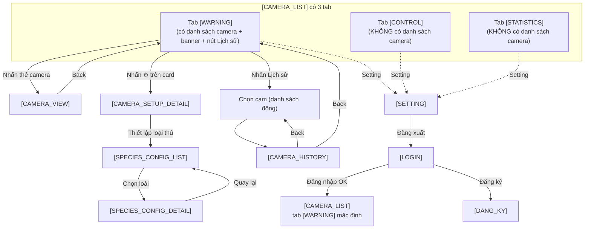

# Đặc tả màn hình chức năng — Android App

**Dự án:** Ứng dụng hệ thống cảnh báo và xua đuổi động vật hoang dã

**Nền tảng:** Android (Mobile App)

**Hướng hiển thị:** Vertical (Portrait) only — khóa cứng xoay dọc để tối ưu thao tác một tay ngoài thực địa.

**Ngôn ngữ giao diện:** Tiếng Việt (mặc định)

---

## Mục lục màn hình

1. `[LOGIN]` — Màn hình đăng nhập
2. `[CAMERA_LIST]` — Trung tâm điều khiển với 3 tab `[WARNING]` / `[CONTROL]` / `[STATISTICS]` *(chỉ tab `[WARNING]` hiển thị danh sách camera)*
3. `[CAMERA_VIEW]` — Xem chi tiết một Camera
4. `[CAMERA_HISTORY]` — Lịch sử ghi hình của một Camera
5. `[CAMERA_SETUP_DETAIL]` — Thiết lập chi tiết một Camera
6. `[SPECIES_CONFIG_LIST]` — Danh sách loại thú cần thiết lập
7. `[SPECIES_CONFIG_DETAIL]` — Thiết lập hành vi phòng vệ theo loài
8. `[SETTING]` — Cài đặt chung

---

## 1. `[LOGIN]` — Màn hình đăng nhập

Màn hình khởi đầu khi người dùng mở ứng dụng lần đầu (chưa có session hợp lệ).

| Thành phần | Kiểu | Mô tả |
|---|---|---|
| Logo ứng dụng | Image | Logo dự án canh giữa phía trên cùng. |
| Tiêu đề `Đăng nhập` | Text | Tiêu đề màn hình. |
| Ô nhập Số điện thoại | TextField | Nhập SĐT dùng để đăng nhập. |
| Ô nhập Mật khẩu | TextField | Password field, dấu `*`, có nút con mắt để hiện/ẩn. |
| Nút `Đăng nhập` | Button | Xác thực tài khoản → chuyển sang `[CAMERA_LIST]` nếu thành công. |
| Nút `Đăng ký` | Button (text link) | Mở `[DANG_KY]` (màn hình đăng ký — tham chiếu tài liệu đề tài). |
| Nút `Quên mật khẩu?` | Button (text link) | Mở luồng khôi phục mật khẩu qua SMS OTP. |

**Luồng chính:**
- `Đăng nhập` thành công → `[CAMERA_LIST]` (tab `[WARNING]` mặc định).
- `Đăng nhập` thất bại → hiển thị Snackbar lỗi (SĐT hoặc mật khẩu sai).

---

## 2. `[CAMERA_LIST]` — Trung tâm điều khiển (3 tab)

Màn hình chính sau khi đăng nhập. **Mỗi tab có layout nội dung hoàn toàn khác nhau** — chuyển tab là chuyển hẳn sang "trang" mới, không phải lướt ngang:

- **Dọc (Vertical — mặc định):** Thanh tab nằm ở **dưới cùng** màn hình (Bottom Tab Bar), nội dung tab chiếm phần còn lại phía trên.
- **Ngang (Horizontal — chỉ preview thiết kế):** Thanh tab nằm **bên phải** (Right Tab Bar), nội dung tab chiếm phần còn lại bên trái.

| Tab | Mặc định | Mô tả ngắn |
|---|---|---|
| `[WARNING]` | ✅ Hiển thị đầu tiên | Danh sách camera + banner cảnh báo + phân tích AI. |
| `[CONTROL]` | | Bật/tắt thiết bị ứng phó cho toàn hệ thống. |
| `[STATISTICS]` | | Biểu đồ thống kê + heatmap tổng quan. |

> ❓ **Quan trọng:** **Danh sách camera chỉ hiển thị ở tab `[WARNING]`.** Hai tab `[CONTROL]` và `[STATISTICS]` không có danh sách camera — chỉ tập trung vào điều khiển/thống kê toàn hệ thống.

---

### 2.1. `[WARNING]` — Tab cảnh báo *(mặc định)*

Tab duy nhất hiển thị **danh sách camera** + **banner cảnh báo khẩn cấp**.

#### a) Danh sách thẻ camera

> **Lưu ý:** Số lượng camera **không cố định 4** — có thể có **1 hoặc nhiều hơn 4** tuỳ cấu hình triển khai thực tế. Danh sách render động theo dữ liệu server.

| Thành phần | Mô tả |
|---|---|
| Thẻ camera | Hiển thị dạng lưới 2 cột × n hàng (hoặc 1 cột × n hàng tuỳ kích thước màn hình); số thẻ = số camera thực tế. |
| Ảnh thumbnail | Ảnh có độ tin cậy AI trên 50% gần nhất; nếu chưa có → placeholder. |
| Tên camera | `Cam 1`, `Cam 2`… (đánh số tự động theo thứ tự thêm vào hệ thống). |
| Chấm trạng thái | 🟢 Online / ⚪ Offline. |
| Icon `⚙️` (Cài đặt) | Nhấn → mở thẳng `[CAMERA_SETUP_DETAIL]` của camera đó. |
| Nhấn thẻ | Mở `[CAMERA_VIEW]` của camera đó. |

#### a1) Chi tiết một card camera

Đây là **đơn vị nhỏ nhất** của danh sách. Mỗi card đại diện cho 1 camera trong hệ thống.

**Layout minh hoạ (Vertical, trong danh sách 2 cột):**

```
┌─────────────────────────┐
│ 🟢            [⚙️]      │  ← Trạng thái & Icon cài đặt
│ ┌─────────────────────┐ │
│ │                     │ │
│ │   [ Ảnh Thumbnail ] │ │  ← Ảnh snapshot gần nhất (>= 50%)
│ │                     │ │
│ │  ⚠️ VOI · 92%       │ │  ← Badge cảnh báo (chỉ khi có sự kiện)
│ └─────────────────────┘ │
│ Cam 1                   │  ← Tên camera
│ Khu vực: Rìa rừng phía B │  ← Khu vực lắp đặt
└─────────────────────────┘
```

**Các thành phần trong card:**

| # | Thành phần | Kiểu | Mô tả chi tiết |
|---|---|---|---|
| 1 | Chấm trạng thái (góc trên-trái) | Status dot | `🟢` (Online) — xanh lá / `⚪` (Offline) — xám. |
| 2 | Icon `⚙️` (góc trên-phải) | IconButton | Nhấn → mở thẳng `[CAMERA_SETUP_DETAIL]` của camera đó. Màu xám nhạt, hover hiện rõ. |
| 3 | Khung ảnh thumbnail | Image card (16:9) | Ảnh snapshot gần nhất có độ tin cậy AI **≥ 50%**. Nếu chưa có → placeholder icon camera + nền xám. Nếu cam offline → overlay icon offline + tối màu. |
| 4 | Badge cảnh báo trên ảnh | Animated badge | Chỉ hiện khi camera vừa có sự kiện (chưa xem): icon `⚠️` + loài + độ tin cậy. Ví dụ: `⚠️ VOI · 92%`. Animation nhấp nháy đỏ-vàng nếu mức nguy hiểm cao. |
| 5 | Tên camera | Text (Bold) | `Cam 1`, `Cam 2`… → có thể đổi sang tên tuỳ chỉnh (vd: `Cam Khu A`). |
| 6 | Khu vực lắp đặt | Text (caption) | Mô tả ngắn vị trí: `Rìa rừng phía B`, `Trạm 2 · Đồi cao`. Cắt bớt nếu dài. |

**Các trạng thái hiển thị của card:**

| Trạng thái | Mô tả | Hình ảnh |
|---|---|---|
| **Idle (bình thường)** | Cam online, không có sự kiện mới. Hiển thị thumbnail gần nhất (snapshot hoặc ảnh tĩnh lúc trời sáng). | Border bo xám nhạt. |
| **Có cảnh báo mới** | Vừa có sự kiện AI ghi nhận trong vòng 30 phút. | Border đỏ + animation nhấp nháy + badge cảnh báo trên ảnh. |
| **Offline** | Cam mất kết nối ≥ 30s. | Ảnh tối đi 50% + overlay icon `⚪ Offline` + chấm trạng thái xám. |
| **Đã xem** | User vừa nhấn vào card → mở `[CAMERA_VIEW]`. | Badge cảnh báo tắt nhấp nháy, để thông tin (không xoá). |

**Tương tác:**

| Hành động | Tác dụng |
|---|---|
| **Nhấn 1 lần vào card** | Mở `[CAMERA_VIEW]` của camera đó. |
| **Nhấn icon `⚙️`** | Mở `[CAMERA_SETUP_DETAIL]` của camera đó. *Có thể dừng propagation để không mở nhầm `[CAMERA_VIEW]`.* |
| **Long-press** *(tuỳ chọn)* | Hiện menu nhanh: `Mở cài đặt` (→ `[CAMERA_SETUP_DETAIL]`) · `Xem lịch sử` (→ `[CAMERA_HISTORY]`) · `Đánh dấu đã xem`. |
| **Vuốt sang trái** *(tuỳ chọn)* | Hiện nút nhanh: `Lịch sử` (→ `[CAMERA_HISTORY]`) · `Cài đặt` (→ `[CAMERA_SETUP_DETAIL]`). |

**Quy tắc render:**

- Grid 2 cột trên tablet/screen lớn; grid 2 cột trên điện thoại ≥ 360dp; rơi về 1 cột nếu screen < 320dp.
- Aspect ratio ảnh thumbnail: **16:9** (khoảng 65% chiều cao card).
- Border radius card: 12dp. Elevation: 2dp (shadow nhẹ).
- Animation loading khi thumbnail đang tải: shimmer effect.

#### b) Banner cảnh báo nhấp nháy

| Thành phần | Mô tả |
|---|---|
| Banner | Có animation nhấp nháy đỏ/vàng. Nội dung: `Tên camera · Phát hiện [LOÀI] · [giờ:phút]`. Ví dụ: `Cam 1 · Phát hiện VOI · 9:04`. |
| Phân tích AI bên dưới banner | Loài, Số lượng cá thể, Mức độ nguy hiểm, Độ tin cậy AI (%). |

**Hành vi:** Banner tự động xuất hiện khi server gửi sự kiện FCM tới thiết bị. Nhấn vào banner → chuyển sang `[CAMERA_VIEW]` của camera tương ứng. Banner có thể nằm phía trên cùng tab (sticky) hoặc đè lên trên lưới camera (overlay).

#### c) Nút `Lịch sử` (góc dưới bên trái tab `[WARNING]`)

- Vị trí: góc dưới-bên-trái của tab `[WARNING]` (Floating Button / nút nổi — không nằm trên thanh tab `[WARNING]/[CONTROL]/[STATISTICS]`).
- Nhấn → Mở màn hình chọn camera xem lịch sử (danh sách nút theo số camera thực tế: Cam 1, Cam 2… tuỳ cấu hình).
- Chọn 1 cam → Mở `[CAMERA_HISTORY]` của camera đó.
- Nút này **chỉ xuất hiện ở tab `[WARNING]`**, không hiện ở `[CONTROL]` hay `[STATISTICS]`.

---

### 2.2. `[CONTROL]` — Tab điều khiển

Tab này **không có danh sách camera**. Toàn bộ toggle áp dụng cho **toàn hệ thống** (mọi camera cùng lúc). Bảng điều khiển gồm **2 nhóm**, mỗi dòng dạng Toggle (CÓ / KHÔNG):

**Nhóm Thông báo:**
| Điều khiển | Toggle |
|---|---|
| Gửi tin nhắn SMS | `CÓ` / `KHÔNG` |
| Phát loa cảnh báo người dân | `CÓ` / `KHÔNG` |

**Nhóm Xử lý:**
| Điều khiển | Toggle |
|---|---|
| Âm thanh xua đuổi | `CÓ` / `KHÔNG` |
| Đèn LED nhấp nháy | `CÓ` / `KHÔNG` |
| Hàng rào điện | `CÓ` / `KHÔNG` |
| Gửi cảnh báo cho kiểm lâm | `CÓ` / `KHÔNG` |

> 💡 *Lưu ý:* Toggle ở tab `[CONTROL]` là **ghi đè nhanh toàn hệ thống**. Để cấu hình chi tiết theo **loài × camera**, mở `[SPECIES_CONFIG_DETAIL]`.

---

### 2.3. `[STATISTICS]` — Tab thống kê

Tab này **không có danh sách camera**. Chỉ hiển thị thống kê tổng hợp toàn hệ thống:

| Thành phần | Mô tả |
|---|---|
| Khối `Phát hiện trong tuần` | Danh sách các sự kiện: `Camera · Ngày giờ · Loài`. |
| Khối `Phân tích theo từng camera` | Số lần xuất hiện, xu hướng (Chart line), khu vực di chuyển (sơ đồ/heatmap rừng). |
| Bộ lọc | Theo khoảng thời gian (7 ngày / 30 ngày / tuỳ chỉnh) · theo loài · theo camera cụ thể. |

> 💡 *Lưu ý:* Muốn xem **lịch sử chi tiết từng camera**, dùng nút `Lịch sử` ở tab `[WARNING]` → `[CAMERA_HISTORY]`. Tab `[STATISTICS]` chỉ cung cấp cái nhìn tổng quan.

---

## 3. `[CAMERA_VIEW]` — Xem chi tiết một Camera

Được mở khi user nhấn vào một thẻ camera từ `[CAMERA_LIST]`.

**Bố cục màn hình (Vertical):**

| Vị trí | Nội dung |
|---|---|
| Top bar | Nút `Back` ← về `[CAMERA_LIST]` · Tên Camera · Trạng thái online/offline. |
| Nửa trên | **Live feed** video thời gian thực từ camera hồng ngoại. |
| Nửa dưới | **Bảng thông tin AI:** Loài · Số lượng · Mức độ nguy hiểm · Độ tin cậy (%). |
| Cuối | Các **nút ghi đè (override)** bật/tắt nhanh thiết bị ngoại vi của riêng trạm camera đó: SMS · Loa phát thanh · Âm thanh xua đuổi · Đèn LED nhấp nháy · Hàng rào điện · Báo Kiểm lâm. |

**Hành vi:**
- Banner cảnh báo nhấp nháy xuất hiện phía trên Live feed khi có sự kiện: `Cam 1 · Phát hiện VOI · 9:04`.
- Nút `Back` → `[CAMERA_LIST]`.

---

## 4. `[CAMERA_HISTORY]` — Lịch sử ghi hình của một Camera

Được mở khi user nhấn nút `Lịch sử` ở `[CAMERA_LIST]`, rồi chọn 1 camera từ danh sách hiện có (Cam 1, Cam 2… tuỳ số lượng thực tế).

| Thành phần | Mô tả |
|---|---|
| Top bar | Nút `Back` ← quay lại; Tên Camera; bộ lọc (khoảng thời gian, loài). |
| Danh sách bản ghi | Mỗi bản ghi là 1 Card, gồm: Ảnh chụp snapshot · `giờ:phút:giây` · `Thứ, dd/MM/yyyy` · Độ tin cậy (%) · Số lượng · Loài. |

**Hành vi:**
- Nhấn vào 1 bản ghi → mở màn hình chi tiết (ảnh lớn, metadata đầy đủ).
- Nút `Back` → về màn hình chọn camera lịch sử (trước đó).

---

## 5. `[CAMERA_SETUP_DETAIL]` — Thiết lập chi tiết một Camera

Được mở khi user nhấn icon `⚙️ Cài đặt` trên một thẻ camera ở `[CAMERA_LIST]` (tab `[WARNING]`).

| Thành phần | Kiểu | Mô tả |
|---|---|---|
| Ô đổi `Tên camera` | TextField | Sửa tên hiển thị (vd: `Cam 1` → `Cam Khu A`). |
| Ô đổi `Khu vực lắp đặt` | TextField | Sửa mô tả vị trí lắp đặt. |
| Nút `Bật/Tắt camera` | Toggle | Bật hoặc tắt stream từ camera đó. |
| Nút `Thiết lập loại thú` | Button | Mở `[SPECIES_CONFIG_LIST]`. |
| Nút `Cấu hình kịch bản mặc định` | Button | Lối tắt tới `[SPECIES_CONFIG_DETAIL]` với kịch bản tổng. |
| Nút `Lưu` | Button | Lưu thay đổi. |

---

## 6. `[SPECIES_CONFIG_LIST]` — Danh sách loại thú cần thiết lập

Được mở khi user nhấn nút `Thiết lập loại thú` trong `[CAMERA_SETUP_DETAIL]`.

| Thành phần | Mô tả |
|---|---|
| Tiêu đề | `Thiết lập phòng vệ theo loài` |
| Danh sách loài đã biết | Voi, Cọp, Nai, Khỉ, Heo rừng… |

**Mỗi Card loài gồm:**

| Trường | Mô tả |
|---|---|
| Tên loài | `VOI`, `CỌP`, `NAI`… |
| Chỉ số hung dữ | `0/10` - `10/10` (thang đo nguy hiểm). |
| Tập tính | Di chuyển theo bầy, hoạt động về đêm… |
| Cách phòng vệ | Mô tả ngắn kịch bản mặc định: Silent Alert / Active Deterrent. |

**Hành vi:**
- Nhấn vào 1 loài → highlight + mở `[SPECIES_CONFIG_DETAIL]`.

---

## 7. `[SPECIES_CONFIG_DETAIL]` — Thiết lập hành vi phòng vệ theo loài

Được mở khi user chọn bất kỳ loài từ `[SPECIES_CONFIG_LIST]`.

### 7.1. Bộ chọn phạm vi áp dụng

| Thành phần | Mô tả |
|---|---|
| Chọn Camera (Dropdown/Chips) | Chọn trạm camera để áp dụng (bất kỳ cam nào có trong hệ thống hoặc `Áp dụng cho tất cả`). |

### 7.2. Các nhóm cài đặt chi tiết (Defense Parameter Configurations)

**Âm thanh xua đuổi:**
- Loại âm thanh: `Tiếng súng`, `Tiếng gầm`, `Tiếng chó sủa lớn`, `Tiếng nổ giả lập`, `Tần số siêu âm`.
- Thanh trượt cường độ: `1 - 100`.
- Nút `Nghe thử (Test Audio)`.

**Đèn LED nhấp nháy:**
- Tần suất: `2 lần/giây`, `4 lần/giây`, `Nhấp nháy ngẫu nhiên`.
- Màu sắc: `Đỏ`, `Trắng`, `Đỏ xen kẽ Trắng`.
- Thời lượng (giây).

**Hàng rào điện:**
- Mức dòng điện sinh học: `Thấp`, `Trung bình`, `Mạnh`.
- Đèn cảnh báo đi kèm: Toggle bật/tắt đèn vàng/đỏ nhấp nháy.
- Cơ chế thông báo: Toggle tự động gửi SMS/Push khi hàng rào hoạt động.
- Tự ngắt: Sau **2 phút** không phát hiện thú → tự động ngắt.

**Phát cảnh báo qua loa:**
- Mẫu nội dung: `Mẫu 1 (Voi hoang dã)`, `Mẫu 2 (Thú dữ xâm lấn)`, `Mẫu 3 (Di tản lánh nạn)`.
- Giới tính giọng nói: `Nam` / `Nữ`.

**Thông báo:**
- Toggle `Gửi SMS`.
- Toggle `Gửi Push Notification`.

### 7.3. Tự thiết lập hành vi nhanh (Preset Scenarios)

| Nút preset | Hành vi |
|---|---|
| `Người lạ đột nhập` | LED đỏ-trắng nhấp nháy + âm thanh báo động + push/SMS cho cơ quan chức năng. |
| `Thú vừa` | LED nhấp nháy + âm siêu âm/chó sủa + dòng điện nhẹ (Nai, Khỉ, Hươu cao cổ). |
| `Thú cực kỳ nguy hiểm` | **Silent Alert** — không loa/đèn tại chỗ; chỉ gửi Push/SMS cho người dân di tản. |
| `Tùy chỉnh` | Mở khoá các nhóm cài đặt chi tiết phía trên để chỉnh tay. |

### 7.4. Lưu

| Thành phần | Mô tả |
|---|---|
| Nút `Lưu` | Ghi các thông số xuống server. |
| Nút `Đặt lại` | Trả về giá trị mặc định. |

---

## 8. `[SETTING]` — Cài đặt chung

Được mở khi user nhấn mục `Setting` từ menu/navigation của app.

| Thành phần | Kiểu | Mô tả |
|---|---|---|
| `Ngôn ngữ` | Dropdown | Chọn `Tiếng Việt` (mặc định) / `English`. |
| `Giao diện sáng/tối` | Toggle | `Sáng` / `Tối` (theo system hoặc thủ công). |
| `Thông báo SMS` | Toggle | Bật/tắt chuông điện thoại khi nhận SMS cảnh báo. |
| `Lối tắt: Thiết lập hành vi ứng phó mặc định` | Button | Mở `[SPECIES_CONFIG_DETAIL]` với kịch bản tổng. |
| `Đăng xuất` | Button | Xoá session → về `[LOGIN]`. |

---

## Phụ lục — Sơ đồ luồng chuyển màn hình



---

> **Ghi chú tác giả:**
> - File này là đặc tả *màn hình* (UI/UX), không bao gồm API/DB chi tiết — xem thêm tài liệu kỹ thuật trong `docs/`.
> - Mọi giá trị nhấp nháy/thời lượng/tần suất có thể chỉnh trong `[SPECIES_CONFIG_DETAIL]`.
