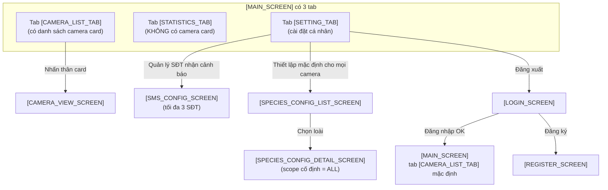

# Đặc tả màn hình chức năng — Android App

**Dự án:** Ứng dụng hệ thống cảnh báo và xua đuổi động vật hoang dã

**Nền tảng:** Android (Mobile App)

**Hướng hiển thị:** Vertical (Portrait) only — khóa cứng xoay dọc để tối ưu thao tác một tay ngoài thực địa.

**Ngôn ngữ giao diện:** Tiếng Việt (mặc định)

**Ngôn ngữ tài liệu / control ID:** Tiếng Anh — mọi điều khiển trong bảng mô tả được đặt tên theo **snake_case** với hậu tố chỉ loại (`_button`, `_input`, `_toggle`, `_dropdown`, `_slider`, `_chip`, `_card`, `_dialog`, `_text`, `_image`, `_list`, `_list_item`, `_snackbar`, `_container`, `_iconbutton`, `_radiobutton`, `_radio_group`, v.v.). UI label hiển thị trong app đặt trong backtick, dùng tiếng Việt (vd: `Label `Đăng nhập`` cho `login_button`).

**Quy ước Screen / Tab ID** đặt giữa `[` … `]` PascalCase có hậu tố:
- Hậu tố `_SCREEN` — màn hình độc lập: `[LOGIN_SCREEN]`, `[REGISTER_SCREEN]`, `[CAMERA_VIEW_SCREEN]`, `[SPECIES_CONFIG_LIST_SCREEN]`, `[SPECIES_CONFIG_DETAIL_SCREEN]`.
- Hậu tố `_TAB` — tab nằm trong `[MAIN_SCREEN]`: `[CAMERA_LIST_TAB]`, `[STATISTICS_TAB]`, `[SETTING_TAB]`.

### Triết lý thiết kế *(note cho designer)*

Nguyên tắc chỉ đạo khi designer phác thảo mockup dựa trên tài liệu này:

- **Tuân thủ Material Design** về hệ thống màu sắc + theme.
- **Đơn giản** — ưu tiên layout rõ ràng, tránh thành phần thừa.
- **Việt hoá** — toàn bộ UI text, label, nhãn trong app dùng tiếng Việt (chỉ tên component ID là snake_case tiếng Anh để dev đặt tên code nhất quán).
- **Ưu tiên các thiết kế component của iPhone** khi có xung đột giữa pattern iOS và Material Design mặc định. Vd: swipe-back gesture kiểu iOS, pull-to-refresh cảm giác "mềm", shadow subtle…

> Triết lý này chỉ để designer tham khảo. Tài liệu này không quy định cụ thể spacing / color token / easing curve — đó là mockup & design system của designer.

---

## Mục lục màn hình

1. `[LOGIN_SCREEN]` — Màn hình đăng nhập
2. `[REGISTER_SCREEN]` — Đăng ký tài khoản
3. `[MAIN_SCREEN]` — Trung tâm điều khiển với 3 tab `[CAMERA_LIST_TAB]` / `[STATISTICS_TAB]` / `[SETTING_TAB]`.
   - Quản lý SĐT nhận cảnh báo: tab `[SETTING_TAB]` → `[SMS_CONFIG_SCREEN]`.
   - Cấu hình thiết bị ứng phó: tab `[SETTING_TAB]` → `[SPECIES_CONFIG_LIST_SCREEN]` → `[SPECIES_CONFIG_DETAIL_SCREEN]`.
4. `[CAMERA_VIEW_SCREEN]` — Chi tiết một Camera *(gồm: ảnh hiện tại, đổi tên camera, danh sách log lịch sử)*
5. `[SPECIES_CONFIG_LIST_SCREEN]` — Danh sách loại thú cần thiết lập
6. `[SPECIES_CONFIG_DETAIL_SCREEN]` — Thiết lập hành vi phòng vệ theo loài *(luôn áp dụng cho tất cả camera)*
7. `[SMS_CONFIG_SCREEN]` — Quản lý SĐT nhận cảnh báo SMS *(tối đa 3 SĐT / user)*

> ℹ️ **Bố cục tab của `[MAIN_SCREEN]`:**
> - Tab `[CAMERA_LIST_TAB]` *(mặc định)*: danh sách camera card.
> - Tab `[STATISTICS_TAB]`: thống kê tổng hợp toàn hệ thống.
> - Tab `[SETTING_TAB]`: cài đặt chung (giao diện sáng/tối, đăng xuất) + nút điều hướng sang:
>   - `[SMS_CONFIG_SCREEN]` — quản lý SĐT nhận cảnh báo.
>   - `[SPECIES_CONFIG_LIST_SCREEN]` → `[SPECIES_CONFIG_DETAIL_SCREEN]` — cấu hình thiết bị ứng phó.

---

## 1. `[LOGIN_SCREEN]` — Màn hình đăng nhập

Màn hình khởi đầu khi người dùng mở ứng dụng lần đầu (chưa có session hợp lệ). Form **đơn giản 2 ô**: Username + Password — phù hợp với phạm vi đề tài nghiên cứu của học sinh.

| Component ID | Type | Mô tả |
|---|---|---|
| `app_logo_image` | Image | Logo dự án, canh giữa phía trên cùng. |
| `login_title_text` | Text | Hiển thị label `Đăng nhập`. |
| `username_input` | TextField | Label `Username`. Bắt buộc. Validate format ngay khi rời ô. |
| `password_input` | TextField (Password) | Label `Mật khẩu`. Bắt buộc. Có icon con mắt hiện/ẩn (mặc định ẩn). |
| `login_button` | Button (Primary, full-width) | Label `Đăng nhập`. Validate cả 2 ô (format) → tiến hành xác thực. Enable khi cả 2 ô không rỗng. |
| `register_linkbutton` | TextButton | Label `Đăng ký`. Mở `[REGISTER_SCREEN]`. |

**Luồng chính:**
- `login_button` thành công → `[MAIN_SCREEN]` (tab `[CAMERA_LIST_TAB]` mặc định).
- `login_button` thất bại → hiển thị `login_error_snackbar` với message `Sai tên đăng nhập hoặc mật khẩu` (thông báo dạng chung, không phân biệt username/mật khẩu sai để tránh lộ thông tin).

### Quy tắc validation (chỉ kiểm tra format phía client)

| Field ID | Quy tắc | Thông báo lỗi hiển thị (tiếng Việt) |
|---|---|---|
| `username_input` | Bắt buộc; 4–20 ký tự; chỉ gồm chữ cái (a–z, A–Z), số (0–9), dấu gạch dưới (`_`); không được bắt đầu bằng số; không được toàn số. | `Tên đăng nhập 4–20 ký tự, gồm chữ, số và gạch dưới, không bắt đầu bằng số`. |
| `password_input` | Bắt buộc; 6–30 ký tự; không được chỉ toàn khoảng trắng. | `Mật khẩu 6–30 ký tự`. |

> Lưu ý: validation form chỉ chặn lỗi **định dạng** rỗng/sai trước khi bấm `login_button`. Nếu thông tin xác thực không đúng (sai username/mật khẩu), thông báo sẽ hiển thị qua `login_error_snackbar`.

---

## 2. `[REGISTER_SCREEN]` — Đăng ký tài khoản

Được mở khi user nhấn `register_linkbutton` ở `[LOGIN_SCREEN]`. Form đăng ký gồm **Username + Email + Password** — đơn giản hơn phiên bản OTP nhưng có đầy đủ validation để đảm bảo tài khoản hợp lệ. Sau khi tạo thành công, user quay về `[LOGIN_SCREEN]` để đăng nhập.

### Bố cục màn

| Component ID | Type | Mô tả |
|---|---|---|
| `back_iconbutton` | IconButton (Top bar) | Label `←`. Back là Android Stack mặc định → `[LOGIN_SCREEN]`. |
| `register_title_text` | Text (Top bar) | Label `Đăng ký tài khoản`. |
| `subtitle_text` | Text | Label `Tạo tài khoản để quản lý hệ thống cảnh báo`. |
| `username_input` | TextField | Label `Username`. Bắt buộc. Cùng quy tắc format với `[LOGIN_SCREEN]`. |
| `email_input` | TextField | Label `Email`. Bắt buộc. Dùng để khôi phục tài khoản sau này. Hiển thị icon `✓` khi đúng định dạng. |
| `password_input` | TextField (Password) | Label `Mật khẩu`. Bắt buộc. Có icon con mắt hiện/ẩn. Khi user gõ, hiển thị `password_strength_indicator` ngay phía dưới. |
| `password_strength_indicator` | ProgressBar (3 mức) | Label `Yếu / Trung bình / Mạnh`. Tính theo độ dài + có cả chữ lẫn số. |
| `password_confirm_input` | TextField (Password) | Label `Xác nhận mật khẩu`. Bắt buộc. So sánh với `password_input` ngay khi gõ. Hiển thị lỗi `Mật khẩu không khớp` nếu lệch. |
| `register_button` | Button (Primary, full-width) | Label `Đăng ký`. Validate toàn bộ form khi bấm → tiến hành tạo tài khoản. Enable khi cả 4 ô hợp lệ và mật khẩu khớp. |
| `login_linkbutton` | TextButton | Label `Đã có tài khoản? Đăng nhập`. Mở `[LOGIN_SCREEN]` (tương đương `back_iconbutton`). |

### Quy tắc validation

| Field ID | Quy tắc | Thông báo lỗi hiển thị (tiếng Việt) |
|---|---|---|
| `username_input` | Bắt buộc; 4–20 ký tự; chỉ gồm chữ cái (a–z, A–Z), số (0–9), dấu gạch dưới (`_`); không bắt đầu bằng số; không toàn số. | `Tên đăng nhập 4–20 ký tự, gồm chữ, số và gạch dưới, không bắt đầu bằng số`. |
| `username_input` (đã tồn tại) | Hệ thống phát hiện username đã được đăng ký. | `Tên đăng nhập đã được sử dụng — chọn tên khác`. |
| `email_input` | Bắt buộc; theo cú pháp `local@domain.tld` — `local` gồm chữ cái/số/`._%+-`; `domain` và `tld` chỉ gồm chữ cái/số/`-`; phải có `.` ngăn `domain` và `tld`; `tld` tối thiểu 2 ký tự. | `Email không hợp lệ`. |
| `email_input` (đã tồn tại) | Hệ thống phát hiện email đã được đăng ký. | `Email đã được sử dụng — đăng nhập ngay?`. |
| `password_input` | Bắt buộc; 8–30 ký tự; phải chứa cả chữ cái và chữ số; không được chỉ toàn khoảng trắng. | Lỗi riêng theo điều kiện: `Tối thiểu 8 ký tự` / `Phải có cả chữ và số` / `Tối đa 30 ký tự`. |
| `password_confirm_input` | Phải khớp với `password_input`. | `Mật khẩu không khớp`. |

**Quy tắc độ mật** cho `password_strength_indicator` (chỉ hiển thị, không chặn):
- `Yếu`: < 8 ký tự hoặc chỉ chữ hoặc chỉ số.
- `Trung bình`: ≥ 8 ký tự và có cả chữ lẫn số.
- `Mạnh`: ≥ 12 ký tự có cả chữ và số (có thể bổ sung chữ hoa và ký tự đặc biệt để đạt Mạnh, không bắt buộc).

### Hành vi

- Hiển thị lỗi validation **dạng inline** ngay dưới ô tương ứng khi user rời ô (on unfocus) hoặc khi bấm `register_button`.
- Khi bấm `register_button` mà form không hợp lệ: focus vào ô lỗi đầu tiên + `register_error_snackbar` với message `Vui lòng kiểm tra các ô bị lỗi`.
- Trong khi hệ thống xử lý (loading) → disable `register_button`, hiển thị spinner nhỏ phía trước nhãn.
- Khi phát hiện username/email đã tồn tại → hiện lỗi inline ngay dưới ô tương ứng + focus ô đó, **không load lại form**.
- Khi thành công → chuyển về `[LOGIN_SCREEN]`, `register_success_snackbar` với message `Đăng ký thành công — vui lòng đăng nhập`. Username đã nhập **tự fill** vào `username_input` của `[LOGIN_SCREEN]` (giúp đăng nhập luôn, không phải gõ lại).

### Điều hướng

- `back_iconbutton` (Android Stack) → `[LOGIN_SCREEN]`.
- Thành công → `[LOGIN_SCREEN]` + auto fill `username_input`.
- `login_linkbutton` tương đương `back_iconbutton`.

---

## 3. `[MAIN_SCREEN]` — Trung tâm điều khiển (3 tab)

Màn hình chính sau khi đăng nhập. **Mỗi tab có layout nội dung hoàn toàn khác nhau** — chuyển tab là chuyển hẳng sang "trang" mới, không phải lướt ngang. Ở chế độ dọc (Portrait — mặc định), thanh tab nằm ở dưới cùng màn hình.

| Tab | Mặc định | Mô tả ngắn |
|---|---|---|
| `[CAMERA_LIST_TAB]` | ✅ Hiển thị đầu tiên | Danh sách camera (mỗi card có timestamp + background chớp theo mức nguy hiểm + badge cảnh báo). |
| `[STATISTICS_TAB]` | | Biểu đồ thống kê + heatmap tổng quan. |
| `[SETTING_TAB]` | | Cài đặt chung (giao diện, đăng xuất). |

> ❓ **Quan trọng:**
>
> **Danh sách camera chỉ hiển thị ở tab `[CAMERA_LIST_TAB]`.** Hai tab `[STATISTICS_TAB]` và `[SETTING_TAB]` không có danh sách camera.
>
> Thiết bị ứng phó **phụ thuộc vào loài phát hiện** (Silent Alert cho thú dữ, Active Deterrent cho thú vừa…), nên cấu hình chúng đi theo luồng **[SPECIES_CONFIG_LIST_SCREEN]** → chọn loài → **[SPECIES_CONFIG_DETAIL_SCREEN]** với scope `Áp dụng cho tất cả` camera. Nút điều hướng nằm trong tab `[SETTING_TAB]` ở mục 3.3.

---

### 3.1. `[CAMERA_LIST_TAB]` — Tab danh sách camera *(mặc định)*

Tab này vừa quản lý camera, vừa hiển thị cảnh báo khẩn cấp.

> ℹ️ **Lưu ý về vị trí các Icon / Nút trên từng Camera Card:**
> - **Không có** bất kỳ icon/nút Cài đặt hay Lịch sử riêng nào ở thanh header/top bar của màn `[MAIN_SCREEN]` — kể cả FAB floating button.
> - Mọi thao tác đặc thù cho 1 camera (xem ảnh, đổi tên, xem danh sách log) đều thực hiện trong **[CAMERA_VIEW_SCREEN]** — user **nhấn vào card** sẽ nhảy thẳng vào màn đó của camera tương ứng, **không qua màn chọn camera trung gian**.

#### b) Banner cảnh báo nhấp nháy *(tuỳ chọn UI; có thể bỏ nếu badge trên card đã đủ)*

| Component ID | Type | Mô tả |
|---|---|---|
| `emergency_banner_container` | Container (clickable) | Banner tóm tắt sự kiện mới nhất. Nội dung label: `Tên camera · Phát hiện [LOÀI] · [giờ:phút]`. Ví dụ: `Cam 1 · Phát hiện VOI · 9:04`. |
| `emergency_banner_analysis_text` | Text (caption) | Bên dưới banner hiển thị Loài, Số lượng cá thể, Mức độ nguy hiểm, Độ tin cậy AI (%). |

**Hành vi:** Banner tự động xuất hiện khi hệ thống gửi thông báo sự kiện mới đến thiết bị. Nhấn vào `emergency_banner_container` → chuyển sang `[CAMERA_VIEW_SCREEN]` của camera tương ứng. Vì mỗi camera card đã có `warning_badge_overlay` cảnh báo riêng (phụ thuộc mức nguy hiểm, xem mục Trạng thái của card), banner sticky trên đầu tab có thể *bỏ qua* nếu thấy dư thừa — designer quyết định bật/tắt trong mockup.

#### a) Danh sách thẻ camera

> Số lượng camera **không cố định 4** — render động theo số camera thực tế trong hệ thống (1 hoặc nhiều hơn).

Tab `[CAMERA_LIST_TAB]` gồm **một khối duy nhất**: lưới các Camera Card. Mọi thông tin, bộ lọc, điều khiển cụ thể cho từng camera được đặt ngay trong **card của camera đó** (xem Chi tiết một Camera Card phía dưới).

#### a1) Chi tiết một Camera Card

Mỗi card là **đơn vị nhỏ nhất** của danh sách, đại diện cho 1 camera. Mô tả theo **thông tin hiển thị** + **điều khiển khả dụng**.

##### Thông tin hiển thị

| Component ID | Thông tin | Type | Mô tả |
|---|---|---|---|
| `camera_status_indicator` | **Trạng thái kết nối** | Status indicator | Label `🟢 Online` / `⚪ Offline`. Khi offline ≥ 30s sẽ hiển thị rõ kèm icon offline. |
| `camera_name_text` | **Tên camera** | Text (Bold) | `Cam 1`, `Cam 2`… (đánh số tự động); có thể đổi sang tên tuỳ chỉnh trong `[CAMERA_VIEW_SCREEN]` (vd: `Cam Khu A`) — nhấn `rename_camera_button` trên màn đó. |
| `camera_location_text` | **Khu vực lắp đặt** | Text (caption) | Mô tả ngắn vị trí: `Rìa rừng phía B`, `Trạm 2 · Đồi cao`… Cắt bớt nếu dài. |
| `camera_thumbnail_image` | **Ảnh thumbnail** | Image | Ảnh snapshot gần nhất có **độ tin cậy AI ≥ 50%**. Nếu chưa có → placeholder icon camera. Nếu offline → overlay icon `⚪ Offline`. Khi đang tải → trạng thái loading. |
| `warning_badge_overlay` | **Badge cảnh báo trên ảnh** *(tuỳ trạng thái)* | Animated badge | Label dạng `⚠️ [LOÀI] · [%]` (vd: `⚠️ VOI · 92%`). Chỉ hiện khi camera có sự kiện AI mới trong 30 phút chưa xem. Tắt nhấp nháy khi user đã mở `[CAMERA_VIEW_SCREEN]` của camera đó. |
| `snapshot_timestamp_overlay` | **Thời gian ghi nhận hình ảnh** | TextOverlay | Mốc thời gian **hệ thống ghi nhận ảnh snapshot**, không phải live. Định dạng `HH:mm · dd/MM` (vd: `9:04 · 16/07`); tooltip dài hơn `HH:mm:ss · dd/MM/yyyy`. Nếu ảnh > 1 giờ: thêm nhãn `cũ` hoặc icon `⏰` (vd: `9:04 · 16/07 · ⏰ cũ`); > 24 giờ: hiển thị cả ngày `16/07` rõ. Nếu chưa có ảnh → text `—`. |

##### Điều khiển (Controls)

| Component ID | Type | Hành vi |
|---|---|---|
| `camera_card_clickable_container` | Container (clickable, bao trùm toàn bộ card) | Nhấn vào thân card (bất kỳ vị trí nào) → mở `[CAMERA_VIEW_SCREEN]` của camera đó. |

> 💡 Camera Card chỉ có **một điều khiển duy nhất: `camera_card_clickable_container`**. Mọi thao tác khác (đổi tên, xem lịch sử) đều thực hiện bên trong `[CAMERA_VIEW_SCREEN]`.

##### Trạng thái của card (Card state)

Trạng thái của `camera_card_clickable_container` kết hợp từ **hai chiều logic** độc lập — phần render UI cụ thể (màu sắc, animation) thuộc trách nhiệm của designer.

> **Chiều 1 — Mức cảnh báo** *(do AI quyết định, theo mức độ nguy hiểm của loài phát hiện gần nhất)*:
>
> | Mức | Loài đại diện |
> |---|---|
> | **Cao** | Voi, Hổ, Báo, Tê giác, Rắn, Cá sấu, Người lạ |
> | **Trung bình** | Nai lớn, Khỉ đàn, Heo rừng |
> | **Thấp** | Sóc, chim, các loài ít nguy hại |
> | **Không có sự kiện** | Không có AI event nào trong vòng 30 phút |
>
> **Quy tắc áp dụng:** mức cảnh báo chỉ áp dụng khi **ảnh snapshot có độ tin cậy AI ≥ 50%** và sự kiện trong vòng **30 phút** gần đây. Quá 30 phút → tự động trở về `Không có sự kiện` (bất kể mức cũ).

> **Chiều 2 — Đã xem / Chưa xem** *(do User quyết định)*:
>
> | Trạng thái | Điều kiện |
> |---|---|
> | **Chưa xem** | User chưa mở `[CAMERA_VIEW_SCREEN]` của camera này. |
> | **Đã xem** | User đã mở `[CAMERA_VIEW_SCREEN]` của camera này. |
>
> Mục đích: khi đã xem, designer có thể giảm nhấp nháy / giảm độ nổi bật của các yếu tố cảnh báo để tránh gây chú ý liên tục; riêng `warning_badge_overlay` vẫn hiện để giữ thông tin.

**Ma trận logic tổng hợp** (gợi ý cho designer; không quy định UI cụ thể):

| Mức cảnh báo | Đã xem | Gợi ý mức nhấp nháy |
|---|---|---|
| Cao / Trung bình | Chưa xem | Nhấp nháy tích cực nhất |
| Cao / Trung bình | Đã xem | Nhấp nháy giảm cường độ (giữ để cảnh báo liên tục 30 phút) |
| Thấp / không có | bất kỳ | Không nhấp nháy |
| `camera_status_indicator` = Offline | bất kỳ | Rõ trạng thái offline (icon + tối màu) |

---

> 📐 *Các chi tiết bố cục (grid 1/2 cột, tỷ lệ ảnh thumbnail, border radius, elevation, khoảng cách, font size, exact paused animation curves...) thuộc phạm vi designer, không quy định trong tài liệu này.*

---

### 3.2. `[STATISTICS_TAB]` — Tab thống kê

Tab này **không có danh sách camera**. Chỉ hiển thị thống kê tổng hợp toàn hệ thống:

| Component ID | Type | Mô tả |
|---|---|---|
| `statistics_filter` | Filter bar (Chips + Dropdown) | Lọc theo khoảng thời gian (7 ngày / 30 ngày / tuỳ chỉnh) · theo loài · theo camera cụ thể. Áp dụng cho toàn bộ tab. |
| `weekly_detections_section` | Section (Card + List) | Tiêu đề `Phát hiện trong tuần`. Danh sách các sự kiện: `Camera · Ngày giờ · Loài`. |
| `per_camera_analysis_section` | Section (Card + Charts) | Tiêu đề `Phân tích theo từng camera`. Số lần xuất hiện, xu hướng (Chart line), khu vực di chuyển (sơ đồ/heatmap rừng). |

> 💡 *Lưu ý:* Muốn xem **lịch sử chi tiết từng camera** (danh sách log theo thời gian), nhấn vào Camera Card tương ứng ở tab `[CAMERA_LIST_TAB]` → `[CAMERA_VIEW_SCREEN]` — phần "Danh sách log" nằm cuối màn đó. Tab `[STATISTICS_TAB]` chỉ cung cấp cái nhìn tổng quan.

---

### 3.3. `[SETTING_TAB]` — Tab cài đặt

Nơi duy nhất để user chỉnh cài đặt cá nhân và quản trị tài khoản.

| Component ID | Type | Mô tả |
|---|---|---|
| `theme_toggle` | Toggle | Label `Giao diện sáng/tối`. Lựa chọn `Sáng` / `Tối` (theo system hoặc thủ công). |
| `sms_config_button` | Button | Label `Quản lý SĐT nhận cảnh báo`. Mở `[SMS_CONFIG_SCREEN]` để thêm / xoá SĐT nhận SMS (tối đa 3). |
| `configure_defense_default_button` | Button | Label `Thiết lập hành vi ứng phó mặc định cho tất cả camera`. Mở `[SPECIES_CONFIG_LIST_SCREEN]` để user **chọn loài** cần cấu hình → mở `[SPECIES_CONFIG_DETAIL_SCREEN]` với **scope = `Áp dụng cho tất cả`** camera. Cấu hình theo từng loài áp dụng cho mọi camera trong hệ thống. |
| `logout_button` | Button (Danger) | Label `Đăng xuất`. Xoá session → về `[LOGIN_SCREEN]`. |

> 💡 **Không có** toggle thiết bị ứng phó (SMS / Loa / Âm thanh / LED / Hàng rào / Kiểm lâm) ngay trong tab `[SETTING_TAB]`. Cấu hình các thiết bị này thuộc về **`[SPECIES_CONFIG_DETAIL_SCREEN]`** và phải đi qua `[SPECIES_CONFIG_LIST_SCREEN]` để chọn loài — vì thiết bị ứng phó phụ thuộc vào loài phát hiện (Silent Alert cho thú dữ, Active Deterrent cho thú vừa…), không thể cấu hình tách rời khỏi ngữ cảnh loài.

---

## 4. `[CAMERA_VIEW_SCREEN]` — Chi tiết một Camera

Được mở khi user **nhấn vào một thẻ camera** từ `[MAIN_SCREEN]` (tab `[CAMERA_LIST_TAB]`). Tại đây user xem ảnh hiện tại, đổi tên camera, và xem danh sách log.

> ℹ️ **Màn này KHÔNG hiển thị live video streaming.** Nó hiển thị **ảnh snapshot** gần nhất từ camera. Theo thuật toán ở [de-tai-nghien-cuu-canh-bao-dong-vat.md:131-170](outputs/de-tai-nghien-cuu-canh-bao-dong-vat.md#L131-L170), hệ thống chỉ ghi nhận snapshot mỗi 2 giây/lần khi có chuyển động đáng kể, do đó ảnh trong màn này có thể đã cũ vài giây đến vài phút tuỳ mức độ hoạt động của thú.

**Bố cục màn hình (Vertical):**

| Component ID | Type | Mô tả |
|---|---|---|
| `back_iconbutton` | IconButton (Top bar) | Label `←`. Quay về `[MAIN_SCREEN]`. |
| `camera_name_title_text` | Text (Top bar, Bold) | Tên hiện tại của camera. |
| `camera_status_indicator` | Status indicator (Top bar) | Label `🟢 Online` / `⚪ Offline`. |
| `refresh_iconbutton` | IconButton (Top bar) | Label `↻`. Kéo xuống để refresh thủ công snapshot mới nhất. |
| `rename_camera_button` | Button (text/icon `✏️`) | Label `Đổi tên`. Mở `rename_camera_dialog`. |
| `rename_camera_dialog` | Dialog (Alert) | TextField `camera_name_input` cho phép sửa tên hiển thị (vd: `Cam 1` → `Cam Khu A`). Buttons: `rename_save_button` (label `Lưu`) / `rename_cancel_button` (label `Huỷ`). Tên mới được hệ thống ghi nhận và áp dụng cho `camera_name_title_text`. |
| `snapshot_image` | Image | Khung ảnh Snapshot chiếm phần lớn diện tích màn. |
| `snapshot_timestamp_overlay` | TextOverlay | Timestamp `HH:mm:ss · dd/MM/yyyy` góc dưới-trái. |
| `snapshot_relative_time_text` | TextOverlay | Dòng `Cách đây X phút/giây` góc dưới-phải (relative time tự cập nhật mỗi 10s). |
| `snapshot_age_chip` | Chip (thông báo) | Label: nếu > 5 phút → `⏰ Ảnh cách đây X phút — có thể đã cũ`; nếu > 30 phút → `⚠️ Ảnh cũ — kiểm tra camera` (màu đỏ). |
| `ai_analysis_section` | Card (Bảng) | Hiển thị Loài · Số lượng · Mức độ nguy hiểm · Độ tin cậy (%). |
| `camera_log_list` | List view | Tiêu đề `Lịch sử ghi nhận`. Mỗi dòng là `camera_log_item`: ảnh thumbnail nhỏ · `giờ:phút:giây · Thứ, dd/MM/yyyy` · Độ tin cậy (%) · Loài · Số lượng. Sắp xếp **mới nhất trên đầu**, lazy load khi cuộn. |

**Hành vi:**
- Nhấn `rename_camera_button` → mở `rename_camera_dialog`. `rename_save_button` ghi nhận thay đổi và refresh `camera_name_title_text`; `rename_cancel_button` đóng không lưu.
- `snapshot_image` tự động refresh mỗi ~2 giây khi AI phát hiện chuyển động đáng kể. Khi không có chuyển động → ảnh giữ nguyên cho đến khi có snapshot mới.
- Pull-to-refresh → làm mới ảnh snapshot hiện tại.
- `snapshot_relative_time_text` tự cập nhật định kỳ (mỗi 10s) nhưng `snapshot_timestamp_overlay` chỉ thay đổi khi nhận snapshot mới.
- Banner cảnh báo (kiểu `emergency_banner_container` ở tab `[CAMERA_LIST_TAB]`) có thể hiện phía trên `snapshot_image` khi có sự kiện mới: `Cam 1 · Phát hiện VOI · 9:04`.
- Nhấn vào 1 dòng `camera_log_item` → mở `log_detail_lightbox` xem ảnh lớn + metadata đầy đủ.
- `back_iconbutton` → `[MAIN_SCREEN]` (Android Stack mặc định).

> 🚫 Màn này **không có** nút bật/tắt stream camera, không có toggle thiết bị ngoại vi (SMS / Loa / LED / Hàng rào / Kiểm lâm). Cấu hình thiết bị ứng phó (kể cả bật/tắt thiết bị cho camera này) thuộc về `[SPECIES_CONFIG_DETAIL_SCREEN]` — mở từ `configure_defense_default_button` ở tab `[SETTING_TAB]` của `[MAIN_SCREEN]` (mục 3.3).

---

## 5. `[SPECIES_CONFIG_LIST_SCREEN]` — Danh sách loại thú cần thiết lập

Được mở khi user nhấn `configure_defense_default_button` ở tab `[SETTING_TAB]` của `[MAIN_SCREEN]` (mục 3.3).

| Component ID | Type | Mô tả |
|---|---|---|
| `back_iconbutton` | IconButton (Top bar) | Label `←`. Quay về `[MAIN_SCREEN]`. |
| `screen_title_text` | Text (Top bar, Bold) | Label `Thiết lập phòng vệ theo loài`. |
| `species_list_view` | RecyclerView (List) | Danh sách loài đã biết: Voi, Cọp, Nai, Khỉ, Heo rừng… Mỗi dòng là `species_card_item`. |

**Mỗi `species_card_item` (Card loài):**

| Component ID | Type | Mô tả |
|---|---|---|
| `species_name_text` | Text (Bold) | Label `VOI`, `CỌP`, `NAI`… |
| `aggression_gauge` | LinearGauge (0–10) | Label `Chỉ số hung dữ`. Thang đo nguy hiểm. |
| `species_behavior_text` | Text (caption) | Mô tả tập tính: di chuyển theo bầy, hoạt động về đêm… |
| `species_defense_summary_text` | Text (caption) | Mô tả ngắn kịch bản mặc định: `Silent Alert` / `Active Deterrent`. |

**Hành vi:**
- Nhấn vào 1 `species_card_item` → highlight + mở `[SPECIES_CONFIG_DETAIL_SCREEN]`.

---

## 6. `[SPECIES_CONFIG_DETAIL_SCREEN]` — Thiết lập hành vi phòng vệ theo loài

**Màn này chỉ được mở qua `[SPECIES_CONFIG_LIST_SCREEN]`** (bắt buộc phải chọn loài trước). Luồng điều hướng duy nhất:

```
[MAIN_SCREEN] ── tab [SETTING_TAB] ──► configure_defense_default_button
                          └─► [SPECIES_CONFIG_LIST_SCREEN] ── chọn loài ──► [SPECIES_CONFIG_DETAIL_SCREEN]
                                                                         (scope cố định = ALL)
```

Mọi thông số ứng phó được thiết lập **áp dụng chung cho tất cả camera** trong hệ thống — chỉ có 1 scope duy nhất.

> 🚫 Tuyệt đối không có điều hướng nào nhảy thẳng sang `[SPECIES_CONFIG_DETAIL_SCREEN]` mà không qua `[SPECIES_CONFIG_LIST_SCREEN]` — vì cấu hình ứng phó **luôn gắn với 1 loài cụ thể**.

### 6.1. Loài đang cấu hình *(chỉ đọc)*

| Component ID | Type | Mô tả |
|---|---|---|
| `species_name_readonly_text` | Text (read-only, Bold) | Hiển thị tên loài vừa chọn ở `[SPECIES_CONFIG_LIST_SCREEN]` (vd: `VOI`, `CỌP`, `NAI`…) — không cho chỉnh tại đây. |

### 6.2. Tự thiết lập hành vi nhanh (Preset Scenarios)

User **chỉ được chọn 1 preset tại 1 thời điểm** (radio group — loại trừ). Chọn một preset non-custom sẽ **đồng thời ép `defense_params_expandable_container` thu gọn (collapsed)**; chọn `preset_custom_radiobutton` sẽ **đồng thời ép container mở rộng (expanded)**.

| Component ID | Type | Mô tả |
|---|---|---|
| `preset_radio_group` | RadioGroup | Group cha, đảm bảo **chỉ 1 trong 4 `preset_*_radiobutton` active** tại 1 thời điểm. |
| `preset_intruder_radiobutton` | RadioButton | Label `Người lạ đột nhập`. Hành vi mặc định: LED đỏ-trắng nhấp nháy + âm thanh báo động + push/SMS cho cơ quan chức năng. |
| `preset_medium_animal_radiobutton` | RadioButton | Label `Thú vừa`. Hành vi mặc định: LED nhấp nháy + âm siêu âm/chó sủa + dòng điện nhẹ (Nai, Khỉ, Hươu cao cổ). |
| `preset_high_risk_radiobutton` | RadioButton | Label `Thú cực kỳ nguy hiểm`. Hành vi mặc định: **Silent Alert** — không loa/đèn tại chỗ; chỉ gửi Push/SMS cho người dân di tản. |
| `preset_custom_radiobutton` | RadioButton | Label `Tùy chỉnh`. Khi chọn → `defense_params_expandable_container` tự động mở rộng (expanded). |

**Hành vi:**
- Khi mở màn: hệ thống tải cấu hình hiện tại. So khớp với 3 preset non-custom → tự chọn preset đó, container **collapsed**. Nếu không khớp → tự chọn `preset_custom_radiobutton`, container **expanded**.
- Khi user chọn `preset_intruder_radiobutton` / `preset_medium_animal_radiobutton` / `preset_high_risk_radiobutton`:
  - Fill toàn bộ control trong mục 6.3 theo bộ giá trị preset đó.
  - **Đặt container = collapsed** (kể cả khi trước đó user đang mở rộng).
- Khi user chọn `preset_custom_radiobutton`:
  - **Đặt container = expanded** (kể cả khi trước đó user đang thu gọn).
  - Không fill giá trị — giữ nguyên giá trị hiện tại trong container (user tự sửa).
- Nếu user mở rộng container thủ công (nhấn `defense_params_toggle_container`) trong khi đang chọn preset non-custom → container hiện giá trị của preset đó; **preset vẫn active, không tự chuyển sang Custom**.
- Nếu user đang ở `preset_custom_radiobutton` mà sửa 1 control bất kỳ trong container → preset vẫn là Custom (trạng thái không đổi cho đến khi user chọn rõ ràng).

### 6.3. Tuỳ chỉnh nâng cao — Defense Parameter Configurations *(collapsible)*

`defense_params_expandable_container` mặc định **collapsed** khi mở màn (trừ khi `preset_custom_radiobutton` đang active — xem mục 6.2).

| Component ID | Type | Mô tả |
|---|---|---|
| `defense_params_toggle_container` | Container (clickable) | Header label `Tuỳ chỉnh nâng cao` + icon `expand_more` / `expand_less`. Nhấn để đổi trạng thái collapsed/expanded của `defense_params_expandable_container`. Khi collapsed, các control bên trong không hiển thị (chỉ thấy header). |
| `defense_params_expandable_container` | Container (expandable) | Body collapsible — chứa toàn bộ control cài đặt chi tiết dưới đây. Trạng thái **bị ép** bởi `preset_radio_group` (xem mục 6.2). |
| `sound_type_dropdown` | Dropdown | Label `Loại âm thanh xua đuổi`. Lựa chọn: `Tiếng súng` · `Tiếng gầm` · `Tiếng chó sủa lớn` · `Tiếng nổ giả lập` · `Tần số siêu âm`. |
| `sound_intensity_slider` | Slider | Label `Cường độ âm thanh`. Range `1`–`100`. |
| `sound_test_button` | Button (Secondary) | Label `Nghe thử (Test Audio)`. Phát âm thanh đã chọn ở mức cường độ hiện tại qua loa thiết bị. |
| `led_frequency_dropdown` | Dropdown | Label `Tần suất LED`. Lựa chọn: `2 lần/giây` · `4 lần/giây` · `Nhấp nháy ngẫu nhiên`. |
| `led_color_segmented` | SegmentedControl | Label `Màu sắc LED`. Lựa chọn: `Đỏ` · `Trắng` · `Đỏ xen kẽ Trắng`. |
| `led_duration_input` | NumberInput | Label `Thời lượng LED (giây)`. |
| `fence_current_level_dropdown` | Dropdown | Label `Mức dòng điện sinh học`. Lựa chọn: `Thấp` · `Trung bình` · `Mạnh`. |
| `fence_warning_light_toggle` | Toggle | Label `Đèn cảnh báo vàng/đỏ nhấp nháy kèm theo`. |
| `fence_notify_on_trigger_toggle` | Toggle | Label `Tự động gửi SMS/Push khi hàng rào hoạt động`. |
| `fence_auto_off_hint_text` | Text (caption) | Label `Tự ngắt sau 2 phút không phát hiện thú` *(thông tin, không chỉnh)*. |
| `speaker_message_dropdown` | Dropdown | Label `Mẫu nội dung`. Lựa chọn: `Mẫu 1 (Voi hoang dã)` · `Mẫu 2 (Thú dữ xâm lấn)` · `Mẫu 3 (Di tản lánh nạn)`. |
| `notify_sms_toggle` | Toggle | Label `Gửi SMS`. |
| `notify_push_toggle` | Toggle | Label `Gửi Push Notification`. |

### 6.4. Lưu

| Component ID | Type | Mô tả |
|---|---|---|
| `save_config_button` | Button (Primary, full-width) | Label `Lưu`. Hệ thống ghi nhận các thông số đã cấu hình. |
| `reset_config_button` | Button (Secondary) | Label `Đặt lại`. Trả về giá trị mặc định. |

---

## 7. `[SMS_CONFIG_SCREEN]` — Quản lý SĐT nhận cảnh báo SMS

Được mở khi user nhấn `sms_config_button` ở tab `[SETTING_TAB]` của `[MAIN_SCREEN]` (mục 3.3). Mỗi user được **đăng ký tối đa 3 SĐT** sẽ nhận SMS cảnh báo động vật. Trong danh sách này **không bao gồm** SĐT đăng nhập của tài khoản hiện tại (SĐT đó mặc định luôn nhận).

Mọi thao tác **thêm / xoá** SĐT được thực hiện ngay khi user xác nhận — không có nút "Lưu chung" cuối màn.

### Bố cục màn

| Component ID | Type | Mô tả |
|---|---|---|
| `back_iconbutton` | IconButton (Top bar) | Label `←`. Quay về `[MAIN_SCREEN]`. |
| `screen_title_text` | Text (Top bar, Bold) | Label `Quản lý SĐT nhận cảnh báo`. |
| `subtitle_text` | Text (caption) | Label `Tối đa 3 SĐT. SĐT của bạn đã nhận mặc định — danh sách này là các SĐT bổ sung.`. |
| `sms_recipient_list_view` | RecyclerView | Danh sách SĐT đã thêm. Mỗi dòng là `sms_recipient_list_item`. Render ngay cả khi rỗng (kèm empty state). |
| `empty_state_text` | Text (ẩn khi list có phần tử) | Label `Chưa có SĐT nào — nhấn "Thêm SĐT" bên dưới để bắt đầu.`. |
| `add_recipient_button` | Button (Primary, full-width) | Label `Thêm SĐT`. Mở `add_recipient_dialog`. **Tự ẩn** khi list đã đủ 3 SĐT. |
| `sms_recipient_full_hint_text` | Text (caption, chỉ hiện khi list = 3) | Label `Đã đạt giới hạn 3 SĐT. Xoá một SĐT hiện tại để thêm mới.` |

**Mỗi `sms_recipient_list_item`:**

| Component ID | Type | Mô tả |
|---|---|---|
| `recipient_phone_text` | Text | SĐT hiển thị đầy đủ (vd: `0987654321`). |
| `recipient_remove_iconbutton` | IconButton | Label 🗑/✕. Nhấn → mở `remove_recipient_confirm_dialog`. |

**`add_recipient_dialog` (Dialog Alert):**

| Component ID | Type | Mô tả |
|---|---|---|
| `add_recipient_phone_input` | TextField (Number, maxLength = 10) | Label `Số điện thoại`. Validate realtime dưới ô. |
| `add_recipient_save_button` | Button (Primary) | Label `Thêm`. Enable khi SĐT hợp lệ + chưa trùng + list < 3. |
| `add_recipient_cancel_button` | Button (Text) | Label `Huỷ`. Đóng dialog không lưu. |

**`remove_recipient_confirm_dialog` (Dialog Alert):**

| Component ID | Type | Mô tả |
|---|---|---|
| `remove_recipient_confirm_text` | Text | Label `Xoá SĐT [SĐT] khỏi danh sách nhận cảnh báo?`. |
| `remove_recipient_confirm_button` | Button (Danger) | Label `Xoá`. Thực hiện xoá + đóng dialog + cập nhật list. |
| `remove_recipient_cancel_button` | Button (Text) | Label `Huỷ`. Đóng dialog không xoá. |

### Quy tắc validation

| Field / State | Quy tắc | Thông báo lỗi hiển thị (tiếng Việt) |
|---|---|---|
| `add_recipient_phone_input` | Bắt buộc; 10 số; đầu `0`; 9 số cuối không phải toàn số giống nhau (vd: `0000000000`). | `Số điện thoại không hợp lệ — phải có 10 số, bắt đầu bằng 0`. |
| `add_recipient_phone_input` (trùng) | SĐT đã có trong `sms_recipient_list_view` (so sánh exact match 10 số). | `Số điện thoại đã có trong danh sách.`. |
| `add_recipient_phone_input` (trùng SĐT tài khoản) | Trùng SĐT đang đăng nhập. | `SĐT này là tài khoản của bạn — đã nhận cảnh báo mặc định, không cần thêm.`. |
| Giới hạn tối đa 3 SĐT | `sms_recipient_list_view.size ≥ 3`. | `add_recipient_button` ẩn; `sms_recipient_full_hint_text` hiện. |

> Lưu ý: validation chỉ chặn **format và trùng** phía client — hệ thống vẫn kiểm tra cuối cùng (có thể SĐT bị trùng giữa 2 thiết bị thêm cùng lúc mà UI chưa cập nhật).

### Hành vi

- Mở màn: tải danh sách SĐT hiện tại → render `sms_recipient_list_view`. Nếu rỗng → hiện `empty_state_text`.
- Nhấn `add_recipient_button` → mở `add_recipient_dialog` với input trống, focus sẵn vào `add_recipient_phone_input`. Bàn phím số tự mở.
- Validate SĐT **realtime** khi user gõ (không chờ bấm Thêm). Trạng thái `add_recipient_save_button` thay đổi theo:
  - Rỗng / sai format → disabled.
  - Hợp lệ nhưng trùng → enabled, nhưng hiện lỗi inline. Bấm vẫn được; hệ thống sẽ thông báo nếu trùng từ nguồn khác (vd đồng bộ giữa 2 thiết bị).
  - Hợp lệ + chưa trùng + list < 3 → enabled.
- Nhấn `add_recipient_save_button` (SĐT hợp lệ):
  - Thực hiện thêm SĐT.
  - Khi thành công: đóng dialog + thêm `sms_recipient_list_item` mới vào list + `add_recipient_success_snackbar` với message `Đã thêm SĐT [SĐT]`.
  - Khi SĐT được thêm bởi tài khoản / thiết bị khác trong lúc user thao tác: hiện lỗi inline trong dialog `SĐT này đã được đăng ký bởi tài khoản khác.`.
- Nhấn `recipient_remove_iconbutton` trên 1 item → mở `remove_recipient_confirm_dialog` với nội dung `[SĐT]` lấy từ item đó.
- Nhấn `remove_recipient_confirm_button`:
  - Thực hiện xoá.
  - Khi thành công: đóng dialog + xoá `sms_recipient_list_item` khỏi list + `remove_recipient_success_snackbar` với message `Đã xoá SĐT [SĐT]`. Nếu list về < 3 → `add_recipient_button` hiện lại.
  - Khi lỗi: `remove_recipient_error_snackbar` `Không xoá được SĐT — thử lại sau.`.
- Pull-to-refresh → tải lại danh sách (đồng bộ khi có thay đổi từ thiết bị khác).
- Trong khi hệ thống đang xử lý (loading) → disable `add_recipient_button` + `recipient_remove_iconbutton`, hiển thị spinner nhỏ tại vị trí thao tác.

### Điều hướng

- `back_iconbutton` (Android Stack) → `[MAIN_SCREEN]`.
- Khi vừa thêm xong SĐT cuối cùng (list lên 3) → `add_recipient_button` tự ẩn, `sms_recipient_full_hint_text` tự hiện.
- Khi vừa xoá SĐT (list về < 3) → `add_recipient_button` tự hiện lại, `sms_recipient_full_hint_text` tự ẩn.

---

## Phụ lục — Sơ đồ luồng chuyển màn hình



---

> **Ghi chú tác giả:**
> - File này là đặc tả **màn hình (UI/UX)** ở mức functional — nêu các control, hành vi, validation rules và luồng điều hướng. **Không** chứa quyết định thiết kế chi tiết (bố cục grid, tỷ lệ ảnh, border radius, elevation, màu sắc cụ thể, easing/animation curves, font size) — các mục đó thuộc trách nhiệm designer.
> - File này cũng **không** chứa đặc tả API/DB — xem thêm tài liệu kỹ thuật trong `docs/`.
