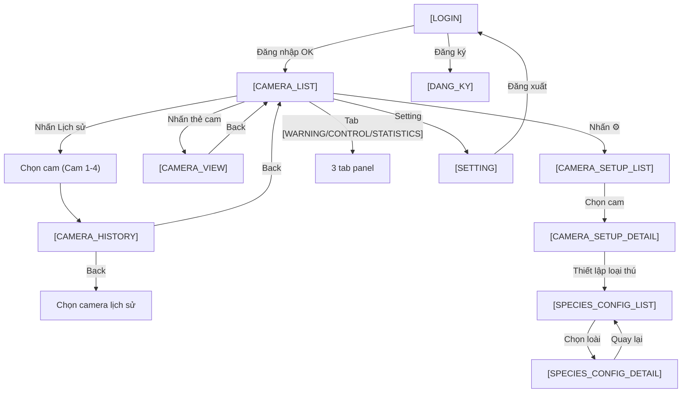

# Đặc tả màn hình chức năng — Android App

**Dự án:** Ứng dụng hệ thống cảnh báo và xua đuổi động vật hoang dã

**Nền tảng:** Android (Mobile App)

**Hướng hiển thị:** Vertical (Portrait) only — khóa cứng xoay dọc để tối ưu thao tác một tay ngoài thực địa.

**Ngôn ngữ giao diện:** Tiếng Việt (mặc định)

---

## Mục lục màn hình

1. `[LOGIN]` — Màn hình đăng nhập
2. `[CAMERA_LIST]` — Danh sách Camera (kèm 3 tab `[WARNING]` / `[CONTROL]` / `[STATISTICS]`)
3. `[CAMERA_VIEW]` — Xem chi tiết một Camera
4. `[CAMERA_HISTORY]` — Lịch sử ghi hình của một Camera
5. `[CAMERA_SETUP_LIST]` — Chọn Camera cần thiết lập
6. `[CAMERA_SETUP_DETAIL]` — Thiết lập chi tiết một Camera
7. `[SPECIES_CONFIG_LIST]` — Danh sách loại thú cần thiết lập
8. `[SPECIES_CONFIG_DETAIL]` — Thiết lập hành vi phòng vệ theo loài
9. `[SETTING]` — Cài đặt chung

---

## 1. `[LOGIN]` — Màn hình đăng nhập

Màn hình khởi đầu khi người dùng mở ứng dụng lần đầu (chưa có session hợp lệ).

| Thành phần | Kiểu | Mô tả |
|---|---|---|
| Logo ứng dụng | Image | Logo dự án canh giữa phía trên cùng. |
| Tiêu đề `Đăng nhập` | Text | Tiêu đề màn hình. |
| Ô nhập Số điện thoại | TextField | Nhập SĐT dùng để đăng nhập. |
| Ô nhập Mật khẩu | TextField | Password field, dấu `*`, có nút con mắt để hiện/ẩn. |
| Nút `Đăng nhập` | Button | Xác thực tài khoản → chuyển sang `[CAMERA_LIST]` nếu thành công. |
| Nút `Đăng ký` | Button (text link) | Mở `[DANG_KY]` (màn hình đăng ký — tham chiếu tài liệu đề tài). |
| Nút `Quên mật khẩu?` | Button (text link) | Mở luồng khôi phục mật khẩu qua SMS OTP. |

**Luồng chính:**
- `Đăng nhập` thành công → `[CAMERA_LIST]` (tab `[WARNING]` mặc định).
- `Đăng nhập` thất bại → hiển thị Snackbar lỗi (SĐT hoặc mật khẩu sai).

---

## 2. `[CAMERA_LIST]` — Danh sách các Camera

Màn hình chính sau khi đăng nhập. Đây là màn layout dạng split:

- **Phần trên (Top half):** Danh sách 4 thẻ camera (Cam 1 - Cam 4).
- **Phần dưới (Bottom panel - Vertical) | Bên phải (Side panel - Horizontal):** Bảng điều khiển 3 tab.

### 2.1. Danh sách thẻ camera

> **Lưu ý:** Số lượng camera trong hệ thống không cố định ở 4 — có thể có **1 hoặc nhiều hơn 4** tuỳ cấu hình triển khai thực tế. Danh sách được render động theo dữ liệu server.

| Thành phần | Mô tả |
|---|---|
| Thẻ camera | Hiển thị dạng lưới 2 cột × n hàng (hoặc 1 cột × n hàng tuỳ kích thước màn hình); số thẻ = số camera thực tế. |
| Ảnh thumbnail | Ảnh có độ tin cậy AI trên 50% gần nhất; nếu chưa có → placeholder. |
| Tên camera | `Cam 1`, `Cam 2`… (đánh số tự động theo thứ tự thêm vào hệ thống). |
| Chấm trạng thái | 🟢 Online / ⚪ Offline. |
| Icon `⚙️` (Cài đặt) | Nhấn → mở `[CAMERA_SETUP_DETAIL]` của camera đó. |
| Nhấn thẻ | Mở `[CAMERA_VIEW]` của camera đó. |

### 2.2. Bảng điều khiển 3 tab (Bottom / Side panel)

| Tab | Mặc định | Mô tả |
|---|---|---|
| `[WARNING]` | ✅ Mặc định hiển thị đầu tiên | Cảnh báo khẩn cấp. |
| `[CONTROL]` | | Bật/tắt thiết bị ứng phó. |
| `[STATISTICS]` | | Thống kê sự kiện. |

**Lưu ý bố cục:**
- **Dọc (Vertical — mặc định):** Bảng điều khiển nằm **phía dưới** danh sách thẻ camera.
- **Ngang (Horizontal — chỉ preview thiết kế):** Bảng điều khiển nằm **bên phải** danh sách thẻ camera.

### 2.3. Nút `Lịch sử` (góc dưới bên trái)

- Nhấn → Mở màn hình chọn camera xem lịch sử (4 nút Cam 1 - Cam 4).
- Chọn 1 cam → Mở `[CAMERA_HISTORY]` của camera đó.

---

### 2.4. `[WARNING]` — Tab cảnh báo (thuộc `[CAMERA_LIST]`)

| Thành phần | Mô tả |
|---|---|
| Banner cảnh báo nhấp nháy | Có animation nhấp nháy đỏ/vàng. Nội dung: `Tên camera · Phát hiện [LOÀI] · [giờ:phút]`. Ví dụ: `Cam 1 · Phát hiện VOI · 9:04`. |
| Phân tích AI bên dưới banner | Loài, Số lượng cá thể, Mức độ nguy hiểm, Độ tin cậy AI (%). |

**Hành vi:** Banner tự động xuất hiện khi server gửi sự kiện FCM tới thiết bị. Nhấn vào banner → chuyển sang `[CAMERA_VIEW]` của camera tương ứng.

---

### 2.5. `[CONTROL]` — Tab điều khiển (thuộc `[CAMERA_LIST]`)

Bảng điều khiển gồm **2 nhóm** điều khiển, mỗi dòng dạng Toggle (CÓ / KHÔNG):

**Nhóm Thông báo:**
| Điều khiển | Toggle |
|---|---|
| Gửi tin nhắn SMS | `CÓ` / `KHÔNG` |
| Phát loa cảnh báo người dân | `CÓ` / `KHÔNG` |

**Nhóm Xử lý:**
| Điều khiển | Toggle |
|---|---|
| Âm thanh xua đuổi | `CÓ` / `KHÔNG` |
| Đèn LED nhấp nháy | `CÓ` / `KHÔNG` |
| Hàng rào điện | `CÓ` / `KHÔNG` |
| Gửi cảnh báo cho kiểm lâm | `CÓ` / `KHÔNG` |

> 💡 *Lưu ý:* Có thể tuỳ chỉnh các điều khiển này ở màn hình `[SPECIES_CONFIG_DETAIL]` (cấu hình theo loài + camera).

---

### 2.6. `[STATISTICS]` — Tab thống kê (thuộc `[CAMERA_LIST]`)

| Thành phần | Mô tả |
|---|---|
| Khối `Phát hiện trong tuần` | Danh sách các sự kiện: `Camera · Ngày giờ · Loài`. |
| Khối `Phân tích theo từng camera` | Số lần xuất hiện, xu hướng (Chart line), khu vực di chuyển (sơ đồ/heatmap rừng). |

---

## 3. `[CAMERA_VIEW]` — Xem chi tiết một Camera

Được mở khi user nhấn vào một thẻ camera từ `[CAMERA_LIST]`.

**Bố cục màn hình (Vertical):**

| Vị trí | Nội dung |
|---|---|
| Top bar | Nút `Back` ← về `[CAMERA_LIST]` · Tên Camera · Trạng thái online/offline. |
| Nửa trên | **Live feed** video thời gian thực từ camera hồng ngoại. |
| Nửa dưới | **Bảng thông tin AI:** Loài · Số lượng · Mức độ nguy hiểm · Độ tin cậy (%). |
| Cuối | Các **nút ghi đè (override)** bật/tắt nhanh thiết bị ngoại vi của riêng trạm camera đó: SMS · Loa phát thanh · Âm thanh xua đuổi · Đèn LED nhấp nháy · Hàng rào điện · Báo Kiểm lâm. |

**Hành vi:**
- Banner cảnh báo nhấp nháy xuất hiện phía trên Live feed khi có sự kiện: `Cam 1 · Phát hiện VOI · 9:04`.
- Nút `Back` → `[CAMERA_LIST]`.

---

## 4. `[CAMERA_HISTORY]` — Lịch sử ghi hình của một Camera

Được mở khi user nhấn nút `Lịch sử` ở `[CAMERA_LIST]`, rồi chọn 1 camera từ danh sách hiện có (Cam 1, Cam 2… tuỳ số lượng thực tế).

| Thành phần | Mô tả |
|---|---|
| Top bar | Nút `Back` ← quay lại; Tên Camera; bộ lọc (khoảng thời gian, loài). |
| Danh sách bản ghi | Mỗi bản ghi là 1 Card, gồm: Ảnh chụp snapshot · `giờ:phút:giây` · `Thứ, dd/MM/yyyy` · Độ tin cậy (%) · Số lượng · Loài. |

**Hành vi:**
- Nhấn vào 1 bản ghi → mở màn hình chi tiết (ảnh lớn, metadata đầy đủ).
- Nút `Back` → về màn hình chọn camera lịch sử (trước đó).

---

## 5. `[CAMERA_SETUP_LIST]` — Chọn Camera cần thiết lập

Được mở khi user nhấn icon `⚙️ Cài đặt` trên một thẻ camera ở `[CAMERA_LIST]`.

| Thành phần | Mô tả |
|---|---|
| Tiêu đề | `Chọn camera cần thiết lập` |
| Danh sách 4 camera | Dạng list, mỗi dòng gồm: Tên camera · Trạng thái (🟢 Online / ⚪ Offline) · Khu vực lắp đặt. |

**Hành vi:**
- Nhấn vào 1 camera → mở `[CAMERA_SETUP_DETAIL]`.

> ⚠️ *Hiện tại danh sách chỉ hiển thị 1 camera (camera mà user vừa nhấn ⚙️). Nếu muốn mở rộng thành 4 camera dạng list, cần xác nhận lại.*

---

## 6. `[CAMERA_SETUP_DETAIL]` — Thiết lập chi tiết một Camera

Được mở khi user chọn một camera từ `[CAMERA_SETUP_LIST]`.

| Thành phần | Kiểu | Mô tả |
|---|---|---|
| Ô đổi `Tên camera` | TextField | Sửa tên hiển thị (vd: `Cam 1` → `Cam Khu A`). |
| Ô đổi `Khu vực lắp đặt` | TextField | Sửa mô tả vị trí lắp đặt. |
| Nút `Bật/Tắt camera` | Toggle | Bật hoặc tắt stream từ camera đó. |
| Nút `Thiết lập loại thú` | Button | Mở `[SPECIES_CONFIG_LIST]`. |
| Nút `Cấu hình kịch bản mặc định` | Button | Lối tắt tới `[SPECIES_CONFIG_DETAIL]` với kịch bản tổng. |
| Nút `Lưu` | Button | Lưu thay đổi. |

---

## 7. `[SPECIES_CONFIG_LIST]` — Danh sách loại thú cần thiết lập

Được mở khi user nhấn nút `Thiết lập loại thú` trong `[CAMERA_SETUP_DETAIL]`.

| Thành phần | Mô tả |
|---|---|
| Tiêu đề | `Thiết lập phòng vệ theo loài` |
| Danh sách loài đã biết | Voi, Cọp, Nai, Khỉ, Heo rừng… |

**Mỗi Card loài gồm:**

| Trường | Mô tả |
|---|---|
| Tên loài | `VOI`, `CỌP`, `NAI`… |
| Chỉ số hung dữ | `0/10` - `10/10` (thang đo nguy hiểm). |
| Tập tính | Di chuyển theo bầy, hoạt động về đêm… |
| Cách phòng vệ | Mô tả ngắn kịch bản mặc định: Silent Alert / Active Deterrent. |

**Hành vi:**
- Nhấn vào 1 loài → highlight + mở `[SPECIES_CONFIG_DETAIL]`.

---

## 8. `[SPECIES_CONFIG_DETAIL]` — Thiết lập hành vi phòng vệ theo loài

Được mở khi user chọn bất kỳ loài từ `[SPECIES_CONFIG_LIST]`.

### 8.1. Bộ chọn phạm vi áp dụng

| Thành phần | Mô tả |
|---|---|
| Chọn Camera (Dropdown/Chips) | Chọn trạm camera để áp dụng (Cam 1 - Cam 4 hoặc `Áp dụng cho tất cả`). |

### 8.2. Các nhóm cài đặt chi tiết (Defense Parameter Configurations)

**Âm thanh xua đuổi:**
- Loại âm thanh: `Tiếng súng`, `Tiếng gầm`, `Tiếng chó sủa lớn`, `Tiếng nổ giả lập`, `Tần số siêu âm`.
- Thanh trượt cường độ: `1 - 100`.
- Nút `Nghe thử (Test Audio)`.

**Đèn LED nhấp nháy:**
- Tần suất: `2 lần/giây`, `4 lần/giây`, `Nhấp nháy ngẫu nhiên`.
- Màu sắc: `Đỏ`, `Trắng`, `Đỏ xen kẽ Trắng`.
- Thời lượng (giây).

**Hàng rào điện:**
- Mức dòng điện sinh học: `Thấp`, `Trung bình`, `Mạnh`.
- Đèn cảnh báo đi kèm: Toggle bật/tắt đèn vàng/đỏ nhấp nháy.
- Cơ chế thông báo: Toggle tự động gửi SMS/Push khi hàng rào hoạt động.
- Tự ngắt: Sau **2 phút** không phát hiện thú → tự động ngắt.

**Phát cảnh báo qua loa:**
- Mẫu nội dung: `Mẫu 1 (Voi hoang dã)`, `Mẫu 2 (Thú dữ xâm lấn)`, `Mẫu 3 (Di tản lánh nạn)`.
- Giới tính giọng nói: `Nam` / `Nữ`.

**Thông báo:**
- Toggle `Gửi SMS`.
- Toggle `Gửi Push Notification`.

### 8.3. Tự thiết lập hành vi nhanh (Preset Scenarios)

| Nút preset | Hành vi |
|---|---|
| `Người lạ đột nhập` | LED đỏ-trắng nhấp nháy + âm thanh báo động + push/SMS cho cơ quan chức năng. |
| `Thú vừa` | LED nhấp nháy + âm siêu âm/chó sủa + dòng điện nhẹ (Nai, Khỉ, Hươu cao cổ). |
| `Thú cực kỳ nguy hiểm` | **Silent Alert** — không loa/đèn tại chỗ; chỉ gửi Push/SMS cho người dân di tản. |
| `Tùy chỉnh` | Mở khoá các nhóm cài đặt chi tiết phía trên để chỉnh tay. |

### 8.4. Lưu

| Thành phần | Mô tả |
|---|---|
| Nút `Lưu` | Ghi các thông số xuống server. |
| Nút `Đặt lại` | Trả về giá trị mặc định. |

---

## 9. `[SETTING]` — Cài đặt chung

Được mở khi user nhấn mục `Setting` từ menu/navigation của app.

| Thành phần | Kiểu | Mô tả |
|---|---|---|
| `Ngôn ngữ` | Dropdown | Chọn `Tiếng Việt` (mặc định) / `English`. |
| `Giao diện sáng/tối` | Toggle | `Sáng` / `Tối` (theo system hoặc thủ công). |
| `Thông báo SMS` | Toggle | Bật/tắt chuông điện thoại khi nhận SMS cảnh báo. |
| `Lối tắt: Thiết lập hành vi ứng phó mặc định` | Button | Mở `[SPECIES_CONFIG_DETAIL]` với kịch bản tổng. |
| `Đăng xuất` | Button | Xoá session → về `[LOGIN]`. |

---

## Phụ lục — Sơ đồ luồng chuyển màn hình

---

> **Ghi chú tác giả:**
> - File này là đặc tả *màn hình* (UI/UX), không bao gồm API/DB chi tiết — xem thêm tài liệu kỹ thuật trong `docs/`.
> - Mọi giá trị nhấp nháy/thời lượng/tần suất có thể chỉnh trong `[SPECIES_CONFIG_DETAIL]`.
