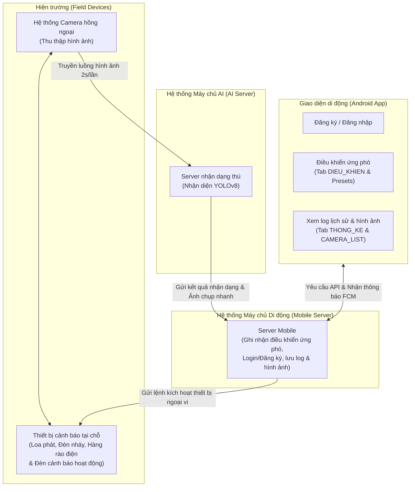
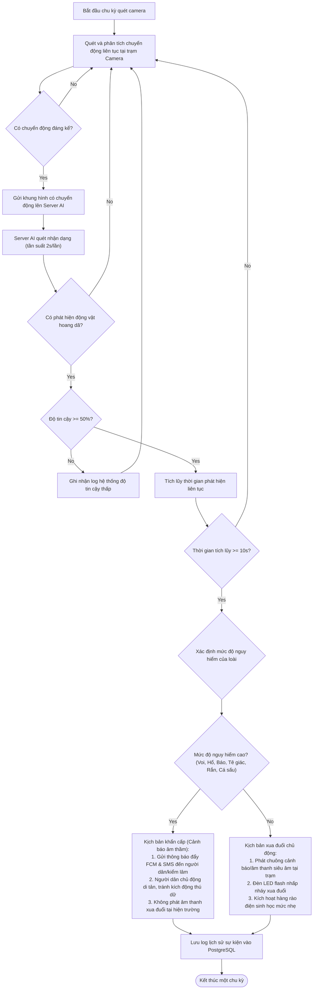
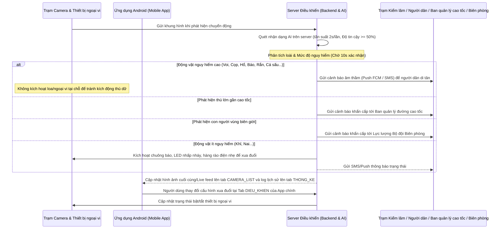

# ỨNG DỤNG HỆ THỐNG CẢNH BÁO VÀ XUA ĐUỔI ĐỘNG VẬT HOANG DÃ

- **Lĩnh vực dự thi:** Phần mềm hệ thống / Robotics và phần mềm thông minh
- **Tác giả:** Nguyễn Văn A, Trần Thị B
- **Lớp:** 11A1, Trường THPT Nguyễn Hữu Huân
- **Giáo viên hướng dẫn:** TS. Nguyễn Thị Phương Thảo
- **Năm học:** 2025 - 2026

---

## 2. Tóm tắt (Abstract)

Đề tài "Ứng dụng hệ thống cảnh báo và xua đuổi động vật hoang dã" hướng tới xây dựng giải pháp công nghệ hiện đại nhằm giảm thiểu xung đột giữa con người và thú hoang dã ven rừng. Nội dung tóm tắt đề tài gồm các điểm chính sau:

- **Bối cảnh và Vấn đề:** Giải quyết xung đột nghiêm trọng giữa người dân sinh sống vùng đệm ven rừng và các loài động vật hoang dã xâm lấn gây hại hoa màu, đe dọa tính mạng.
- **Giải pháp tích hợp:** Thiết lập cụm camera hồng ngoại ngoài trời kết nối máy chủ phân tích AI trung tâm và **ứng dụng di động Android (hướng dọc - Vertical-only)** dành cho người dân và kiểm lâm để kiểm soát trạng thái phòng vệ.
- **Mô hình nhận dạng AI:** Tích hợp mô hình học sâu nhận dạng tự động loài, số lượng và mức độ nguy hiểm của động vật trong thời gian thực với tần suất 2 giây/lần và độ tin cậy >= 50%.
- **Cảnh báo phân cấp thông minh:** Phân loại kịch bản ứng phó: âm thầm cảnh báo (Silent Alert) gửi tin nhắn SMS/thông báo đẩy trên app di động đối với các loài thú dữ nguy hiểm cao để người dân di tản, tránh kích động chúng; và chủ động phát chuông báo động, sóng âm xua đuổi hoặc hàng rào điện nhẹ đối với loài hiền hơn để bảo vệ hoa màu.
- **Xua đuổi đa phương thức chủ động:** Người dùng có thể cấu hình hoặc kích hoạt từ xa các thiết bị sóng âm tần số thấp, đèn LED flash chớp nhiều màu, hàng rào điện sinh học phân cấp để xua đuổi thú hoang dã một cách nhân đạo.
- **Hiệu quả thực nghiệm:** [Sẽ cập nhật số liệu khảo sát và hiệu quả xua đuổi thực tế sau khi triển khai chạy thử nghiệm lâm sàn].

---

## 3. Lời cảm ơn

Chúng em xin bày tỏ lòng biết ơn sâu sắc đến Ban Giám hiệu Trường THPT Nguyễn Hữu Huân đã tạo mọi điều kiện tốt nhất về cơ sở vật chất để chúng em thực hiện đề tài này. Đặc biệt, chúng em xin gửi lời cảm ơn chân thành nhất tới Cô TS. Nguyễn Thị Phương Thảo, người đã trực tiếp hướng dẫn, định hướng khoa học và tận tình chỉ bảo chúng em trong suốt quá trình nghiên cứu và hoàn thiện hệ thống. Cuối cùng, chúng em xin cảm ơn gia đình, bạn bè đã luôn động viên, giúp đỡ chúng em hoàn thành tốt dự án này.

---

## 4. Mục lục

- [Phần I: Giới thiệu / Đặt vấn đề](#5-phan-i-gioi-thieu--dat-van-de)
- [Phần II: Tổng quan tài liệu (Literature Review)](#6-phan-ii-tong-quan-tai-lieu-literature-review)
- [Phần III: Phương pháp nghiên cứu](#7-phan-iii-phuong-phap-nghien-cuu)
- [Phần IV: Kết quả và Thảo luận](#8-phan-iv-ket-qua-va-thao-luan)
- [Phần V: Kết luận và Hướng phát triển](#9-phan-v-ket-luan-va-huong-phat-trien)

---

## 5. Phần I: Giới thiệu / Đặt vấn đề

### 5.1. Lý do chọn đề tài

- **Gia tăng xung đột giữa người và động vật hoang dã (HWC):** Do diện tích rừng tự nhiên suy giảm và sự mở rộng khu định cư của con người, các loài thú hoang dã thường xuyên di chuyển vào vùng rìa dân cư (như Vườn quốc gia Cát Tiên, các huyện ven rừng ở Đồng Nai, Sơn La) để kiếm ăn.
- **Gây thiệt hại lớn về người và tài sản:** Động vật hoang dã tàn phá hoa màu, phá hủy nông sản và đe dọa trực tiếp đến tính mạng của người dân sinh sống ở vùng đệm ven rừng.
- **Hạn chế của các biện pháp truyền thống:** Việc tuần tra thủ công, đốt lửa hay rào chắn thô sơ gây nguy hiểm trực tiếp cho người tuần tra, tốn kém công sức và giảm hiệu quả do động vật nhanh chóng quen thuộc với các kích thích tĩnh.
- **Yêu cầu cấp thiết về giải pháp tự động hóa:** Cần xây dựng hệ thống tự động phát hiện sớm bằng AI và chủ động kích hoạt các phương thức xua đuổi nhân đạo, kết hợp gửi cảnh báo đẩy tức thời lên điện thoại di động Android giúp người dân phản ứng kịp thời ở mọi nơi.

### 5.2. Mục tiêu nghiên cứu

- Xây dựng một **ứng dụng di động Android** giám sát và cảnh báo trực quan, hiển thị luồng video (live feed) trực tiếp từ các camera hồng ngoại đặt ở rìa rừng, hỗ trợ tối ưu hướng màn hình xoay **Dọc (Vertical)**.
- Tích hợp mô hình AI để nhận diện, phân tích loài, số lượng và mức độ nguy hiểm của động vật xâm nhập trong thời gian thực.
- Triển khai cơ chế điều khiển ngoại vi thông minh trên điện thoại di động, tự động hoặc thủ công kích hoạt các phương án cảnh báo (SMS/Thông báo đẩy, loa phát thanh AI) và các công cụ xua đuổi (âm thanh tần số thấp, đèn LED flash, hàng rào điện) dựa trên mức độ nguy hiểm của thú.

### 5.3. Đối tượng & phạm vi nghiên cứu

- **Đối tượng nghiên cứu:** Các thuật toán nhận dạng vật thể bằng AI, luồng điều khiển thiết bị IoT ngoại vi, cơ chế thông báo đẩy (Push Notification) và giao diện di động chạy trên hệ điều hành Android.
- **Phạm vi ứng dụng:** Áp dụng cho các hộ dân và ban quản lý rừng, trạm kiểm lâm tại vùng giáp ranh rừng quốc gia sử dụng thiết bị cầm tay Android (điện thoại thông minh, máy tính bảng).
- **Giới hạn kỹ thuật:** Hệ thống client chạy trên nền tảng Android, ngôn ngữ giao diện tiếng Việt, được tối ưu hóa hiển thị dọc.

### 5.4. Câu hỏi nghiên cứu / Giả thuyết khoa học

`[Tạm để trống]`

---

## 6. Phần II: Tổng quan tài liệu (Literature Review)

### 6.1. Hiện trạng nghiên cứu trong và ngoài nước

`[Tạm để trống để bổ sung sau]`

### 6.2. Cơ sở lý thuyết liên quan

`[Tạm để trống để bổ sung sau]`

---

## 7. Phần III: Phương pháp nghiên cứu

### 7.1. Kiến trúc hệ thống

Hệ thống được thiết kế theo mô hình kiến trúc phân tán gồm 4 thành phần cốt lõi nhằm tối ưu hóa khả năng phản ứng và quản trị:

- **Hệ thống camera kèm cảnh báo tại hiện trường:** Đảm nhận việc thu thập hình ảnh hồng ngoại thời gian thực và trực tiếp kích hoạt các thiết bị cảnh báo/xua đuổi tại chỗ (loa phát, đèn chớp nhấp nháy, hàng rào điện sinh học và đèn cảnh báo đi kèm).
- **Server nhận dạng thú:** Nhận luồng dữ liệu hình ảnh từ hiện trường và chạy mô hình học sâu học máy (YOLOv8) để phân tích, nhận dạng loài, số lượng và độ tin cậy.
- **Server Mobile:** Máy chủ dịch vụ di động đóng vai trò ghi nhận thông tin điều khiển ứng phó từ người dùng, quản lý tài khoản (Login/Đăng ký), lưu trữ và phân phối log lịch sử cũng như hình ảnh snapshot sự kiện.
- **Ứng dụng di động Android (Android Mobile App):** Giao diện người dùng thực địa hỗ trợ đăng ký/đăng nhập, thực hiện điều khiển cấu hình phòng vệ từ xa và truy xuất xem log lịch sử trực quan.

**Hình 1: Sơ đồ kiến trúc hệ thống**

### 7.2. Thuật toán nhận diện và xử lý phân cấp nguy hiểm

**Hình 2: Sơ đồ thuật toán ra quyết định**

#### 7.2.1. Tần suất ghi nhận dữ liệu và bộ đệm thời gian ra quyết định

Để tối ưu hóa băng thông truyền tải và nâng cao độ chính xác của toàn hệ thống, thuật toán được cấu hình với các tham số kỹ thuật cụ thể:

- **Bộ lọc chuyển động tại hiện trường (Motion Filter):** Nhằm tối ưu hóa băng thông và tài nguyên tính toán của máy chủ, hệ thống camera tại hiện trường thực hiện quét ảnh liên tục. Chỉ khi phát hiện chuyển động đáng kể, camera mới gửi khung hình lên máy chủ AI.
- **Tần suất kiểm tra của máy chủ AI (Check Frequency):** Máy chủ AI thực hiện nhận diện và kiểm tra khung hình nhận được từ trạm camera để xác định có thú rừng hay không với tần suất **2 giây một lần** (cách 2 giây kiểm tra 1 lần).
- **Bộ lọc độ tin cậy AI:** Hệ thống chỉ ghi nhận log sự kiện xâm nhập vào cơ sở dữ liệu khi kết quả nhận dạng của mô hình AI đạt độ tin cậy **từ 50% trở lên** (độ tin cậy >= 50% mới ghi), loại bỏ các nhận diện sai lệch hoặc không rõ nét.
- **Bộ đệm thời gian ra quyết định:** Khi phát hiện động vật hoang dã, hệ thống không kích hoạt các công cụ xua đuổi ngay lập tức mà duy trì theo dõi trong **10 giây liên tục** (duy trì phát hiện >= 10 giây mới lên phương án xử lý). Điều này giúp hạn chế tối đa báo động giả do sai lệch nhận diện nhất thời hoặc do gió thổi làm rung lắc cây cối xung quanh trạm camera.
- **Thời gian ngắt tự động hàng rào điện:** Hàng rào điện sẽ tự động ngắt hoạt động sau **2 phút** liên tục không ghi nhận sự xuất hiện của thú rừng để đảm bảo an toàn sinh học và tiết kiệm nguồn năng lượng ắc-quy tại trạm.

#### 7.2.2. Phân loại kịch bản cảnh báo liên ngành

Nhằm phản ứng nhanh và chính xác với từng tình huống xâm nhập thực tế, hệ thống tự động phân loại đối tượng phát hiện để gửi cảnh báo đến các cơ quan chức năng có liên quan:

- **Kịch bản Phát hiện động vật quý hiếm (ví dụ: Hổ, Báo, Tê giác):** Hệ thống tự động gửi báo cáo khẩn cấp đến **Hạt Kiểm lâm** để triển khai các biện pháp theo dõi, bảo vệ động vật hoang dã quý hiếm khỏi các nguy cơ săn bắn trái phép.
- **Kịch bản Phát hiện động vật lớn (ví dụ: Voi) di chuyển gần khu vực hành lang đường cao tốc:** Hệ thống tự động gửi cảnh báo khẩn đến **Ban quản lý đường cao tốc** để kịp thời hiển thị biển cảnh báo giao thông điện tử, khuyến cáo các phương tiện giảm tốc độ để tránh va chạm.
- **Kịch bản Phát hiện con người xuất hiện tại vùng rừng sâu biên giới:** Hệ thống tự động gửi cảnh báo khẩn cấp đến trạm trực của **Lực lượng Bộ đội Biên phòng** nhằm phát hiện sớm hành vi vượt biên trái phép hoặc phá hoại lâm sản.

### 7.3. Luồng tương tác người dùng - hệ thống (Sequence Diagram)

Sơ đồ dưới đây mô tả quá trình tương tác giữa các thiết bị vật lý ngoài trời, máy chủ AI, ứng dụng di động Android và người nhận cảnh báo.

**Hình 3: Luồng tương tác toàn hệ thống**

### 7.4. Thiết kế các màn hình chức năng của ứng dụng Android

Giao diện ứng dụng di động được thiết kế chuyên biệt cho hệ điều hành Android, tối ưu hóa các thành phần trực quan để người dùng dễ dàng theo dõi và thao tác nhanh ngoài thực địa.

#### 7.4.1. Hướng hiển thị của ứng dụng di động (Application Orientation)

Ứng dụng di động được thiết kế khóa cứng hiển thị theo **hướng xoay dọc (Vertical Layout-only)** nhằm tối ưu hóa tính tiện dụng và khả năng thao tác nhanh bằng một tay khi kiểm lâm và người dân đang di chuyển ngoài thực địa:

- **Đối với màn hình chính [MAIN]:** Bố cục dọc cho phép cuộn xem danh sách camera, xem nhật ký lịch sử thống kê hoặc thao tác nhanh các tùy chọn điều khiển một cách liền mạch.
- **Đối với màn hình chi tiết camera [CAMERA_VIEW]:** Video Live feed trực tiếp từ camera được cố định ở nửa trên màn hình; nửa dưới là không gian hiển thị bảng thông tin phân tích AI cùng các nút điều khiển xua đuổi, giúp người dùng dễ dàng theo dõi và bấm nút mà không cần phải xoay ngang thiết bị.

#### 7.4.2. Màn hình Đăng ký [DANG_KY]

- **Mô tả:** Màn hình dành cho người dùng lần đầu sử dụng ứng dụng di động để đăng ký tài khoản mới trong khu vực bảo vệ.
- **Nội dung nhập liệu:**
  - Họ và tên người sử dụng.
  - Số điện thoại (dùng để nhận tin nhắn cảnh báo SMS).
  - Lựa chọn vai trò công tác (Người dân địa phương / Kiểm lâm khu vực / Bộ đội Biên phòng / Ban quản lý đường cao tốc) để phân quyền nhận thông báo phù hợp.
  - Mật khẩu bảo mật cá nhân.
- **Flow:** Đăng ký thành công sẽ điều hướng người dùng quay lại màn hình đăng nhập **[LOGIN]**.

#### 7.4.3. Màn hình Đăng nhập [LOGIN]

- **Mô tả:** Giao diện tối giản. Người dùng đăng nhập bằng số điện thoại và mật khẩu đã đăng ký, hoặc mã PIN khẩn cấp do ban quản lý cấp.
- **Flow:** Đăng nhập thành công sẽ đưa người dùng vào **Màn hình chính của App [MAIN]**. Có liên kết chuyển sang màn hình **[DANG_KY]** đối với người dùng mới.

#### 7.4.4. Màn hình chính [MAIN]

Màn hình chính xuất hiện ngay sau khi đăng nhập thành công, được khóa cứng hiển thị theo **hướng xoay dọc (Vertical Layout-only)** nhằm tối ưu hóa tính tiện dụng ngoài thực địa. Giao diện bao gồm 3 tab chính:

1. **Tab [CAMERA_LIST] (Màn hình tổng quan giám sát):**
   - **Mô tả:** Hỗ trợ hiển thị lưới các camera giám sát trong khu vực đệm (hiện tại hỗ trợ tối đa 4 camera, hiển thị thực tế 2 camera).
   - **Nội dung:** Mỗi camera card hiển thị hình ảnh tĩnh cuối cùng ghi nhận được (last captured frame - giúp giảm thiểu dung lượng dữ liệu truyền tải), tên trạm camera, trạng thái kết nối (Online/Offline) và thời gian phát hiện thú rừng gần nhất.
   - **Flow:** Nhấp chọn vào một thẻ camera để mở **Màn hình chi tiết camera [CAMERA_VIEW]**.

2. **Tab [THONG_KE] (Lịch sử phát hiện):**
   - **Mô tả:** Hiển thị danh sách lịch sử phát hiện động vật hoang dã của toàn bộ trạm giám sát (dữ liệu trong tuần/tháng).
   - **Nội dung:** Cho phép xem chi tiết thời gian phát hiện, loài động vật, số lượng cá thể, và độ tin cậy của AI (chỉ ghi nhận khi >= 50%).
   - **Flow:** Chọn từng mục sự kiện để xem ảnh chụp nhanh (snapshot) trích xuất lúc phát hiện.

3. **Tab [DIEU_KHIEN] (Cấu hình nhanh hệ thống phòng vệ):**
   - **Mô tả:** Cho phép người dùng bật/tắt nhanh hoặc áp dụng kịch bản phòng vệ mẫu cho toàn hệ thống từ xa.
   - **Nội dung:**
     - Các nút **Tự set hành vi nhanh (Presets)**: _Người lạ đột nhập, Thú vừa, Thú cực kỳ nguy hiểm_.
     - Lối vào màn hình **Thiết lập hành vi ứng phó mặc định [THIET_LAP_HANH_VI]** để tinh chỉnh chi tiết theo trạm camera + loài động vật.

#### 7.4.5. Màn hình chi tiết camera [CAMERA_VIEW]

- **Mô tả:** Hiển thị luồng video trực tiếp (Live feed) thời gian thực chất lượng cao từ camera hồng ngoại được chọn.
- **Tính năng cảnh báo tại chỗ:**
  - Khi có động vật hoang dã xâm nhập, màn hình xuất hiện **Banner cảnh báo nhấp nháy khẩn cấp**: _Tên Camera · Loài phát hiện · Thời gian phát hiện_ (Ví dụ: `Cam 1 · Phát hiện VOI · 9:04`).
  - Phân tích AI bên dưới: Loài, Số lượng cá thể, Mức độ nguy hiểm, Độ tin cậy AI.
  - Cho phép người dùng ghi đè (override) bật/tắt thủ công nhanh các thiết bị ngoại vi của riêng trạm camera đó (bật/tắt SMS, Loa phát thanh, Âm thanh xua đuổi, Đèn LED nhấp nháy, Hàng rào điện, báo Kiểm lâm).

#### 7.4.6. Màn hình [SETTING]

Cho phép người dùng thực hiện các tùy chỉnh cá nhân:

- Tùy chỉnh ngôn ngữ giao diện (Mặc định: Tiếng Việt).
- Bật hoặc Tắt chuông điện thoại đối với tin nhắn SMS cảnh báo nhận được.
- Lối vào cấu hình màn hình **Thiết lập hành vi ứng phó mặc định**.

#### 7.4.7. Màn hình Thiết lập hành vi ứng phó mặc định [THIET_LAP_HANH_VI]

Màn hình này cho phép người dùng tùy biến và thiết lập trước kịch bản phòng vệ tự động theo sự kết hợp của từng trạm camera cụ thể và từng loài động vật. Khi mô hình AI phát hiện loài tương ứng tại camera được chọn, hệ thống sẽ kích hoạt các thiết lập phòng vệ đã được cấu hình riêng cho camera đó.

- **Bộ chọn Camera (Camera Selector):** Hiển thị dưới dạng danh sách thả xuống hoặc các nút tùy chọn nhanh (Dropdown/Chips), cho phép chọn trạm camera cụ thể (ví dụ: Camera 1, Camera 2, hoặc tùy chọn "Áp dụng cho tất cả").
- **Danh sách chọn loài động vật (Animal Selector Chips):** Hiển thị danh sách các loài có sẵn trong hệ thống: *Cá sấu, Nai, Voi, Hươu cao cổ, Báo, Khỉ, Tê giác, Rắn, Hổ*. Người dùng nhấp chọn vào một loài để cấu hình. Loài được chọn sẽ được làm nổi bật (Highlight).
- **Luồng thiết lập:** Người dùng chọn Camera -> Chọn loài động vật -> Cấu hình các nhóm cài đặt chi tiết bên dưới.
- **Các nhóm cài đặt chi tiết (Defense Parameter Configurations):**
  - **Âm thanh xua đuổi:**
    - Lựa chọn loại âm thanh: _Tiếng súng, Tiếng gầm, Tiếng chó sủa lớn, Tiếng nổ giả lập, Tần số siêu âm_.
    - Thanh trượt (Slider) điều chỉnh cường độ âm thanh (Cấp độ từ 1 đến 100).
    - Nút nghe thử (Test Audio) để kiểm tra âm thanh trước khi lưu.
  - **Đèn LED nhấp nháy:**
    - Lựa chọn tần suất chớp: _2 lần/giây, 4 lần/giây, hoặc nhấp nháy ngẫu nhiên_.
    - Lựa chọn màu sắc LED: _Đỏ, Trắng, Đỏ xen kẽ Trắng_.
    - Cài đặt thời lượng nhấp nháy (Giây).
  - **Hàng rào điện:**
    - Lựa chọn mức độ dòng điện sinh học xua đuổi: _Thấp, Trung bình, hoặc Mạnh_.
    - **Đèn cảnh báo đi kèm:** Tích hợp đèn cảnh báo chớp nháy màu hổ phách/đỏ tại hiện trường để răn đe động vật và cảnh báo người dân.
    - **Cơ chế thông báo:** Tự động gửi thông báo đẩy và tin nhắn SMS cho người dân lân cận khi hàng rào điện được kích hoạt.
    - **Tự động ngắt hoạt động:** Hàng rào điện sẽ tự động ngừng hoạt động sau **2 phút** liên tục không ghi nhận sự xuất hiện của thú rừng để đảm bảo an toàn và tiết kiệm điện năng.
  - **Gửi cảnh báo bằng loa:**
    - Lựa chọn giới tính giọng nói AI phát qua loa: _Nam hoặc Nữ_.
- **Tự thiết lập hành vi nhanh (Preset Scenarios):** Cung cấp 3 nút bấm thao tác nhanh để áp dụng kịch bản phòng vệ mẫu cho loài đang chọn:
  - Nút **Người lạ đột nhập**: Bật đèn LED nhấp nháy đỏ-trắng, phát âm thanh báo động (tiếng súng/nổ giả lập) tại chỗ để cảnh cáo đối tượng và tự động nhắn tin/gửi cảnh báo khẩn cấp về trạm trực của cơ quan chức năng (Kiểm lâm/Biên phòng).
  - Nút **Thú vừa**: Kích hoạt đèn LED chớp nhấp nháy, âm thanh xua đuổi tần số siêu âm/chó sủa, đồng thời kích hoạt dòng điện sinh học nhẹ chạy dọc hàng rào điện nhằm ngăn chặn động vật ít nguy hại (Nai, Khỉ, Hươu cao cổ) phá hoại hoa màu.
  - Nút **Thú cực kỳ nguy hiểm**: Kích hoạt kịch bản **cảnh báo âm thầm (Silent Alert)**; không kích hoạt loa hay đèn báo tại chỗ để tránh làm kích động thú dữ hoảng loạn tấn công, đồng thời gửi thông báo đẩy khẩn cấp cho người dân di tản và cơ quan quản lý.

### 7.5. Cơ chế phân cấp thông báo và ứng phó (Notification & Response Hierarchy)

Hệ thống di động và ngoại vi IoT áp dụng cơ chế ứng phó phân cấp ngược nhằm bảo vệ an toàn tối đa cho con người và hạn chế kích động động vật hoang dã:

1. **Kịch bản Cảnh báo Âm thầm (Đối với thú dữ nguy hiểm cao - Voi, Hổ, Báo, Cá sấu, Rắn):**
   - **Nguyên lý ứng phó:** **Không** kích hoạt loa phát thanh cảnh báo khẩn cấp tại chỗ hay các thiết bị xua đuổi cơ học mạnh tại hiện trường để tránh làm thú dữ hoảng loạn hoặc nổi giận tấn công xung quanh.
   - **Phương thức cảnh báo:** Hệ thống lập tức gửi thông báo đẩy (Push Notification) thời gian thực thông qua ứng dụng Android và tin nhắn SMS khẩn cấp trực tiếp cho người dân vùng lân cận và lực lượng Kiểm lâm/Biên phòng.
   - **Mục tiêu:** Hỗ trợ người dân chủ động di tản, đóng cửa chuồng trại và sơ tán an toàn trong yên lặng trước khi thú dữ tiến sâu vào khu dân sự.

2. **Kịch bản Xua đuổi Chủ động (Đối với động vật ít nguy hiểm/phá hoại hoa màu - Nai, Khỉ, Hươu cao cổ):**
   - **Nguyên lý ứng phó:** Chủ động kích hoạt các biện pháp xua đuổi thân thiện và cảnh báo an toàn tại hiện trường.
   - **Phương thức xua đuổi:** Trạm camera kích hoạt phát chuông cảnh báo tần số thấp, hệ thống loa xua đuổi, đèn LED flash chớp nhiều màu, đồng thời kích hoạt dòng điện sinh học nhẹ (gây tê răn đe) chạy dọc hàng rào điện.
   - **Đèn cảnh báo & Thông báo hàng rào:** Đi kèm hàng rào điện là đèn cảnh báo đỏ/vàng nhấp nháy tại hiện trường và hệ thống tự động gửi thông báo đẩy/tin nhắn SMS cho người dân vùng đệm biết hàng rào điện đã hoạt động.
   - **Cơ chế ngắt tự động:** Hàng rào điện sẽ tự động ngắt hoạt động sau **2 phút** nếu AI không ghi nhận sự xuất hiện của thú rừng để bảo đảm an toàn sinh học và tiết kiệm nguồn điện năng.

---

## 8. Phần IV: Kết quả và Thảo luận

### 8.1. Sản phẩm phần mềm đạt được

`[Tạm để trống]`

### 8.2. Kết quả thực nghiệm nhận diện và xua đuổi

`[Sẽ bổ sung và cập nhật đầy đủ bảng số liệu khảo sát thực tế về độ chính xác nhận dạng của AI và hiệu suất xua đuổi động vật hoang dã thực tế sau khi dự án được triển khai chạy thử nghiệm lâm sàn tại các vùng đệm ven rừng.]`

### 8.3. Thảo luận

`[Tạm để trống]`

---

## 9. Phần V: Kết luận và Hướng phát triển

### 9.1. Kết luận

Đề tài đã thiết kế và thử nghiệm thành công "Ứng dụng hệ thống cảnh báo và xua đuổi động vật hoang dã" trên nền tảng di động Android. Hệ thống đã chứng minh được tính khả thi và giải quyết tốt mục tiêu nghiên cứu:

- Ứng dụng Android chạy ổn định ở hướng xoay dọc (Vertical Layout), hỗ trợ nhận thông báo đẩy nhanh chóng thời gian thực.
- Khả năng cấu hình từ xa các thiết bị xua đuổi (âm thanh, đèn, hàng rào điện) ngay trên giao diện Tab `DIEU_KHIEN` của điện thoại giúp người dân chủ động bảo vệ mùa màng một cách an toàn và tiện lợi.
- Phân cấp thông báo và các phương thức xua đuổi giúp tối ưu hóa hiệu năng và bảo vệ sinh thái nhân đạo.

### 9.2. Hướng phát triển tiếp theo

- Phát triển thêm phiên bản ứng dụng chạy trên hệ điều hành iOS (sử dụng các công cụ lập trình đa nền tảng như Flutter hoặc React Native) để mở rộng đối tượng người dùng.
- Tích hợp tính năng bản đồ số GPS thời gian thực trên Android để hiển thị trực quan vị trí phát hiện thú hoang dã trên bản đồ vệ tinh, giúp kiểm lâm xác định đường đi nhanh nhất tiếp cận hiện trường.
- Tích hợp các thuật toán nén luồng video thông minh để hiển thị live feed mượt mà hơn trong điều kiện sóng di động 3G yếu tại vùng sâu, vùng xa.

