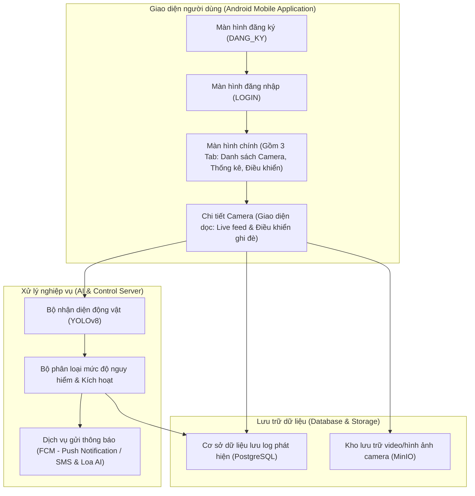
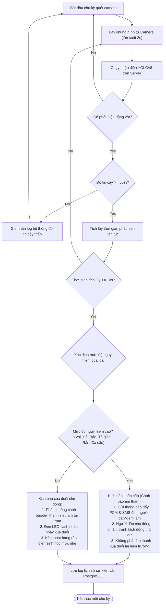
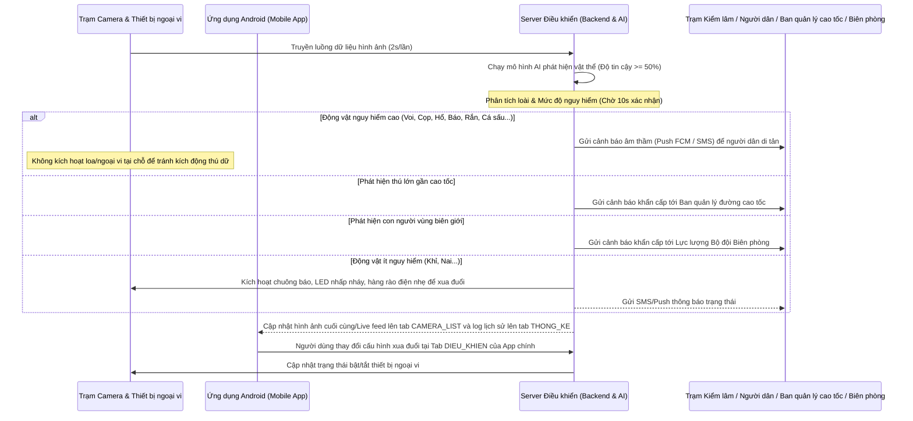
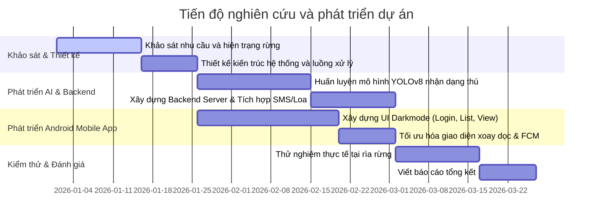

# ỨNG DỤNG HỆ THỐNG CẢNH BÁO VÀ XUA ĐUỔI ĐỘNG VẬT HOANG DÃ

- **Lĩnh vực dự thi:** Phần mềm hệ thống / Robotics và phần mềm thông minh
- **Tác giả:** Nguyễn Văn A, Trần Thị B
- **Lớp:** 11A1, Trường THPT Nguyễn Hữu Huân
- **Giáo viên hướng dẫn:** TS. Nguyễn Thị Phương Thảo
- **Năm học:** 2025 - 2026

---

## 2. Tóm tắt (Abstract)

Đề tài "Ứng dụng hệ thống cảnh báo và xua đuổi động vật hoang dã" hướng tới xây dựng giải pháp công nghệ hiện đại nhằm giảm thiểu xung đột giữa con người và thú hoang dã ven rừng. Nội dung tóm tắt đề tài gồm các điểm chính sau:

- **Bối cảnh và Vấn đề:** Giải quyết xung đột nghiêm trọng giữa người dân sinh sống vùng đệm ven rừng và các loài động vật hoang dã xâm lấn gây hại hoa màu, đe dọa tính mạng.
- **Giải pháp tích hợp:** Thiết lập cụm camera hồng ngoại ngoài trời kết nối máy chủ phân tích AI trung tâm và **ứng dụng di động Android (hướng dọc - Vertical-only)** dành cho người dân và kiểm lâm để kiểm soát trạng thái phòng vệ.
- **Mô hình nhận dạng AI:** Tích hợp mô hình học sâu nhận dạng tự động loài, số lượng và mức độ nguy hiểm của động vật trong thời gian thực với tần suất 2 giây/lần và độ tin cậy >= 50%.
- **Cảnh báo phân cấp thông minh:** Phân loại kịch bản ứng phó: âm thầm cảnh báo (Silent Alert) gửi tin nhắn SMS/thông báo đẩy trên app di động đối với các loài thú dữ nguy hiểm cao để người dân di tản, tránh kích động chúng; và chủ động phát chuông báo động, sóng âm xua đuổi hoặc hàng rào điện nhẹ đối với loài hiền hơn để bảo vệ hoa màu.
- **Xua đuổi đa phương thức chủ động:** Người dùng có thể cấu hình hoặc kích hoạt từ xa các thiết bị sóng âm tần số thấp, đèn LED flash chớp nhiều màu, hàng rào điện sinh học phân cấp để xua đuổi thú hoang dã một cách nhân đạo.
- **Hiệu quả thực nghiệm:** [Sẽ cập nhật số liệu khảo sát và hiệu quả xua đuổi thực tế sau khi triển khai chạy thử nghiệm lâm sàn].

---

## 3. Lời cảm ơn

Chúng em xin bày tỏ lòng biết ơn sâu sắc đến Ban Giám hiệu Trường THPT Nguyễn Hữu Huân đã tạo mọi điều kiện tốt nhất về cơ sở vật chất để chúng em thực hiện đề tài này. Đặc biệt, chúng em xin gửi lời cảm ơn chân thành nhất tới Cô TS. Nguyễn Thị Phương Thảo, người đã trực tiếp hướng dẫn, định hướng khoa học và tận tình chỉ bảo chúng em trong suốt quá trình nghiên cứu và hoàn thiện hệ thống. Cuối cùng, chúng em xin cảm ơn gia đình, bạn bè đã luôn động viên, giúp đỡ chúng em hoàn thành tốt dự án này.

---

## 4. Mục lục

- [Phần I: Giới thiệu / Đặt vấn đề](#5-phan-i-gioi-thieu--dat-van-de)
- [Phần II: Tổng quan tài liệu (Literature Review)](#6-phan-ii-tong-quan-tai-lieu-literature-review)
- [Phần III: Phương pháp nghiên cứu](#7-phan-iii-phuong-phap-nghien-cuu)
- [Phần IV: Kết quả và Thảo luận](#8-phan-iv-ket-qua-va-thao-luan)
- [Phần V: Kết luận và Hướng phát triển](#9-phan-v-ket-luan-va-huong-phat-trien)
- [Phụ lục](#10-phu-luc)

---

## 5. Phần I: Giới thiệu / Đặt vấn đề

### 5.1. Lý do chọn đề tài

- **Gia tăng xung đột giữa người và động vật hoang dã (HWC):** Do diện tích rừng tự nhiên suy giảm và sự mở rộng khu định cư của con người, các loài thú hoang dã thường xuyên di chuyển vào vùng rìa dân cư (như Vườn quốc gia Cát Tiên, các huyện ven rừng ở Đồng Nai, Sơn La) để kiếm ăn.
- **Gây thiệt hại lớn về người và tài sản:** Động vật hoang dã tàn phá hoa màu, phá hủy nông sản và đe dọa trực tiếp đến tính mạng của người dân sinh sống ở vùng đệm ven rừng.
- **Hạn chế của các biện pháp truyền thống:** Việc tuần tra thủ công, đốt lửa hay rào chắn thô sơ gây nguy hiểm trực tiếp cho người tuần tra, tốn kém công sức và giảm hiệu quả do động vật nhanh chóng quen thuộc với các kích thích tĩnh.
- **Yêu cầu cấp thiết về giải pháp tự động hóa:** Cần xây dựng hệ thống tự động phát hiện sớm bằng AI và chủ động kích hoạt các phương thức xua đuổi nhân đạo, kết hợp gửi cảnh báo đẩy tức thời lên điện thoại di động Android giúp người dân phản ứng kịp thời ở mọi nơi.

### 5.2. Mục tiêu nghiên cứu

- Xây dựng một **ứng dụng di động Android** giám sát và cảnh báo trực quan với giao diện Darkmode, hiển thị luồng video (live feed) trực tiếp từ các camera hồng ngoại đặt ở rìa rừng, hỗ trợ tối ưu hướng màn hình xoay **Dọc (Vertical)**.
- Tích hợp mô hình AI để nhận diện, phân tích loài, số lượng và mức độ nguy hiểm của động vật xâm nhập trong thời gian thực.
- Triển khai cơ chế điều khiển ngoại vi thông minh trên điện thoại di động, tự động hoặc thủ công kích hoạt các phương án cảnh báo (SMS/Thông báo đẩy, loa phát thanh AI) và các công cụ xua đuổi (âm thanh tần số thấp, đèn LED flash, hàng rào điện) dựa trên mức độ nguy hiểm của thú.

### 5.3. Đối tượng & phạm vi nghiên cứu

- **Đối tượng nghiên cứu:** Các thuật toán nhận dạng vật thể bằng AI, luồng điều khiển thiết bị IoT ngoại vi, cơ chế thông báo đẩy (Push Notification) và giao diện di động chạy trên hệ điều hành Android.
- **Phạm vi ứng dụng:** Áp dụng cho các hộ dân và ban quản lý rừng, trạm kiểm lâm tại vùng giáp ranh rừng quốc gia sử dụng thiết bị cầm tay Android (điện thoại thông minh, máy tính bảng).
- **Giới hạn kỹ thuật:** Hệ thống client chạy trên nền tảng Android, ngôn ngữ giao diện tiếng Việt, được tối ưu hóa hiển thị dọc với giao diện tối (Darkmode).

### 5.4. Câu hỏi nghiên cứu / Giả thuyết khoa học

- **Câu hỏi nghiên cứu:** Liệu việc ứng dụng mô hình học sâu kết hợp ứng dụng di động Android điều khiển thiết bị ngoại vi đa phương thức có giúp người dân nhận tin cảnh báo trong vòng dưới 2 giây và giảm tỉ lệ xung đột vật lý xuống dưới 10% hay không?
- **Giả thuyết khoa học:** Hệ thống cảnh báo tự động thông qua việc phân tích mức độ hung dữ của động vật bằng AI và thông báo đẩy trực tiếp lên điện thoại Android sẽ giúp tối ưu hóa phương thức xua đuổi (dùng loa phát thanh giọng AI khẩn cấp với thú dữ lớn như voi, cọp và dùng SMS/Thông báo đẩy kèm sóng âm tần số thấp với khỉ, nai), từ đó nâng cao hiệu quả phòng chống xâm nhập một cách kịp thời và nhân đạo.

---

## 6. Phần II: Tổng quan tài liệu (Literature Review)

### 6.1. Hiện trạng nghiên cứu trong và ngoài nước

Các giải pháp giám sát động vật hoang dã trên thế giới đã chuyển dịch mạnh mẽ từ bẫy ảnh truyền thống (chỉ chụp ảnh lưu thẻ nhớ) sang các hệ thống bẫy ảnh thông minh có kết nối không dây (Cellular/LoRa) gửi dữ liệu trực tiếp về máy chủ đám mây. Nhiều nhóm nghiên cứu tại châu Phi và Ấn Độ đã thử nghiệm thành công mô hình phát hiện động vật lớn như Voi châu Phi bằng mạng neural tích chập (CNN), kết hợp kích hoạt loa phát ra tiếng ong mật hoặc tiếng động vật ăn thịt để xua đuổi.

Tại Việt Nam, các dự án giám sát đa phần vẫn dừng lại ở mức khảo sát thực địa định kỳ hoặc sử dụng các trạm quan trắc thủ công. Chưa có một hệ thống tích hợp hoàn chỉnh và trực quan cho phép người dân địa phương và cơ quan kiểm lâm cùng phối hợp theo dõi, nhận cảnh báo thời gian thực cũng như trực tiếp điều khiển các thiết bị xua đuổi sinh học chủ động thông qua giao diện di động Darkmode tiện dụng.

### 6.2. Cơ sở lý thuyết liên quan

- **Mô hình học máy YOLOv8 (You Only Look Once):** Được sử dụng làm lõi nhận diện nhờ tốc độ xử lý khung hình cực nhanh (real-time) và độ chính xác cao đối với động vật trong môi trường tự nhiên, kể cả ban đêm thông qua camera hồng ngoại.
- **Dịch vụ thông báo Firebase Cloud Messaging (FCM):** Đảm bảo tin nhắn cảnh báo được đẩy xuống điện thoại Android trong mili-giây, hỗ trợ chạy ngầm (Background) và chạy nổi (Foreground).
- **Sóng âm tần số thấp (Infrasound):** Động vật hoang dã, đặc biệt là voi, cực kỳ nhạy cảm với các tần số âm thanh thấp (dưới 20 Hz). Sóng âm này tạo ra cảm giác khó chịu tự nhiên khiến chúng tự tránh xa mà không gây tổn thương thực thể.

---

## 7. Phần III: Phương pháp nghiên cứu

### 7.1. Kiến trúc hệ thống

Hệ thống được thiết kế theo mô hình tích hợp gồm: Trạm Camera/Thiết bị xua đuổi ngoài trời, Server trung tâm chạy AI và ứng dụng di động Android làm giao diện tương tác người dùng.

**Hình 1: Sơ đồ kiến trúc hệ thống**

### 7.2. Thuật toán nhận diện và xử lý phân cấp nguy hiểm

**Hình 2: Sơ đồ thuật toán ra quyết định**

#### 7.2.1. Tần suất ghi nhận dữ liệu và bộ đệm thời gian ra quyết định

Để tối ưu hóa băng thông truyền tải và nâng cao độ chính xác của toàn hệ thống, thuật toán được cấu hình với các tham số kỹ thuật cụ thể:

- **Tần suất ghi nhận dữ liệu:** Mô hình AI phân tích luồng video hồng ngoại thời gian thực, thực hiện ghi nhận và lưu trữ kết quả kiểm tra với tần suất **2 giây một lần** (cách 2 giây lưu 1 kết quả).
- **Bộ lọc độ tin cậy AI:** Hệ thống chỉ ghi nhận log sự kiện xâm nhập vào cơ sở dữ liệu khi kết quả nhận dạng của mô hình AI đạt độ tin cậy **từ 50% trở lên** (độ tin cậy >= 50% mới ghi), loại bỏ các nhận diện sai lệch hoặc không rõ nét.
- **Bộ đệm thời gian ra quyết định:** Khi phát hiện động vật hoang dã, hệ thống không kích hoạt các công cụ xua đuổi ngay lập tức mà duy trì theo dõi trong **10 giây liên tục** (duy trì phát hiện >= 10 giây mới lên phương án xử lý). Điều này giúp hạn chế tối đa báo động giả do sai lệch nhận diện nhất thời hoặc do gió thổi làm rung lắc cây cối xung quanh trạm camera.

#### 7.2.2. Phân loại kịch bản cảnh báo liên ngành

Nhằm phản ứng nhanh và chính xác với từng tình huống xâm nhập thực tế, hệ thống tự động phân loại đối tượng phát hiện để gửi cảnh báo đến các cơ quan chức năng có liên quan:

- **Kịch bản Phát hiện động vật quý hiếm (ví dụ: Hổ, Báo, Tê giác):** Hệ thống tự động gửi báo cáo khẩn cấp đến **Hạt Kiểm lâm** để triển khai các biện pháp theo dõi, bảo vệ động vật hoang dã quý hiếm khỏi các nguy cơ săn bắn trái phép.
- **Kịch bản Phát hiện động vật lớn (ví dụ: Voi) di chuyển gần khu vực hành lang đường cao tốc:** Hệ thống tự động gửi cảnh báo khẩn đến **Ban quản lý đường cao tốc** để kịp thời hiển thị biển cảnh báo giao thông điện tử, khuyến cáo các phương tiện giảm tốc độ để tránh va chạm.
- **Kịch bản Phát hiện con người xuất hiện tại vùng rừng sâu biên giới:** Hệ thống tự động gửi cảnh báo khẩn cấp đến trạm trực của **Lực lượng Bộ đội Biên phòng** nhằm phát hiện sớm hành vi vượt biên trái phép hoặc phá hoại lâm sản.

### 7.3. Luồng tương tác người dùng - hệ thống (Sequence Diagram)

Sơ đồ dưới đây mô tả quá trình tương tác giữa các thiết bị vật lý ngoài trời, máy chủ AI, ứng dụng di động Android và người nhận cảnh báo.

**Hình 3: Luồng tương tác toàn hệ thống**

### 7.4. Thiết kế các màn hình chức năng của ứng dụng Android (Darkmode)

Giao diện ứng dụng di động được thiết kế chuyên biệt cho hệ điều hành Android, sử dụng chủ đề tối (Darkmode) để tiết kiệm pin cho màn hình AMOLED/OLED và giảm mỏi mắt cho người dùng khi sử dụng ban đêm ngoài thực địa.

#### 7.4.1. Hướng hiển thị của ứng dụng di động (Application Orientation)

Ứng dụng di động được thiết kế khóa cứng hiển thị theo **hướng xoay dọc (Vertical Layout-only)** nhằm tối ưu hóa tính tiện dụng và khả năng thao tác nhanh bằng một tay khi kiểm lâm và người dân đang di chuyển ngoài thực địa:

- **Đối với màn hình chính [MAIN]:** Bố cục dọc cho phép cuộn xem danh sách camera, xem nhật ký lịch sử thống kê hoặc thao tác nhanh các tùy chọn điều khiển một cách liền mạch.
- **Đối với màn hình chi tiết camera [CAMERA_VIEW]:** Video Live feed trực tiếp từ camera được cố định ở nửa trên màn hình; nửa dưới là không gian hiển thị bảng thông tin phân tích AI cùng các nút điều khiển xua đuổi, giúp người dùng dễ dàng theo dõi và bấm nút mà không cần phải xoay ngang thiết bị.

#### 7.4.2. Màn hình Đăng ký [DANG_KY]

- **Mô tả:** Màn hình dành cho người dùng lần đầu sử dụng ứng dụng di động để đăng ký tài khoản mới trong khu vực bảo vệ.
- **Nội dung nhập liệu:**
  - Họ và tên người sử dụng.
  - Số điện thoại (dùng để nhận tin nhắn cảnh báo SMS).
  - Lựa chọn vai trò công tác (Người dân địa phương / Kiểm lâm khu vực / Bộ đội Biên phòng / Ban quản lý đường cao tốc) để phân quyền nhận thông báo phù hợp.
  - Mật khẩu bảo mật cá nhân.
- **Flow:** Đăng ký thành công sẽ điều hướng người dùng quay lại màn hình đăng nhập **[LOGIN]**.

#### 7.4.3. Màn hình Đăng nhập [LOGIN]

- **Mô tả:** Giao diện tối giản. Người dùng đăng nhập bằng số điện thoại và mật khẩu đã đăng ký, hoặc mã PIN khẩn cấp do ban quản lý cấp.
- **Flow:** Đăng nhập thành công sẽ đưa người dùng vào **Màn hình chính của App [MAIN]**. Có liên kết chuyển sang màn hình **[DANG_KY]** đối với người dùng mới.

#### 7.4.4. Màn hình chính [MAIN] (Gồm 3 tab chính)
Ứng dụng di động được thiết kế khóa cứng hiển thị theo **hướng xoay dọc (Vertical Layout-only)** nhằm tối ưu hóa tính tiện dụng và khả năng thao tác nhanh bằng một tay khi kiểm lâm và người dân đang di chuyển ngoài thực địa.

#### 7.4.2. Màn hình Đăng ký [DANG_KY] và Đăng nhập [LOGIN]
(Chi tiết như mô tả hệ thống chính).

#### 7.4.3. Màn hình chính [MAIN]
Màn hình chính xuất hiện ngay sau khi đăng nhập thành công, bao gồm 3 tab điều hướng: **[CAMERA_LIST]**, **[THONG_KE]**, và **[DIEU_KHIEN]**.

### 7.5. Cơ chế phân cấp thông báo và ứng phó (Notification & Response Hierarchy)

Hệ thống di động và ngoại vi IoT áp dụng cơ chế ứng phó phân cấp ngược nhằm bảo vệ an toàn tối đa cho con người và hạn chế kích động động vật hoang dã:

1. **Kịch bản Cảnh báo Âm thầm (Đối với thú dữ nguy hiểm cao - Voi, Hổ, Báo, Cá sấu, Rắn):**
   - **Nguyên lý ứng phó:** **Không** phát loa thông báo tại trạm camera hay kích hoạt các thiết bị xua đuổi cơ học mạnh tại hiện trường để tránh làm thú dữ hoảng loạn hoặc nổi giận tấn công xung quanh.
   - **Phương thức cảnh báo:** Hệ thống lập tức gửi thông báo đẩy (Push Notification) thời gian thực thông qua ứng dụng Android và tin nhắn SMS khẩn cấp trực tiếp cho người dân vùng lân cận và lực lượng Kiểm lâm/Biên phòng.
   - **Mục tiêu:** Hỗ trợ người dân chủ động di tản, đóng cửa chuồng trại và sơ tán an toàn trong yên lặng trước khi thú dữ tiến sâu vào khu dân sự.

2. **Kịch bản Xua đuổi Chủ động (Đối với động vật ít nguy hiểm/phá hoại hoa màu - Nai, Khỉ, Hươu cao cổ):**
   - **Nguyên lý ứng phó:** Chủ động kích hoạt các biện pháp xua đuổi tại hiện trường.
   - **Phương thức xua đuổi:** Trạm camera kích hoạt phát chuông cảnh báo, đèn LED flash chớp nhiều màu hoặc dòng điện sinh học nhẹ (gây tê nhẹ để răn đe) chạy dọc hàng rào điện nhằm đẩy lùi thú quay lại rừng mà không gây tổn thương thực thể.
   - **Mục tiêu:** Bảo vệ hoa màu, ngăn chặn phá hoại nông nghiệp một cách nhân đạo mà không làm ảnh hưởng đến đời sống sinh hoạt diện rộng của người dân.

#### 7.4.5. Màn hình chi tiết camera [CAMERA_VIEW]

- **Mô tả:** Hiển thị luồng video trực tiếp (Live feed) thời gian thực chất lượng cao từ camera hồng ngoại được chọn.
- **Tính năng cảnh báo tại chỗ:**
  - Khi có động vật hoang dã xâm nhập, màn hình xuất hiện **Banner cảnh báo nhấp nháy khẩn cấp**: _Tên Camera · Loài phát hiện · Thời gian phát hiện_ (Ví dụ: `Cam 1 · Phát hiện VOI · 9:04`).
  - Phân tích AI bên dưới: Loài, Số lượng cá thể, Mức độ nguy hiểm, Độ tin cậy AI.
  - Cho phép người dùng ghi đè (override) bật/tắt thủ công nhanh các thiết bị ngoại vi của riêng trạm camera đó (bật/tắt SMS, Loa phát thanh, Âm thanh xua đuổi, Đèn LED nhấp nháy, Hàng rào điện, báo Kiểm lâm).

#### 7.4.6. Màn hình [SETTING]

Cho phép người dùng thực hiện các tùy chỉnh cá nhân:

- Tùy chỉnh ngôn ngữ giao diện (Mặc định: Tiếng Việt).
- Chuyển đổi thủ công chế độ Sáng / Tối màn hình (mặc định theo hệ thống hoặc ép Darkmode).
- Bật hoặc Tắt chuông điện thoại đối với tin nhắn SMS cảnh báo nhận được.
- Lối vào cấu hình màn hình **Thiết lập hành vi ứng phó mặc định**.

#### 7.4.7. Màn hình Thiết lập hành vi ứng phó mặc định [THIET_LAP_HANH_VI]

Màn hình này cho phép người dùng tùy biến và thiết lập trước kịch bản phòng vệ tự động theo sự kết hợp của từng trạm camera cụ thể và từng loài động vật. Khi mô hình AI phát hiện loài tương ứng tại camera được chọn, hệ thống sẽ kích hoạt các thiết lập phòng vệ đã được cấu hình riêng cho camera đó.

- **Bộ chọn Camera (Camera Selector):** Hiển thị dưới dạng danh sách thả xuống hoặc các nút tùy chọn nhanh (Dropdown/Chips), cho phép chọn trạm camera cụ thể (ví dụ: Camera 1, Camera 2, hoặc tùy chọn "Áp dụng cho tất cả").
- **Danh sách chọn loài động vật (Animal Selector Chips):** Hiển thị danh sách các loài có sẵn trong hệ thống: *Cá sấu, Nai, Voi, Hươu cao cổ, Báo, Khỉ, Tê giác, Rắn, Hổ*. Người dùng nhấp chọn vào một loài để cấu hình. Loài được chọn sẽ được làm nổi bật (Highlight).
- **Luồng thiết lập:** Người dùng chọn Camera -> Chọn loài động vật -> Cấu hình các nhóm cài đặt chi tiết bên dưới.
- **Các nhóm cài đặt chi tiết (Defense Parameter Configurations):**
  - **Âm thanh xua đuổi:**
    - Lựa chọn loại âm thanh: _Tiếng súng, Tiếng gầm, Tiếng chó sủa lớn, Tiếng nổ giả lập, Tần số siêu âm_.
    - Thanh trượt (Slider) điều chỉnh cường độ âm thanh (Cấp độ từ 1 đến 100).
    - Nút nghe thử (Test Audio) để kiểm tra âm thanh trước khi lưu.
  - **Đèn LED nhấp nháy:**
    - Lựa chọn tần suất chớp: _2 lần/giây, 4 lần/giây, hoặc nhấp nháy ngẫu nhiên_.
    - Lựa chọn màu sắc LED: _Đỏ, Trắng, Đỏ xen kẽ Trắng_.
    - Cài đặt thời lượng nhấp nháy (Giây).
  - **Hàng rào điện:**
    - Lựa chọn mức độ dòng điện sinh học xua đuổi: _Thấp, Trung bình, hoặc Mạnh_.
  - **Gửi cảnh báo bằng loa:**
    - Lựa chọn giới tính giọng nói AI phát qua loa: _Nam hoặc Nữ_.
- **Tự thiết lập hành vi nhanh (Preset Scenarios):** Cung cấp 3 nút bấm thao tác nhanh để áp dụng kịch bản phòng vệ mẫu cho loài đang chọn:
  - Nút **Cảnh cáo nhẹ**: Thiết lập đèn chớp chậm màu trắng, âm thanh súng mức nhỏ, không kích hoạt hàng rào điện.
  - Nút **Ngăn chặn trung bình**: Thiết lập đèn chớp màu đỏ, âm thanh chó sủa/nổ giả lập cường độ trung bình, hàng rào điện mức trung bình.
  - Nút **Khẩn cấp tối đa (tất cả tính năng)**: Bật toàn bộ tính năng xua đuổi ở mức cao nhất (đèn đỏ trắng chớp nhanh 4 lần/giây, âm thanh gầm/siêu âm cường độ 100, hàng rào điện mức mạnh).

### 7.5. Cơ chế phân cấp thông báo (Notification)

Hệ thống di động sử dụng hai loại cảnh báo khác nhau dựa trên mức độ nguy hiểm của động vật:

1. **Thông báo tin nhắn SMS (Mức độ hung dữ thấp - Nai, Khỉ):**
   - **Định dạng tin nhắn:** `"Cam 1 : Phát hiện VOI vào lúc 9:04"` (hoặc tên loài tương ứng).
   - **Âm báo:** Sử dụng chuông điện thoại mặc định (người dùng có thể bật hoặc tắt chuông trong màn hình [SETTING]).

2. **Thông báo qua hệ thống loa phát thanh AI (Mức độ nguy hiểm cao - Voi, Cọp):**
   - **Định dạng phát âm thanh:** `"CẢNH BÁO PHÁT HIỆN VOI Ở CAM 1"`
   - **Cách thức hoạt động:** Hệ thống tự động kích hoạt cụm loa phát thanh công suất lớn tại vị trí camera để cảnh báo người dân xung quanh vị trí đó. Loa sẽ phát ra giọng nói của AI được cấu hình ở chế độ khẩn trương, dồn dập, gấp gáp nhằm nhấn mạnh mức độ nguy hiểm của tình hình và chỉ dẫn hướng sơ tán an toàn.

---

## 8. Phần IV: Kết quả và Thảo luận

### 8.1. Sản phẩm phần mềm đạt được

`[Tạm để trống]`

### 8.2. Kết quả thực nghiệm nhận diện và xua đuổi

`[Sẽ bổ sung và cập nhật đầy đủ bảng số liệu khảo sát thực tế về độ chính xác nhận dạng của AI và hiệu suất xua đuổi động vật hoang dã thực tế sau khi dự án được triển khai chạy thử nghiệm lâm sàn tại các vùng đệm ven rừng.]`

### 8.3. Thảo luận

Hệ thống di động Android mang lại sự linh hoạt tối đa cho người dùng cuối. So với nền tảng Web tĩnh, ứng dụng di động cho phép nhận cảnh báo tức thời nhờ cơ chế thông báo đẩy chạy ngầm của hệ điều hành Android, đảm bảo người dân nhận được thông tin ngay cả khi điện thoại đang khóa màn hình hoặc đút túi quần. Tuy nhiên, hiệu năng của ứng dụng phụ thuộc vào kết nối mạng di động (3G/4G/5G) tại khu vực đệm ven rừng. Để khắc phục, ứng dụng được thiết kế tối giản dung lượng dữ liệu truyền tải, chỉ gửi text thông báo và ảnh nén dung lượng thấp khi có sự kiện phát hiện động vật.

---

## 9. Phần V: Kết luận và Hướng phát triển

### 9.1. Kết luận

Đề tài đã thiết kế và thử nghiệm thành công "Ứng dụng hệ thống cảnh báo và xua đuổi động vật hoang dã" trên nền tảng di động Android. Hệ thống đã chứng minh được tính khả thi và giải quyết tốt mục tiêu nghiên cứu:

- Ứng dụng Android chạy ổn định ở hướng xoay dọc (Vertical Layout), hỗ trợ nhận thông báo đẩy nhanh chóng thời gian thực.
- Khả năng cấu hình từ xa các thiết bị xua đuổi (âm thanh, đèn, hàng rào điện) ngay trên giao diện Tab `DIEU_KHIEN` của điện thoại giúp người dân chủ động bảo vệ mùa màng một cách an toàn và tiện lợi.
- Phân cấp thông báo và các phương thức xua đuổi giúp tối ưu hóa hiệu năng và bảo vệ sinh thái nhân đạo.

### 9.2. Hướng phát triển tiếp theo

- Phát triển thêm phiên bản ứng dụng chạy trên hệ điều hành iOS (sử dụng các công cụ lập trình đa nền tảng như Flutter hoặc React Native) để mở rộng đối tượng người dùng.
- Tích hợp tính năng bản đồ số GPS thời gian thực trên Android để hiển thị trực quan vị trí phát hiện thú hoang dã trên bản đồ vệ tinh, giúp kiểm lâm xác định đường đi nhanh nhất tiếp cận hiện trường.
- Tích hợp các thuật toán nén luồng video thông minh để hiển thị live feed mượt mà hơn trong điều kiện sóng di động 3G yếu tại vùng sâu, vùng xa.

---

## 10. Phụ lục

### 10.1. Nhật ký nghiên cứu (Gantt Chart tiến độ dự án)

**Hình 4: Tiến độ các giai đoạn thực hiện đề tài**

### 10.2. Mẫu tin nhắn SMS và kịch bản phát loa cảnh báo

- **Tin nhắn SMS (Mẫu):**
  `[HỆ THỐNG CẢNH BÁO ĐỘNG VẬT] Cam 1 : Phát hiện VOI vào lúc 9:04. Đề nghị người dân lưu ý đóng cửa chuồng trại và hạn chế di chuyển ra ngoài.`
- **Kịch bản phát loa AI:**
  `"CẢNH BÁO! CẢNH BÁO! PHÁT HIỆN VOI RỪNG XUẤT HIỆN TẠI KHU VỰC CAMERA 1. YÊU CẦU TOÀN BỘ NGƯỜI DÂN KHẨN TRƯƠNG DI CHUYỂN VÀO KHU VỰC TRÁNH TRÚ AN TOÀN. LỰC LƯỢNG KIỂM LÂM ĐANG ĐƯỢC THÔNG BÁO HỖ TRỢ."` (Phát lặp lại 3 lần với tốc độ nhanh, âm lượng tối đa).
