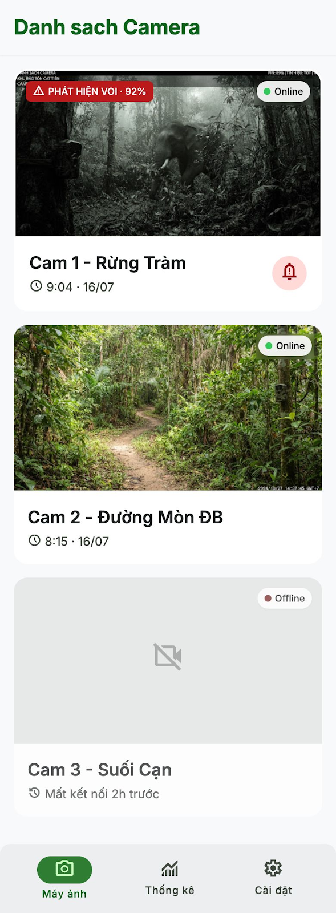
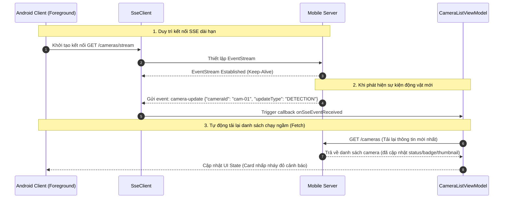

# Kế hoạch Triển khai: CAMERA_LIST_TAB (Tab Danh sách Camera)

Bản kế hoạch này mô tả thiết kế và kiến trúc triển khai cho tab `[CAMERA_LIST_TAB]` (thuộc màn hình chính `[MAIN_SCREEN]`), tuân thủ các tài liệu đặc tả nghiệp vụ (02), đặc tả API (03) và sơ đồ sequence (04).

---

## 0. Thiết kế Giao diện Mockup (UI Design)

*   **Hình ảnh Thiết kế Mockup:** [screen.png](../../docs/design-screen/CAMERA_LIST_TAB/screen.png)
*   **Bản xem trước trực quan (Preview):**
    

---

## 1. Thành phần Giao diện (UI Components)

Màn hình được đặt tại `ui/screens/CameraListTab.kt` và cấu thành từ các thành phần UI sau:

*   **`emergency_banner_container` (Khung cảnh báo khẩn cấp):** Banner hiển thị sticky ở phía trên cùng của tab khi có sự kiện cảnh báo động vật hoang dã nguy hiểm mới.
    *   `emergency_banner_analysis_text`: Text mô tả chi tiết con vật (Tên loài, độ tin cậy AI, mức độ nguy hiểm).
*   **`camera_grid_list` (Danh sách lưới camera):** Hiển thị danh sách các camera card dưới dạng Grid.
*   **`CameraCard` (Thẻ trạm camera):** Đại diện cho một trạm camera cụ thể, bao gồm:
    *   `camera_status_indicator`: Đèn led nhỏ hiển thị trạng thái `🟢 Online` hoặc `⚪ Offline`.
    *   `camera_name_text`: Tên của trạm camera (ví dụ: `Trạm Số 1`).
    *   `camera_location_text`: Mô tả khu vực lắp đặt (ví dụ: `Rìa rừng Phía Nam`).
    *   `camera_thumbnail_image`: Ảnh snapshot mới nhất chụp từ trạm có độ tin cậy AI ≥ 50%.
    *   `warning_badge_overlay`: Badge đè lên ảnh thumbnail nhấp nháy đỏ khi có loài nguy hiểm xuất hiện mà chưa xem.
    *   `snapshot_timestamp_overlay`: Thời gian hệ thống ghi nhận ảnh (HH:mm · dd/MM).
    *   `camera_card_clickable_container`: Vùng clickable bao trùm toàn bộ card để mở màn hình chi tiết `[CAMERA_VIEW_SCREEN]`.

---

## 2. API Tương tác & Luồng Dữ liệu (Retrofit & SSE Integration)

Màn hình tương tác với Mobile Server qua hai kênh chính:

1.  **REST API (Retrofit):** `GET /cameras` (Định nghĩa trong `data/CameraApi.kt`) để lấy danh sách trạm camera.
2.  **Server-Sent Events (SSE):** `GET /cameras/stream` (Định nghĩa trong `data/SseClient.kt`) để nhận ping cập nhật thời gian thực.

### Luồng xử lý thời gian thực "Ping-to-Fetch":


---

## 3. Cấu trúc Trạng thái UI (UI State) & Event/Action

### UI State:
```kotlin
data class CameraListUiState(
    val cameras: List<CameraUiModel> = emptyList(),
    val isLoading: Boolean = false,
    val error: String? = null,
    val isRefreshing: Boolean = false,
    val lastUpdated: Long = 0L
)

data class CameraUiModel(
    val id: String,
    val name: String,
    val address: String,
    val isOnline: Boolean,
    val thumbnailUrl: String?,
    val hasUnreadAlert: Boolean,
    val alertSpecies: String?,
    val alertConfidence: Int?,
    val timestampText: String,
    val dangerLevel: String?
)
```

### Events / Actions:
*   `loadCameras(isSilent: Boolean = false)`: Nạp danh sách camera từ server.
*   `refreshCameras()`: Pull-to-refresh làm mới danh sách thủ công.
*   `startSseListening()`: Đăng ký lắng nghe sự kiện SSE khi Tab được hiển thị ở Foreground.
*   `stopSseListening()`: Hủy kết nối SSE khi ứng dụng chuyển xuống Background hoặc chuyển Tab.

---

## 4. Ma trận logic trạng thái thẻ (Card State Logic)

*   **Logic Cảnh báo:** Trạng thái nhấp nháy cảnh báo chỉ kích hoạt khi ảnh snapshot gần nhất có độ tin cậy AI ≥ 50% và thời gian xảy ra sự kiện dưới 30 phút. Quá 30 phút, thẻ tự động tắt cảnh báo nhấp nháy.
*   **Logic Đã xem / Chưa xem:** 
    *   *Chưa xem:* Thẻ hiển thị `warning_badge_overlay` và nhấp nháy nền đỏ (cảnh báo cao/trung bình).
    *   *Đã xem:* Ngay sau khi người dùng nhấn vào thẻ mở `[CAMERA_VIEW_SCREEN]`, trạng thái đổi sang Đã xem, thẻ sẽ tắt nhấp nháy nền nhưng giữ `warning_badge_overlay` để bảo toàn thông tin.

---

## 5. Kế hoạch Kiểm thử (Verification Plan)

### Automated Tests (Unit Tests)
*   **`CameraListViewModelTest.kt`**:
    *   `TC_UI_CAM_LOAD_SUCCESS`: Nạp danh sách camera thành công, kiểm tra map đúng định dạng dữ liệu (Online/Offline, text thời gian).
    *   `TC_UI_CAM_LOAD_FAILURE`: Lỗi kết nối API -> hiển thị thông báo lỗi trên UI State.
    *   `TC_UI_CAM_SSE_TRIGGER`: Giả lập nhận event SSE `camera-update` -> kiểm tra hàm `loadCameras` được gọi tự động chạy ngầm để kéo dữ liệu mới.
    *   `TC_UI_CAM_OFFLINE_30S`: Giả lập camera offline trên 30s -> kiểm tra UI cập nhật đúng badge xám offline.

### Manual Verification
1.  Bật/tắt kết nối mạng của thiết bị di động để kiểm tra trạng thái hiển thị Offline.
2.  Thực hiện vuốt xuống (Pull-to-refresh) xem danh sách có được tải lại thành công không.
3.  Giả lập đẩy sự kiện webhook AI gửi ảnh động vật nguy hiểm mới -> kiểm tra card tương ứng có lập tức nhấp nháy đỏ và xuất hiện `warning_badge_overlay` thời gian thực (qua kết nối SSE) không.
4.  Nhấn vào card kiểm tra xem ứng dụng có điều hướng sang màn hình chi tiết `[CAMERA_VIEW_SCREEN]` hay không, và khi quay lại card có tắt nhấp nháy đỏ hay không.
