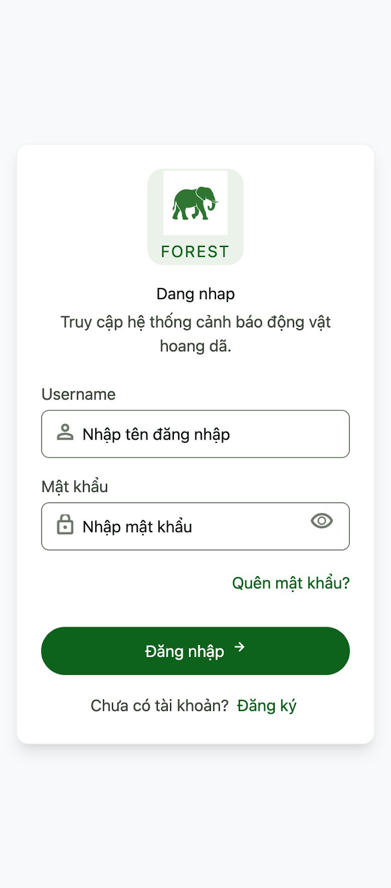
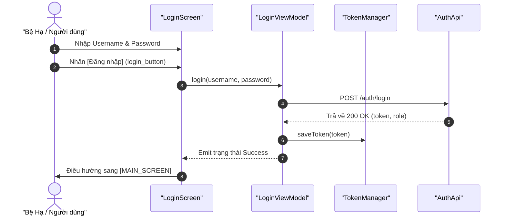

# Kế hoạch Triển khai: LOGIN_SCREEN (Màn hình Đăng nhập)

Bản kế hoạch này mô tả thiết kế và kiến trúc triển khai cho màn hình `[LOGIN_SCREEN]`, tuân thủ các tài liệu đặc tả nghiệp vụ (02), đặc tả API (03) và sơ đồ sequence (04).

## 0. Thiết kế Giao diện Mockup (UI Design)

*   **Hình ảnh Thiết kế Mockup:** [screen.png](../../docs/design-screen/LOGIN_SCREEN/screen.png)
*   **Bản xem trước trực quan (Preview):**
    

---

## 1. Thành phần Giao diện (UI Components)

Màn hình được đặt tại `ui/screens/LoginScreen.kt` và tái sử dụng các thành phần dùng chung từ đặc tả [UI_COMPONENTS.md](../UI_COMPONENTS.md):

*   **`AppLogo` (Tái sử dụng từ [AppLogo](../UI_COMPONENTS.md#1-applogo-logo-he-thong)):** Khối hiển thị logo cảnh báo và tên dự án ở trên cùng.
*   **`login_title_text` (Tái sử dụng [AppTitleText](../UI_COMPONENTS.md#10-apptext-components-cac-composable-view-van-ban-tu-dinh-nghia)):** Hiển thị nhãn `Đăng nhập` sử dụng font chữ tiêu đề lớn đậm màu theo theme.
*   **`username_input` (Tái sử dụng [ValidatedTextField](../UI_COMPONENTS.md#3-validatedtextfield-truong-nhap-lieu-kem-xac-thuc---cao-cap)):** Trường nhập tài khoản bo góc `12.dp` kèm icon `Icons.Default.Person` ở bên trái, tự động hiển thị nhãn báo lỗi khi kiểm tra biểu mẫu.
*   **`password_input` (Tái sử dụng [ValidatedTextField](../UI_COMPONENTS.md#3-validatedtextfield-truong-nhap-lieu-kem-xac-thuc---cao-cap)):** Trường nhập mật khẩu bo góc `12.dp` kèm icon `Icons.Default.Lock` ở bên trái, cấu hình `isPassword = true` để hiển thị icon con mắt ẩn/hiện mật khẩu thô ở góc phải.
*   **`login_button` (Tái sử dụng [AppButton](../UI_COMPONENTS.md#11-appbutton-nut-bam-da-nang-cua-he-thong)):** Nút đăng nhập dạng `Filled` bo góc chữ nhật `Rounded` (`12.dp`), tự động đổi trạng thái vô hiệu hóa (disabled) khi các trường để trống.
*   **`register_linkbutton` (TextButton):** Nút liên kết dạng chữ màu để chuyển sang màn hình đăng ký `[REGISTER_SCREEN]`.
*   **`login_error_snackbar` (Snackbar):** Hiển thị thông báo lỗi xác thực từ máy chủ hoặc lỗi mạng ở cuối màn hình.

---

## 2. API Tương tác & Luồng Dữ liệu (Retrofit API Integration)

Màn hình sẽ tương tác với API Backend thông qua:
*   **API Endpoint:** `POST /auth/login` (Định nghĩa trong `data/AuthApi.kt`).
*   **Request Body:** `{ "username": "...", "password": "..." }`
*   **Response Body (Thành công):** `{ "token": "...", "role": "..." }`

### Luồng xử lý chính:


---

## 3. Cấu trúc Trạng thái UI (UI State) & Event/Action

### UI State:
```kotlin
data class LoginUiState(
    val usernameText: String = "",
    val usernameError: String? = null,
    val passwordText: String = "",
    val passwordError: String? = null,
    val isLoading: Boolean = false,
    val loginError: String? = null,
    val loginSuccess: Boolean = false
)
```

### Events / Actions:
*   `onUsernameChanged(text: String)`: Cập nhật text và thực hiện validate định dạng.
*   `onPasswordChanged(text: String)`: Cập nhật text và thực hiện validate định dạng.
*   `onLoginClick()`: Kích hoạt gọi API xác thực, đổi trạng thái sang `isLoading = true`.
*   `clearErrors()`: Reset lại các thông báo lỗi hiển thị trên snackbar.

---

## 4. Các Quy tắc Kiểm tra Định dạng (Client-side Validation Rules)

*   **Username (`username_input`):**
    *   Bắt buộc phải nhập.
    *   Độ dài từ 4 đến 20 ký tự.
    *   Chỉ gồm các chữ cái (a-z, A-Z), chữ số (0-9) và dấu gạch dưới (`_`).
    *   Không được phép bắt đầu bằng một chữ số.
    *   Không được phép chứa toàn bộ là chữ số.
    *   *Thông báo lỗi:* `Tên đăng nhập 4–20 ký tự, gồm chữ, số và gạch dưới, không bắt đầu bằng số`.
*   **Password (`password_input`):**
    *   Bắt buộc phải nhập.
    *   Độ dài từ 6 đến 30 ký tự.
    *   Không được chỉ chứa khoảng trắng.
    *   *Thông báo lỗi:* `Mật khẩu 6–30 ký tự`.

---

## 5. Kế hoạch Kiểm thử (Verification Plan)

### Automated Tests (Unit Tests)
*   **`LoginViewModelTest.kt`**:
    *   `TC_UI_VAL_USER_01`: Validate username rỗng, quá ngắn, hoặc bắt đầu bằng số -> báo lỗi định dạng tương ứng.
    *   `TC_UI_VAL_PASS_01`: Validate mật khẩu quá ngắn -> báo lỗi định dạng.
    *   `TC_UI_AUTH_SUCCESS`: Đăng nhập thành công -> lưu token và báo trạng thái thành công.
    *   `TC_UI_AUTH_FAILURE`: Đăng nhập thất bại (401) -> hiển thị thông báo lỗi thích hợp lên UI State.

### Manual Verification
1.  Nhập sai định dạng username/password để xem cảnh báo tức thời dưới mỗi ô nhập liệu.
2.  Để trống một trong hai ô xem nút Đăng nhập có bị vô hiệu hóa hay không.
3.  Nhập sai tài khoản thực tế để kiểm tra sự hiển thị của thông báo lỗi trên Snackbar: `Sai tên đăng nhập hoặc mật khẩu`.
4.  Nhập đúng tài khoản đã đăng ký xem ứng dụng có điều hướng sang màn hình chính hay không.
