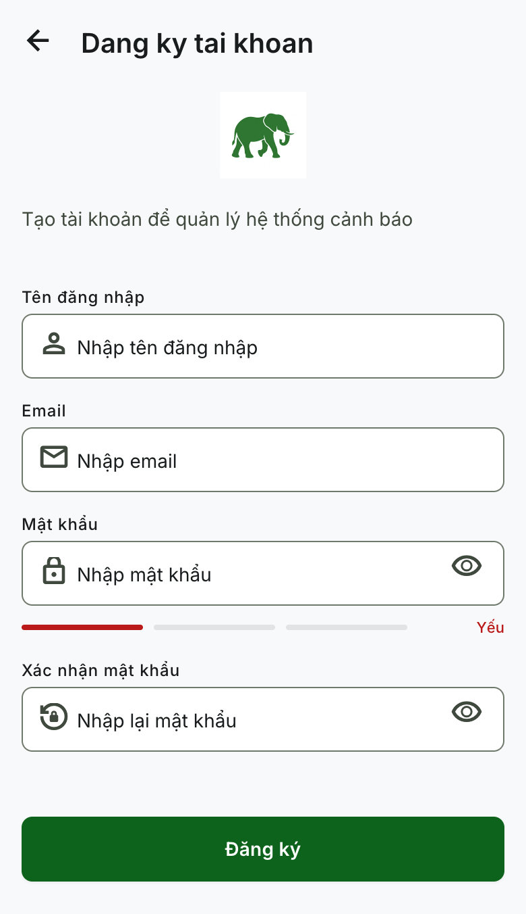
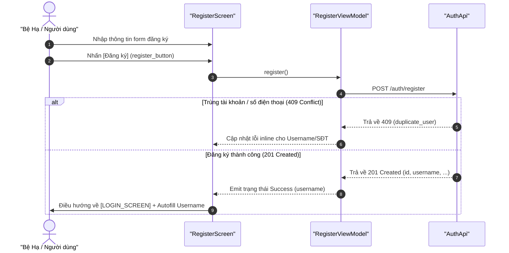

# Kế hoạch Triển khai: REGISTER_SCREEN (Màn hình Đăng ký)

Bản kế hoạch này mô tả thiết kế và kiến trúc triển khai cho màn hình `[REGISTER_SCREEN]`, tuân thủ các tài liệu đặc tả nghiệp vụ (02), đặc tả API (03) và sơ đồ sequence (04).

## 0. Thiết kế Giao diện Mockup (UI Design)

*   **Hình ảnh Thiết kế Mockup:** [screen.png](../../docs/design-screen/REGISTER_SCREEN/screen.png)
*   **Bản xem trước trực quan (Preview):**
    

---

## 1. Thành phần Giao diện (UI Components)

Màn hình được đặt tại `ui/screens/RegisterScreen.kt` và tái sử dụng các thành phần dùng chung từ đặc tả [UI_COMPONENTS.md](../UI_COMPONENTS.md):

*   **`back_iconbutton` (IconButton):** Nút mũi tên quay lại góc trái thanh tiêu đề (Top Bar), điều hướng quay lại màn hình `[LOGIN_SCREEN]`.
*   **`register_title_text` (Tái sử dụng [AppTitleText](../UI_COMPONENTS.md#10-apptext-components-cac-composable-view-van-ban-tu-dinh-nghia)):** Hiển thị tiêu đề `Đăng ký tài khoản`.
*   **`subtitle_text` (Tái sử dụng [AppSubTitleText](../UI_COMPONENTS.md#10-apptext-components-cac-composable-view-van-ban-tu-dinh-nghia)):** Hiển thị nhãn phụ `Tạo tài khoản để quản lý hệ thống cảnh báo`.
*   **`username_input` (Tái sử dụng [ValidatedTextField](../UI_COMPONENTS.md#3-validatedtextfield-truong-nhap-lieu-kem-xac-thuc---cao-cap)):** Trường nhập tài khoản kèm icon `Icons.Default.Person`.
*   **`fullName_input` (Tái sử dụng [ValidatedTextField](../UI_COMPONENTS.md#3-validatedtextfield-truong-nhap-lieu-kem-xac-thuc---cao-cap)):** Trường nhập họ và tên kèm icon `Icons.Default.Person` (Bổ sung để khớp với yêu cầu bắt buộc của API Backend).
*   **`phoneNumber_input` (Tái sử dụng [ValidatedTextField](../UI_COMPONENTS.md#3-validatedtextfield-truong-nhap-lieu-kem-xac-thuc---cao-cap)):** Trường nhập số điện thoại kèm icon `Icons.Default.Phone` (Bắt buộc nhập số điện thoại 10 số của Việt Nam, tự động chuyển đổi sang định dạng E.164 khi gọi API).
*   **`email_input` (Tái sử dụng [ValidatedTextField](../UI_COMPONENTS.md#3-validatedtextfield-truong-nhap-lieu-kem-xac-thuc---cao-cap)):** Trường nhập Email kèm icon `Icons.Default.Email` (Không bắt buộc).
*   **`password_input` (Tái sử dụng [ValidatedTextField](../UI_COMPONENTS.md#3-validatedtextfield-truong-nhap-lieu-kem-xac-thuc---cao-cap)):** Trường nhập mật khẩu kèm icon `Icons.Default.Lock` và nút ẩn/hiện mật khẩu.
*   **`password_strength_indicator` (Progress indicator):** Dãy 3 thanh ngang ngay dưới ô mật khẩu hiển thị mức độ bảo mật: `Yếu` (Màu đỏ), `Trung bình` (Màu cam), hoặc `Mạnh` (Màu xanh lá) giúp người dùng trực quan hóa độ an toàn của mật khẩu.
*   **`password_confirm_input` (Tái sử dụng [ValidatedTextField](../UI_COMPONENTS.md#3-validatedtextfield-truong-nhap-lieu-kem-xac-thuc---cao-cap)):** Trường xác nhận lại mật khẩu kèm icon `Icons.Default.Lock` hoặc `Icons.Default.LockReset`.
*   **`register_button` (Tái sử dụng [AppButton](../UI_COMPONENTS.md#11-appbutton-nut-bam-da-nang-cua-he-thong)):** Nút đăng ký chính dạng `Filled` bo góc `12.dp`, tự động đổi nhãn thành `Đang xử lý...` và disable khi hệ thống đang xử lý tải dữ liệu.
*   **`login_linkbutton` (TextButton):** Liên kết văn bản quay trở lại màn hình đăng nhập.

---

## 2. API Tương tác & Luồng Dữ liệu (Retrofit API Integration)

Màn hình sẽ tương tác với API Backend thông qua:
*   **API Endpoint:** `POST /auth/register` (Định nghĩa trong `data/AuthApi.kt`).
*   **Request Body:**
    ```json
    {
      "username": "...",
      "password": "...",
      "fullName": "...",
      "phoneNumber": "+84...",
      "email": "...", // Gửi null nếu không nhập
      "role": "..."
    }
    ```
*   **Response Body (Thành công - 201 Created):**
    ```json
    {
      "id": "...",
      "username": "...",
      "fullName": "...",
      "phoneNumber": "...",
      "role": "...",
      "createdAt": "..."
    }
    ```

### Luồng xử lý chính:


---

## 3. Cấu trúc Trạng thái UI (UI State) & Event/Action

### UI State:
```kotlin
enum class PasswordStrength {
    WEAK,
    MEDIUM,
    STRONG
}

data class RegisterUiState(
    val usernameText: String = "",
    val usernameError: String? = null,
    val fullNameText: String = "",
    val fullNameError: String? = null,
    val phoneNumberText: String = "",
    val phoneNumberError: String? = null,
    val emailText: String = "",
    val emailError: String? = null,
    val passwordText: String = "",
    val passwordError: String? = null,
    val passwordStrength: PasswordStrength = PasswordStrength.WEAK,
    val confirmPasswordText: String = "",
    val confirmPasswordError: String? = null,
    val isLoading: Boolean = false,
    val registerError: String? = null,
    val registerSuccessUsername: String? = null
)
```

### Events / Actions:
*   `onUsernameChanged(text: String)`
*   `onFullNameChanged(text: String)`
*   `onPhoneNumberChanged(text: String)`
*   `onEmailChanged(text: String)`
*   `onPasswordChanged(text: String)`: Cập nhật mật khẩu và đồng thời cập nhật trạng thái `passwordStrength`.
*   `onConfirmPasswordChanged(text: String)`
*   `onRegisterClick()`: Kiểm tra toàn bộ form, đổi định dạng số điện thoại sang chuẩn E.164 (thay `0` ở đầu bằng `+84`), gọi API `/auth/register`.
*   `clearErrors()`

---

## 4. Các Quy tắc Kiểm tra Định dạng (Client-side Validation Rules)

*   **Username (`username_input`):**
    *   Bắt buộc. Độ dài 4-20 ký tự. Chỉ chứa chữ, số, dấu gạch dưới, không bắt đầu bằng số, không toàn số.
    *   *Thông báo lỗi:* `Tên đăng nhập 4–20 ký tự, gồm chữ, số và gạch dưới, không bắt đầu bằng số`.
*   **Họ và tên (`fullName_input`):**
    *   Bắt buộc. Không được chỉ chứa khoảng trắng.
    *   *Thông báo lỗi:* `Họ và tên không được để trống`.
*   **Số điện thoại (`phoneNumber_input`):**
    *   Bắt buộc. Phải khớp regex định dạng Việt Nam: `^0[0-9]{9}$` (10 chữ số bắt đầu bằng số 0).
    *   *Thông báo lỗi:* `Số điện thoại phải gồm 10 chữ số bắt đầu bằng 0`.
*   **Email (`email_input`):**
    *   Không bắt buộc. Nếu nhập, phải đúng định dạng `local@domain.tld`.
    *   *Thông báo lỗi:* `Email không đúng định dạng`.
*   **Mật khẩu (`password_input`):**
    *   Bắt buộc. Độ dài 8-30 ký tự. Phải chứa cả chữ cái và chữ số. Không chỉ toàn khoảng trắng.
    *   *Thông báo lỗi:* `Mật khẩu tối thiểu 8 ký tự, gồm cả chữ và số`.
*   **Xác nhận mật khẩu (`password_confirm_input`):**
    *   Bắt buộc. Phải khớp hoàn toàn với `password_input`.
    *   *Thông báo lỗi:* `Mật khẩu xác nhận không khớp`.

---

## 5. Kế hoạch Kiểm thử (Verification Plan)

### Automated Tests (Unit Tests)
*   **`RegisterViewModelTest.kt`**:
    *   `TC_UI_REG_VAL_USER_01`: Validate username trống, sai định dạng.
    *   `TC_UI_REG_VAL_PHONE_01`: Validate số điện thoại trống, sai định dạng Việt Nam.
    *   `TC_UI_REG_VAL_PASS_01`: Validate mật khẩu quá ngắn (< 8) hoặc thiếu chữ/số.
    *   `TC_UI_REG_VAL_CONFIRM_01`: Validate xác nhận mật khẩu không khớp.
    *   `TC_UI_REG_STRENGTH_01`: Validate thuật toán tính độ mạnh mật khẩu (Yếu / Trung bình / Mạnh).
    *   `TC_UI_REG_SUCCESS`: Đăng ký thành công -> lưu trạng thái thành công kèm username để autofill.
    *   `TC_UI_REG_FAILURE_CONFLICT`: Máy chủ báo lỗi trùng lặp (409) -> gán thông báo lỗi phù hợp lên UI.

### Manual Verification
1.  Nhập dữ liệu sai định dạng trên từng ô để kiểm tra hiển thị lỗi inline tức thời.
2.  Nhập mật khẩu ngắn và chỉ có chữ để thấy indicator hiện mức độ `Yếu` (đỏ), sau đó thêm số và độ dài để nâng lên `Trung bình` và `Mạnh`.
3.  Để trống các ô bắt buộc và kiểm tra xem nút `Đăng ký` có bị vô hiệu hóa hay không.
4.  Điền đúng thông tin và tiến hành đăng ký, kiểm tra xem ứng dụng có tự động quay về màn hình Đăng nhập và tự động điền sẵn tên đăng nhập vừa tạo vào ô nhập liệu hay không.
