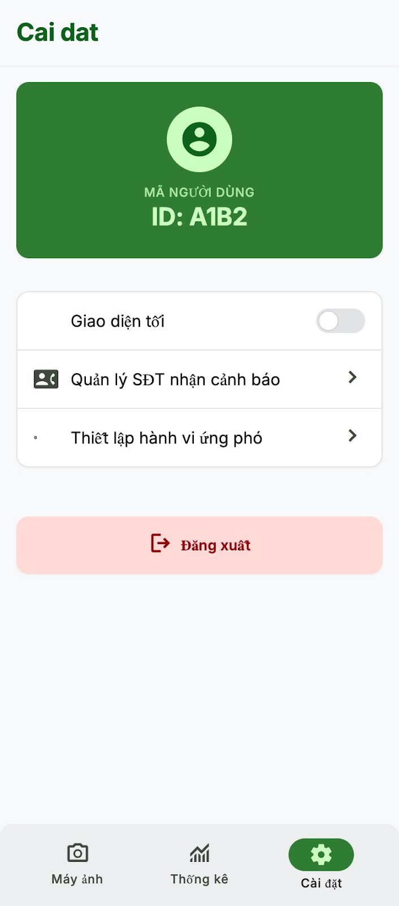
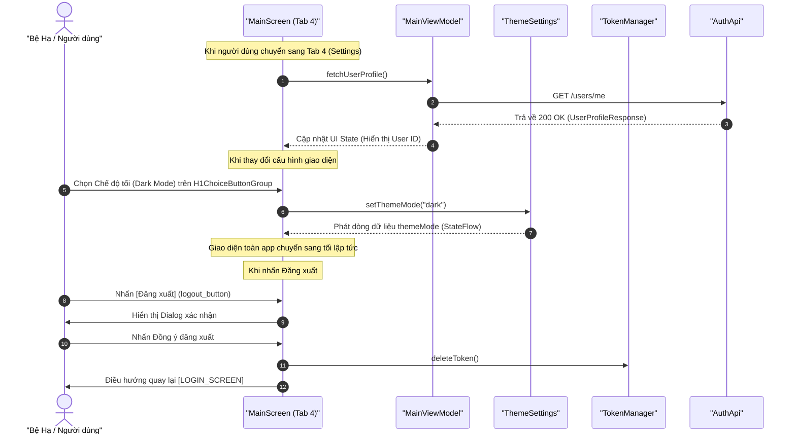

# Kế hoạch Triển khai: SETTING_SCREEN (Màn hình Cài đặt)

Bản kế hoạch này mô tả thiết kế và kiến trúc triển khai cho màn hình Cài đặt (`[SETTING_SCREEN]`), được hiển thị trực tiếp trong Tab thứ 4 của màn hình chính ứng dụng `wildlife-mobile`, tuân thủ các tài liệu đặc tả nghiệp vụ (02), đặc tả API (03) và hướng dẫn viết mã nguồn tại `AI_INSTRUCTIONS.md`.

---

## 0. Thiết kế Giao diện Mockup (UI Design)

*   **Hình ảnh Thiết kế Mockup:** [screen.png](../../docs/design-screen/SETTING_TAB/screen.png)
*   **Bản xem trước trực quan (Preview):**
    

---

## 1. Thành phần Giao diện (UI Components)

Màn hình được nhúng vào Tab thứ 4 của `ui/main/MainScreen.kt` dưới dạng Composable `SettingsTabContent` và tái sử dụng triệt để các thành phần dùng chung từ đặc tả [UI_COMPONENTS.md](../UI_COMPONENTS.md):

*   **`AppCard` (Tái sử dụng từ [AppCard](../UI_COMPONENTS.md#9-appcard-the-container-chuan)):** Khung chứa chuẩn hóa dùng để bọc nhóm thông tin tài khoản và cấu hình giao diện, tự động hỗ trợ bo tròn `16.dp` hiện đại và viền nhẹ đổ bóng.
*   **`H1ChoiceButtonGroup` (Tái sử dụng từ [H1ChoiceButtonGroup](../UI_COMPONENTS.md#7-h1choicebuttongroup-hang-nut-chon-mot---ngang-cao-cap)):** Hàng nút chọn capsule ngang cao cấp thay thế cho nhóm RadioButton mặc định để chọn chế độ sáng/tối/hệ thống mượt mà.
*   **`AppTitleText`, `AppSectionTitleText`, `AppSubTitleText`, `AppBodyText` (Tái sử dụng từ [AppText Components](../UI_COMPONENTS.md#10-apptext-components-cac-composable-view-van-ban-tu-dinh-nghia)):** Các thành phần hiển thị văn bản thống nhất kiểu dáng toàn dự án.
*   **`logout_button` (FilledButton):** Nút đăng xuất màu đỏ sử dụng tông màu lỗi `MaterialTheme.colorScheme.error`, kèm icon `Icons.Default.ExitToApp`.
*   **`logout_confirm_dialog` (AlertDialog):** Hộp thoại xác nhận đăng xuất yêu cầu người dùng xác thực trước khi xóa phiên làm việc.
*   **`sms_config_button` (Tái sử dụng từ [AppButton](../UI_COMPONENTS.md#11-appbutton-nut-bam-da-nang-cua-he-thong)):** Nút bấm mở màn hình quản lý SĐT nhận cảnh báo dạng `Outlined` kèm icon Phone.
*   **`configure_defense_default_button` (Tái sử dụng từ [AppButton](../UI_COMPONENTS.md#11-appbutton-nut-bam-da-nang-cua-he-thong)):** Nút bấm mở màn hình thiết lập ứng phó mặc định dạng `Outlined` kèm icon Security.

---

## 2. API Tương tác & Luồng Dữ liệu (Retrofit API Integration)

Màn hình sẽ tương tác với API Backend thông qua:
*   **API Endpoint:** `GET /users/me` (Định nghĩa trong `data/AuthApi.kt`).
*   **Header:** `Authorization: Bearer <token>`
*   **Response Body (Thành công):**
    ```json
    {
      "id": "user-uuid",
      "username": "ranger_john",
      "fullName": "John Doe",
      "phoneNumber": "+84901234567",
      "role": "RANGER",
      "email": "john.doe@example.com"
    }
    ```

### Luồng xử lý chính:


---

## 3. Cấu trúc Trạng thái UI (UI State) & Event/Action

### Cập nhật MainViewModel.kt:
*   `userProfile: StateFlow<UserProfileResponse?>`: Thông tin hồ sơ người dùng tải từ máy chủ.
*   `isLoadingProfile: StateFlow<Boolean>`: Trạng thái xoay tròn loading khi đang tải profile.
*   `profileError: StateFlow<String?>`: Nội dung lỗi hiển thị nếu không thể kết nối hoặc lỗi token.

### Events / Actions:
*   `fetchUserProfile()`: Thực hiện gọi API `GET /users/me` sử dụng Token lấy từ `TokenManager`.
*   `selectTab(index: Int)`: Hàm thay đổi tab hiện hành.

---

## 4. Các Quy tắc Luồng nghiệp vụ (Business Rules)

*   **Tự động tải dữ liệu:** Khi người dùng chuyển sang Tab 4, nếu `userProfile` trong ViewModel đang trống (`null`), hệ thống tự động phát lệnh `fetchUserProfile()`.
*   **Lưu trữ Theme bền vững:** Lựa chọn theme của người dùng phải được lưu giữ xuống `SharedPreferences` cục bộ để duy trì trạng thái khi người dùng mở lại app lần sau.
*   **Ngăn chặn nút Back sau khi Logout:** Khi nhấn Đăng xuất thành công, ứng dụng phải xóa sạch Backstack định tuyến trước khi điều hướng sang màn hình Login, ngăn ngừa việc người dùng nhấn nút Back quay lại màn hình chính khi không còn phiên làm việc.

---

## 5. Kế hoạch Kiểm thử (Verification Plan)

### Automated Tests (Unit Tests)
*   **`MainViewModelTest.kt`**:
    *   `testSelectTab`: Chuyển đổi qua lại giữa các Tab -> UI State cập nhật chỉ số tab chính xác.
    *   `testFetchUserProfileSuccess`: Tải profile thành công -> Lưu dữ liệu vào `userProfile` và tắt loading.
    *   `testFetchUserProfileFailure`: Máy chủ trả lỗi (ví dụ: 401 hoặc 500) -> Đặt `profileError` và tắt loading.

### Manual Verification
1.  Đăng nhập, truy cập màn hình chính, nhấn chuyển sang Tab "Cài đặt".
2.  Xác nhận hiển thị đúng mã định danh User ID tương ứng với tài khoản đã đăng nhập.
3.  Thay đổi theme sang "Tối", "Sáng", "Hệ thống" trên `H1ChoiceButtonGroup` để kiểm tra màu sắc giao diện thay đổi tức thì. Khởi động lại ứng dụng để xác thực theme đã chọn được duy trì bền vững.
4.  Nhấn nút "Đăng xuất", chọn "Hủy" kiểm tra hộp thoại biến mất. Nhấn chọn "Đăng xuất" lần nữa, bấm xác nhận, kiểm định ứng dụng đã chuyển hướng về màn hình Login và không thể nhấn Back để quay lại.
